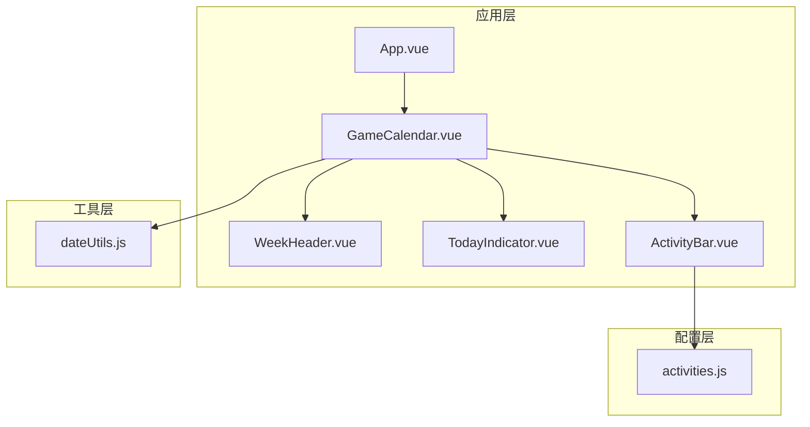
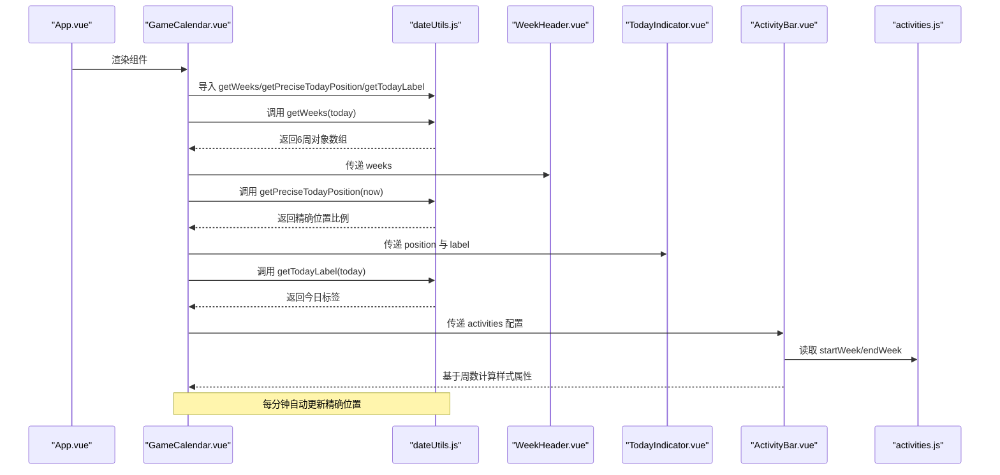
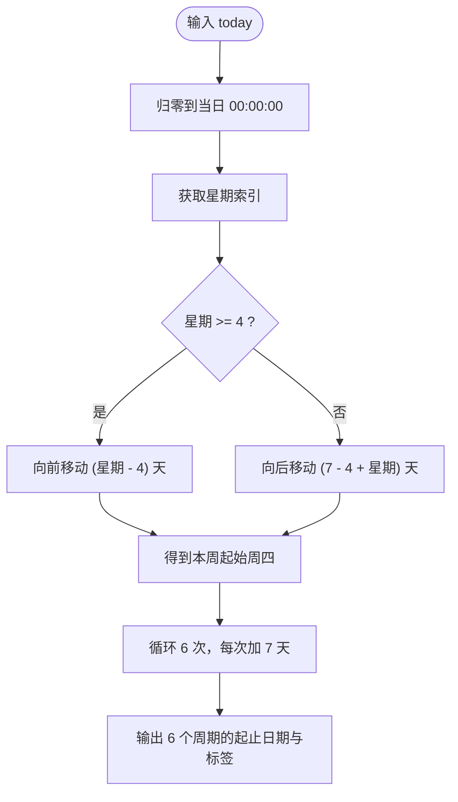
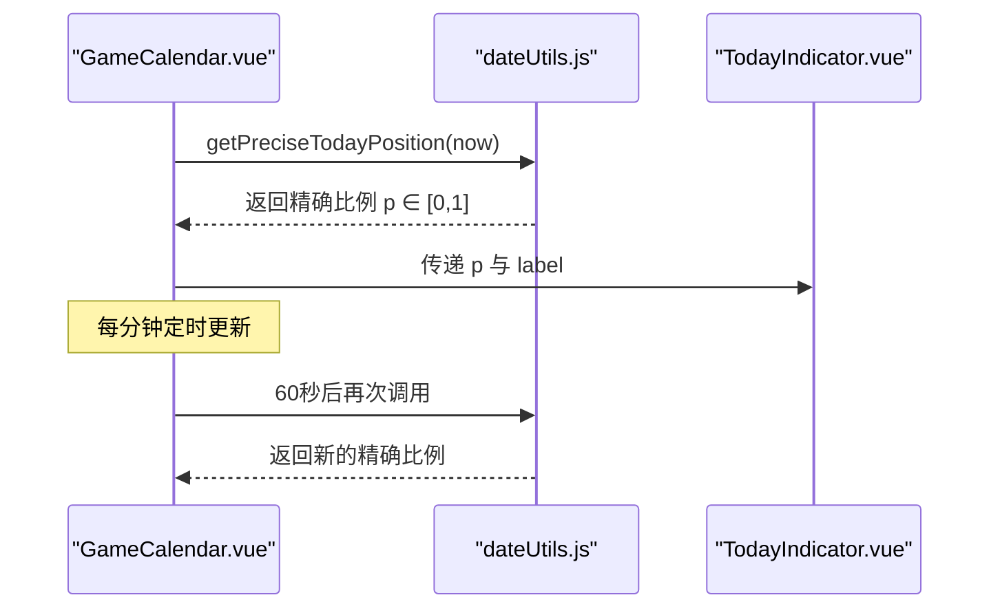
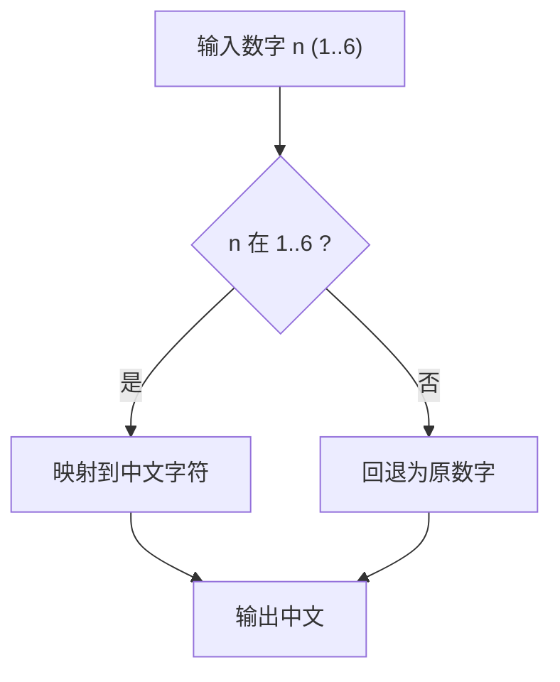
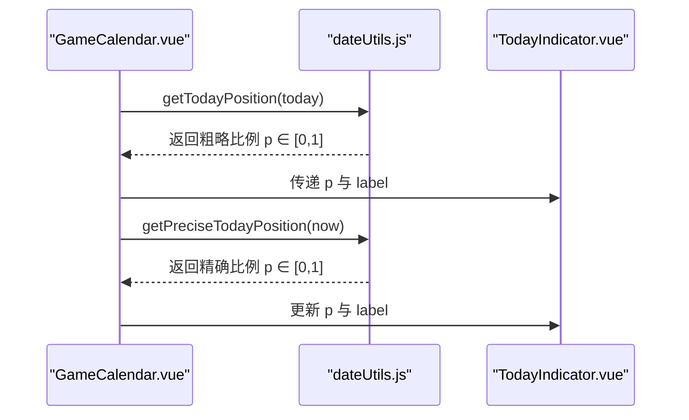
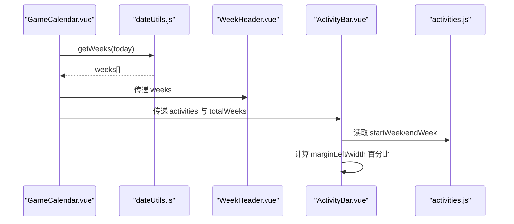
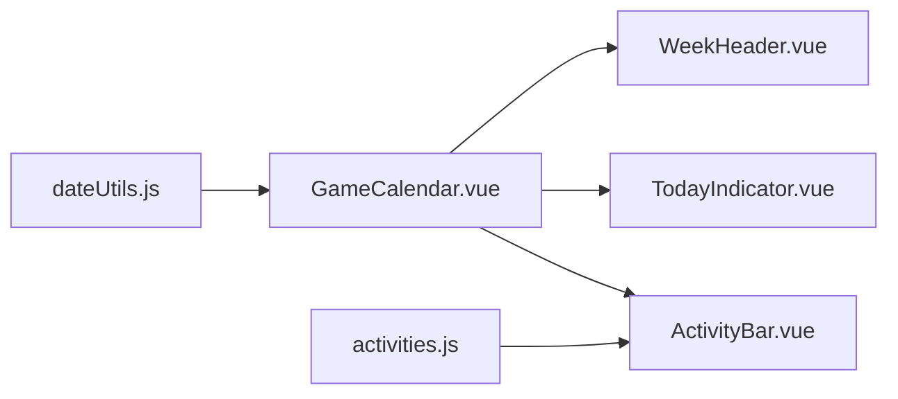

# 工具函数

<cite>
**本文引用的文件**
- [dateUtils.js](file://src/utils/dateUtils.js)
- [GameCalendar.vue](file://src/components/GameCalendar.vue)
- [TodayIndicator.vue](file://src/components/TodayIndicator.vue)
- [WeekHeader.vue](file://src/components/WeekHeader.vue)
- [ActivityBar.vue](file://src/components/ActivityBar.vue)
- [activities.js](file://src/config/activities.js)
- [App.vue](file://src/App.vue)
- [main.js](file://src/main.js)
</cite>

## 目录
1. [简介](#简介)
2. [项目结构](#项目结构)
3. [核心组件](#核心组件)
4. [架构总览](#架构总览)
5. [详细组件分析](#详细组件分析)
6. [依赖关系分析](#依赖关系分析)
7. [性能考量](#性能考量)
8. [故障排查指南](#故障排查指南)
9. [结论](#结论)
10. [附录](#附录)

## 简介
本文件为日期计算工具函数的API文档，聚焦于 src/utils/dateUtils.js 中导出的函数，包括：
- 维护周期算法：以"每周四"为起始日的周起始与6周周期推导
- 日期格式化函数：用于生成周范围的短日期字符串
- 中文数字转换：将阿拉伯数字转为中文"一二三四五六"
- 位置计算：计算今日在6周时间轴上的相对位置（0~1）
- **新增** 精确位置计算：计算当前时刻在6周时间轴上的精确比例位置（0~1），精确到小时和分钟
- 今日标签：生成本地化的"今天"显示文本

文档同时结合 GameCalendar 应用的实际使用场景，说明各函数在组件中的调用方式、参数与返回值、错误处理策略与边界条件，并给出性能优化建议与常见问题排查方法。

## 项目结构
该应用采用 Vue 3 单页应用结构，日期工具位于 utils 目录，被 GameCalendar 主组件导入并在多个子组件中使用：
- utils/dateUtils.js：提供日期计算与格式化工具
- components/GameCalendar.vue：主容器，调用工具函数生成周表、今日位置与标签，支持实时更新
- components/TodayIndicator.vue：渲染今日指示器，接收 position 与 label
- components/WeekHeader.vue：渲染6周标题与范围
- components/ActivityBar.vue：根据活动的起止周在时间轴上定位显示
- config/activities.js：活动配置数据，包含 startWeek/endWeek
- App.vue/main.js：应用入口

**图表来源**
- [GameCalendar.vue:23-39](file://src/components/GameCalendar.vue#L23-L39)
- [dateUtils.js:12-127](file://src/utils/dateUtils.js#L12-L127)
- [activities.js:1-53](file://src/config/activities.js#L1-L53)

**章节来源**
- [GameCalendar.vue:1-70](file://src/components/GameCalendar.vue#L1-L70)
- [dateUtils.js:1-127](file://src/utils/dateUtils.js#L1-L127)
- [activities.js:1-53](file://src/config/activities.js#L1-L53)

## 核心组件
本节对 dateUtils.js 中的每个导出函数进行逐项说明，包括功能、参数、返回值、内部逻辑要点与使用示例路径。

- getCurrentWeekStart(today = new Date())
  - 功能：获取当前维护周期的起始日（每周四）。若 today 正好是周四，则返回当天；否则返回最近的一个周四。
  - 参数：可选 today（默认为当前时间），类型为 Date 或可被 Date 构造的值
  - 返回值：Date 对象，表示本周起始日（周四）的 00:00:00
  - 边界条件与注意事项：
    - 输入为无效日期时，会抛出异常或产生不可预期结果；建议在调用前确保传入合法日期
    - 函数会将输入日期归零到当日 00:00:00，避免时分秒影响周起始判断
  - 使用示例路径：
    - [GameCalendar.vue:35-38](file://src/components/GameCalendar.vue#L35-L38)
  - 复杂度：O(1)，仅进行一次日期运算与常量时间分支判断

- getWeeks(today = new Date())
  - 功能：计算包含 today 的当前周起始日之后的连续6个维护周期（每周期7天），返回包含每个周期起止日期、中文周标签与范围字符串的对象数组
  - 参数：可选 today（默认当前时间）
  - 返回值：Array<{ start: Date, end: Date, label: string, range: string }>
  - 内部逻辑要点：
    - 调用 getCurrentWeekStart(today) 获取基准周起始
    - 循环6次，每次在基准周基础上加 7*i 天得到起止日期
    - 使用中文数字转换与日期格式化生成 label 与 range
  - 使用示例路径：
    - [GameCalendar.vue:35-38](file://src/components/GameCalendar.vue#L35-L38)
    - [WeekHeader.vue:3-6](file://src/components/WeekHeader.vue#L3-L6)
  - 复杂度：O(1)，固定循环6次

- getTodayPosition(today = new Date())
  - 功能：计算 today 在6周（42天）时间轴上的相对位置（0~1），用于在时间轴上定位今日指示器
  - 参数：可选 today（默认当前时间）
  - 返回值：Number，范围 [0, 1]
  - 内部逻辑要点：
    - 获取基准周起始
    - 将 today 归零至当日 00:00:00
    - 计算与基准周起始的天数差，除以42得到比例
    - 使用 Math.min/Math.max 限制在 [0, 1] 范围内
  - 使用示例路径：
    - [GameCalendar.vue:35-38](file://src/components/GameCalendar.vue#L35-L38)
    - [TodayIndicator.vue:2](file://src/components/TodayIndicator.vue#L2)
  - 复杂度：O(1)

- **新增** getPreciseTodayPosition(now = new Date())
  - 功能：计算当前时刻在6周时间轴上的精确比例位置（0~1），精确到小时和分钟，支持实时时间轴更新
  - 参数：可选 now（默认为当前时间），类型为 Date
  - 返回值：Number，范围 [0, 1]
  - 内部逻辑要点：
    - 获取基准周起始
    - 将 now 归零至当日 00:00:00
    - 计算与基准周起始的完整天数差
    - 计算当天已过时间占全天的比例：(hours * 60 + minutes) / (24 * 60)
    - 将完整天数与当天比例相加得到精确天数
    - 除以42得到精确比例，使用 Math.min/Math.max 限制在 [0, 1] 范围内
  - 使用示例路径：
    - [GameCalendar.vue:36](file://src/components/GameCalendar.vue#L36)
    - [GameCalendar.vue:43](file://src/components/GameCalendar.vue#L43)
    - [GameCalendar.vue:56](file://src/components/GameCalendar.vue#L56)
  - 复杂度：O(1)

- getTodayLabel(today = new Date())
  - 功能：生成本地化的"今天"显示文本，包含月/日与中文星期
  - 参数：可选 today（默认当前时间）
  - 返回值：String，格式如"今天 04/05 星期四"
  - 内部逻辑要点：
    - 月份与日期均使用两位补零
    - 通过索引 weekDays 数组获取中文星期
  - 使用示例路径：
    - [GameCalendar.vue:35-38](file://src/components/GameCalendar.vue#L35-L38)
    - [TodayIndicator.vue:3](file://src/components/TodayIndicator.vue#L3)
  - 复杂度：O(1)

- formatDate(date)
  - 功能：内部辅助函数，将日期格式化为"MM/DD"
  - 参数：Date
  - 返回值：String
  - 使用示例路径：
    - [dateUtils.js:117-121](file://src/utils/dateUtils.js#L117-L121)
  - 复杂度：O(1)

- numberToChinese(num)
  - 功能：内部辅助函数，将 1~6 转换为中文"一二三四五六"，超出范围时回退为原数字
  - 参数：Number
  - 返回值：String
  - 使用示例路径：
    - [dateUtils.js:123-126](file://src/utils/dateUtils.js#L123-L126)
  - 复杂度：O(1)

**章节来源**
- [dateUtils.js:12-127](file://src/utils/dateUtils.js#L12-L127)

## 架构总览
下图展示了 GameCalendar 应用中日期工具的调用关系与数据流，包括新增的精确位置计算功能：

**图表来源**
- [GameCalendar.vue:23-39](file://src/components/GameCalendar.vue#L23-L39)
- [dateUtils.js:35-95](file://src/utils/dateUtils.js#L35-L95)
- [WeekHeader.vue:3-6](file://src/components/WeekHeader.vue#L3-L6)
- [TodayIndicator.vue:2-3](file://src/components/TodayIndicator.vue#L2-L3)
- [ActivityBar.vue:38-49](file://src/components/ActivityBar.vue#L38-L49)
- [activities.js:1-53](file://src/config/activities.js#L1-L53)

## 详细组件分析

### 维护周期算法（以周四为起始）
- 设计背景：游戏维护通常以"每周四"为周期起始，便于玩家规划活动与维护窗口
- 关键点：
  - 周起始计算：通过 getDay() 判断与周四的距离，正向或负向移动到最近周四
  - 6周推导：从本周起始开始，按 7 天步进生成后续5个周期，形成完整6周视图
  - 位置映射：getTodayPosition 将今日映射到 0~1 的区间，用于时间轴定位
  - **新增** 精确位置：getPreciseTodayPosition 支持实时更新，精确到小时和分钟

**图表来源**
- [dateUtils.js:12-55](file://src/utils/dateUtils.js#L12-L55)

**章节来源**
- [dateUtils.js:12-55](file://src/utils/dateUtils.js#L12-L55)

### 精确位置计算与实时更新
- **新增功能** getPreciseTodayPosition 提供了精确到小时和分钟的位置计算，支持实时时间轴更新
- 核心逻辑：
  - 计算完整天数差：与 getTodayPosition 相同
  - 计算当天时间比例：(hours × 60 + minutes) / (24 × 60)
  - 合成精确天数：完整天数 + 当天比例
  - 返回最终比例：精确天数 ÷ 42 天
- **实时更新机制**：GameCalendar 组件每分钟调用一次 getPreciseTodayPosition，实现时间轴的平滑移动

**图表来源**
- [GameCalendar.vue:36](file://src/components/GameCalendar.vue#L36)
- [GameCalendar.vue:43](file://src/components/GameCalendar.vue#L43)
- [GameCalendar.vue:54-58](file://src/components/GameCalendar.vue#L54-L58)
- [dateUtils.js:78-95](file://src/utils/dateUtils.js#L78-L95)
- [TodayIndicator.vue:2-3](file://src/components/TodayIndicator.vue#L2-L3)

**章节来源**
- [GameCalendar.vue:36](file://src/components/GameCalendar.vue#L36)
- [GameCalendar.vue:43](file://src/components/GameCalendar.vue#L43)
- [GameCalendar.vue:54-58](file://src/components/GameCalendar.vue#L54-L58)
- [dateUtils.js:78-95](file://src/utils/dateUtils.js#L78-L95)
- [TodayIndicator.vue:2-3](file://src/components/TodayIndicator.vue#L2-L3)

### 日期格式化与中文数字转换
- formatDate：将日期格式化为"MM/DD"，用于周范围字符串
- numberToChinese：将 1~6 转为中文"一二三四五六"，用于周标签
- 使用场景：getWeeks 中生成 label 与 range；getTodayLabel 中生成中文星期

**图表来源**
- [dateUtils.js:123-126](file://src/utils/dateUtils.js#L123-L126)

**章节来源**
- [dateUtils.js:117-126](file://src/utils/dateUtils.js#L117-L126)

### 今日位置计算与指示器
- getTodayPosition 将 today 映射到 0~1 的区间，用于 TodayIndicator 的 left 定位
- **新增** getPreciseTodayPosition 提供更精确的位置计算，支持实时更新
- TodayIndicator 接收 position 与 label，通过 CSS transform 实现定位与显示

**图表来源**
- [GameCalendar.vue:35-38](file://src/components/GameCalendar.vue#L35-L38)
- [dateUtils.js:61-72](file://src/utils/dateUtils.js#L61-L72)
- [dateUtils.js:78-95](file://src/utils/dateUtils.js#L78-L95)
- [TodayIndicator.vue:2-3](file://src/components/TodayIndicator.vue#L2-L3)

**章节来源**
- [GameCalendar.vue:35-38](file://src/components/GameCalendar.vue#L35-L38)
- [dateUtils.js:61-72](file://src/utils/dateUtils.js#L61-L72)
- [dateUtils.js:78-95](file://src/utils/dateUtils.js#L78-L95)
- [TodayIndicator.vue:2-3](file://src/components/TodayIndicator.vue#L2-L3)

### 周表头与活动条
- WeekHeader：接收 weeks 数组，渲染每个周期的中文标签与范围
- ActivityBar：根据活动的 startWeek/endWeek 与 totalWeeks 计算 marginLeft 与 width 百分比，实现活动在时间轴上的可视化

**图表来源**
- [GameCalendar.vue:35-38](file://src/components/GameCalendar.vue#L35-L38)
- [dateUtils.js:35-55](file://src/utils/dateUtils.js#L35-L55)
- [WeekHeader.vue:3-6](file://src/components/WeekHeader.vue#L3-L6)
- [ActivityBar.vue:38-49](file://src/components/ActivityBar.vue#L38-L49)
- [activities.js:1-53](file://src/config/activities.js#L1-L53)

**章节来源**
- [WeekHeader.vue:3-6](file://src/components/WeekHeader.vue#L3-L6)
- [ActivityBar.vue:38-49](file://src/components/ActivityBar.vue#L38-L49)
- [activities.js:1-53](file://src/config/activities.js#L1-L53)

## 依赖关系分析
- dateUtils.js 作为纯函数工具模块，不依赖外部库，仅使用标准 Date API
- GameCalendar.vue 导入并调用四个工具函数：getWeeks、getPreciseTodayPosition、getTodayPosition、getTodayLabel
- WeekHeader.vue 依赖 weeks 数据结构（包含 start、end、label、range）
- TodayIndicator.vue 依赖 position 与 label
- ActivityBar.vue 依赖 activities 配置中的 startWeek/endWeek 与 totalWeeks
- activities.js 提供静态配置数据，被 ActivityBar 使用

**图表来源**
- [GameCalendar.vue:23-39](file://src/components/GameCalendar.vue#L23-L39)
- [dateUtils.js:35-95](file://src/utils/dateUtils.js#L35-L95)
- [WeekHeader.vue:3-6](file://src/components/WeekHeader.vue#L3-L6)
- [TodayIndicator.vue:2-3](file://src/components/TodayIndicator.vue#L2-L3)
- [ActivityBar.vue:38-49](file://src/components/ActivityBar.vue#L38-L49)
- [activities.js:1-53](file://src/config/activities.js#L1-L53)

**章节来源**
- [GameCalendar.vue:23-39](file://src/components/GameCalendar.vue#L23-L39)
- [dateUtils.js:35-95](file://src/utils/dateUtils.js#L35-L95)
- [activities.js:1-53](file://src/config/activities.js#L1-L53)

## 性能考量
- 时间复杂度
  - getCurrentWeekStart：O(1)
  - getWeeks：O(1)，固定6次迭代
  - getTodayPosition：O(1)
  - **新增** getPreciseTodayPosition：O(1)，但包含额外的小时/分钟计算
  - getTodayLabel：O(1)
  - formatDate/numberToChinese：O(1)
- 空间复杂度
  - 所有函数均为 O(1)，不创建与输入规模相关的数据结构
- 优化建议
  - **实时更新优化**：当前每分钟更新一次，可根据需求调整频率（如每5分钟或每30分钟）
  - 缓存策略：若同一页面多次调用 getWeeks/getTodayPosition，可在组件层级缓存结果，避免重复计算
  - 输入校验：对外暴露的函数可增加参数类型检查与边界校验，提升健壮性
  - 本地化：getTodayLabel 中的中文星期与格式可抽象为可配置项，便于国际化扩展
  - 避免频繁重渲染：在 Vue 中，将计算结果保存在响应式 ref/computed 中，减少不必要的依赖更新
  - **内存管理**：定时器在组件卸载时正确清理，防止内存泄漏

**章节来源**
- [GameCalendar.vue:54-65](file://src/components/GameCalendar.vue#L54-L65)

## 故障排查指南
- 常见问题与处理
  - 传入非法日期：当 today/now 为无效值时，Date 构造可能失败或行为不可预测。建议在调用前进行有效性检查或提供默认安全值
  - 位置越界：getTodayPosition 和 getPreciseTodayPosition 通过 Math.min/Math.max 限制在 [0,1]，但仍需确保传入日期与基准周起始的比较逻辑正确
  - **新增** 精确位置更新：如果实时更新不生效，检查定时器是否正确设置和清理，以及组件生命周期钩子的正确使用
  - 中文数字越界：numberToChinese 仅支持 1~6，超出范围时回退为原数字。若业务需要更多周期，应扩展映射表
  - 日期精度：由于使用 setHours(0,0,0,0) 归零，计算不受时分秒影响；若需要考虑时区，应在调用前统一为 UTC 或本地时间
- 调试建议
  - 在 GameCalendar.vue 中打印 today、weeks、position、label，确认数据流是否符合预期
  - **新增** 在控制台观察 getPreciseTodayPosition 的输出，验证实时更新效果
  - 在 TodayIndicator.vue 中验证 left 样式是否为百分比且在 0~100% 范围内
  - 在 ActivityBar.vue 中验证 marginLeft 与 width 是否按 startWeek/endWeek 正确计算
  - **新增** 检查定时器状态，确保每分钟正确触发更新

**章节来源**
- [dateUtils.js:12-127](file://src/utils/dateUtils.js#L12-L127)
- [GameCalendar.vue:35-38](file://src/components/GameCalendar.vue#L35-L38)
- [GameCalendar.vue:54-65](file://src/components/GameCalendar.vue#L54-L65)
- [TodayIndicator.vue:2-3](file://src/components/TodayIndicator.vue#L2-L3)
- [ActivityBar.vue:38-49](file://src/components/ActivityBar.vue#L38-L49)

## 结论
dateUtils.js 提供了围绕"每周四"维护周期的完整日期计算能力，配合 GameCalendar 应用实现了清晰的时间轴视图与今日指示器。**新增的精确位置计算功能**使得时间轴能够实时更新，提供更流畅的用户体验。其设计简洁、复杂度低、易于扩展。建议在生产环境中增加输入校验与缓存策略，并考虑将本地化配置外置以便国际化。

**章节来源**
- [dateUtils.js:78-95](file://src/utils/dateUtils.js#L78-L95)
- [GameCalendar.vue:54-65](file://src/components/GameCalendar.vue#L54-L65)

## 附录
- 使用示例路径汇总
  - 获取6周数据：[GameCalendar.vue:35-38](file://src/components/GameCalendar.vue#L35-L38)
  - 获取今日位置（粗略）：[GameCalendar.vue:35-38](file://src/components/GameCalendar.vue#L35-L38)
  - **新增** 获取今日位置（精确）：[GameCalendar.vue:36](file://src/components/GameCalendar.vue#L36)
  - **新增** 实时位置更新：[GameCalendar.vue:43](file://src/components/GameCalendar.vue#L43)
  - **新增** 定时器设置：[GameCalendar.vue:54-58](file://src/components/GameCalendar.vue#L54-L58)
  - 获取今日标签：[GameCalendar.vue:35-38](file://src/components/GameCalendar.vue#L35-L38)
  - 渲染周表头：[WeekHeader.vue:3-6](file://src/components/WeekHeader.vue#L3-L6)
  - 渲染今日指示器：[TodayIndicator.vue:2-3](file://src/components/TodayIndicator.vue#L2-L3)
  - 活动条样式计算：[ActivityBar.vue:38-49](file://src/components/ActivityBar.vue#L38-L49)
  - 活动配置数据：[activities.js:1-53](file://src/config/activities.js#L1-L53)

**章节来源**
- [GameCalendar.vue:35-38](file://src/components/GameCalendar.vue#L35-L38)
- [GameCalendar.vue:36](file://src/components/GameCalendar.vue#L36)
- [GameCalendar.vue:43](file://src/components/GameCalendar.vue#L43)
- [GameCalendar.vue:54-58](file://src/components/GameCalendar.vue#L54-L58)
- [WeekHeader.vue:3-6](file://src/components/WeekHeader.vue#L3-L6)
- [TodayIndicator.vue:2-3](file://src/components/TodayIndicator.vue#L2-L3)
- [ActivityBar.vue:38-49](file://src/components/ActivityBar.vue#L38-L49)
- [activities.js:1-53](file://src/config/activities.js#L1-L53)