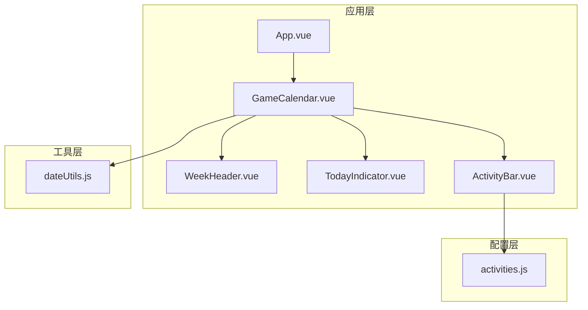
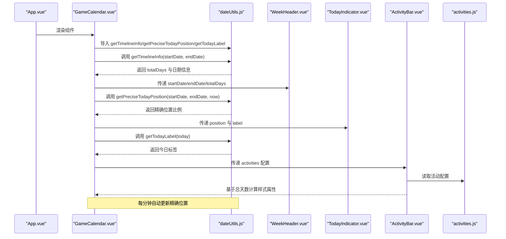
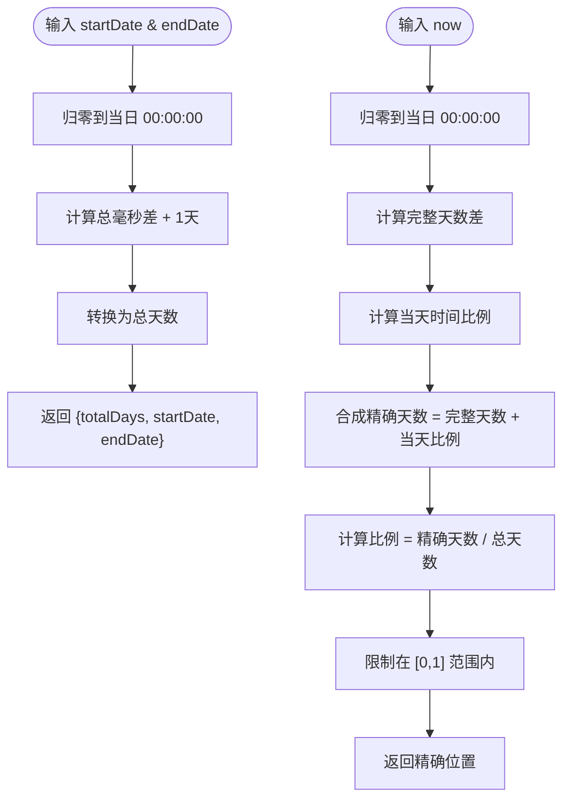
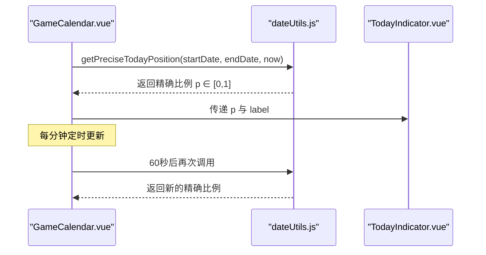
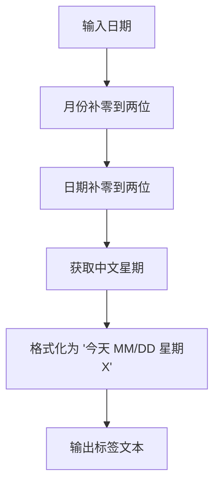
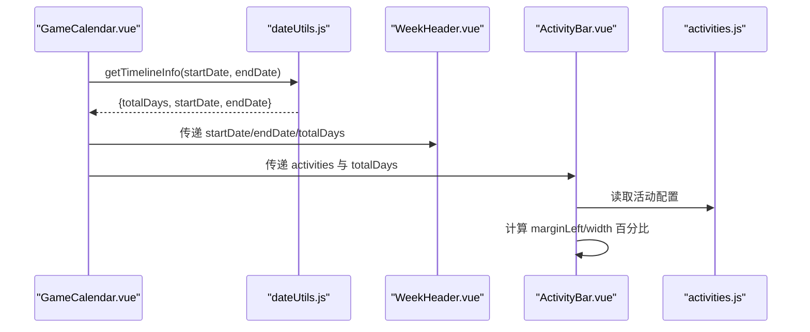
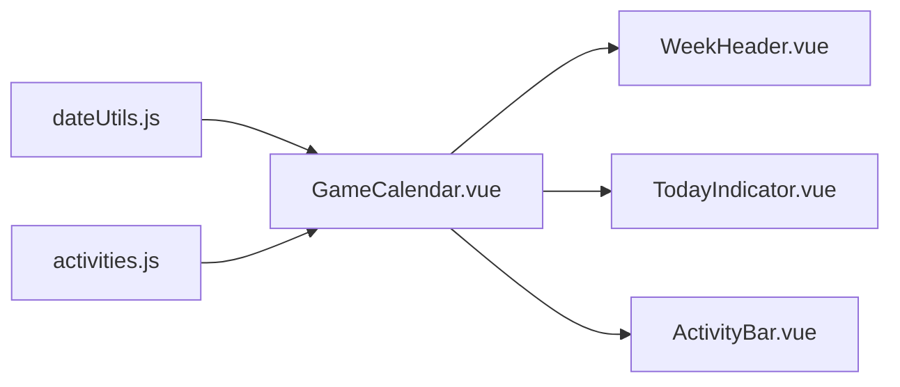

# 工具函数

<cite>
**本文引用的文件**
- [dateUtils.js](file://src/utils/dateUtils.js)
- [GameCalendar.vue](file://src/components/GameCalendar.vue)
- [TodayIndicator.vue](file://src/components/TodayIndicator.vue)
- [WeekHeader.vue](file://src/components/WeekHeader.vue)
- [ActivityBar.vue](file://src/components/ActivityBar.vue)
- [activities.js](file://src/config/activities.js)
- [App.vue](file://src/App.vue)
- [main.js](file://src/main.js)
</cite>

## 更新摘要
**变更内容**
- dateUtils.js完全重构，移除维护周期算法，采用通用时间轴计算
- 新增getTimelineInfo()函数，计算时间轴基本信息
- 新增getPreciseTodayPosition()函数，支持精确位置计算
- 移除getCurrentWeekStart()、getWeeks()等旧函数
- 更新组件调用关系，适配新的时间轴计算方式

## 目录
1. [简介](#简介)
2. [项目结构](#项目结构)
3. [核心组件](#核心组件)
4. [架构总览](#架构总览)
5. [详细组件分析](#详细组件分析)
6. [依赖关系分析](#依赖关系分析)
7. [性能考量](#性能考量)
8. [故障排查指南](#故障排查指南)
9. [结论](#结论)
10. [附录](#附录)

## 简介
本文件为日期计算工具函数的API文档，聚焦于重构后的 src/utils/dateUtils.js 中导出的函数，包括：
- **新增** getTimelineInfo：计算时间轴基本信息（总天数、起始日期、结束日期）
- **新增** getPreciseTodayPosition：计算当前时刻在自定义时间轴上的精确比例位置（0~1）
- **保留** getTodayLabel：生成本地化的"今天"显示文本
- **移除** 旧的维护周期算法（每周四起始）

文档同时结合 GameCalendar 应用的实际使用场景，说明各函数在组件中的调用方式、参数与返回值、错误处理策略与边界条件，并给出性能优化建议与常见问题排查方法。

## 项目结构
该应用采用 Vue 3 单页应用结构，日期工具位于 utils 目录，被 GameCalendar 主组件导入并在多个子组件中使用：
- utils/dateUtils.js：提供通用时间轴计算工具
- components/GameCalendar.vue：主容器，调用工具函数生成时间轴、今日位置与标签，支持实时更新
- components/TodayIndicator.vue：渲染今日指示器，接收 position 与 label
- components/WeekHeader.vue：渲染时间轴头部与日期标注
- components/ActivityBar.vue：根据活动的起止时间在时间轴上定位显示
- config/activities.js：活动配置数据，包含 startWeek/endWeek
- App.vue/main.js：应用入口

**图表来源**
- [GameCalendar.vue:71-76](file://src/components/GameCalendar.vue#L71-L76)
- [dateUtils.js:11-74](file://src/utils/dateUtils.js#L11-L74)
- [activities.js:1-110](file://src/config/activities.js#L1-L110)

**章节来源**
- [GameCalendar.vue:1-279](file://src/components/GameCalendar.vue#L1-L279)
- [dateUtils.js:1-81](file://src/utils/dateUtils.js#L1-L81)
- [activities.js:1-110](file://src/config/activities.js#L1-L110)

## 核心组件
本节对重构后的 dateUtils.js 中的每个导出函数进行逐项说明，包括功能、参数、返回值、内部逻辑要点与使用示例路径。

- **新增** getTimelineInfo(startDate, endDate)
  - 功能：计算时间轴基本信息，包括总天数、起始日期和结束日期
  - 参数：必需 startDate（起始日期字符串）、endDate（结束日期字符串）
  - 返回值：{ totalDays: Number, startDate: String, endDate: String }
  - 内部逻辑要点：
    - 将输入日期归零到当日 00:00:00，确保计算精度
    - 计算起止日期之间的毫秒差，转换为天数并加1（包含起始日）
    - 返回标准化的时间轴信息对象
  - 使用示例路径：
    - [GameCalendar.vue:108-110](file://src/components/GameCalendar.vue#L108-L110)
    - [WeekHeader.vue:36-49](file://src/components/WeekHeader.vue#L36-L49)
  - 复杂度：O(1)，仅进行一次日期运算与常量时间计算

- **新增** getPreciseTodayPosition(startDate, endDate, now = new Date())
  - 功能：计算当前时刻在自定义时间轴上的精确比例位置（0~1），精确到小时和分钟
  - 参数：必需 startDate（起始日期字符串）、endDate（结束日期字符串），可选 now（当前时间，默认为当前时间）
  - 返回值：Number，范围 [0, 1]
  - 内部逻辑要点：
    - 将起始日期、结束日期和当前时间都归零到当日 00:00:00
    - 计算总毫秒差并转换为天数，加1天（endDate - startDate + 1天）
    - 计算完整天数差和当天已过时间比例
    - 合成精确天数并除以总天数，使用 Math.min/Math.max 限制在 [0, 1] 范围内
  - 使用示例路径：
    - [GameCalendar.vue:114-120](file://src/components/GameCalendar.vue#L114-L120)
    - [GameCalendar.vue:131-142](file://src/components/GameCalendar.vue#L131-L142)
    - [TodayIndicator.vue:4](file://src/components/TodayIndicator.vue#L4)
  - 复杂度：O(1)，包含额外的小时/分钟计算

- **保留** getTodayLabel(today = new Date())
  - 功能：生成本地化的"今天"显示文本，包含月/日与中文星期
  - 参数：可选 today（默认当前时间）
  - 返回值：String，格式如"今天 04/05 星期四"
  - 内部逻辑要点：
    - 月份与日期均使用两位补零
    - 通过索引 weekDays 数组获取中文星期
  - 使用示例路径：
    - [GameCalendar.vue:121](file://src/components/GameCalendar.vue#L121)
    - [TodayIndicator.vue:4](file://src/components/TodayIndicator.vue#L4)
  - 复杂度：O(1)

**章节来源**
- [dateUtils.js:11-74](file://src/utils/dateUtils.js#L11-L74)

## 架构总览
下图展示了重构后的 GameCalendar 应用中日期工具的调用关系与数据流，包括新增的精确位置计算功能：

**图表来源**
- [GameCalendar.vue:71-76](file://src/components/GameCalendar.vue#L71-L76)
- [dateUtils.js:11-74](file://src/utils/dateUtils.js#L11-L74)
- [WeekHeader.vue:36-49](file://src/components/WeekHeader.vue#L36-L49)
- [TodayIndicator.vue:4](file://src/components/TodayIndicator.vue#L4)
- [ActivityBar.vue:75-102](file://src/components/ActivityBar.vue#L75-L102)
- [activities.js:1-110](file://src/config/activities.js#L1-L110)

## 详细组件分析

### 通用时间轴计算系统
- **重构设计**：从固定的"每周四"维护周期改为通用的时间轴计算，支持任意起止日期的自定义时间轴
- **关键优势**：
  - 更灵活的日期范围支持
  - 精确到小时和分钟的位置计算
  - 支持实时更新的时间轴显示
  - 适用于多种游戏维护周期和活动安排

**图表来源**
- [dateUtils.js:11-74](file://src/utils/dateUtils.js#L11-L74)

**章节来源**
- [dateUtils.js:11-74](file://src/utils/dateUtils.js#L11-L74)

### 精确位置计算与实时更新
- **新增功能** getPreciseTodayPosition 提供了精确到小时和分钟的位置计算，支持实时时间轴更新
- 核心逻辑：
  - 计算总天数：(endDate - startDate + 1天)
  - 计算完整天数差：与起始日期的天数差
  - 计算当天时间比例：(hours × 60 + minutes) / (24 × 60)
  - 合成精确天数：完整天数 + 当天比例
  - 返回最终比例：精确天数 ÷ 总天数
- **实时更新机制**：GameCalendar 组件每分钟调用一次 getPreciseTodayPosition，实现时间轴的平滑移动

**图表来源**
- [GameCalendar.vue:114-120](file://src/components/GameCalendar.vue#L114-L120)
- [GameCalendar.vue:131-142](file://src/components/GameCalendar.vue#L131-L142)
- [dateUtils.js:32-54](file://src/utils/dateUtils.js#L32-L54)
- [TodayIndicator.vue:4](file://src/components/TodayIndicator.vue#L4)

**章节来源**
- [GameCalendar.vue:114-120](file://src/components/GameCalendar.vue#L114-L120)
- [GameCalendar.vue:131-142](file://src/components/GameCalendar.vue#L131-L142)
- [dateUtils.js:32-54](file://src/utils/dateUtils.js#L32-L54)
- [TodayIndicator.vue:4](file://src/components/TodayIndicator.vue#L4)

### 今日标签与日期格式化
- **保留** getTodayLabel：生成本地化的"今天"显示文本，包含月/日与中文星期
- **移除** formatDate/numberToChinese：这些内部函数已被移除，格式化逻辑直接在函数内部实现
- 使用场景：TodayIndicator 组件显示今日标签；WeekHeader 组件显示日期标注

**图表来源**
- [dateUtils.js:59-74](file://src/utils/dateUtils.js#L59-L74)

**章节来源**
- [dateUtils.js:59-74](file://src/utils/dateUtils.js#L59-L74)

### 时间轴头部与活动条
- **WeekHeader**：接收 startDate、endDate 和 totalDays，渲染时间轴头部与日期标注
- **ActivityBar**：根据活动的 startTime/endTime 与 totalDays 计算 marginLeft 与 width 百分比，实现活动在时间轴上的可视化
- **时间计算**：使用 totalHours = totalDays × 24 进行小时级计算

**图表来源**
- [GameCalendar.vue:108-110](file://src/components/GameCalendar.vue#L108-L110)
- [dateUtils.js:11-25](file://src/utils/dateUtils.js#L11-L25)
- [WeekHeader.vue:36-49](file://src/components/WeekHeader.vue#L36-L49)
- [ActivityBar.vue:75-102](file://src/components/ActivityBar.vue#L75-L102)
- [activities.js:1-110](file://src/config/activities.js#L1-L110)

**章节来源**
- [WeekHeader.vue:36-49](file://src/components/WeekHeader.vue#L36-L49)
- [ActivityBar.vue:75-102](file://src/components/ActivityBar.vue#L75-L102)
- [activities.js:1-110](file://src/config/activities.js#L1-L110)

## 依赖关系分析
- **重构后的依赖**：dateUtils.js 作为纯函数工具模块，不依赖外部库，仅使用标准 Date API
- **组件调用关系**：GameCalendar.vue 导入并调用三个工具函数：getTimelineInfo、getPreciseTodayPosition、getTodayLabel
- **数据传递**：WeekHeader.vue 依赖 totalDays 数据；TodayIndicator.vue 依赖 position 与 label；ActivityBar.vue 依赖 activities 配置与 totalDays
- **配置数据**：activities.js 提供静态配置数据，被 GameCalendar 使用

**图表来源**
- [GameCalendar.vue:71-76](file://src/components/GameCalendar.vue#L71-L76)
- [dateUtils.js:11-74](file://src/utils/dateUtils.js#L11-L74)
- [WeekHeader.vue:36-49](file://src/components/WeekHeader.vue#L36-L49)
- [TodayIndicator.vue:12-25](file://src/components/TodayIndicator.vue#L12-L25)
- [ActivityBar.vue:45-66](file://src/components/ActivityBar.vue#L45-L66)
- [activities.js:1-110](file://src/config/activities.js#L1-L110)

**章节来源**
- [GameCalendar.vue:71-76](file://src/components/GameCalendar.vue#L71-L76)
- [dateUtils.js:11-74](file://src/utils/dateUtils.js#L11-L74)
- [activities.js:1-110](file://src/config/activities.js#L1-L110)

## 性能考量
- **时间复杂度**
  - getTimelineInfo：O(1)，固定的一次日期运算
  - getPreciseTodayPosition：O(1)，包含额外的小时/分钟计算
  - getTodayLabel：O(1)
- **空间复杂度**
  - 所有函数均为 O(1)，不创建与输入规模相关的数据结构
- **优化建议**
  - **实时更新优化**：当前每分钟更新一次，可根据需求调整频率（如每5分钟或每30分钟）
  - **缓存策略**：若同一页面多次调用 getTimelineInfo，可在组件层级缓存结果，避免重复计算
  - **输入校验**：对外暴露的函数可增加参数类型检查与边界校验，提升健壮性
  - **本地化**：getTodayLabel 中的中文星期与格式可抽象为可配置项，便于国际化扩展
  - **内存管理**：定时器在组件卸载时正确清理，防止内存泄漏

**章节来源**
- [GameCalendar.vue:131-142](file://src/components/GameCalendar.vue#L131-L142)

## 故障排查指南
- **常见问题与处理**
  - 传入非法日期：当 startDate/endDate/now 为无效值时，Date 构造可能失败或行为不可预测。建议在调用前进行有效性检查或提供默认安全值
  - 位置越界：getPreciseTodayPosition 通过 Math.min/Math.max 限制在 [0,1]，但仍需确保传入日期与起始日期的比较逻辑正确
  - **新增** 精确位置更新：如果实时更新不生效，检查定时器是否正确设置和清理，以及组件生命周期钩子的正确使用
  - **新增** 时间轴计算：如果时间轴显示异常，检查 getTimelineInfo 的返回值 totalDays 是否正确
  - **新增** 日期精度：由于使用 setHours(0,0,0,0) 归零，计算不受时分秒影响；若需要考虑时区，应在调用前统一为 UTC 或本地时间
- **调试建议**
  - 在 GameCalendar.vue 中打印 timelineInfo、todayPosition、todayLabel，确认数据流是否符合预期
  - **新增** 在控制台观察 getPreciseTodayPosition 的输出，验证实时更新效果
  - 在 TodayIndicator.vue 中验证 left 样式是否为百分比且在 0~100% 范围内
  - 在 ActivityBar.vue 中验证 marginLeft 与 width 是否按 startTime/endTime 正确计算
  - **新增** 检查定时器状态，确保每分钟正确触发更新

**章节来源**
- [dateUtils.js:11-74](file://src/utils/dateUtils.js#L11-L74)
- [GameCalendar.vue:108-120](file://src/components/GameCalendar.vue#L108-L120)
- [GameCalendar.vue:131-142](file://src/components/GameCalendar.vue#L131-L142)
- [TodayIndicator.vue:4](file://src/components/TodayIndicator.vue#L4)
- [ActivityBar.vue:75-102](file://src/components/ActivityBar.vue#L75-L102)

## 结论
**重构后的 dateUtils.js** 提供了更通用的时间轴计算能力，移除了固定的"每周四"维护周期限制，支持任意起止日期的自定义时间轴。**新增的 getTimelineInfo() 和 getPreciseTodayPosition() 函数**使得应用能够灵活处理不同游戏的维护周期和活动安排，实时更新功能提供了更流畅的用户体验。其设计简洁、复杂度低、易于扩展。建议在生产环境中增加输入校验与缓存策略，并考虑将本地化配置外置以便国际化。

**章节来源**
- [dateUtils.js:11-74](file://src/utils/dateUtils.js#L11-L74)
- [GameCalendar.vue:114-142](file://src/components/GameCalendar.vue#L114-L142)

## 附录
- **使用示例路径汇总**
  - **新增** 获取时间轴信息：[GameCalendar.vue:108-110](file://src/components/GameCalendar.vue#L108-L110)
  - **新增** 获取今日精确位置：[GameCalendar.vue:114-120](file://src/components/GameCalendar.vue#L114-L120)
  - **新增** 实时位置更新：[GameCalendar.vue:131-142](file://src/components/GameCalendar.vue#L131-L142)
  - **保留** 获取今日标签：[GameCalendar.vue:121](file://src/components/GameCalendar.vue#L121)
  - **新增** 渲染时间轴头部：[WeekHeader.vue:36-49](file://src/components/WeekHeader.vue#L36-L49)
  - **新增** 渲染今日指示器：[TodayIndicator.vue:4](file://src/components/TodayIndicator.vue#L4)
  - **新增** 活动条样式计算：[ActivityBar.vue:75-102](file://src/components/ActivityBar.vue#L75-L102)
  - **新增** 活动配置数据：[activities.js:1-110](file://src/config/activities.js#L1-L110)

**章节来源**
- [GameCalendar.vue:108-142](file://src/components/GameCalendar.vue#L108-L142)
- [WeekHeader.vue:36-49](file://src/components/WeekHeader.vue#L36-L49)
- [TodayIndicator.vue:4](file://src/components/TodayIndicator.vue#L4)
- [ActivityBar.vue:75-102](file://src/components/ActivityBar.vue#L75-L102)
- [activities.js:1-110](file://src/config/activities.js#L1-L110)