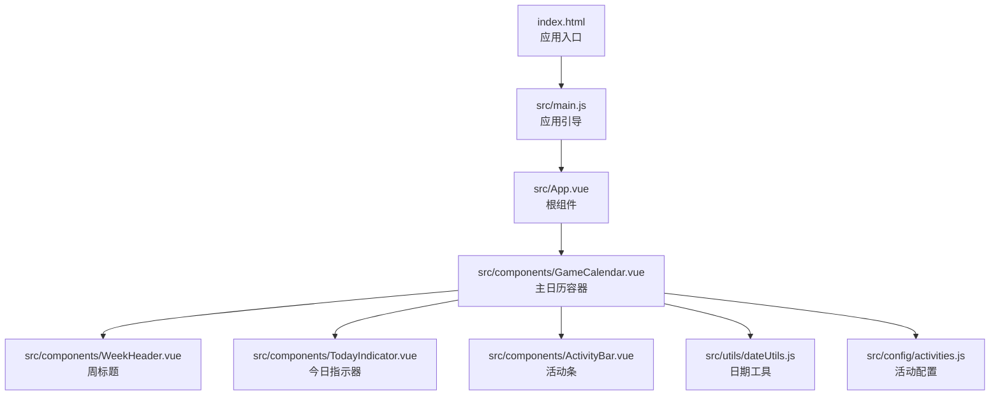
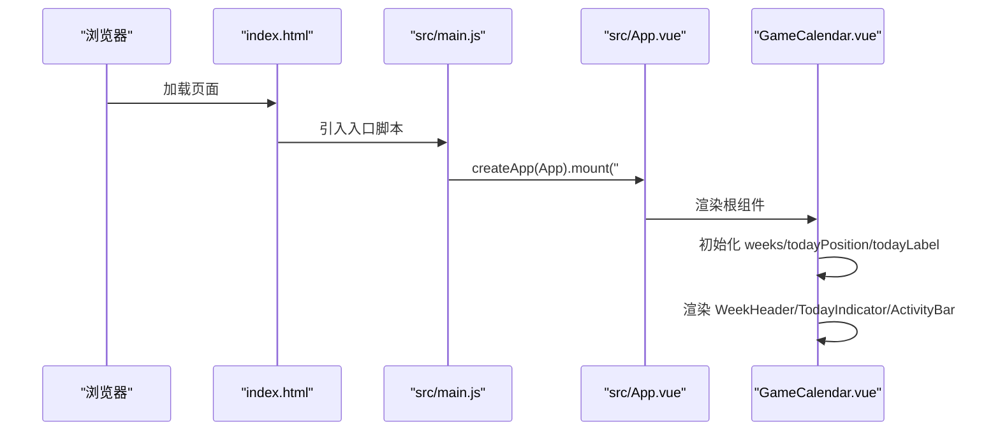
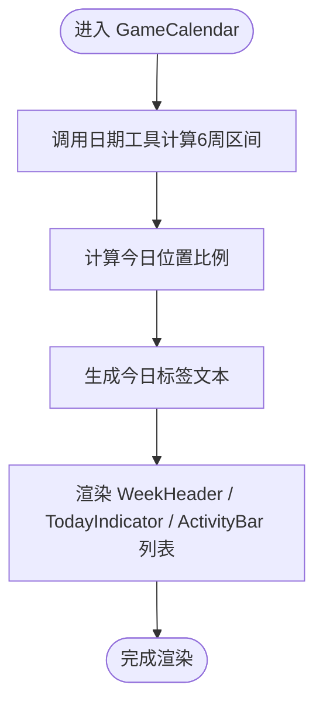
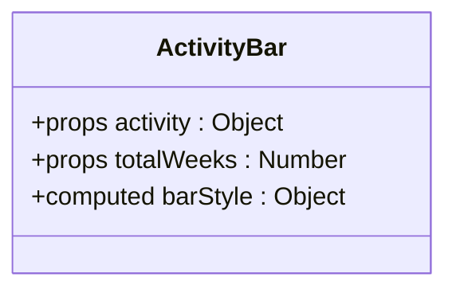
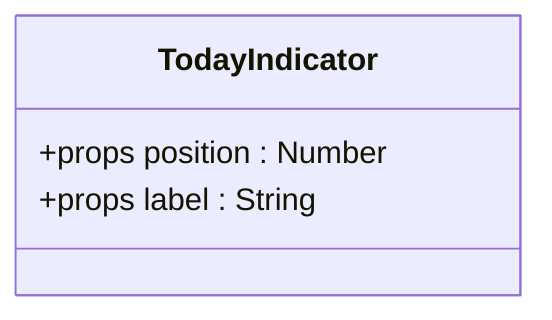
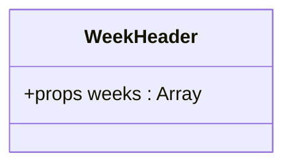
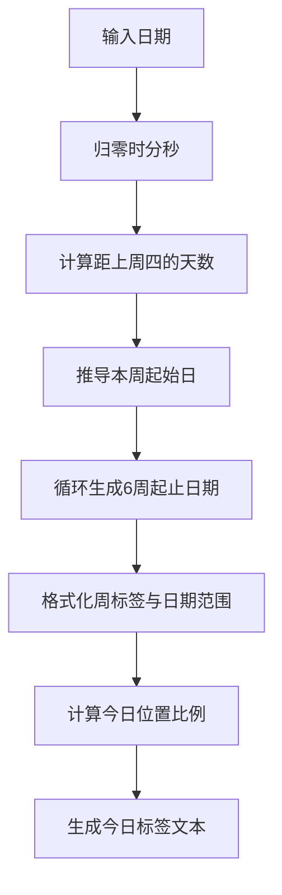
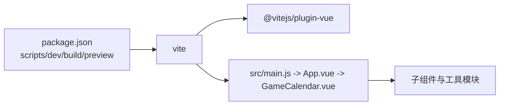

# 开发指南

<cite>
**本文引用的文件**
- [package.json](file://package.json)
- [vite.config.js](file://vite.config.js)
- [index.html](file://index.html)
- [src/main.js](file://src/main.js)
- [src/App.vue](file://src/App.vue)
- [src/components/GameCalendar.vue](file://src/components/GameCalendar.vue)
- [src/components/ActivityBar.vue](file://src/components/ActivityBar.vue)
- [src/components/TodayIndicator.vue](file://src/components/TodayIndicator.vue)
- [src/components/WeekHeader.vue](file://src/components/WeekHeader.vue)
- [src/utils/dateUtils.js](file://src/utils/dateUtils.js)
- [src/config/activities.js](file://src/config/activities.js)
- [README.md](file://README.md)
</cite>

## 目录
1. [简介](#简介)
2. [项目结构](#项目结构)
3. [核心组件](#核心组件)
4. [架构总览](#架构总览)
5. [详细组件分析](#详细组件分析)
6. [依赖分析](#依赖分析)
7. [性能考虑](#性能考虑)
8. [调试与故障排除](#调试与故障排除)
9. [测试与质量保证](#测试与质量保证)
10. [部署与生产优化](#部署与生产优化)
11. [开发环境配置与IDE推荐](#开发环境配置与ide推荐)
12. [代码规范与提交规范](#代码规范与提交规范)
13. [结论](#结论)

## 简介
本指南面向参与本项目的开发者，提供从环境搭建、开发调试、构建优化、测试质量保障到生产部署的完整工作流程。项目基于 Vue 3 + Vite，采用单页应用结构，核心功能围绕“游戏日历”展示活动在6周时间轴上的分布，并标注今日位置。

## 项目结构
项目采用典型的 Vue 3 单文件组件（SFC）组织方式，入口 HTML 负责挂载根组件，根组件再组合业务组件；工具函数与配置数据分别位于 utils 与 config 目录，便于复用与维护。

图表来源
- [index.html:1-14](file://index.html#L1-L14)
- [src/main.js:1-5](file://src/main.js#L1-L5)
- [src/App.vue:1-29](file://src/App.vue#L1-L29)
- [src/components/GameCalendar.vue:1-70](file://src/components/GameCalendar.vue#L1-L70)
- [src/components/WeekHeader.vue:1-51](file://src/components/WeekHeader.vue#L1-L51)
- [src/components/TodayIndicator.vue:1-53](file://src/components/TodayIndicator.vue#L1-L53)
- [src/components/ActivityBar.vue:1-164](file://src/components/ActivityBar.vue#L1-L164)
- [src/utils/dateUtils.js:1-103](file://src/utils/dateUtils.js#L1-L103)
- [src/config/activities.js:1-53](file://src/config/activities.js#L1-L53)

章节来源
- [index.html:1-14](file://index.html#L1-L14)
- [src/main.js:1-5](file://src/main.js#L1-L5)
- [src/App.vue:1-29](file://src/App.vue#L1-L29)

## 核心组件
- 应用入口与引导：HTML 提供挂载点，main.js 创建并挂载根组件。
- 根组件 App.vue：全局样式初始化，承载主组件 GameCalendar。
- 主组件 GameCalendar.vue：聚合周表头、今日指示器、活动列表，负责状态与数据传递。
- 子组件：
  - ActivityBar.vue：按活动起止周渲染横向进度条。
  - TodayIndicator.vue：根据今日在6周中的比例定位指示线与标签。
  - WeekHeader.vue：展示6周的周序号与日期范围。
- 工具与配置：
  - dateUtils.js：计算当前维护周期起始日、6周区间、今日位置与标签。
  - activities.js：活动配置数据，包含起止周、类型与图标等属性。

章节来源
- [src/App.vue:1-29](file://src/App.vue#L1-L29)
- [src/components/GameCalendar.vue:1-70](file://src/components/GameCalendar.vue#L1-L70)
- [src/components/ActivityBar.vue:1-164](file://src/components/ActivityBar.vue#L1-L164)
- [src/components/TodayIndicator.vue:1-53](file://src/components/TodayIndicator.vue#L1-L53)
- [src/components/WeekHeader.vue:1-51](file://src/components/WeekHeader.vue#L1-L51)
- [src/utils/dateUtils.js:1-103](file://src/utils/dateUtils.js#L1-L103)
- [src/config/activities.js:1-53](file://src/config/activities.js#L1-L53)

## 架构总览
下图展示了从浏览器加载到组件渲染的关键路径，以及数据流方向。

图表来源
- [index.html:1-14](file://index.html#L1-L14)
- [src/main.js:1-5](file://src/main.js#L1-L5)
- [src/App.vue:1-29](file://src/App.vue#L1-L29)
- [src/components/GameCalendar.vue:1-70](file://src/components/GameCalendar.vue#L1-L70)

## 详细组件分析

### GameCalendar 组件
职责与交互
- 聚合子组件：周表头、今日指示器、活动条集合。
- 数据准备：通过日期工具计算6周区间、今日位置与标签。
- 配置注入：从配置模块导入活动数据。

图表来源
- [src/components/GameCalendar.vue:23-39](file://src/components/GameCalendar.vue#L23-L39)
- [src/utils/dateUtils.js:35-91](file://src/utils/dateUtils.js#L35-L91)
- [src/config/activities.js:1-53](file://src/config/activities.js#L1-L53)

章节来源
- [src/components/GameCalendar.vue:1-70](file://src/components/GameCalendar.vue#L1-L70)
- [src/utils/dateUtils.js:1-103](file://src/utils/dateUtils.js#L1-L103)
- [src/config/activities.js:1-53](file://src/config/activities.js#L1-L53)

### ActivityBar 组件
职责与交互
- 接收活动对象与总周数，计算横向条形的起始百分比与宽度百分比。
- 根据活动类型应用不同样式主题。
- 支持可选的美元标识与角色图标。

图表来源
- [src/components/ActivityBar.vue:24-49](file://src/components/ActivityBar.vue#L24-L49)

章节来源
- [src/components/ActivityBar.vue:1-164](file://src/components/ActivityBar.vue#L1-L164)

### TodayIndicator 组件
职责与交互
- 接收今日位置比例与标签文本，通过内联样式定位指示线与标签。
- 使用绝对定位在时间轴上方显示今日标记。

图表来源
- [src/components/TodayIndicator.vue:8-18](file://src/components/TodayIndicator.vue#L8-L18)

章节来源
- [src/components/TodayIndicator.vue:1-53](file://src/components/TodayIndicator.vue#L1-L53)

### WeekHeader 组件
职责与交互
- 接收6周信息数组，渲染周序号与日期范围。
- 使用弹性布局均分列宽，末列无右侧边框。

图表来源
- [src/components/WeekHeader.vue:10-16](file://src/components/WeekHeader.vue#L10-L16)

章节来源
- [src/components/WeekHeader.vue:1-51](file://src/components/WeekHeader.vue#L1-L51)

### 日期工具模块
职责与交互
- 计算以周四为一周起始的维护周期起始日。
- 生成6周的起止日期、周标签与日期范围字符串。
- 计算今日在6周总跨度中的比例位置。
- 生成今日显示文本（包含月/日与星期）。

图表来源
- [src/utils/dateUtils.js:12-91](file://src/utils/dateUtils.js#L12-L91)

章节来源
- [src/utils/dateUtils.js:1-103](file://src/utils/dateUtils.js#L1-L103)

## 依赖分析
- 运行时依赖
  - vue：框架核心，提供响应式与组件系统。
- 开发时依赖
  - vite：现代化构建工具与开发服务器。
  - @vitejs/plugin-vue：支持 Vue SFC 的 Vite 插件。
- 脚本命令
  - dev：启动开发服务器（热重载）。
  - build：打包生产版本。
  - preview：预览生产包。

图表来源
- [package.json:6-17](file://package.json#L6-L17)
- [vite.config.js:1-8](file://vite.config.js#L1-L8)
- [src/main.js:1-5](file://src/main.js#L1-L5)

章节来源
- [package.json:1-19](file://package.json#L1-L19)
- [vite.config.js:1-8](file://vite.config.js#L1-L8)

## 性能考虑
- 代码分割与懒加载
  - 对于大型组件或路由，可结合路由懒加载减少首屏体积。
- Tree Shaking
  - 使用 ES Module 导出，确保未使用的导出被移除。
- 样式作用域
  - 使用 scoped 样式避免全局污染，同时注意选择器复杂度。
- 图标与资源
  - 将图标转为 SVG 或内联小图标，减少请求次数。
- 构建优化
  - 生产构建默认启用压缩与最小化；如需进一步优化，可在 Vite 配置中开启更多插件或调整 Rollup 选项。
- 缓存策略
  - 合理设置静态资源缓存头，利用浏览器缓存提升二次加载速度。

## 调试与故障排除
- 热重载
  - 修改任意 .vue/.js/.css 文件后，浏览器自动刷新，无需手动重启。
- 源码映射
  - 开发模式默认启用 sourcemap，便于断点调试与错误定位。
- 性能分析
  - 使用浏览器性能面板记录渲染与重排开销，关注 ActivityBar 列表渲染与 TodayIndicator 定位逻辑。
- 常见问题
  - 样式不生效：确认 scoped 样式选择器是否正确匹配元素层级。
  - 今日指示器位置异常：检查 getTodayPosition 的计算边界值与 totalWeeks 参数。
  - 活动条宽度/间距异常：核对 barStyle 的百分比计算与父容器宽度。

## 测试与质量保证
- 单元测试
  - 对 dateUtils.js 中的纯函数进行单元测试，覆盖边界场景（如跨年、月末）。
- 组件测试
  - 使用测试框架对 ActivityBar、TodayIndicator、WeekHeader 的 props 输入与渲染结果进行断言。
- 端到端测试
  - 使用自动化测试工具验证从首页到日历视图的交互流程。
- 质量门禁
  - 在 CI 中执行 lint、单元测试与构建，失败则阻断合并。

## 部署与生产优化
- 构建产物
  - 执行构建命令生成 dist 目录，包含静态资源与入口 HTML。
- 预览
  - 使用内置预览命令在本地验证生产包。
- 静态托管
  - 将 dist 目录部署至 CDN 或静态站点服务。
- 安全与缓存
  - 设置合适的 CORS、安全响应头与缓存策略。
- SEO 与可访问性
  - 如需 SEO，可考虑服务端渲染或静态生成方案。

## 开发环境配置与IDE推荐
- Node.js 版本
  - 使用与项目兼容的 LTS 版本。
- 包管理器
  - 推荐使用 npm 与 package.json 脚本保持一致。
- IDE 插件
  - Vue 官方扩展、ESLint、Prettier、Volar。
- VSCode 设置建议
  - 启用 Volar 的“打开语言服务替代”与“仅针对当前项目启用”。
  - 自动格式化与保存时修复。
- 调试配置
  - 在浏览器中启用 Vue DevTools，观察组件树与响应式数据变化。

## 代码规范与提交规范
- 命名约定
  - 组件文件：帕斯卡命名（如 GameCalendar.vue）。
  - 工具函数：驼峰命名（如 getWeeks）。
  - 样式类名：BEM 或语义化短横线分隔（如 .game-calendar）。
- 结构组织
  - 组件拆分遵循单一职责，尽量保持无状态展示组件与有状态容器分离。
- 提交规范
  - 使用约定式提交（如 feat: 新增功能；fix: 修复问题；docs: 文档更新）。
- Lint 与格式化
  - ESLint + Prettier 统一风格，提交前执行检查与修复。

## 结论
本指南提供了从开发到生产的全流程实践建议。建议团队在现有 Vue 3 + Vite 基础上，持续完善测试体系、性能监控与部署流程，以保障项目的长期可维护性与稳定性。