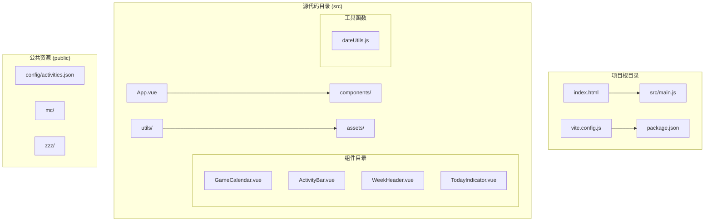
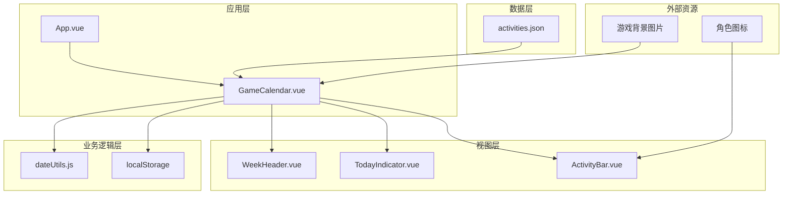
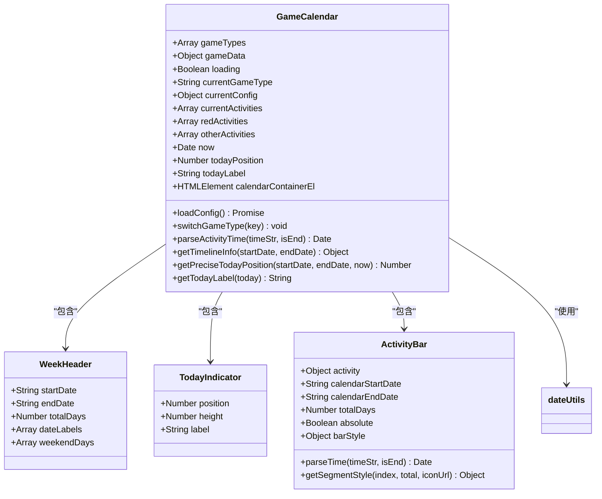
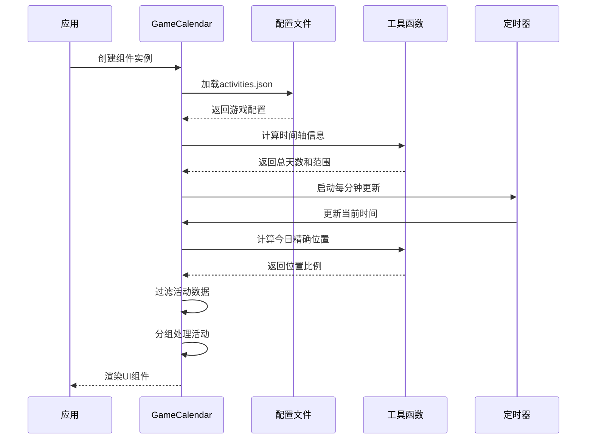
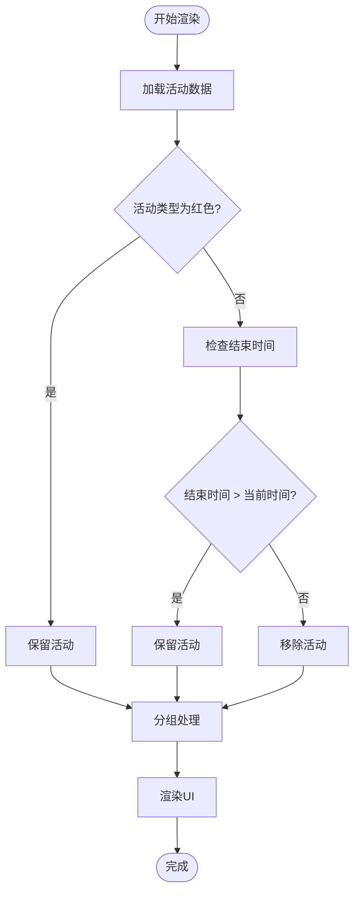
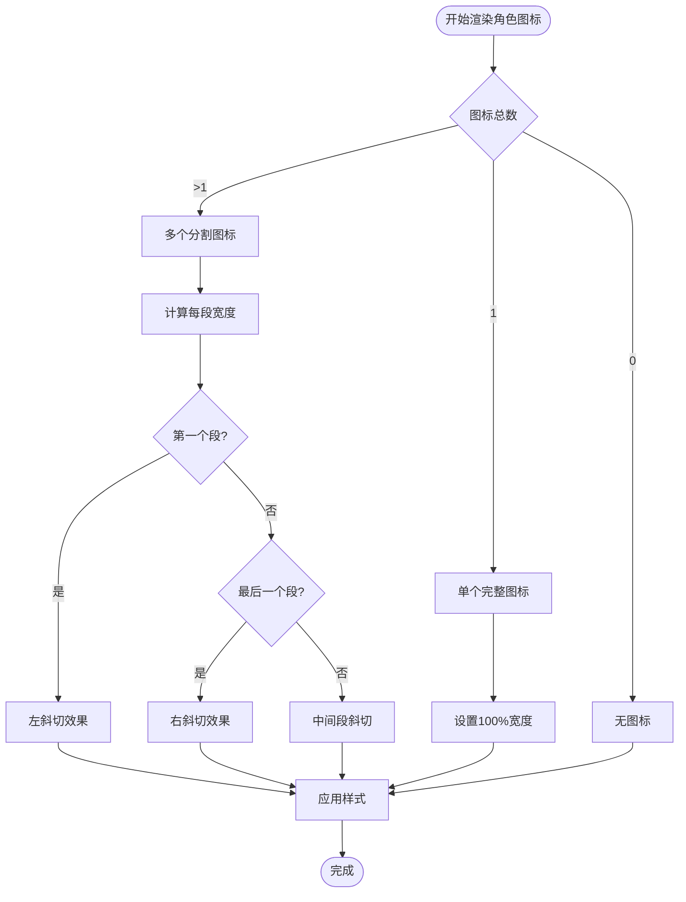
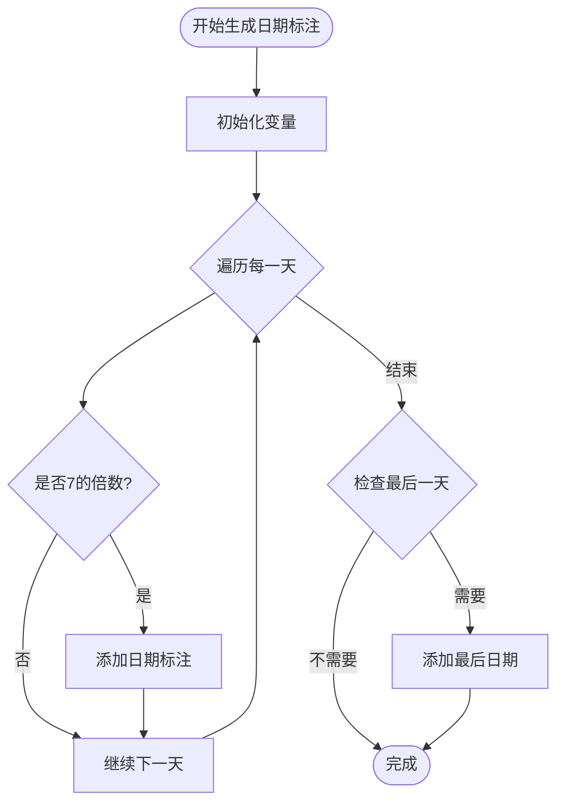
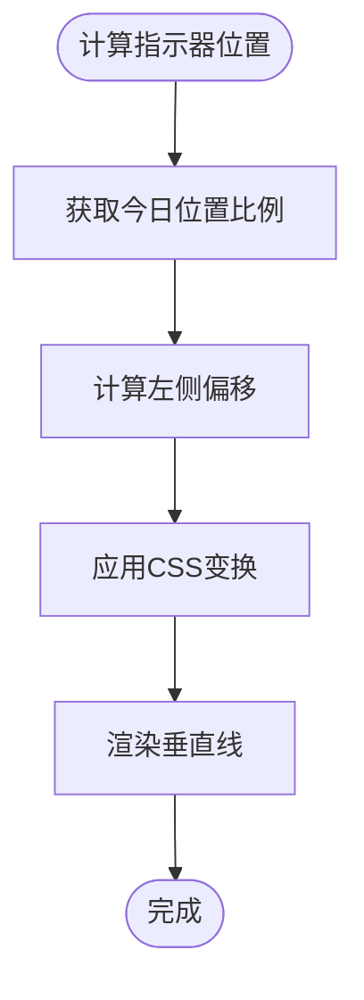
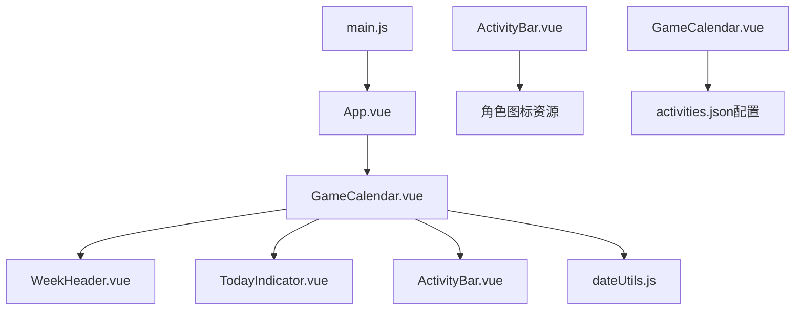

# 开发指南

<cite>
**本文档引用的文件**
- [README.md](file://README.md)
- [package.json](file://package.json)
- [vite.config.js](file://vite.config.js)
- [index.html](file://index.html)
- [src/main.js](file://src/main.js)
- [src/App.vue](file://src/App.vue)
- [src/utils/dateUtils.js](file://src/utils/dateUtils.js)
- [src/components/GameCalendar.vue](file://src/components/GameCalendar.vue)
- [src/components/ActivityBar.vue](file://src/components/ActivityBar.vue)
- [src/components/WeekHeader.vue](file://src/components/WeekHeader.vue)
- [src/components/TodayIndicator.vue](file://src/components/TodayIndicator.vue)
- [public/config/activities.json](file://public/config/activities.json)
</cite>

## 目录
1. [项目简介](#项目简介)
2. [项目结构](#项目结构)
3. [核心组件](#核心组件)
4. [架构概览](#架构概览)
5. [详细组件分析](#详细组件分析)
6. [依赖关系分析](#依赖关系分析)
7. [性能考虑](#性能考虑)
8. [开发指南](#开发指南)
9. [部署指南](#部署指南)
10. [故障排除](#故障排除)
11. [总结](#总结)

## 项目简介

这是一个基于Vue 3和Vite的游戏日历应用，用于展示游戏活动的时间轴。项目支持多个游戏类型（如《绝区零》和《鸣潮》），提供可视化的活动时间线展示，包括今日指示器、活动条形图和周标题等核心功能。

## 项目结构

项目采用标准的Vue 3单文件组件（SFC）架构，主要目录结构如下：



**图表来源**
- [src/main.js:1-5](file://src/main.js#L1-L5)
- [src/App.vue:1-35](file://src/App.vue#L1-L35)
- [vite.config.js:1-9](file://vite.config.js#L1-L9)

**章节来源**
- [README.md:1-6](file://README.md#L1-L6)
- [package.json:1-22](file://package.json#L1-L22)
- [src/main.js:1-5](file://src/main.js#L1-L5)

## 核心组件

### 应用入口组件

应用通过Vue 3的应用实例启动，使用组合式API和脚本设置语法。

### 游戏日历主组件

GameCalendar组件是整个应用的核心，负责：
- 游戏类型切换和状态管理
- 活动数据加载和过滤
- 时间轴计算和渲染
- 实时更新机制

### 工具函数模块

dateUtils.js提供了核心的日期计算功能：
- 时间轴信息计算
- 精确今日位置计算
- 日期格式化和标签生成

**章节来源**
- [src/App.vue:1-35](file://src/App.vue#L1-L35)
- [src/components/GameCalendar.vue:1-352](file://src/components/GameCalendar.vue#L1-L352)
- [src/utils/dateUtils.js:1-81](file://src/utils/dateUtils.js#L1-L81)

## 架构概览

系统采用组件化架构，各组件职责清晰分离：



**图表来源**
- [src/App.vue:5-7](file://src/App.vue#L5-L7)
- [src/components/GameCalendar.vue:70-79](file://src/components/GameCalendar.vue#L70-L79)
- [public/config/activities.json:1-246](file://public/config/activities.json#L1-L246)

## 详细组件分析

### GameCalendar 组件分析

GameCalendar是应用的核心组件，实现了复杂的状态管理和数据处理逻辑。

#### 组件类图



**图表来源**
- [src/components/GameCalendar.vue:70-194](file://src/components/GameCalendar.vue#L70-L194)
- [src/components/WeekHeader.vue:34-101](file://src/components/WeekHeader.vue#L34-L101)
- [src/components/TodayIndicator.vue:11-26](file://src/components/TodayIndicator.vue#L11-L26)
- [src/components/ActivityBar.vue:40-144](file://src/components/ActivityBar.vue#L40-L144)

#### 数据流序列图



**图表来源**
- [src/components/GameCalendar.vue:87-193](file://src/components/GameCalendar.vue#L87-L193)
- [src/utils/dateUtils.js:11-54](file://src/utils/dateUtils.js#L11-L54)

#### 活动过滤流程图



**图表来源**
- [src/components/GameCalendar.vue:130-157](file://src/components/GameCalendar.vue#L130-L157)

**章节来源**
- [src/components/GameCalendar.vue:1-352](file://src/components/GameCalendar.vue#L1-L352)

### ActivityBar 组件分析

ActivityBar组件负责渲染单个活动条，支持多种视觉效果和布局模式。

#### 角色图标分割算法



**图表来源**
- [src/components/ActivityBar.vue:80-114](file://src/components/ActivityBar.vue#L80-L114)

**章节来源**
- [src/components/ActivityBar.vue:1-316](file://src/components/ActivityBar.vue#L1-L316)

### WeekHeader 组件分析

WeekHeader组件实现时间轴头部的日期标注和周末背景效果。

#### 日期标注生成算法



**图表来源**
- [src/components/WeekHeader.vue:52-84](file://src/components/WeekHeader.vue#L52-L84)

**章节来源**
- [src/components/WeekHeader.vue:1-142](file://src/components/WeekHeader.vue#L1-L142)

### TodayIndicator 组件分析

TodayIndicator组件负责渲染今日指示器，包括垂直线和标签。

#### 指示器定位计算



**图表来源**
- [src/components/TodayIndicator.vue:2-8](file://src/components/TodayIndicator.vue#L2-L8)

**章节来源**
- [src/components/TodayIndicator.vue:1-59](file://src/components/TodayIndicator.vue#L1-L59)

## 依赖关系分析

### 外部依赖

项目使用现代化的前端技术栈：

```mermaid
graph LR
subgraph "运行时依赖"
A[Vue 3.5.34] --> B[核心框架]
end
subgraph "开发依赖"
C[Vite 8.0.12] --> D[构建工具]
E[@vitejs/plugin-vue 6.0.6] --> F[Vue插件]
G[gh-pages 6.3.0] --> H[部署工具]
end
subgraph "项目配置"
I[package.json] --> J[依赖声明]
K[vite.config.js] --> L[构建配置]
M[index.html] --> N[入口页面]
end
```

**图表来源**
- [package.json:13-20](file://package.json#L13-L20)
- [vite.config.js:5-8](file://vite.config.js#L5-L8)

### 内部组件依赖



**图表来源**
- [src/components/GameCalendar.vue:72-74](file://src/components/GameCalendar.vue#L72-L74)
- [src/App.vue:6](file://src/App.vue#L6)

**章节来源**
- [package.json:1-22](file://package.json#L1-L22)
- [src/components/GameCalendar.vue:70-79](file://src/components/GameCalendar.vue#L70-L79)

## 性能考虑

### 内存管理

- 使用`onUnmounted`钩子清理定时器，防止内存泄漏
- 通过`computed`属性实现响应式数据缓存
- 合理使用`ref`和`reactive`避免不必要的重渲染

### 渲染优化

- 使用虚拟滚动减少DOM节点数量
- 通过CSS硬件加速提升动画性能
- 合理的组件拆分避免单个组件过于复杂

### 数据处理优化

- 时间计算使用高效的数学运算
- 活动过滤在计算属性中进行，避免重复计算
- 图片资源预加载和懒加载策略

## 开发指南

### 环境要求

- Node.js版本：16.x或更高版本
- 包管理器：Yarn（推荐）
- 浏览器：现代浏览器（Chrome/Firefox/Safari）

### 本地开发

1. **安装依赖**
   ```bash
   yarn install
   ```

2. **启动开发服务器**
   ```bash
   yarn dev
   ```

3. **访问应用**
   打开浏览器访问 `http://localhost:5173`

### 项目配置

#### Vite配置说明

- `base: "/gameCalendar/"` - 设置GitHub Pages的基础路径
- 自动检测Vue单文件组件
- 支持热重载开发体验

#### 脚本命令

- `yarn dev` - 启动开发服务器
- `yarn build` - 生产环境构建
- `yarn preview` - 预览生产构建
- `yarn deploy` - 部署到GitHub Pages

### 添加新游戏类型

1. **更新配置文件**
   在 `public/config/activities.json` 中添加新的游戏类型配置

2. **添加资源文件**
   在 `public/mc/` 或 `public/zzz/` 目录下添加对应的背景图片和角色图标

3. **测试配置**
   启动应用验证新游戏类型的显示效果

### 修改活动数据

1. **编辑配置文件**
   在 `public/config/activities.json` 中修改活动时间范围和类型

2. **验证数据格式**
   确保时间格式符合 `YYYY-MM-DD HH` 或 `YYYY-MM-DD` 格式

3. **测试显示效果**
   检查活动条在时间轴上的正确位置和长度

**章节来源**
- [vite.config.js:5-8](file://vite.config.js#L5-L8)
- [package.json:6-12](file://package.json#L6-L12)

## 部署指南

### GitHub Pages部署

1. **构建项目**
   ```bash
   yarn build
   ```

2. **部署到GitHub Pages**
   ```bash
   yarn deploy
   ```

3. **配置GitHub仓库**
   - 在仓库设置中启用GitHub Pages
   - 设置源为 `gh-pages` 分支
   - 确认基础URL为 `/gameCalendar/`

### 本地预览

```bash
yarn preview
```

### 自定义部署

要部署到其他平台，需要：

1. **修改基础路径**
   在 `vite.config.js` 中调整 `base` 配置

2. **更新CNAME文件**
   如需自定义域名，在 `public/` 目录下添加 `CNAME` 文件

3. **配置CDN**
   将构建产物部署到CDN服务

**章节来源**
- [package.json:10-11](file://package.json#L10-L11)
- [vite.config.js:6](file://vite.config.js#L6)

## 故障排除

### 常见问题

#### 页面空白问题

**症状**：页面完全空白或只显示背景

**解决方案**：
1. 检查浏览器控制台是否有错误信息
2. 确认网络连接正常
3. 验证 `activities.json` 文件格式正确
4. 清除浏览器缓存后重试

#### 活动不显示问题

**症状**：活动条不显示或显示异常

**解决方案**：
1. 检查活动时间范围是否正确
2. 验证活动类型配置
3. 确认资源文件路径正确
4. 检查浏览器跨域问题

#### 定时器问题

**症状**：时间不更新或出现内存泄漏

**解决方案**：
1. 确认组件卸载时定时器被正确清理
2. 检查 `onUnmounted` 生命周期钩子
3. 验证定时器间隔设置合理

### 调试技巧

#### 开发者工具使用

1. **Vue DevTools**：检查组件状态和props传递
2. **网络面板**：监控配置文件加载
3. **性能面板**：分析渲染性能
4. **控制台**：查看错误日志和调试信息

#### 日志调试

在关键位置添加console.log输出：
- 配置文件加载成功
- 活动数据解析结果
- 时间计算过程
- 组件生命周期事件

**章节来源**
- [src/components/GameCalendar.vue:181-193](file://src/components/GameCalendar.vue#L181-L193)

## 总结

这个游戏日历应用展示了现代Vue 3开发的最佳实践，包括：

### 技术亮点

- **组件化架构**：清晰的组件职责分离
- **响应式设计**：灵活的数据绑定和状态管理
- **性能优化**：合理的渲染策略和内存管理
- **可扩展性**：易于添加新游戏类型和活动

### 开发建议

1. **代码组织**：保持组件单一职责原则
2. **错误处理**：完善的数据验证和错误捕获
3. **性能监控**：定期检查渲染性能和内存使用
4. **测试覆盖**：为关键功能编写单元测试

### 未来改进方向

1. **国际化支持**：添加多语言界面
2. **移动端适配**：优化移动设备显示效果
3. **数据持久化**：支持用户自定义活动
4. **主题系统**：允许用户自定义外观风格