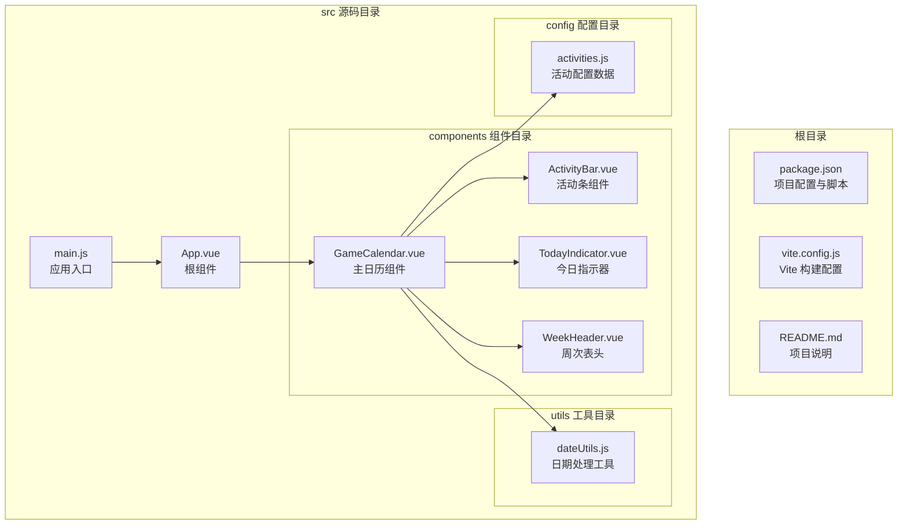
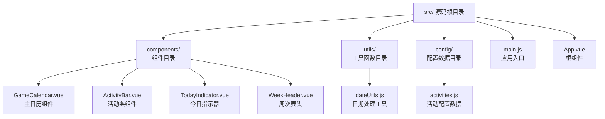
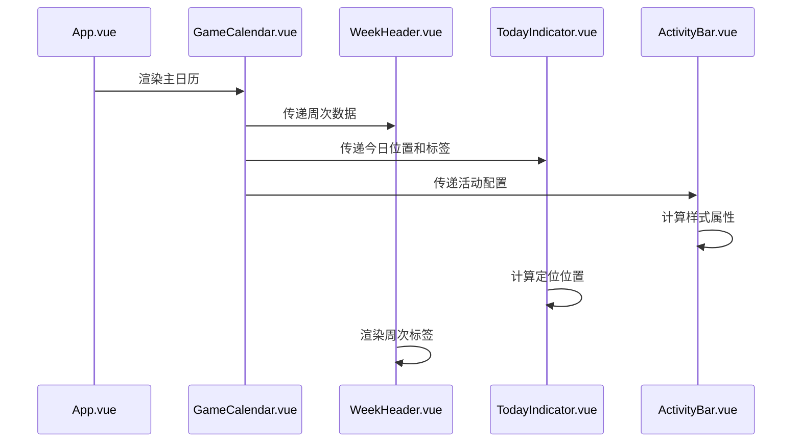

# 快速开始

<cite>
**本文档引用的文件**
- [package.json](file://package.json)
- [vite.config.js](file://vite.config.js)
- [README.md](file://README.md)
- [src/main.js](file://src/main.js)
- [src/App.vue](file://src/App.vue)
- [src/components/GameCalendar.vue](file://src/components/GameCalendar.vue)
- [src/components/ActivityBar.vue](file://src/components/ActivityBar.vue)
- [src/components/TodayIndicator.vue](file://src/components/TodayIndicator.vue)
- [src/components/WeekHeader.vue](file://src/components/WeekHeader.vue)
- [src/utils/dateUtils.js](file://src/utils/dateUtils.js)
- [src/config/activities.js](file://src/config/activities.js)
</cite>

## 目录
1. [简介](#简介)
2. [项目结构](#项目结构)
3. [环境准备](#环境准备)
4. [安装与启动](#安装与启动)
5. [开发工作流](#开发工作流)
6. [构建与预览](#构建与预览)
7. [核心组件详解](#核心组件详解)
8. [常见问题与故障排除](#常见问题与故障排除)
9. [总结](#总结)

## 简介

这是一个基于 Vue 3 和 Vite 的游戏日历可视化应用，专门用于展示游戏活动的时间轴信息。项目采用现代化的前端技术栈，提供了直观的游戏活动日历界面，支持活动条形图展示、今日指示器和周次导航等功能。

## 项目结构

项目采用标准的 Vue 3 单文件组件架构，主要文件组织如下：



**图表来源**
- [package.json:1-19](file://package.json#L1-L19)
- [vite.config.js:1-8](file://vite.config.js#L1-L8)
- [src/main.js:1-5](file://src/main.js#L1-L5)
- [src/App.vue:1-29](file://src/App.vue#L1-L29)

**章节来源**
- [package.json:1-19](file://package.json#L1-L19)
- [vite.config.js:1-8](file://vite.config.js#L1-L8)
- [src/main.js:1-5](file://src/main.js#L1-L5)
- [src/App.vue:1-29](file://src/App.vue#L1-L29)

## 环境准备

### Node.js 版本要求

项目使用现代 JavaScript 特性，建议使用以下版本的 Node.js：

- **推荐版本**: Node.js 16.x 或更高版本
- **最低版本**: Node.js 14.x
- **包管理器**: npm 7.x 或更高版本

### 环境检查

在开始之前，请验证您的开发环境：

```bash
# 检查 Node.js 版本
node --version

# 检查 npm 版本
npm --version

# 检查 Git 版本（如果需要从源码仓库克隆）
git --version
```

**章节来源**
- [package.json:1-19](file://package.json#L1-L19)

## 安装与启动

### 步骤 1：克隆项目

```bash
# 使用 HTTPS 克隆
git clone https://github.com/your-repo/gameCalendar.git

# 或使用 SSH 克隆
git clone git@github.com:your-repo/gameCalendar.git

# 进入项目目录
cd gameCalendar
```

### 步骤 2：安装依赖

```bash
# 使用 npm 安装依赖
npm install

# 或使用 yarn 安装依赖
yarn install

# 或使用 pnpm 安装依赖
pnpm install
```

### 步骤 3：启动开发服务器

```bash
# 启动开发服务器
npm run dev

# 开发服务器默认端口: 5173
# 访问地址: http://localhost:5173
```

### 开发服务器特性

- **热重载**: 修改代码后自动刷新浏览器
- **错误边界**: 编译错误会在浏览器中显示详细信息
- **源码映射**: 支持调试原始源码
- **实时预览**: 实时查看代码变更效果

**章节来源**
- [package.json:6-10](file://package.json#L6-L10)
- [vite.config.js:1-8](file://vite.config.js#L1-L8)

## 开发工作流

### 目录结构详解



**图表来源**
- [src/components/GameCalendar.vue:1-70](file://src/components/GameCalendar.vue#L1-L70)
- [src/utils/dateUtils.js:1-103](file://src/utils/dateUtils.js#L1-L103)
- [src/config/activities.js:1-53](file://src/config/activities.js#L1-L53)

### 主要文件功能

#### 应用入口 (src/main.js)
- 创建 Vue 应用实例
- 导入根组件 App.vue
- 将应用挂载到 DOM 中

#### 根组件 (src/App.vue)
- 定义全局样式
- 设置深色主题背景
- 渲染 GameCalendar 主组件

#### 主日历组件 (src/components/GameCalendar.vue)
- 整合所有日历相关组件
- 处理日期计算逻辑
- 管理活动数据展示

**章节来源**
- [src/main.js:1-5](file://src/main.js#L1-L5)
- [src/App.vue:1-29](file://src/App.vue#L1-L29)
- [src/components/GameCalendar.vue:1-70](file://src/components/GameCalendar.vue#L1-L70)

## 开发工作流

### 组件通信模式



**图表来源**
- [src/App.vue:1-29](file://src/App.vue#L1-L29)
- [src/components/GameCalendar.vue:1-70](file://src/components/GameCalendar.vue#L1-L70)
- [src/components/WeekHeader.vue:1-51](file://src/components/WeekHeader.vue#L1-L51)
- [src/components/TodayIndicator.vue:1-53](file://src/components/TodayIndicator.vue#L1-L53)
- [src/components/ActivityBar.vue:1-164](file://src/components/ActivityBar.vue#L1-L164)

### 数据流向

1. **配置层**: activities.js 提供活动数据
2. **计算层**: dateUtils.js 处理日期逻辑
3. **展示层**: 各组件负责具体 UI 展示
4. **交互层**: Vue 响应式系统管理状态更新

**章节来源**
- [src/config/activities.js:1-53](file://src/config/activities.js#L1-L53)
- [src/utils/dateUtils.js:1-103](file://src/utils/dateUtils.js#L1-L103)
- [src/components/GameCalendar.vue:23-39](file://src/components/GameCalendar.vue#L23-L39)

## 构建与预览

### 构建生产版本

```bash
# 构建生产版本
npm run build

# 构建输出目录: dist/
# 生成静态资源文件
```

### 预览生产版本

```bash
# 启动本地预览服务器
npm run preview

# 预览服务器默认端口: 4173
# 访问地址: http://localhost:4173
```

### 构建配置说明

项目使用 Vite 进行构建，配置特点：

- **模块化打包**: 自动代码分割
- **Tree Shaking**: 移除未使用的代码
- **资源优化**: 图片压缩、CSS 优化
- **缓存策略**: 文件名包含哈希值

**章节来源**
- [package.json:6-10](file://package.json#L6-L10)
- [vite.config.js:1-8](file://vite.config.js#L1-L8)

## 核心组件详解

### GameCalendar 组件

GameCalendar 是整个应用的核心组件，负责协调其他子组件的工作。

#### 主要功能
- **日期计算**: 使用 `dateUtils.js` 计算当前周和未来几周的日期范围
- **组件集成**: 组合 WeekHeader、TodayIndicator 和多个 ActivityBar
- **响应式数据**: 使用 Vue 的 ref 和 computed 管理动态状态

#### 关键实现要点
- 以周四作为一周的起始日（符合游戏维护日设定）
- 支持 6 周时间轴的展示
- 动态计算今日在时间轴上的位置

**章节来源**
- [src/components/GameCalendar.vue:1-70](file://src/components/GameCalendar.vue#L1-L70)
- [src/utils/dateUtils.js:35-55](file://src/utils/dateUtils.js#L35-L55)

### ActivityBar 组件

ActivityBar 负责展示单个活动在时间轴上的位置和样式。

#### 样式类型
- **红色类型**: 重要活动或限时活动
- **橙色类型**: 普通活动
- **灰色类型**: 不活跃或已结束的活动

#### 样式计算
组件通过计算属性动态生成样式：
- `marginLeft`: 活动开始周的位置百分比
- `width`: 活动持续时间的宽度百分比

**章节来源**
- [src/components/ActivityBar.vue:1-164](file://src/components/ActivityBar.vue#L1-L164)

### 日期工具函数

dateUtils.js 提供了完整的日期处理功能：

#### 核心函数
- `getCurrentWeekStart()`: 获取当前维护周期的起始日
- `getWeeks()`: 计算未来 6 周的日期范围
- `getTodayPosition()`: 计算今日在时间轴上的位置比例
- `getTodayLabel()`: 生成今日的显示文本

#### 日期规则
- 以周四为一周的起始日
- 当前周包含今天的那一周（周四到周三）
- 支持中文周次显示

**章节来源**
- [src/utils/dateUtils.js:1-103](file://src/utils/dateUtils.js#L1-L103)

### 活动配置数据

activities.js 定义了游戏活动的基本信息：

#### 数据结构
每个活动对象包含：
- `id`: 活动唯一标识
- `name`: 活动名称
- `startWeek`: 开始周次（从 1 开始）
- `endWeek`: 结束周次
- `type`: 样式类型（red/orange/gray）
- `icons`: 右侧图标数量
- `hasDollarSign`: 是否显示美元符号
- `hasCharIcon`: 是否显示角色图标

**章节来源**
- [src/config/activities.js:1-53](file://src/config/activities.js#L1-L53)

## 常见问题与故障排除

### 环境问题

#### Node.js 版本不兼容
**问题**: 安装依赖时报错，提示 Node.js 版本过低
**解决方案**:
```bash
# 升级 Node.js 到 16.x 或更高版本
# 或使用 nvm 管理 Node.js 版本
nvm install 16
nvm use 16
```

#### 权限问题
**问题**: npm install 报权限错误
**解决方案**:
```bash
# 使用管理员权限运行
sudo npm install

# 或配置 npm 全局目录权限
mkdir ~/.npm-global
npm config set prefix '~/.npm-global'
echo 'export PATH=~/.npm-global/bin:$PATH' >> ~/.bashrc
source ~/.bashrc
```

### 依赖安装问题

#### 网络连接问题
**问题**: npm install 下载缓慢或失败
**解决方案**:
```bash
# 使用淘宝镜像源
npm install --registry https://registry.npmmirror.com/

# 或配置 npm 使用代理
npm config set proxy http://proxy.server.com:8080
npm config set https-proxy http://proxy.server.com:8080
```

#### 缓存问题
**问题**: 依赖安装异常或版本冲突
**解决方案**:
```bash
# 清理 npm 缓存
npm cache clean --force

# 删除 node_modules 和 package-lock.json
rm -rf node_modules package-lock.json

# 重新安装依赖
npm install
```

### 开发服务器问题

#### 端口占用
**问题**: 开发服务器启动失败，提示端口被占用
**解决方案**:
```bash
# 查找占用端口的进程
lsof -i :5173

# 修改 Vite 配置中的端口号
# 在 vite.config.js 中添加
export default defineConfig({
  server: {
    port: 5174
  },
  plugins: [vue()]
})
```

#### 热重载失效
**问题**: 修改代码后浏览器不自动刷新
**解决方案**:
```bash
# 检查网络连接
# 清理浏览器缓存
# 重启开发服务器
npm run dev

# 检查防火墙设置
```

### 构建问题

#### 构建失败
**问题**: npm run build 报错
**解决方案**:
```bash
# 检查语法错误
# 确保所有组件正确导入
# 更新依赖到最新版本
npm update

# 清理构建缓存
rm -rf node_modules/.vite
```

#### 预览服务器问题
**问题**: npm run preview 无法访问
**解决方案**:
```bash
# 确认已先执行构建
npm run build

# 检查预览端口是否被占用
lsof -i :4173

# 修改预览端口
npx vite preview --port 4174
```

### 浏览器兼容性问题

#### Vue 3 兼容性
**问题**: 在旧版浏览器中运行异常
**解决方案**:
```javascript
// 在 vite.config.js 中添加 polyfill
export default defineConfig({
  build: {
    target: ['es2015']
  },
  plugins: [vue()]
})
```

**章节来源**
- [package.json:1-19](file://package.json#L1-L19)
- [vite.config.js:1-8](file://vite.config.js#L1-L8)

## 总结

这个游戏日历项目提供了完整的学习路径，涵盖了现代前端开发的最佳实践。通过遵循本指南，您可以在几分钟内完成项目搭建并开始开发。

### 快速检查清单

- ✅ Node.js 16+ 已安装
- ✅ 项目克隆完成
- ✅ 依赖安装成功
- ✅ 开发服务器正常运行
- ✅ 构建流程测试通过

### 下一步建议

1. **探索现有功能**: 熟悉各个组件的职责和交互方式
2. **修改活动数据**: 在 activities.js 中添加新的游戏活动
3. **自定义样式**: 调整颜色方案和布局设计
4. **扩展功能**: 添加更多日历相关的功能特性

### 学习资源

- [Vue 3 官方文档](https://vuejs.org/)
- [Vite 官方文档](https://vite.dev/)
- [JavaScript ES6+ 特性](https://developer.mozilla.org/zh-CN/docs/Web/JavaScript/New_in_JavaScript)

祝您开发顺利！如有任何问题，请随时查阅本指南或参考官方文档。