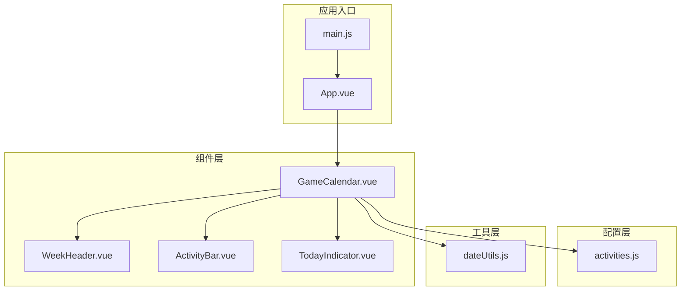
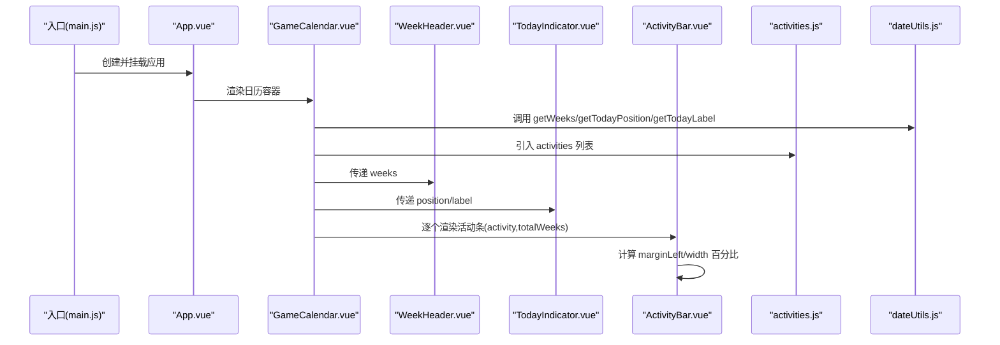
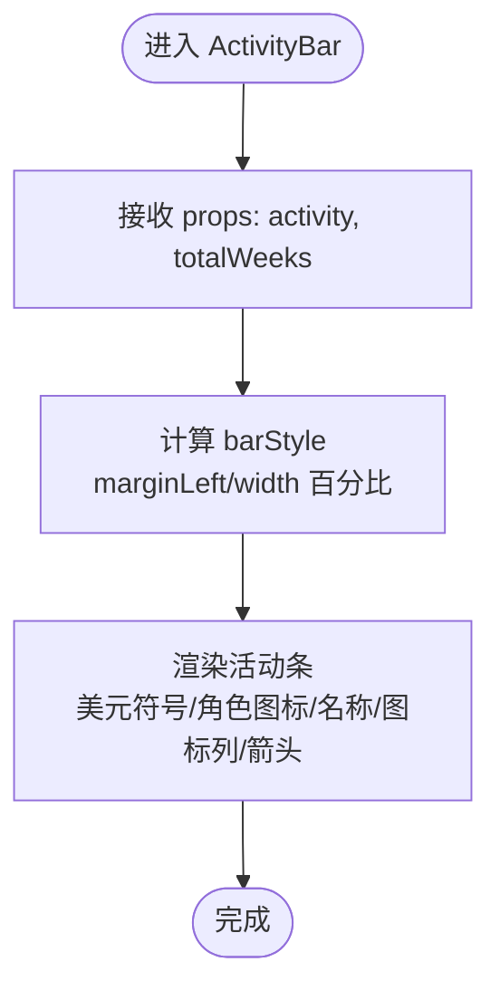
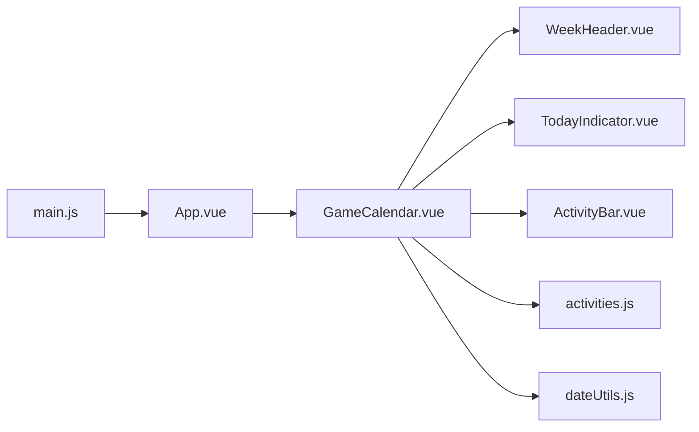

# 扩展开发

<cite>
**本文引用的文件**
- [App.vue](file://src/App.vue)
- [main.js](file://src/main.js)
- [GameCalendar.vue](file://src/components/GameCalendar.vue)
- [ActivityBar.vue](file://src/components/ActivityBar.vue)
- [WeekHeader.vue](file://src/components/WeekHeader.vue)
- [TodayIndicator.vue](file://src/components/TodayIndicator.vue)
- [activities.js](file://src/config/activities.js)
- [dateUtils.js](file://src/utils/dateUtils.js)
- [package.json](file://package.json)
- [vite.config.js](file://vite.config.js)
</cite>

## 目录
1. [简介](#简介)
2. [项目结构](#项目结构)
3. [核心组件](#核心组件)
4. [架构总览](#架构总览)
5. [详细组件分析](#详细组件分析)
6. [依赖关系分析](#依赖关系分析)
7. [性能考量](#性能考量)
8. [故障排查指南](#故障排查指南)
9. [结论](#结论)
10. [附录：扩展开发最佳实践与步骤](#附录扩展开发最佳实践与步骤)

## 简介
本指南面向希望对“游戏日历”项目进行扩展开发的工程师，涵盖以下主题：
- 添加新的活动类型与自定义活动样式
- 扩展日期计算逻辑（如维护周期、周粒度）
- 组件扩展的最佳实践（新增组件、修改现有组件、集成第三方组件）
- 配置系统的扩展机制与插件化思路
- API扩展、数据源集成与功能增强的实现方案
- 提供可直接参考的代码路径与集成步骤，帮助快速落地

## 项目结构
该项目采用基于组件的单页应用架构，使用 Vue 3 + Vite 构建，核心目录如下：
- src/components：视图组件层（日历容器、活动条、周表头、今日指示器）
- src/config：静态配置层（活动列表）
- src/utils：工具函数层（日期计算）
- src/App.vue 与 src/main.js：应用入口与挂载
- vite.config.js：构建配置
- package.json：依赖与脚本

图表来源
- [main.js:1-5](file://src/main.js#L1-L5)
- [App.vue:1-29](file://src/App.vue#L1-L29)
- [GameCalendar.vue:1-70](file://src/components/GameCalendar.vue#L1-L70)
- [WeekHeader.vue:1-51](file://src/components/WeekHeader.vue#L1-L51)
- [ActivityBar.vue:1-164](file://src/components/ActivityBar.vue#L1-L164)
- [TodayIndicator.vue:1-53](file://src/components/TodayIndicator.vue#L1-L53)
- [activities.js:1-53](file://src/config/activities.js#L1-L53)
- [dateUtils.js:1-103](file://src/utils/dateUtils.js#L1-L103)

章节来源
- [main.js:1-5](file://src/main.js#L1-L5)
- [App.vue:1-29](file://src/App.vue#L1-L29)
- [GameCalendar.vue:1-70](file://src/components/GameCalendar.vue#L1-L70)
- [WeekHeader.vue:1-51](file://src/components/WeekHeader.vue#L1-L51)
- [ActivityBar.vue:1-164](file://src/components/ActivityBar.vue#L1-L164)
- [TodayIndicator.vue:1-53](file://src/components/TodayIndicator.vue#L1-L53)
- [activities.js:1-53](file://src/config/activities.js#L1-L53)
- [dateUtils.js:1-103](file://src/utils/dateUtils.js#L1-L103)

## 核心组件
- GameCalendar.vue：日历主容器，负责组织周表头、今日指示器与活动条集合，调用日期工具与配置数据。
- ActivityBar.vue：单个活动条组件，支持按类型渲染不同样式与图标，根据 startWeek/endWeek 计算横向布局。
- WeekHeader.vue：展示6周的标签与日期范围。
- TodayIndicator.vue：在时间轴上标识“今天”的位置与标签。
- activities.js：活动配置数组，包含活动名称、起止周、类型、图标数量、是否显示美元符号与角色图标等字段。
- dateUtils.js：日期计算工具，以“周四为一周起始日”，提供当前周起始日、6周区间、今日位置、今日标签等方法。

章节来源
- [GameCalendar.vue:1-70](file://src/components/GameCalendar.vue#L1-L70)
- [ActivityBar.vue:1-164](file://src/components/ActivityBar.vue#L1-L164)
- [WeekHeader.vue:1-51](file://src/components/WeekHeader.vue#L1-L51)
- [TodayIndicator.vue:1-53](file://src/components/TodayIndicator.vue#L1-L53)
- [activities.js:1-53](file://src/config/activities.js#L1-L53)
- [dateUtils.js:1-103](file://src/utils/dateUtils.js#L1-L103)

## 架构总览
下图展示了组件间的数据流与依赖关系，以及配置与工具层的接入点。

图表来源
- [main.js:1-5](file://src/main.js#L1-L5)
- [App.vue:1-29](file://src/App.vue#L1-L29)
- [GameCalendar.vue:23-39](file://src/components/GameCalendar.vue#L23-L39)
- [WeekHeader.vue:10-16](file://src/components/WeekHeader.vue#L10-L16)
- [TodayIndicator.vue:8-18](file://src/components/TodayIndicator.vue#L8-L18)
- [ActivityBar.vue:24-49](file://src/components/ActivityBar.vue#L24-L49)
- [activities.js:1-53](file://src/config/activities.js#L1-L53)
- [dateUtils.js:35-91](file://src/utils/dateUtils.js#L35-L91)

## 详细组件分析

### GameCalendar 组件
职责与行为
- 接收 today 的日期，计算 weeks、todayPosition、todayLabel
- 将这些数据分别传给 WeekHeader、TodayIndicator 与 ActivityBar
- 使用 activities.js 中的活动配置驱动活动条渲染

扩展点
- 新增属性：如 totalWeeks、locale、theme 等，可在组件内通过 props 接收并传递给子组件
- 新增子组件：如“活动详情面板”、“筛选器”等，通过插槽或条件渲染接入

章节来源
- [GameCalendar.vue:23-39](file://src/components/GameCalendar.vue#L23-L39)
- [GameCalendar.vue:10-18](file://src/components/GameCalendar.vue#L10-L18)

### ActivityBar 组件
职责与行为
- 接收 activity 与 totalWeeks
- 通过计算属性 barStyle 将 startWeek/endWeek 映射为百分比布局
- 支持类型类名（type-red/type-orange/type-gray）与可选美元符号、角色图标、右侧图标列、箭头按钮

扩展点
- 新增活动类型：在样式层新增 type-xxx 类，或通过动态类绑定扩展
- 自定义图标：icons 数量与图标盒样式可按需求调整
- 动态内容：hasDollarSign、hasCharIcon 可作为开关控制元素显隐

图表来源
- [ActivityBar.vue:24-49](file://src/components/ActivityBar.vue#L24-L49)
- [ActivityBar.vue:1-21](file://src/components/ActivityBar.vue#L1-L21)

章节来源
- [ActivityBar.vue:1-164](file://src/components/ActivityBar.vue#L1-L164)

### WeekHeader 组件
职责与行为
- 展示6个周单元格，每个单元格包含周标签与日期范围

扩展点
- 周粒度：可通过 props 接收 weeks 并在组件内部处理
- 交互：可增加点击事件或 hover 效果，联动到日历主容器

章节来源
- [WeekHeader.vue:1-51](file://src/components/WeekHeader.vue#L1-L51)

### TodayIndicator 组件
职责与行为
- 根据 position（0~1）计算绝对定位 left 值，显示今日标签与垂直线

扩展点
- 动画：可引入过渡动画或滚动同步
- 多语言：label 可通过外部传入 locale 控制

章节来源
- [TodayIndicator.vue:1-53](file://src/components/TodayIndicator.vue#L1-L53)

### 配置系统（activities.js）
- 结构：数组对象，包含 id、name、startWeek、endWeek、type、icons、hasDollarSign、hasCharIcon
- 扩展方式：新增对象项即可添加新活动；通过 type 字段与样式类名关联

扩展点
- 新增活动类型：在样式层新增对应 type 类，或通过动态类绑定
- 动态加载：可将配置改为远程接口返回，结合 GameCalendar 的 props 注入

章节来源
- [activities.js:1-53](file://src/config/activities.js#L1-L53)

### 日期计算工具（dateUtils.js）
- 周起始：以“周四为一周起始日”
- 方法：getCurrentWeekStart、getWeeks（6周区间）、getTodayPosition（0~1）、getTodayLabel（本地化标签）

扩展点
- 周起始日可配置化：通过参数或环境变量切换
- 周粒度：totalWeeks 可由 props 传入，或通过配置文件注入
- 本地化：getTodayLabel 可按 locale 切换语言

章节来源
- [dateUtils.js:12-91](file://src/utils/dateUtils.js#L12-L91)

## 依赖关系分析

图表来源
- [main.js:1-5](file://src/main.js#L1-L5)
- [App.vue:1-29](file://src/App.vue#L1-L29)
- [GameCalendar.vue:23-39](file://src/components/GameCalendar.vue#L23-L39)
- [WeekHeader.vue:10-16](file://src/components/WeekHeader.vue#L10-L16)
- [TodayIndicator.vue:8-18](file://src/components/TodayIndicator.vue#L8-L18)
- [ActivityBar.vue:24-49](file://src/components/ActivityBar.vue#L24-L49)
- [activities.js:1-53](file://src/config/activities.js#L1-L53)
- [dateUtils.js:35-91](file://src/utils/dateUtils.js#L35-L91)

章节来源
- [package.json:11-17](file://package.json#L11-L17)
- [vite.config.js:1-8](file://vite.config.js#L1-L8)

## 性能考量
- 渲染优化：ActivityBar 通过计算属性一次性计算百分比布局，避免重复计算
- 数据流：GameCalendar 在 setup 中一次性计算 weeks、position、label，减少子组件重复计算
- 图标与样式：通过类名与内联样式控制，避免过度 DOM 操作
- 可选优化建议：对大量活动条场景，可考虑虚拟滚动或分页

## 故障排查指南
- 活动条位置异常
  - 检查 activity.startWeek/endWeek 是否在 totalWeeks 范围内
  - 检查 barStyle 百分比计算是否正确
  - 参考路径：[ActivityBar.vue:38-49](file://src/components/ActivityBar.vue#L38-L49)
- 今日指示器偏移
  - 检查 getTodayPosition 返回值是否在 0~1
  - 检查 TodayIndicator 的 left 定位逻辑
  - 参考路径：[dateUtils.js:60-71](file://src/utils/dateUtils.js#L60-L71)，[TodayIndicator.vue:2-4](file://src/components/TodayIndicator.vue#L2-L4)
- 周表头不显示
  - 检查 GameCalendar 传入 weeks 是否为空
  - 参考路径：[GameCalendar.vue:36](file://src/components/GameCalendar.vue#L36)，[WeekHeader.vue:3-6](file://src/components/WeekHeader.vue#L3-L6)
- 样式未生效
  - 检查 type 类名是否与样式类一致
  - 参考路径：[ActivityBar.vue:65-78](file://src/components/ActivityBar.vue#L65-L78)

章节来源
- [ActivityBar.vue:38-49](file://src/components/ActivityBar.vue#L38-L49)
- [dateUtils.js:60-71](file://src/utils/dateUtils.js#L60-L71)
- [TodayIndicator.vue:2-4](file://src/components/TodayIndicator.vue#L2-L4)
- [GameCalendar.vue:36](file://src/components/GameCalendar.vue#L36)
- [WeekHeader.vue:3-6](file://src/components/WeekHeader.vue#L3-L6)
- [ActivityBar.vue:65-78](file://src/components/ActivityBar.vue#L65-L78)

## 结论
本项目以清晰的组件分层与简洁的配置/工具层实现了“活动日历”的核心能力。扩展开发的关键在于：
- 在配置层新增活动与类型，在样式层映射类型类名
- 在工具层扩展日期计算逻辑，保持对外 API 稳定
- 在组件层通过 props 与计算属性解耦，便于新增子组件与第三方组件集成
- 通过插件化思路（如动态配置、远程数据源）实现更灵活的功能增强

## 附录：扩展开发最佳实践与步骤

### 一、添加新的活动类型与自定义活动样式
目标：新增一种活动类型（如“purple”），并为其定制图标与颜色。

步骤
1. 在样式层新增类型类名
   - 参考路径：[ActivityBar.vue:65-78](file://src/components/ActivityBar.vue#L65-L78)
2. 在配置层新增活动对象
   - 参考路径：[activities.js:1-53](file://src/config/activities.js#L1-L53)
3. 如需自定义图标与美元符号/角色图标，调整 icons 数量与开关
   - 参考路径：[ActivityBar.vue:3-20](file://src/components/ActivityBar.vue#L3-L20)

验证
- 在浏览器中确认活动条颜色、图标与布局符合预期
- 若需要动态类名，可在组件内通过计算属性拼接类名

章节来源
- [ActivityBar.vue:65-78](file://src/components/ActivityBar.vue#L65-L78)
- [activities.js:1-53](file://src/config/activities.js#L1-L53)
- [ActivityBar.vue:3-20](file://src/components/ActivityBar.vue#L3-L20)

### 二、扩展日期计算逻辑（维护周期、周粒度）
目标：支持可配置的周起始日与周数。

步骤
1. 修改 dateUtils.js 的周起始策略
   - 参考路径：[dateUtils.js:12-29](file://src/utils/dateUtils.js#L12-L29)
2. 将 totalWeeks 从固定值改为可配置
   - 在 GameCalendar.vue 中通过 props 接收 totalWeeks
   - 参考路径：[GameCalendar.vue:32](file://src/components/GameCalendar.vue#L32)，[ActivityBar.vue:32-35](file://src/components/ActivityBar.vue#L32-L35)
3. 如需多语言标签，扩展 getTodayLabel 的 locale 参数
   - 参考路径：[dateUtils.js:76-91](file://src/utils/dateUtils.js#L76-L91)

验证
- 重新计算 weeks 与 todayPosition，确保百分比布局正确

章节来源
- [dateUtils.js:12-29](file://src/utils/dateUtils.js#L12-L29)
- [GameCalendar.vue:32](file://src/components/GameCalendar.vue#L32)
- [ActivityBar.vue:32-35](file://src/components/ActivityBar.vue#L32-L35)
- [dateUtils.js:76-91](file://src/utils/dateUtils.js#L76-L91)

### 三、组件扩展的最佳实践
新增组件
- 在 src/components 下新建组件文件，遵循单一职责
- 通过 props 与 emits 与父组件通信
- 在 GameCalendar.vue 中引入并渲染

修改现有组件
- 保持对外 API 不变，内部通过计算属性与局部状态优化
- 对可选功能使用 v-if 或 props 开关

集成第三方组件
- 通过 npm 安装并在组件中按需导入
- 注意样式隔离与主题一致性

章节来源
- [GameCalendar.vue:23-39](file://src/components/GameCalendar.vue#L23-L39)

### 四、配置系统的扩展机制与插件开发模式
目标：将静态配置替换为可插拔的配置模块。

方案
- 将 activities.js 抽象为“配置插件接口”，支持默认配置与远程配置
- 在 GameCalendar.vue 中通过 props 注入配置，或在运行时动态加载
- 通过工厂模式或注册表管理多个配置插件

章节来源
- [activities.js:1-53](file://src/config/activities.js#L1-L53)
- [GameCalendar.vue:32-33](file://src/components/GameCalendar.vue#L32-L33)

### 五、API 扩展、数据源集成与功能增强
API 扩展
- 在 utils 层新增工具函数，保持纯函数与无副作用
- 通过 dateUtils.js 的模式扩展更多日期/时间相关能力

数据源集成
- 将 activities.js 替换为远程接口调用，返回与原结构兼容的对象数组
- 在 GameCalendar.vue 中通过异步加载与错误处理完善体验

功能增强
- 新增筛选器组件（按类型/图标数量），通过 props 与事件与 GameCalendar 通信
- 新增导出/分享功能，利用 dateUtils.js 的格式化能力生成分享文案

章节来源
- [dateUtils.js:35-91](file://src/utils/dateUtils.js#L35-L91)
- [GameCalendar.vue:23-39](file://src/components/GameCalendar.vue#L23-L39)