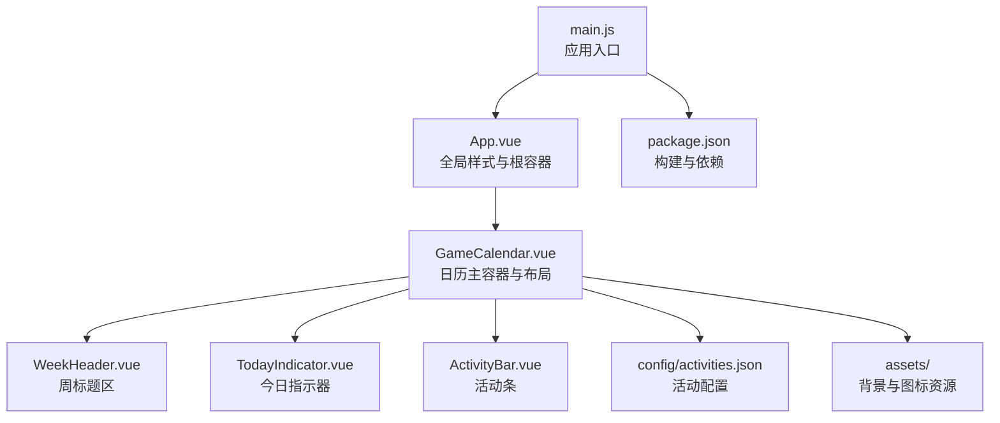
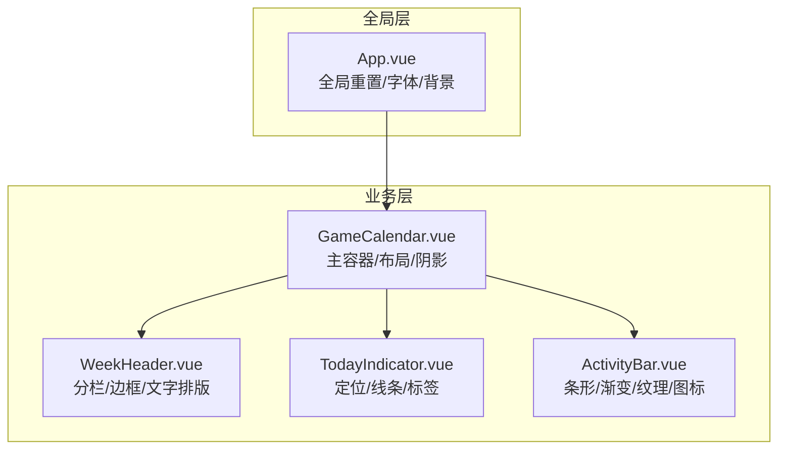
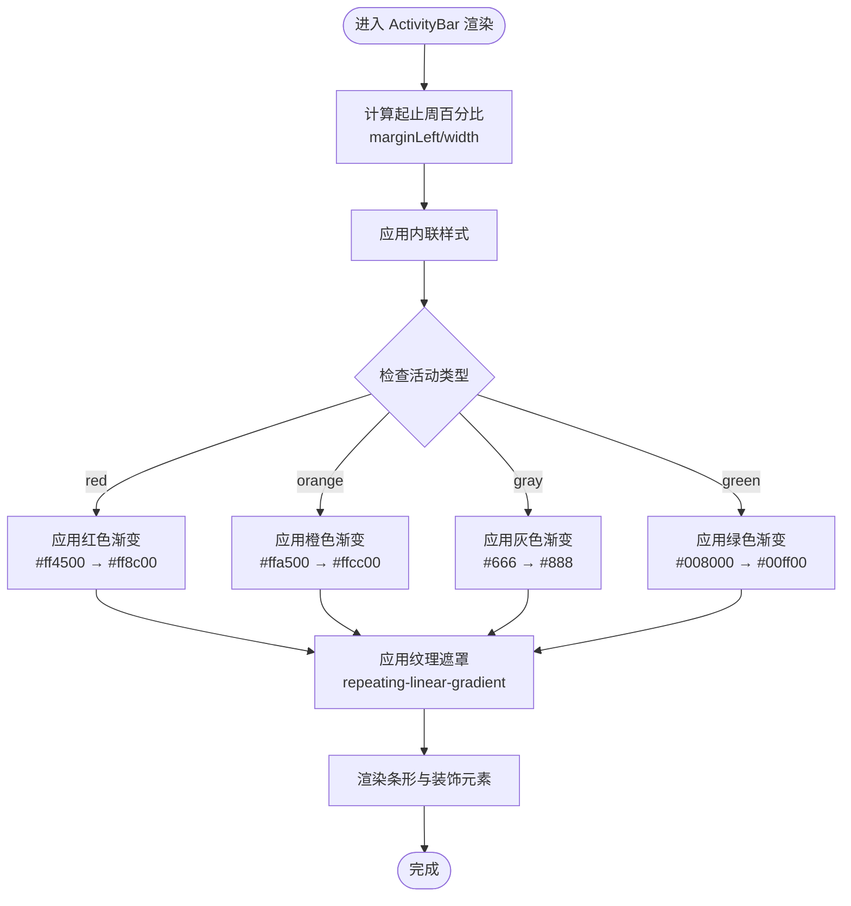
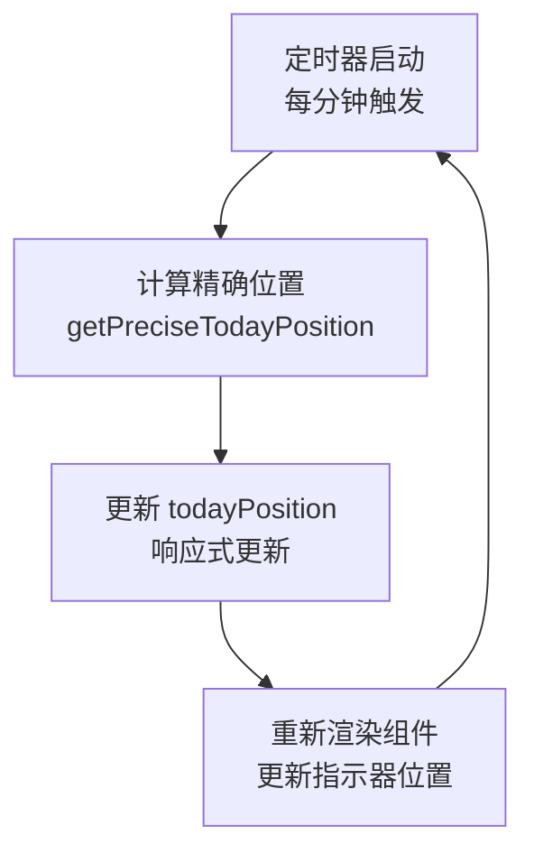
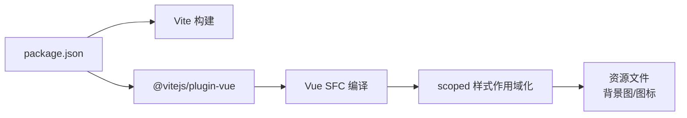

# 样式系统

<cite>
**本文引用的文件**
- [App.vue](file://src/App.vue)
- [main.js](file://src/main.js)
- [GameCalendar.vue](file://src/components/GameCalendar.vue)
- [ActivityBar.vue](file://src/components/ActivityBar.vue)
- [TodayIndicator.vue](file://src/components/TodayIndicator.vue)
- [WeekHeader.vue](file://src/components/WeekHeader.vue)
- [activities.json](file://public/config/activities.json)
- [dateUtils.js](file://src/utils/dateUtils.js)
- [package.json](file://package.json)
</cite>

## 更新摘要
**变更内容**
- 新增绿色活动类型样式支持，实现从深绿(#008000)到亮绿(#00ff00)的渐变背景效果
- 扩展活动类型分类，支持红色、橙色、灰色和绿色四种类型
- 完善类型化样式的语义化区分体系
- 保持现有高级CSS效果的完整性，包括渐变、阴影和纹理

## 目录
1. [简介](#简介)
2. [项目结构](#项目结构)
3. [核心组件与样式架构](#核心组件与样式架构)
4. [架构总览](#架构总览)
5. [详细组件分析](#详细组件分析)
6. [高级CSS效果实现](#高级css效果实现)
7. [实时更新机制](#实时更新机制)
8. [依赖关系分析](#依赖关系分析)
9. [性能考量](#性能考量)
10. [故障排查指南](#故障排查指南)
11. [结论](#结论)
12. [附录：样式定制与品牌化指南](#附录样式定制与品牌化指南)

## 简介
本项目采用 Vue 3 单文件组件（SFC）开发，样式体系以"全局重置 + 组件级 scoped 样式"为主，辅以大量高级CSS效果实现复杂的视觉设计。整体风格偏向深色系与高对比度，强调信息密度与可读性；颜色系统围绕活动类型进行语义化区分，现已支持红色、橙色、灰色和绿色四种类型；字体与排版遵循系统字体链与抗锯齿优化；间距与圆角遵循统一的视觉节奏。项目特别注重视觉层次和质感表现，通过渐变、阴影、纹理等效果营造丰富的视觉体验。

## 项目结构
- 入口应用：通过根组件挂载应用实例，全局样式在根组件中集中定义。
- 组件层：每个功能组件均使用 scoped 样式隔离作用域，避免样式污染。
- 配置与工具：活动配置与日期计算逻辑分别位于独立模块，供组件按需导入。
- 资源文件：包含背景图片和图标资源，支持复杂的视觉效果实现。

**图表来源**
- [main.js:1-5](file://src/main.js#L1-L5)
- [App.vue:1-35](file://src/App.vue#L1-L35)
- [GameCalendar.vue:1-200](file://src/components/GameCalendar.vue#L1-L200)
- [WeekHeader.vue:1-76](file://src/components/WeekHeader.vue#L1-L76)
- [TodayIndicator.vue:1-56](file://src/components/TodayIndicator.vue#L1-L56)
- [ActivityBar.vue:1-321](file://src/components/ActivityBar.vue#L1-L321)
- [activities.json:1-256](file://public/config/activities.json#L1-L256)
- [package.json:1-19](file://package.json#L1-L19)

**章节来源**
- [main.js:1-5](file://src/main.js#L1-L5)
- [App.vue:1-35](file://src/App.vue#L1-L35)
- [GameCalendar.vue:1-200](file://src/components/GameCalendar.vue#L1-L200)
- [WeekHeader.vue:1-76](file://src/components/WeekHeader.vue#L1-L76)
- [TodayIndicator.vue:1-56](file://src/components/TodayIndicator.vue#L1-L56)
- [ActivityBar.vue:1-321](file://src/components/ActivityBar.vue#L1-L321)
- [activities.json:1-256](file://public/config/activities.json#L1-L256)
- [package.json:1-19](file://package.json#L1-L19)

## 核心组件与样式架构
- 全局样式
  - 归一化与盒模型：全局重置 margin/padding，并设置 box-sizing 为 border-box，确保一致的尺寸计算。
  - 字体与抗锯齿：采用系统字体链，启用 WebKit 与 Gecko 抗锯齿，提升文本清晰度。
  - 背景与根容器：根背景采用深灰，保证深色主题一致性；根容器占满视口宽度。
- 组件级样式（scoped）
  - 使用 scoped 样式限定作用域，避免跨组件样式冲突。
  - 动态样式：通过内联 style 计算定位与宽度，实现时间轴进度的可视化。
  - 视觉层次：通过阴影、渐变与圆角塑造卡片与条形元素的立体感。
  - 高级效果：渐变背景、纹理叠加、多重阴影等复杂视觉效果。

**章节来源**
- [App.vue:9-35](file://src/App.vue#L9-L35)
- [GameCalendar.vue:68-147](file://src/components/GameCalendar.vue#L68-L147)
- [ActivityBar.vue:70-254](file://src/components/ActivityBar.vue#L70-L254)
- [TodayIndicator.vue:25-55](file://src/components/TodayIndicator.vue#L25-L55)
- [WeekHeader.vue:27-75](file://src/components/WeekHeader.vue#L27-L75)

## 架构总览
下图展示了样式在组件树中的分布与交互方式，以及全局样式对组件的基础影响。

**图表来源**
- [App.vue:9-35](file://src/App.vue#L9-L35)
- [GameCalendar.vue:68-147](file://src/components/GameCalendar.vue#L68-L147)
- [WeekHeader.vue:27-75](file://src/components/WeekHeader.vue#L27-L75)
- [TodayIndicator.vue:25-55](file://src/components/TodayIndicator.vue#L25-L55)
- [ActivityBar.vue:70-254](file://src/components/ActivityBar.vue#L70-L254)

## 详细组件分析

### 全局样式与基础排版
- 目标
  - 统一页面基础样式，确保组件在一致的视觉基线上渲染。
- 关键点
  - 全局归一化与盒模型设置，减少浏览器差异。
  - 系统字体链与抗锯齿，兼顾可读性与性能。
  - 深色背景与根容器宽度，营造沉浸式界面氛围。

**章节来源**
- [App.vue:9-35](file://src/App.vue#L9-L35)

### 日历主容器（GameCalendar）
- 目标
  - 提供日历的整体布局与视觉容器，承载标题、活动条与今日指示器。
- 关键点
  - 容器最大宽度与内边距，保证在大屏下的内容密度与留白。
  - 金属质感边框：通过多层边框和阴影实现立体金属效果。
  - 渐变背景：使用线性渐变创建丰富的背景层次。
  - 多重阴影：内外阴影组合营造深度感和立体感。
  - 内容区域的外边距与内边距，确保活动条的排列与间距稳定。

**章节来源**
- [GameCalendar.vue:68-147](file://src/components/GameCalendar.vue#L68-L147)

### 周标题区（WeekHeader）
- 目标
  - 展示6周的时间范围与周序号，提供清晰的时间参考。
- 关键点
  - 分栏布局与等分列宽，确保每格信息对齐。
  - 文字排版：标题粗体与副标题较小字号，形成信息层级。
  - 边框与圆角，弱化分割线的视觉重量。
  - 时间刻度：使用绝对定位和重复背景创建精确的时间标记。

**章节来源**
- [WeekHeader.vue:27-75](file://src/components/WeekHeader.vue#L27-L75)

### 今日指示器（TodayIndicator）
- 目标
  - 在时间轴上标识"今天"的位置与标签，提供即时上下文。
- 关键点
  - 绝对定位与 transform 实现水平居中与垂直对齐。
  - 内联样式根据传入位置计算 left 百分比，保证与时间轴同步。
  - 红色标签与垂直连线，形成强引导性视觉。
  - 实时更新：通过定时器每分钟更新一次位置。

**章节来源**
- [TodayIndicator.vue:25-55](file://src/components/TodayIndicator.vue#L25-L55)

### 活动条（ActivityBar）
- 目标
  - 可视化活动在6周时间轴上的起止区间，支持多类型与装饰元素。
- 关键点
  - 类型化样式：通过类名映射不同渐变与阴影，实现语义化色彩。
  - 内联样式：根据活动起止周计算 marginLeft 与 width 百分比，动态定位与缩放。
  - 装饰元素：美元标记、角色图标与右侧操作按钮，增强识别度与交互暗示。
  - 文本处理：省略号与阴影，保证长文本在有限空间内的可读性。
  - 纹理效果：使用重复线性渐变创建微妙的纹理背景。
  - 遮罩技术：通过渐变遮罩实现部分透明效果。

**图表来源**
- [ActivityBar.vue:56-67](file://src/components/ActivityBar.vue#L56-L67)
- [ActivityBar.vue:99-125](file://src/components/ActivityBar.vue#L99-L125)
- [ActivityBar.vue:127-159](file://src/components/ActivityBar.vue#L127-L159)

**章节来源**
- [ActivityBar.vue:42-67](file://src/components/ActivityBar.vue#L42-L67)
- [ActivityBar.vue:70-254](file://src/components/ActivityBar.vue#L70-L254)

### 数据与样式联动（日期工具与活动配置）
- 目标
  - 将日期计算与活动配置注入到组件，驱动样式与布局的动态变化。
- 关键点
  - 日期工具提供周起始日、周范围与今日位置，用于 TodayIndicator 与 ActivityBar 的定位。
  - 活动配置包含类型、图标数量与装饰开关，决定 ActivityBar 的外观与内容。
  - 精确时间计算：支持到小时分钟级别的精确位置计算。
  - 活动类型扩展：现已支持 red、orange、gray、green 四种类型。

**章节来源**
- [dateUtils.js:78-95](file://src/utils/dateUtils.js#L78-L95)
- [activities.json:1-256](file://public/config/activities.json#L1-L256)

## 高级CSS效果实现

### 渐变背景系统
项目实现了多层次的渐变背景系统，包括：

- **主容器渐变边框**：使用线性渐变创建金属质感的边框效果
- **纹理背景**：通过重复线性渐变创建微妙的纹理图案
- **活动条渐变**：不同类型活动使用不同的渐变色彩组合
  - 红色：#ff4500 → #ff8c00
  - 橙色：#ffa500 → #ffcc00  
  - 灰色：#666 → #888
  - **绿色：#008000 → #00ff00**（新增）
- **文字渐变**：箭头按钮使用文字渐变实现立体效果

### 纹理效果技术
- **重复线性渐变**：创建45度和135度的交叉纹理
- **渐变遮罩**：使用线性渐变作为遮罩实现透明度控制
- **多重纹理叠加**：将多个纹理效果叠加创造丰富层次

### 金属质感实现
- **多层边框**：通过20px的边框厚度创造立体感
- **内外阴影组合**：外部投影和内部阴影共同营造深度
- **高光与暗线**：通过 inset 阴影模拟金属表面的高光和阴影

**章节来源**
- [GameCalendar.vue:102-124](file://src/components/GameCalendar.vue#L102-L124)
- [ActivityBar.vue:99-125](file://src/components/ActivityBar.vue#L99-L125)
- [ActivityBar.vue:175-178](file://src/components/ActivityBar.vue#L175-L178)
- [ActivityBar.vue:244-248](file://src/components/ActivityBar.vue#L244-L248)

## 实时更新机制

### 时间轴动态更新
项目实现了精确的实时更新机制：

- **定时器系统**：每分钟更新一次今日位置
- **精确计算**：支持到小时分钟级别的精确位置计算
- **性能优化**：使用 setInterval 控制更新频率，避免过度重绘

### 更新流程

**图表来源**
- [GameCalendar.vue:52-65](file://src/components/GameCalendar.vue#L52-L65)
- [dateUtils.js:78-95](file://src/utils/dateUtils.js#L78-L95)

**章节来源**
- [GameCalendar.vue:52-65](file://src/components/GameCalendar.vue#L52-L65)
- [dateUtils.js:78-95](file://src/utils/dateUtils.js#L78-L95)

## 依赖关系分析
- 构建与样式处理
  - 项目使用 Vite 与 @vitejs/plugin-vue 进行编译与热更新。
  - Vue SFC 编译器负责提取与作用域化 scoped 样式，确保组件样式隔离。
- 外部依赖
  - 运行时仅依赖 Vue 3；无额外 CSS 预处理器或 UI 库，保持最小依赖与可控性。
- 资源管理
  - 背景图片和图标资源通过相对路径引用，支持构建时打包优化。

**图表来源**
- [package.json:1-19](file://package.json#L1-L19)

**章节来源**
- [package.json:1-19](file://package.json#L1-L19)

## 性能考量
- 样式体积控制
  - 采用内联样式仅用于必要场景（如定位），其余样式集中于 scoped 样式，便于 Tree Shaking 与缓存复用。
- 渲染开销
  - 活动条的动态样式计算在组件内部完成，避免重复计算与不必要重排。
  - 实时更新频率控制在每分钟，平衡性能与用户体验。
- 字体与抗锯齿
  - 系统字体链与抗锯齿优化在多数设备上具备良好性能表现，同时保证可读性。
- 资源优化
  - 图片资源经过压缩处理，支持现代浏览器的图片格式优化。

## 故障排查指南
- 样式未生效
  - 检查组件是否正确使用 scoped 样式，确认选择器优先级与命名空间。
  - 若使用内联样式，确认传入值类型与边界条件（如百分比计算）。
- 渐变效果异常
  - 确认浏览器对 CSS 渐变的支持情况。
  - 检查渐变参数的数值范围和单位。
- 纹理效果问题
  - 验证重复线性渐变的参数设置。
  - 检查遮罩渐变的方向和透明度设置。
- 实时更新失效
  - 确认定时器是否正常启动和清理。
  - 检查精确时间计算函数的返回值范围。
- 响应式问题
  - 当前样式未包含媒体查询；若需要移动端适配，建议在组件 scoped 样式中添加断点规则，或在全局样式中补充媒体查询。
- **绿色样式问题**（新增）
  - 确认活动配置中的 type 字段设置为 "green"。
  - 检查 .activity-bar.type-green 类的渐变颜色值是否正确应用。
  - 验证绿色渐变背景与阴影的兼容性。

## 结论
本项目的样式系统以简洁、可维护为核心目标：全局样式统一基础体验，组件级 scoped 样式保障隔离与复用，内联样式仅在必要时用于动态定位。颜色系统通过类型化类名实现语义化区分，现已支持红色、橙色、灰色和绿色四种活动类型。字体与排版遵循系统默认与抗锯齿优化。项目特别注重高级CSS效果的实现，包括渐变背景、纹理效果、金属质感等复杂视觉设计。通过实时更新机制，提供了精确的时间轴定位体验。未来可在不破坏现有架构的前提下，通过断点规则与 CSS 变量进一步增强响应式与主题化能力。

## 附录：样式定制与品牌化指南

### 颜色系统与语义化
- 当前颜色体系
  - 活动类型通过类名映射不同渐变与阴影，形成直观的语义化区分。
  - 支持红色、橙色、灰色和绿色四种主要类型。
- 扩展建议
  - 引入 CSS 变量集中管理主色、强调色与状态色，便于主题切换与品牌定制。
  - 为深浅主题提供两套变量集，配合媒体查询或运行时切换。
  - 支持更多活动类型的渐变色彩定义。

### 字体规范与排版
- 当前做法
  - 使用系统字体链与抗锯齿属性，兼顾性能与可读性。
  - 活动名称使用粗体和阴影增强可读性。
- 扩展建议
  - 通过 CSS 变量统一字号、行高与字重，确保跨组件一致性。
  - 在全局样式中引入媒体查询，针对小屏设备微调字号与行高。
  - 支持自定义字体的加载和回退机制。

### 间距与圆角标准
- 当前做法
  - 统一使用像素值作为间距与半径，形成稳定的视觉节奏。
  - 圆角半径根据元素大小按比例设置。
- 扩展建议
  - 引入步进式间距变量（如 4/8/12/16…），在组件中以变量引用，提升一致性与可维护性。
  - 支持响应式圆角半径的动态调整。

### 响应式布局与移动端适配
- 当前现状
  - 未包含媒体查询，整体布局在大屏下表现良好。
  - 通过 max-width 和 padding 实现基本的响应式适配。
- 实施建议
  - 在组件 scoped 样式中添加断点规则，例如：
    - 小屏：压缩内边距与字号，合并装饰元素，简化纹理效果。
    - 中屏：恢复完整布局与图标数量，保持渐变效果。
    - 大屏：维持最大宽度与留白，突出信息密度。
  - 在全局样式中补充媒体查询，统一移动端交互细节（如触摸目标最小尺寸）。
  - 考虑触摸设备的特殊需求，优化交互元素的可点击区域。

### CSS 变量与主题扩展
- 推荐变量结构
  - 主题色：主色调、强调色、状态色
  - 基础色：背景、卡片、边框、文本
  - 尺寸：圆角、间距、阴影强度
  - 动画：过渡时长、缓动曲线
- 使用方式
  - 在根组件或全局样式中声明变量，组件通过 var() 引用。
  - 通过切换根元素的 class 或属性，实现主题切换。
  - 支持动态主题切换的 JavaScript API。

### 高级CSS效果定制
- 渐变效果定制
  - 支持自定义渐变方向、颜色停止点和透明度。
  - 提供渐变预设库，便于快速应用。
- 纹理效果定制
  - 支持不同角度、密度和颜色的纹理组合。
  - 提供纹理遮罩的参数化配置。
- 动画与视觉反馈
  - 为关键交互（如点击、悬停、选中）添加简短过渡，提升反馈速度。
  - 对活动条的渐变与阴影进行微动画，增强时间轴的动态感。
  - 使用 CSS 变量控制动画时长与缓动曲线，便于统一风格。

### 实时更新机制扩展
- 更新频率控制
  - 支持自定义更新间隔，平衡性能与精度。
  - 提供节流和防抖机制，避免频繁更新。
- 精度提升
  - 支持更精细的时间粒度（秒级）。
  - 提供本地时间与服务器时间的同步机制。
- 性能优化
  - 实现智能更新策略，只在必要时重新计算。
  - 提供更新队列和批处理机制。

### 品牌化定制
- 方法
  - 通过 CSS 变量覆盖默认色板，替换主色与强调色。
  - 在全局样式中引入品牌字体或字体子集，确保加载性能。
  - 在组件中保留语义化类名（如 type-*），以便在不改变结构的情况下调整外观。
- 资源定制
  - 支持自定义背景图片和图标资源。
  - 提供资源压缩和格式优化的自动化流程。
- 交互定制
  - 支持自定义动画时长和缓动曲线。
  - 提供交互反馈的个性化配置选项。

### 绿色样式扩展指南
- **新增绿色活动类型**
  - 已实现从深绿(#008000)到亮绿(#00ff00)的渐变背景效果
  - 配合阴影效果增强立体感
  - 支持与现有红色、橙色、灰色类型的统一管理
- **配置方法**
  - 在活动配置中设置 type: "green"
  - 支持与其他装饰元素（美元标记、角色图标）的组合使用
- **样式定制**
  - 可通过修改 .activity-bar.type-green 类来自定义渐变色彩
  - 支持调整阴影强度和透明度
  - 可扩展为更多绿色系变体（如浅绿、草绿等）