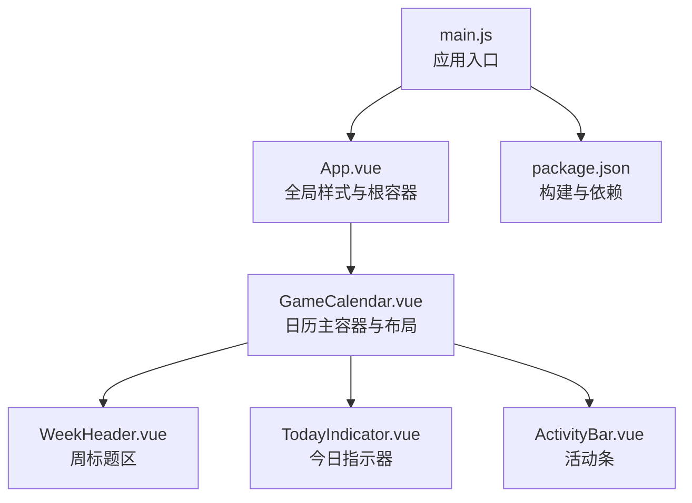
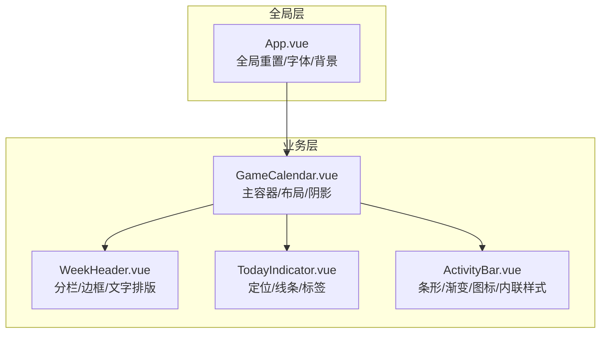
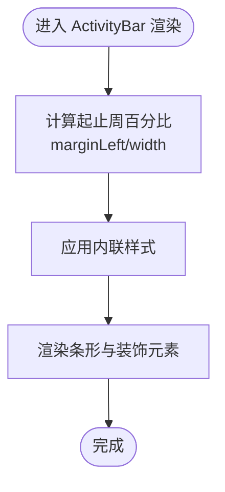
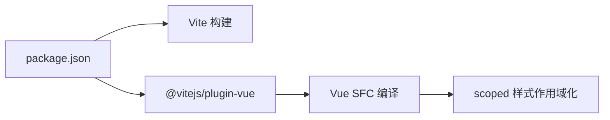

# 样式系统

<cite>
**本文引用的文件**
- [App.vue](file://src/App.vue)
- [main.js](file://src/main.js)
- [GameCalendar.vue](file://src/components/GameCalendar.vue)
- [ActivityBar.vue](file://src/components/ActivityBar.vue)
- [TodayIndicator.vue](file://src/components/TodayIndicator.vue)
- [WeekHeader.vue](file://src/components/WeekHeader.vue)
- [activities.js](file://src/config/activities.js)
- [dateUtils.js](file://src/utils/dateUtils.js)
- [package.json](file://package.json)
</cite>

## 目录
1. [简介](#简介)
2. [项目结构](#项目结构)
3. [核心组件与样式架构](#核心组件与样式架构)
4. [架构总览](#架构总览)
5. [详细组件分析](#详细组件分析)
6. [依赖关系分析](#依赖关系分析)
7. [性能考量](#性能考量)
8. [故障排查指南](#故障排查指南)
9. [结论](#结论)
10. [附录：样式定制与品牌化指南](#附录样式定制与品牌化指南)

## 简介
本项目采用 Vue 3 单文件组件（SFC）开发，样式体系以“全局重置 + 组件级 scoped 样式”为主，辅以少量内联样式用于动态定位与尺寸计算。整体风格偏向深色系与高对比度，强调信息密度与可读性；颜色系统围绕活动类型进行语义化区分；字体与排版遵循系统字体链与抗锯齿优化；间距与圆角遵循统一的视觉节奏。

## 项目结构
- 入口应用：通过根组件挂载应用实例，全局样式在根组件中集中定义。
- 组件层：每个功能组件均使用 scoped 样式隔离作用域，避免样式污染。
- 配置与工具：活动配置与日期计算逻辑分别位于独立模块，供组件按需导入。

图表来源
- [main.js:1-5](file://src/main.js#L1-L5)
- [App.vue:1-29](file://src/App.vue#L1-L29)
- [GameCalendar.vue:1-70](file://src/components/GameCalendar.vue#L1-L70)
- [WeekHeader.vue:1-51](file://src/components/WeekHeader.vue#L1-L51)
- [TodayIndicator.vue:1-53](file://src/components/TodayIndicator.vue#L1-L53)
- [ActivityBar.vue:1-164](file://src/components/ActivityBar.vue#L1-L164)
- [package.json:1-19](file://package.json#L1-L19)

章节来源
- [main.js:1-5](file://src/main.js#L1-L5)
- [App.vue:1-29](file://src/App.vue#L1-L29)
- [GameCalendar.vue:1-70](file://src/components/GameCalendar.vue#L1-L70)
- [WeekHeader.vue:1-51](file://src/components/WeekHeader.vue#L1-L51)
- [TodayIndicator.vue:1-53](file://src/components/TodayIndicator.vue#L1-L53)
- [ActivityBar.vue:1-164](file://src/components/ActivityBar.vue#L1-L164)
- [package.json:1-19](file://package.json#L1-L19)

## 核心组件与样式架构
- 全局样式
  - 归一化与盒模型：全局重置 margin/padding，并设置 box-sizing 为 border-box，确保一致的尺寸计算。
  - 字体与抗锯齿：采用系统字体链，启用 WebKit 与 Gecko 抗锯齿，提升文本清晰度。
  - 背景与根容器：根背景采用深灰，保证深色主题一致性；根容器占满视口宽度。
- 组件级样式（scoped）
  - 使用 scoped 样式限定作用域，避免跨组件样式冲突。
  - 动态样式：通过内联 style 计算定位与宽度，实现时间轴进度的可视化。
  - 视觉层次：通过阴影、渐变与圆角塑造卡片与条形元素的立体感。

章节来源
- [App.vue:9-28](file://src/App.vue#L9-L28)
- [GameCalendar.vue:41-69](file://src/components/GameCalendar.vue#L41-L69)
- [ActivityBar.vue:52-163](file://src/components/ActivityBar.vue#L52-L163)
- [TodayIndicator.vue:21-52](file://src/components/TodayIndicator.vue#L21-L52)
- [WeekHeader.vue:19-50](file://src/components/WeekHeader.vue#L19-L50)

## 架构总览
下图展示了样式在组件树中的分布与交互方式，以及全局样式对组件的基础影响。

图表来源
- [App.vue:9-28](file://src/App.vue#L9-L28)
- [GameCalendar.vue:41-69](file://src/components/GameCalendar.vue#L41-L69)
- [WeekHeader.vue:19-50](file://src/components/WeekHeader.vue#L19-L50)
- [TodayIndicator.vue:21-52](file://src/components/TodayIndicator.vue#L21-L52)
- [ActivityBar.vue:52-163](file://src/components/ActivityBar.vue#L52-L163)

## 详细组件分析

### 全局样式与基础排版
- 目标
  - 统一页面基础样式，确保组件在一致的视觉基线上渲染。
- 关键点
  - 全局归一化与盒模型设置，减少浏览器差异。
  - 系统字体链与抗锯齿，兼顾可读性与性能。
  - 深色背景与根容器宽度，营造沉浸式界面氛围。

章节来源
- [App.vue:9-28](file://src/App.vue#L9-L28)

### 日历主容器（GameCalendar）
- 目标
  - 提供日历的整体布局与视觉容器，承载标题、活动条与今日指示器。
- 关键点
  - 容器最大宽度与内边距，保证在大屏下的内容密度与留白。
  - 边框与圆角，结合阴影形成卡片式视觉层级。
  - 内容区域的外边距与内边距，确保活动条的排列与间距稳定。

章节来源
- [GameCalendar.vue:41-69](file://src/components/GameCalendar.vue#L41-L69)

### 周标题区（WeekHeader）
- 目标
  - 展示6周的时间范围与周序号，提供清晰的时间参考。
- 关键点
  - 分栏布局与等分列宽，确保每格信息对齐。
  - 文字排版：标题粗体与副标题较小字号，形成信息层级。
  - 边框与圆角，弱化分割线的视觉重量。

章节来源
- [WeekHeader.vue:19-50](file://src/components/WeekHeader.vue#L19-L50)

### 今日指示器（TodayIndicator）
- 目标
  - 在时间轴上标识“今天”的位置与标签，提供即时上下文。
- 关键点
  - 绝对定位与 transform 实现水平居中与垂直对齐。
  - 内联样式根据传入位置计算 left 百分比，保证与时间轴同步。
  - 红色标签与垂直连线，形成强引导性视觉。

章节来源
- [TodayIndicator.vue:21-52](file://src/components/TodayIndicator.vue#L21-L52)

### 活动条（ActivityBar）
- 目标
  - 可视化活动在6周时间轴上的起止区间，支持多类型与装饰元素。
- 关键点
  - 类型化样式：通过类名映射不同渐变与阴影，实现语义化色彩。
  - 内联样式：根据活动起止周计算 marginLeft 与 width 百分比，动态定位与缩放。
  - 装饰元素：美元标记、角色图标与右侧操作按钮，增强识别度与交互暗示。
  - 文本处理：省略号与阴影，保证长文本在有限空间内的可读性。

图表来源
- [ActivityBar.vue:38-49](file://src/components/ActivityBar.vue#L38-L49)
- [ActivityBar.vue:52-163](file://src/components/ActivityBar.vue#L52-L163)

章节来源
- [ActivityBar.vue:24-50](file://src/components/ActivityBar.vue#L24-L50)
- [ActivityBar.vue:52-163](file://src/components/ActivityBar.vue#L52-L163)

### 数据与样式联动（日期工具与活动配置）
- 目标
  - 将日期计算与活动配置注入到组件，驱动样式与布局的动态变化。
- 关键点
  - 日期工具提供周起始日、周范围与今日位置，用于 TodayIndicator 与 ActivityBar 的定位。
  - 活动配置包含类型、图标数量与装饰开关，决定 ActivityBar 的外观与内容。

章节来源
- [dateUtils.js:35-91](file://src/utils/dateUtils.js#L35-L91)
- [activities.js:1-53](file://src/config/activities.js#L1-L53)

## 依赖关系分析
- 构建与样式处理
  - 项目使用 Vite 与 @vitejs/plugin-vue 进行编译与热更新。
  - Vue SFC 编译器负责提取与作用域化 scoped 样式，确保组件样式隔离。
- 外部依赖
  - 运行时仅依赖 Vue 3；无额外 CSS 预处理器或 UI 库，保持最小依赖与可控性。

图表来源
- [package.json:1-19](file://package.json#L1-L19)

章节来源
- [package.json:1-19](file://package.json#L1-L19)

## 性能考量
- 样式体积控制
  - 采用内联样式仅用于必要场景（如定位），其余样式集中于 scoped 样式，便于 Tree Shaking 与缓存复用。
- 渲染开销
  - 活动条的动态样式计算在组件内部完成，避免重复计算与不必要重排。
- 字体与抗锯齿
  - 系统字体链与抗锯齿优化在多数设备上具备良好性能表现，同时保证可读性。

## 故障排查指南
- 样式未生效
  - 检查组件是否正确使用 scoped 样式，确认选择器优先级与命名空间。
  - 若使用内联样式，确认传入值类型与边界条件（如百分比计算）。
- 颜色对比度不足
  - 深色背景下，确保文本与装饰元素的对比度满足可读性要求；必要时调整阴影或背景透明度。
- 响应式问题
  - 当前样式未包含媒体查询；若需要移动端适配，建议在组件 scoped 样式中添加断点规则，或在全局样式中补充媒体查询。

## 结论
本项目的样式系统以简洁、可维护为核心目标：全局样式统一基础体验，组件级 scoped 样式保障隔离与复用，内联样式仅在必要时用于动态定位。颜色系统通过类型化类名实现语义化区分，字体与排版遵循系统默认与抗锯齿优化。未来可在不破坏现有架构的前提下，通过断点规则与 CSS 变量进一步增强响应式与主题化能力。

## 附录：样式定制与品牌化指南

### 颜色系统与语义化
- 当前颜色体系
  - 活动类型通过类名映射不同渐变与阴影，形成直观的语义化区分。
- 扩展建议
  - 引入 CSS 变量集中管理主色、强调色与状态色，便于主题切换与品牌定制。
  - 为深浅主题提供两套变量集，配合媒体查询或运行时切换。

### 字体规范与排版
- 当前做法
  - 使用系统字体链与抗锯齿属性，兼顾性能与可读性。
- 扩展建议
  - 通过 CSS 变量统一字号、行高与字重，确保跨组件一致性。
  - 在全局样式中引入媒体查询，针对小屏设备微调字号与行高。

### 间距与圆角标准
- 当前做法
  - 统一使用像素值作为间距与半径，形成稳定的视觉节奏。
- 扩展建议
  - 引入步进式间距变量（如 4/8/12/16…），在组件中以变量引用，提升一致性与可维护性。

### 响应式布局与移动端适配
- 当前现状
  - 未包含媒体查询，整体布局在大屏下表现良好。
- 实施建议
  - 在组件 scoped 样式中添加断点规则，例如：
    - 小屏：压缩内边距与字号，合并装饰元素。
    - 中屏：恢复完整布局与图标数量。
    - 大屏：维持最大宽度与留白，突出信息密度。
  - 在全局样式中补充媒体查询，统一移动端交互细节（如触摸目标最小尺寸）。

### CSS 变量与主题扩展
- 推荐变量结构
  - 主题色：主色调、强调色、状态色
  - 基础色：背景、卡片、边框、文本
  - 尺寸：圆角、间距、阴影强度
- 使用方式
  - 在根组件或全局样式中声明变量，组件通过 var() 引用。
  - 通过切换根元素的 class 或属性，实现主题切换。

### 动画与视觉反馈
- 当前现状
  - 未包含过渡动画与交互反馈。
- 建议方案
  - 为关键交互（如点击、悬停、选中）添加简短过渡，提升反馈速度。
  - 对活动条的渐变与阴影进行微动画，增强时间轴的动态感。
  - 使用 CSS 变量控制动画时长与缓动曲线，便于统一风格。

### 品牌化定制
- 方法
  - 通过 CSS 变量覆盖默认色板，替换主色与强调色。
  - 在全局样式中引入品牌字体或字体子集，确保加载性能。
  - 在组件中保留语义化类名（如 type-*），以便在不改变结构的情况下调整外观。