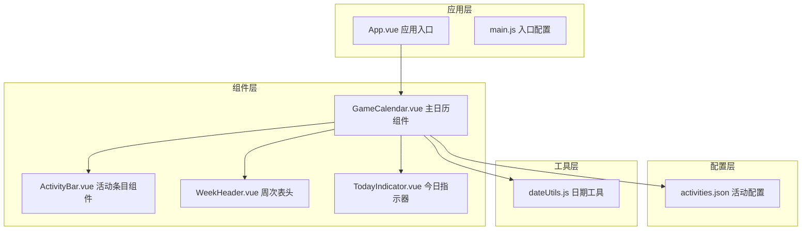
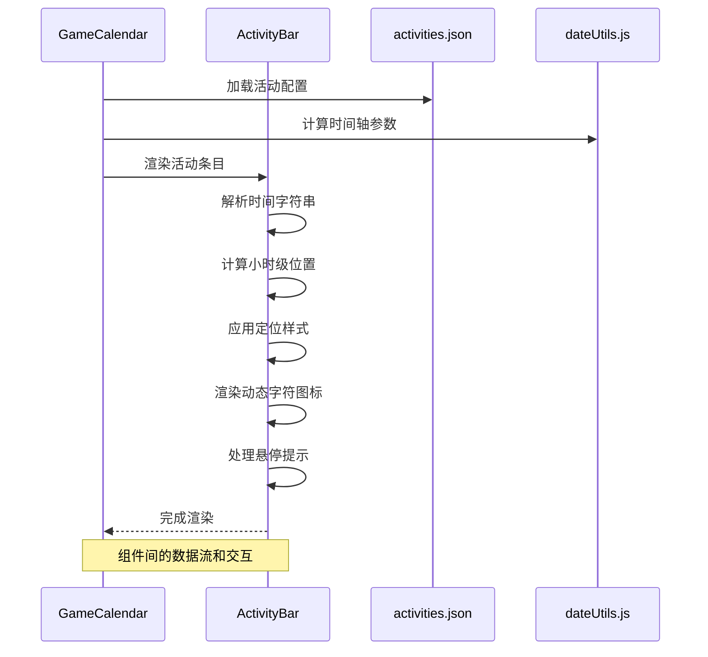
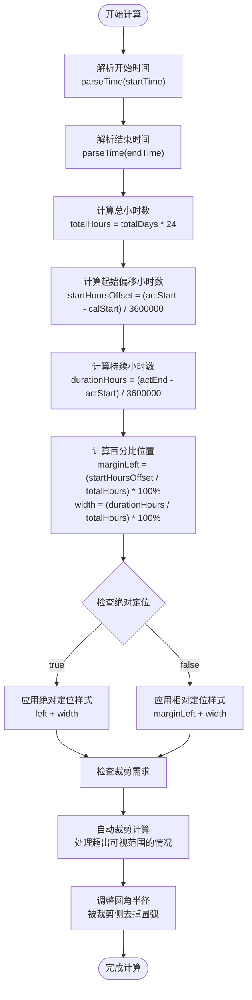
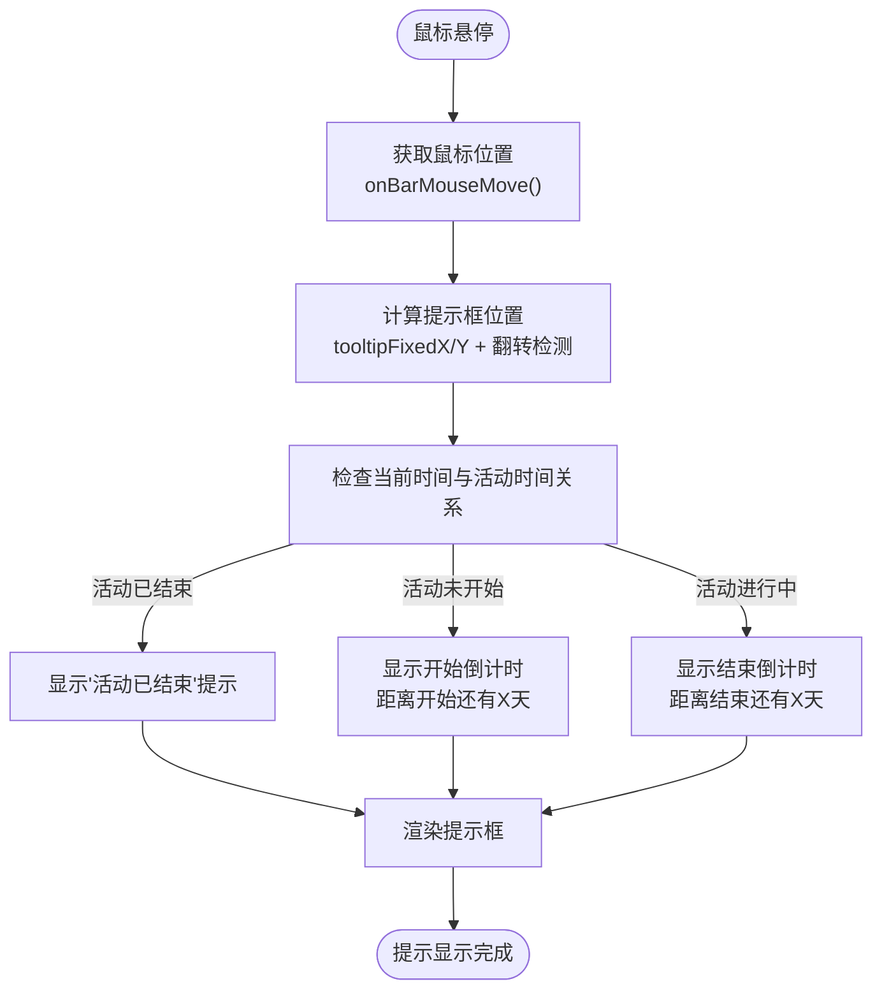
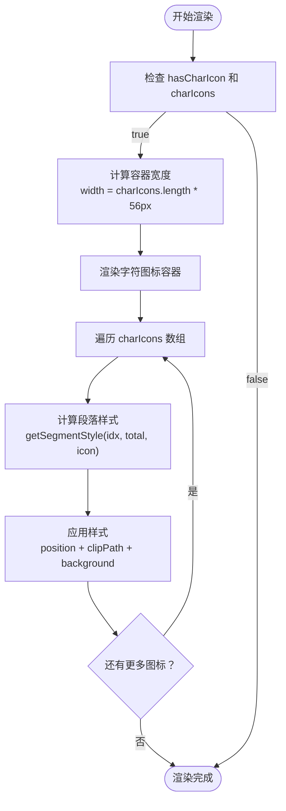
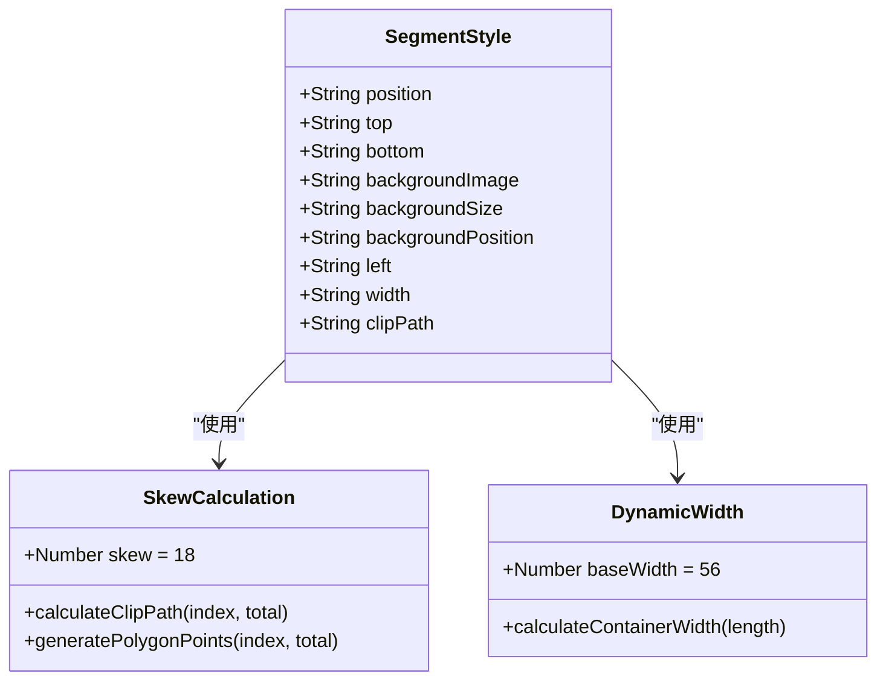
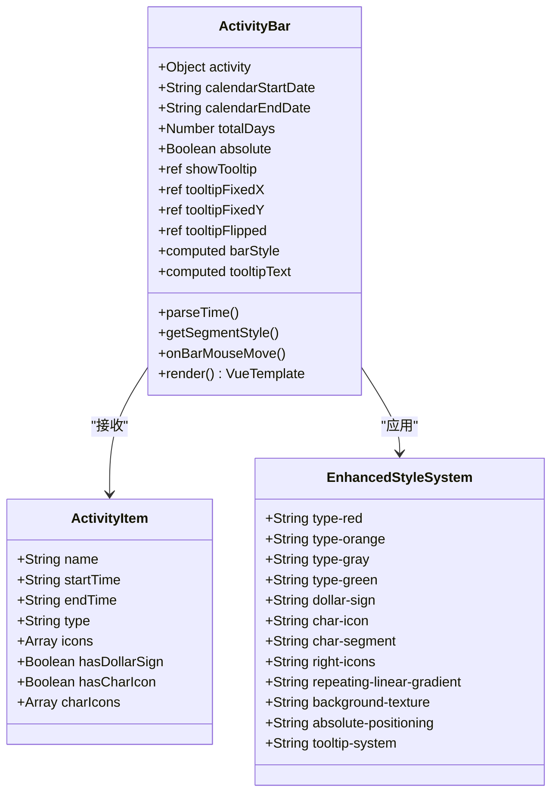
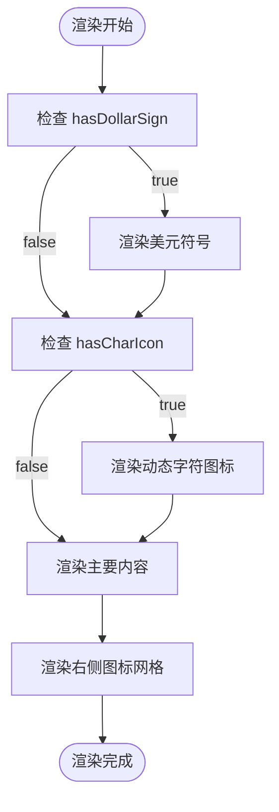
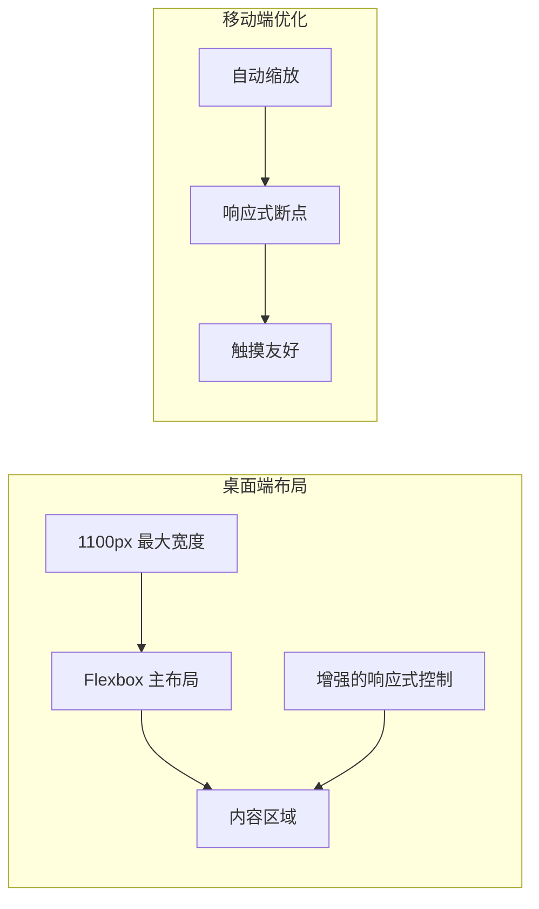
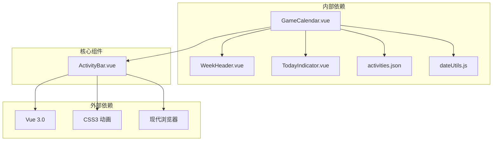

# ActivityBar 活动条目组件

<cite>
**本文档引用的文件**
- [ActivityBar.vue](file://src/components/ActivityBar.vue)
- [GameCalendar.vue](file://src/components/GameCalendar.vue)
- [activities.json](file://public/config/activities.json)
- [dateUtils.js](file://src/utils/dateUtils.js)
- [WeekHeader.vue](file://src/components/WeekHeader.vue)
- [TodayIndicator.vue](file://src/components/TodayIndicator.vue)
- [App.vue](file://src/App.vue)
- [main.js](file://src/main.js)
</cite>

## 更新摘要
**变更内容**
- 新增悬停提示系统（hover tooltip），提供实时倒计时信息显示活动开始/结束剩余天数
- 增强活动条渲染逻辑，包括自动裁剪和圆角半径调整
- 添加角色图标区域支持多个图标显示
- 新增绿色活动类型支持
- 优化鼠标交互和定位系统

## 目录
1. [简介](#简介)
2. [项目结构](#项目结构)
3. [核心组件](#核心组件)
4. [架构概览](#架构概览)
5. [详细组件分析](#详细组件分析)
6. [依赖关系分析](#依赖关系分析)
7. [性能考虑](#性能考虑)
8. [故障排除指南](#故障排除指南)
9. [结论](#结论)
10. [附录](#附录)

## 简介

ActivityBar 是游戏日历应用中的核心组件，负责渲染单个游戏活动条目。该组件实现了精确的小时级时间轴可视化功能，能够根据活动的开始和结束时间精确计算其在时间轴上的显示位置，并通过增强的样式系统提供丰富的视觉效果。

**更新** 组件现已支持完全重构的动态字符图标渲染系统，能够根据活动配置自动渲染多个角色图标，并通过智能的宽度计算和斜线裁剪效果实现独特的视觉呈现。该系统完全移除了固定的左右图标容器设计，为用户提供了更加灵活和美观的活动展示体验。

**新增功能** 组件现在集成了实时悬停提示系统，当用户将鼠标悬停在活动条目上时，会显示活动开始或结束的剩余天数倒计时信息，提供即时的活动状态反馈。

该组件采用现代化的Vue 3 Composition API实现，结合CSS Grid和Flexbox布局技术，提供了响应式的视觉呈现和流畅的用户体验。组件支持四种活动类型（红色、橙色、灰色、绿色），每种类型都有独特的渐变背景和视觉风格。

## 项目结构

游戏日历应用采用模块化架构设计，主要组件分布如下：



**图表来源**
- [App.vue:1-29](file://src/App.vue#L1-L29)
- [main.js:1-5](file://src/main.js#L1-L5)
- [GameCalendar.vue:1-85](file://src/components/GameCalendar.vue#L1-L85)

**章节来源**
- [App.vue:1-29](file://src/App.vue#L1-L29)
- [main.js:1-5](file://src/main.js#L1-L5)
- [GameCalendar.vue:1-85](file://src/components/GameCalendar.vue#L1-L85)

## 核心组件

### ActivityBar 组件概述

ActivityBar 组件是整个游戏日历系统的核心视觉元素，负责将抽象的活动数据转换为直观的图形表示。组件的主要职责包括：

- **小时级位置计算**：基于活动的开始和结束时间计算在时间轴上的精确位置
- **样式渲染**：根据活动类型应用相应的颜色编码和视觉效果
- **内容展示**：动态渲染活动名称、图标和装饰元素
- **响应式布局**：适配不同屏幕尺寸和设备类型
- **绝对定位支持**：支持绝对定位和相对定位两种模式
- **动态字符图标渲染**：支持多个角色图标的智能渲染和布局
- **实时悬停提示**：提供活动状态的实时倒计时信息
- **自动裁剪系统**：智能处理超出可视范围的活动条目

**更新** 组件现在支持完全重构的动态字符图标渲染系统，能够根据charIcons数组长度自动计算容器宽度，并通过斜线裁剪效果实现独特的视觉分割。同时新增的悬停提示系统提供实时的活动状态反馈。

### Props 参数结构

组件接收的 activity 对象包含以下关键属性：

| 属性名 | 类型 | 必需 | 默认值 | 描述 |
|--------|------|------|--------|------|
| activity | Object | 是 | - | 活动对象，包含活动详情 |
| calendarStartDate | String | 是 | - | 日历起始日期（YYYY/MM/DD格式） |
| calendarEndDate | String | 是 | - | 日历结束日期（YYYY/MM/DD格式） |
| totalDays | Number | 是 | - | 日历总天数 |
| absolute | Boolean | 否 | false | 是否使用绝对定位 |

**活动对象(activity)属性**：
| 属性名 | 类型 | 必需 | 默认值 | 描述 |
|--------|------|------|--------|------|
| name | String | 是 | - | 活动显示名称 |
| startTime | String | 是 | - | 活动开始时间（YYYY-MM-DD HH格式） |
| endTime | String | 是 | - | 活动结束时间（YYYY-MM-DD HH格式） |
| type | String | 是 | - | 活动类型（red/orange/gray/green） |
| icons | Array | 否 | [] | 右侧图标URL数组 |
| hasDollarSign | Boolean | 否 | false | 是否显示美元符号标记 |
| hasCharIcon | Boolean | 否 | false | 是否显示角色图标 |
| charIcons | Array | 否 | [] | 角色图标URL数组，支持多个图标 |

### 增强的样式系统

**更新** 组件采用基于类名的颜色编码系统，支持四种活动类型，每种类型都具有独特的渐变背景和纹理效果：

- **红色类型**：深红色到橙色的线性渐变背景，带有半透明的阴影效果
- **橙色类型**：橙色到金黄色的线性渐变背景，具有温暖的视觉感受
- **灰色类型**：深灰色到浅灰色的线性渐变背景，保持简洁和专业感
- **绿色类型**：绿色到亮绿色的线性渐变背景，代表特殊活动类型

**章节来源**
- [ActivityBar.vue:285-288](file://src/components/ActivityBar.vue#L285-L288)
- [activities.json:121-126](file://public/config/activities.json#L121-L126)

## 架构概览

ActivityBar 组件在整个应用架构中扮演着重要的视觉渲染角色，与多个组件协同工作：



**图表来源**
- [GameCalendar.vue:89-105](file://src/components/GameCalendar.vue#L89-L105)
- [ActivityBar.vue:66-78](file://src/components/ActivityBar.vue#L66-L78)
- [activities.json:14-100](file://public/config/activities.json#L14-L100)

**章节来源**
- [GameCalendar.vue:1-352](file://src/components/GameCalendar.vue#L1-L352)
- [ActivityBar.vue:1-431](file://src/components/ActivityBar.vue#L1-L431)

## 详细组件分析

### 小时级位置计算算法

**更新** ActivityBar 的核心功能是准确计算活动在时间轴上的精确位置。算法基于小时级精度计算：



**图表来源**
- [ActivityBar.vue:184-235](file://src/components/ActivityBar.vue#L184-L235)

#### 算法细节

1. **时间解析**：`parseTime()`函数解析"YYYY-MM-DD HH"格式的时间字符串
2. **边界处理**：日历起始时间设置为00:00:00，结束时间设置为23:59:59.999
3. **小时级计算**：使用毫秒差值除以3600000得到小时数
4. **百分比计算**：将小时偏移和持续时间转换为相对于总小时数的百分比
5. **定位模式**：根据`absolute`属性决定使用绝对定位还是相对定位
6. **自动裁剪**：超出可视范围的活动条目自动裁剪，保持视觉完整性
7. **圆角调整**：被裁剪侧的圆角自动移除，避免视觉不协调

### 实时悬停提示系统

**更新** 组件新增了智能的悬停提示系统，提供实时的活动状态反馈：



**图表来源**
- [ActivityBar.vue:83-132](file://src/components/ActivityBar.vue#L83-L132)

#### 提示系统特性

1. **实时倒计时**：基于当前时间动态计算剩余天数
2. **智能定位**：自动检测屏幕边界，必要时翻转提示框位置
3. **自然日计算**：使用日期部分计算，忽略具体时间
4. **多种状态**：支持活动未开始、进行中、已结束三种状态
5. **固定定位**：使用fixed定位确保提示框始终可见

### 动态字符图标渲染系统

**更新** 组件现在支持完全重构的动态字符图标渲染系统，能够根据活动配置自动渲染多个角色图标：



**图表来源**
- [ActivityBar.vue:26-42](file://src/components/ActivityBar.vue#L26-L42)
- [ActivityBar.vue:148-182](file://src/components/ActivityBar.vue#L148-L182)

#### 系统特性

1. **智能宽度计算**：根据charIcons数组长度自动计算容器宽度（每张图标56px）
2. **动态段落分割**：将容器水平分割为多个段落，每个段落对应一个角色图标
3. **斜线裁剪效果**：使用clip-path实现独特的斜线分割效果
4. **背景图像支持**：每个段落独立设置背景图像，实现无缝拼接
5. **响应式布局**：支持任意数量的角色图标，从1个到多个

### 斜线裁剪效果实现

**更新** 组件实现了复杂的斜线裁剪效果，为字符图标区域提供了独特的视觉分割：



**图表来源**
- [ActivityBar.vue:148-182](file://src/components/ActivityBar.vue#L148-L182)

#### 裁剪算法细节

1. **斜度设置**：固定斜度值18度，创造独特的视觉效果
2. **段落宽度**：每个段落宽度 = 100% / total
3. **左边界计算**：left = index * segWidth + "%"
4. **裁剪路径生成**：
   - 第一个段落：`polygon(0 0, ${100 + skew}% 0, ${100 - skew}% 100%, 0 100%)`
   - 最后一个段落：`polygon(${-skew}% 0, 100% 0, 100% 100%, ${skew}% 100%)`
   - 中间段落：`polygon(${-skew}% 0, ${100 + skew}% 0, ${100 - skew}% 100%, ${skew}% 100%)`

### 增强的视觉呈现系统

**更新** 组件采用多层次的视觉设计，每个元素都有特定的功能和样式特征。现在支持复杂的CSS渐变背景、重复线性渐变纹理效果和动态字符图标显示系统：



**图表来源**
- [ActivityBar.vue:57-81](file://src/components/ActivityBar.vue#L57-L81)
- [ActivityBar.vue:238-430](file://src/components/ActivityBar.vue#L238-L430)

#### 增强的样式层次结构

1. **基础容器**：圆角矩形设计，54px高度，27px半径
2. **渐变背景系统**：基于活动类型应用不同的线性渐变背景
3. **纹理效果系统**：使用重复线性渐变创建微妙的纹理效果
4. **装饰元素**：
   - 美元符号标记（可选）
   - 动态字符图标区域（可选）
   - 右侧图标网格
   - 导航箭头按钮
   - 实时悬停提示框

### 颜色编码系统

**更新** 组件支持四种活动类型的颜色编码，每种类型都有独特的渐变背景和视觉特征：

| 类型 | CSS类名 | 背景渐变 | 阴影效果 | 文本颜色 |
|------|---------|----------|----------|----------|
| red | type-red | `#ff4500 → #ff8c00` | `rgba(255, 69, 0, 0.3)` | `#fff` |
| orange | type-orange | `#ffa500 → #ffcc00` | `rgba(255, 165, 0, 0.3)` | `#333` |
| gray | type-gray | `#666 → #888` | `rgba(100, 100, 100, 0.3)` | `#fff` |
| green | type-green | `#008000 → #00ff00` | `rgba(0, 128, 0, 0.3)` | `#fff` |

**章节来源**
- [ActivityBar.vue:269-288](file://src/components/ActivityBar.vue#L269-L288)
- [activities.json:121-126](file://public/config/activities.json#L121-L126)

### 增强的图标显示逻辑

**更新** 组件支持多种图标显示模式，通过条件渲染实现灵活的内容展示。现在包括完全重构的动态字符图标显示系统：



**图表来源**
- [ActivityBar.vue:20-54](file://src/components/ActivityBar.vue#L20-L54)

#### 增强的图标系统特性

1. **美元符号**：绝对定位的装饰性标记，包含图像和文字元素
2. **动态字符图标**：完全重构的多段落设计，支持任意数量的角色图标
3. **右侧图标**：可配置数量的网格图标，反映活动的重要程度
4. **箭头按钮**：圆形按钮，提供导航和交互功能

### 响应式设计

**更新** 组件采用Flexbox布局系统，确保在不同设备上都能提供良好的用户体验。现在支持更精细的响应式控制：



**章节来源**
- [GameCalendar.vue:20-63](file://src/components/GameCalendar.vue#L20-L63)
- [ActivityBar.vue:239-249](file://src/components/ActivityBar.vue#L239-L249)

## 依赖关系分析

ActivityBar 组件与其他组件之间的依赖关系形成了完整的应用架构：



**图表来源**
- [GameCalendar.vue:69-76](file://src/components/GameCalendar.vue#L69-L76)
- [ActivityBar.vue:57-81](file://src/components/ActivityBar.vue#L57-L81)

### 数据流向

组件间的数据传递遵循单向数据流原则：

1. **配置数据**：从 activities.json 传递到 GameCalendar
2. **计算数据**：从 dateUtils.js 传递到 GameCalendar
3. **渲染数据**：从 GameCalendar 传递到 ActivityBar
4. **样式数据**：由 ActivityBar 内部计算生成
5. **交互数据**：通过事件处理器传递用户输入

**章节来源**
- [GameCalendar.vue:82-110](file://src/components/GameCalendar.vue#L82-L110)
- [ActivityBar.vue:184-235](file://src/components/ActivityBar.vue#L184-L235)

## 性能考虑

### 渲染优化

**更新** ActivityBar 组件在性能方面采用了多项优化策略：

1. **计算属性缓存**：使用 Vue 的 computed 属性避免重复计算
2. **条件渲染**：仅渲染必要的装饰元素
3. **样式复用**：通过类名系统减少内联样式的使用
4. **CSS渐变优化**：使用硬件加速的CSS渐变效果
5. **绝对定位优化**：红色活动使用绝对定位减少布局重排
6. **动态样式计算**：仅在需要时计算字符图标样式
7. **悬停提示优化**：使用fixed定位避免布局重排
8. **自动裁剪优化**：智能处理超出可视范围的活动条目

### 内存管理

组件生命周期管理良好，避免内存泄漏：

- **组件卸载**：确保清理定时器和其他资源
- **事件监听**：正确移除事件监听器
- **引用管理**：避免循环引用
- **定时器管理**：GameCalendar中的定时器每分钟更新一次

### 增强的动画性能

**更新** 组件支持流畅的动画效果，包括：

- **CSS3 过渡**：利用硬件加速的 CSS 动画
- **GPU 加速**：使用 transform 和 opacity 属性
- **帧率优化**：避免触发强制同步布局的操作
- **渐变动画**：平滑的颜色过渡效果
- **clip-path 动画**：流畅的斜线裁剪效果
- **悬停提示动画**：平滑的显示和隐藏效果

## 故障排除指南

### 常见问题及解决方案

#### 问题1：活动位置显示异常

**症状**：活动条目显示在错误的位置

**可能原因**：
- startTime 或 endTime 参数格式不正确
- 时间字符串格式不符合"YYYY-MM-DD HH"要求
- totalDays 参数设置不正确
- 时间计算逻辑错误
- 自动裁剪算法异常

**解决方法**：
1. 验证活动配置中的时间格式
2. 确认时间字符串符合"YYYY-MM-DD HH"格式
3. 检查 totalDays 参数与实际天数一致
4. 验证 startTime <= endTime 的约束条件
5. 检查自动裁剪逻辑是否正确处理边界情况

#### 问题2：样式显示不正确

**更新** 症状：活动条目样式不符合预期

**可能原因**：
- CSS 类名拼写错误
- 样式覆盖冲突
- 浏览器兼容性问题
- 渐变背景渲染问题
- 圆角半径调整异常

**解决方法**：
1. 检查活动类型字符串是否正确
2. 验证 CSS 选择器的优先级
3. 测试不同浏览器的兼容性
4. 检查CSS渐变语法的正确性
5. 验证圆角半径调整逻辑

#### 问题3：字符图标显示异常

**更新** 症状：动态字符图标没有正确显示

**可能原因**：
- hasCharIcon 标志位设置错误
- charIcons 数组为空或格式不正确
- CSS 样式冲突
- 字符图标URL无效
- 斜线裁剪效果不兼容
- 宽度计算错误

**解决方法**：
1. 验证 hasCharIcon 标志位的设置
2. 检查 charIcons 数组的有效性和格式
3. 排查 CSS 样式冲突问题
4. 验证字符图标URL的有效性和可访问性
5. 检查浏览器对 clip-path 属性的支持情况
6. 验证宽度计算公式：`length * 56 + 'px'`

#### 问题4：悬停提示显示异常

**更新** 症状：实时悬停提示不显示或显示错误

**可能原因**：
- 鼠标事件处理异常
- 时间计算逻辑错误
- 提示框定位计算错误
- 翻转检测逻辑异常
- 定时器更新问题

**解决方法**：
1. 检查鼠标事件监听器是否正常工作
2. 验证时间计算逻辑的正确性
3. 确认提示框定位坐标的计算
4. 检查屏幕边界检测和翻转逻辑
5. 验证GameCalendar中的定时器是否正常运行

#### 问题5：字符图标宽度计算错误

**更新** 症状：字符图标容器宽度不正确

**可能原因**：
- charIcons 数组长度计算错误
- 宽度计算公式不正确
- 单位转换问题
- 样式继承问题

**解决方法**：
1. 验证 charIcons 数组的长度
2. 检查宽度计算公式：`length * 56 + 'px'`
3. 确认单位转换的正确性
4. 验证容器样式的继承和覆盖

#### 问题6：斜线裁剪效果异常

**更新** 症状：字符图标的斜线裁剪效果不正确

**可能原因**：
- clip-path 语法错误
- 斜度计算错误
- 段落宽度计算错误
- 裁剪路径生成逻辑错误

**解决方法**：
1. 验证 clip-path 语法的正确性
2. 检查斜度值18的设置
3. 确认段落宽度计算的准确性
4. 验证裁剪路径生成的逻辑

#### 问题7：红活动行显示异常

**更新** 症状：红色活动没有在同一行显示

**可能原因**：
- absolute 属性未正确设置
- 红色活动分组逻辑错误
- 时间接续处理失败
- CSS 绝对定位样式冲突

**解决方法**：
1. 确保红色活动渲染时传入 `absolute="true"`
2. 检查红色活动分组逻辑
3. 验证时间接续处理算法
4. 检查 `.red-row .activity-bar` 样式是否正确

#### 问题8：小时级精度计算错误

**更新** 症状：活动位置计算不准确

**可能原因**：
- parseTime 函数解析错误
- 时间边界处理不当
- 总小时数计算错误
- 百分比计算精度问题
- 自动裁剪算法错误

**解决方法**：
1. 验证时间字符串格式
2. 检查 parseTime 函数的日期解析逻辑
3. 确认日历起始和结束时间的边界设置
4. 验证总小时数计算的准确性
5. 检查自动裁剪算法的边界条件处理

**章节来源**
- [ActivityBar.vue:184-235](file://src/components/ActivityBar.vue#L184-L235)
- [activities.json:14-100](file://public/config/activities.json#L14-L100)

## 结论

**更新** ActivityBar 活动条目组件是一个设计精良、功能完整的视觉渲染组件。经过完全重构的动态字符图标渲染系统和新增的实时悬停提示系统，它现在提供了更加精确、专业且功能丰富的活动展示体验，为用户带来了卓越的用户体验。

组件的主要优势包括：

1. **精确的小时级算法**：基于数学公式的准确位置计算
2. **增强的样式系统**：支持四种活动类型的颜色编码和复杂的CSS渐变背景
3. **丰富的视觉效果**：动态字符图标显示系统、美元符号装饰、实时悬停提示
4. **优秀的响应式设计**：适应各种设备和屏幕尺寸
5. **完善的红活动行系统**：支持红色活动在同一行显示
6. **灵活的定位模式**：支持绝对定位和相对定位
7. **完全重构的字符图标系统**：支持多个角色图标并自动计算宽度
8. **创新的斜线裁剪效果**：实现独特的视觉分割
9. **智能的自动裁剪系统**：处理超出可视范围的活动条目
10. **实时的悬停提示系统**：提供活动状态的即时反馈
11. **良好的性能表现**：优化的渲染和内存管理
12. **完善的错误处理**：健壮的边界条件处理

**更新** 特别值得一提的是，组件现在支持完全重构的动态字符图标渲染系统和实时悬停提示系统，包括：
- 基于数组长度的智能宽度计算
- 复杂的斜线裁剪效果实现
- 独特的多段落背景图像拼接
- 灵活的字符图标布局系统
- GPU加速的clip-path动画效果
- 实时的活动状态倒计时显示
- 智能的屏幕边界检测和提示框翻转

该组件为游戏日历应用奠定了坚实的视觉基础，为用户提供了直观、美观且功能丰富的活动展示体验。

## 附录

### 使用示例

#### 基本使用

```vue
<template>
  <ActivityBar
    :activity="activityData"
    :calendarStartDate="currentConfig.startDate"
    :calendarEndDate="currentConfig.endDate"
    :totalDays="timelineInfo.totalDays"
  />
</template>
```

#### 实时悬停提示使用

**更新** 悬停提示系统自动启用，无需额外配置：

```vue
<template>
  <ActivityBar
    :activity="{
      name: '活动名称',
      startTime: '2026-05-07 10',
      endTime: '2026-05-07 14',
      type: 'red',
      hasCharIcon: true,
      charIcons: [
        './path/to/icon1.png',
        './path/to/icon2.png'
      ]
    }"
    :calendarStartDate="currentConfig.startDate"
    :calendarEndDate="currentConfig.endDate"
    :totalDays="timelineInfo.totalDays"
  />
</template>
```

#### 动态字符图标使用

**更新** 支持多个角色图标的使用方式：

```vue
<template>
  <!-- 单个角色图标 -->
  <ActivityBar
    :activity="{
      name: '活动名称',
      startTime: '2026-05-07 10',
      endTime: '2026-05-07 14',
      type: 'red',
      hasCharIcon: true,
      charIcons: ['./path/to/icon1.png']
    }"
    :calendarStartDate="currentConfig.startDate"
    :calendarEndDate="currentConfig.endDate"
    :totalDays="timelineInfo.totalDays"
  />
  
  <!-- 多个角色图标 -->
  <ActivityBar
    :activity="{
      name: '活动名称',
      startTime: '2026-05-07 10',
      endTime: '2026-05-07 14',
      type: 'red',
      hasCharIcon: true,
      charIcons: [
        './path/to/icon1.png',
        './path/to/icon2.png',
        './path/to/icon3.png'
      ]
    }"
    :calendarStartDate="currentConfig.startDate"
    :calendarEndDate="currentConfig.endDate"
    :totalDays="timelineInfo.totalDays"
  />
</template>
```

#### 红活动行使用

**更新** 红色活动的特殊使用方式：

```vue
<template>
  <!-- 红色活动行 -->
  <div class="activity-row red-row">
    <ActivityBar
      v-for="(activity, index) in redActivities"
      :key="index"
      :activity="activity"
      :calendarStartDate="currentConfig.startDate"
      :calendarEndDate="currentConfig.endDate"
      :totalDays="timelineInfo.totalDays"
      :absolute="true"
    />
  </div>
  
  <!-- 其他类型活动 -->
  <ActivityBar
    v-for="(activity, index) in otherActivities"
    :key="index"
    :activity="activity"
    :calendarStartDate="currentConfig.startDate"
    :calendarEndDate="currentConfig.endDate"
    :totalDays="timelineInfo.totalDays"
  />
</template>
```

#### 自定义配置

**更新** 增强的配置选项：

```javascript
const enhancedActivity = {
  id: 1,
  name: "增强活动",
  startTime: "2026-05-07 10",
  endTime: "2026-05-07 14",
  type: "green", // 新增绿色类型
  icons: [],
  hasDollarSign: true,
  hasCharIcon: true,
  charIcons: [
    "./path/to/left-icon.png",
    "./path/to/right-icon.png"
  ]
}
```

### 扩展指南

#### 添加新活动类型

**更新** 新增活动类型步骤：

1. 在 CSS 中添加新的类型样式，包括渐变背景和纹理效果
2. 更新活动配置数据
3. 确保样式系统的一致性
4. 测试不同浏览器的兼容性

#### 修改视觉效果

**更新** 增强的修改选项：

1. 调整颜色编码方案，包括渐变色彩
2. 修改字符图标设计，支持更复杂的多段落布局
3. 优化动画效果，包括纹理动画
4. 调整纹理效果，包括渐变角度和密度
5. 自定义悬停提示的样式和内容

#### 自定义字符图标系统

**更新** 字符图标系统的自定义：

```css
.char-icon {
  width: calc(var(--icon-count) * 56px);
  height: 45px;
  border-radius: 21px;
  border: 3px solid black;
  flex-shrink: 0;
  margin-right: 10px;
  position: relative;
  overflow: hidden;
  background: #222;
}

.char-segment {
  position: absolute;
  top: 0;
  left: 0;
  right: 0;
  bottom: 0;
  background-size: cover;
  clip-path: polygon(0 0, 100% 0, 100% 100%, 0 100%);
}
```

#### 实现动态字符图标渲染

**更新** 动态字符图标渲染的实现要点：

1. 使用 `charIcons.length` 计算容器宽度
2. 通过 `getSegmentStyle()` 函数计算每个段落的样式
3. 应用 `clip-path` 实现斜线裁剪效果
4. 设置 `background-image` 实现背景图像
5. 使用百分比定位实现精确的布局控制

#### 实现实时悬停提示系统

**更新** 悬停提示系统的实现要点：

1. 使用 `@mouseenter`、`@mousemove`、`@mouseleave` 事件
2. 通过 `ref` 状态管理提示框的显示和位置
3. 使用 `computed` 属性动态计算提示文本
4. 实现屏幕边界检测和提示框翻转逻辑
5. 使用 `fixed` 定位确保提示框始终可见

#### 实现小时级精度定位

**更新** 小时级精度定位的实现要点：

1. 使用毫秒差值进行精确时间计算
2. 设置正确的日历边界时间（00:00:00到23:59:59.999）
3. 计算总小时数：`totalDays * 24`
4. 应用百分比计算：`(小时偏移 / 总小时数) * 100`
5. 根据绝对定位需求选择合适的CSS属性
6. 实现自动裁剪和圆角半径调整逻辑

#### 实现自动裁剪系统

**更新** 自动裁剪系统的实现要点：

1. 检查活动条目是否超出可视范围
2. 调整宽度和左偏移量以适应可视区域
3. 根据裁剪方向调整圆角半径
4. 保持视觉效果的完整性
5. 处理边界情况和极端情况