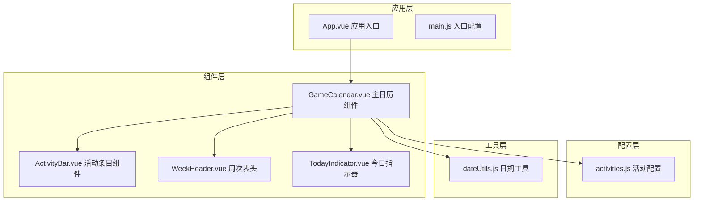
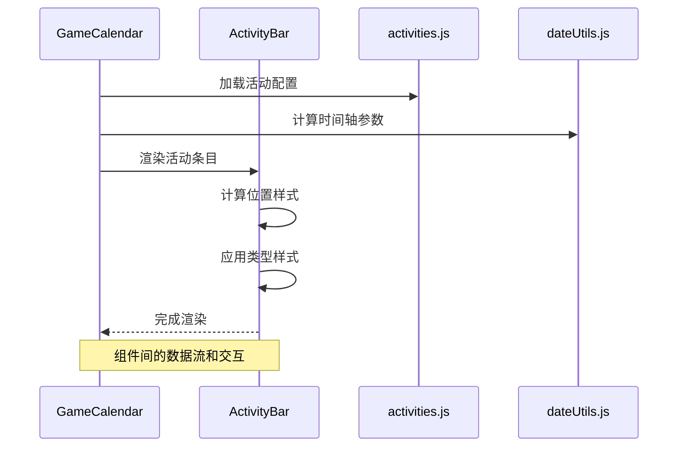
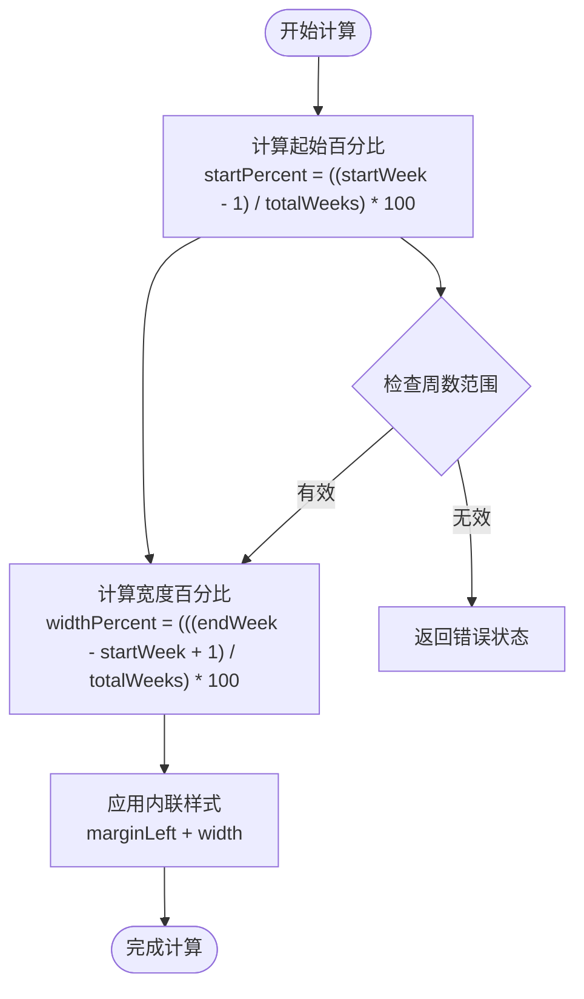
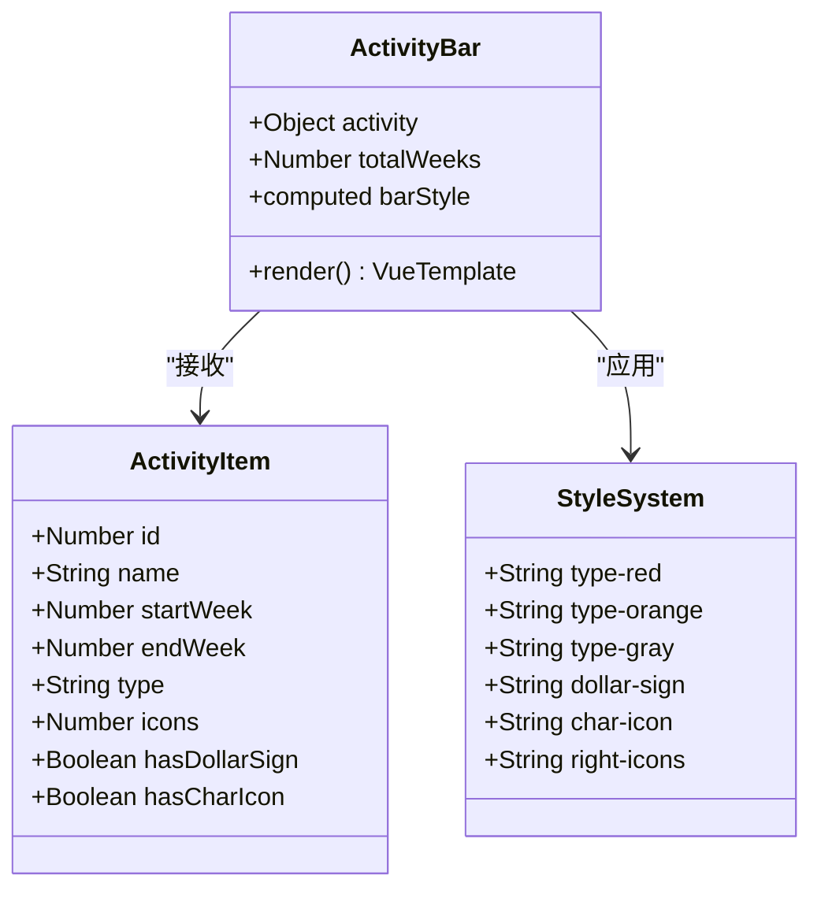
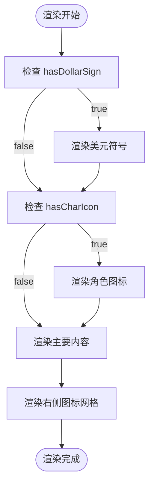
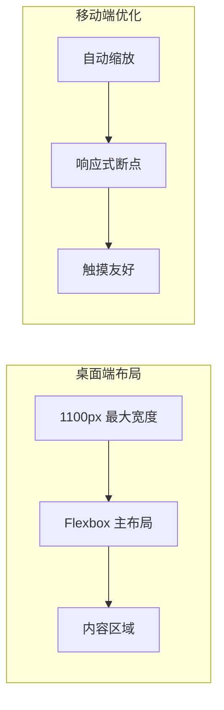
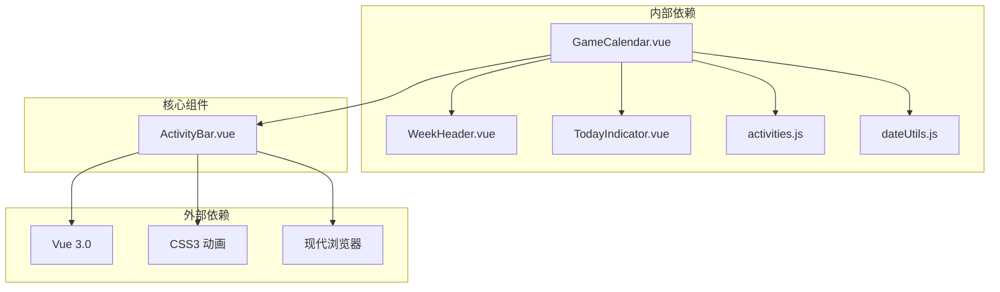

# ActivityBar 活动条目组件

<cite>
**本文档引用的文件**
- [ActivityBar.vue](file://src/components/ActivityBar.vue)
- [GameCalendar.vue](file://src/components/GameCalendar.vue)
- [activities.js](file://src/config/activities.js)
- [dateUtils.js](file://src/utils/dateUtils.js)
- [WeekHeader.vue](file://src/components/WeekHeader.vue)
- [TodayIndicator.vue](file://src/components/TodayIndicator.vue)
- [App.vue](file://src/App.vue)
- [main.js](file://src/main.js)
</cite>

## 目录
1. [简介](#简介)
2. [项目结构](#项目结构)
3. [核心组件](#核心组件)
4. [架构概览](#架构概览)
5. [详细组件分析](#详细组件分析)
6. [依赖关系分析](#依赖关系分析)
7. [性能考虑](#性能考虑)
8. [故障排除指南](#故障排除指南)
9. [结论](#结论)
10. [附录](#附录)

## 简介

ActivityBar 是游戏日历应用中的核心组件，负责渲染单个游戏活动条目。该组件实现了复杂的时间轴可视化功能，能够根据活动的开始和结束周数精确计算其在6周时间轴上的显示位置，并通过颜色编码系统直观地展示不同类型的活动。

该组件采用现代化的Vue 3 Composition API实现，结合CSS Grid和Flexbox布局技术，提供了响应式的视觉呈现和流畅的用户体验。组件支持多种活动类型（红色、橙色、灰色），每种类型都有独特的视觉风格和样式特征。

## 项目结构

游戏日历应用采用模块化架构设计，主要组件分布如下：



**图表来源**
- [App.vue:1-29](file://src/App.vue#L1-L29)
- [main.js:1-5](file://src/main.js#L1-L5)
- [GameCalendar.vue:1-85](file://src/components/GameCalendar.vue#L1-L85)

**章节来源**
- [App.vue:1-29](file://src/App.vue#L1-L29)
- [main.js:1-5](file://src/main.js#L1-L5)
- [GameCalendar.vue:1-85](file://src/components/GameCalendar.vue#L1-L85)

## 核心组件

### ActivityBar 组件概述

ActivityBar 组件是整个游戏日历系统的核心视觉元素，负责将抽象的活动数据转换为直观的图形表示。组件的主要职责包括：

- **位置计算**：基于活动的开始和结束周数计算在时间轴上的精确位置
- **样式渲染**：根据活动类型应用相应的颜色编码和视觉效果
- **内容展示**：动态渲染活动名称、图标和装饰元素
- **响应式布局**：适配不同屏幕尺寸和设备类型

### Props 参数结构

组件接收的 activity 对象包含以下关键属性：

| 属性名 | 类型 | 必需 | 默认值 | 描述 |
|--------|------|------|--------|------|
| id | Number | 是 | - | 活动唯一标识符 |
| name | String | 是 | - | 活动显示名称 |
| startWeek | Number | 是 | - | 活动开始周数（1-6） |
| endWeek | Number | 是 | - | 活动结束周数（1-6） |
| type | String | 是 | - | 活动类型（red/orange/gray） |
| icons | Number | 否 | 0 | 右侧图标数量 |
| hasDollarSign | Boolean | 否 | false | 是否显示美元符号标记 |
| hasCharIcon | Boolean | 否 | false | 是否显示角色图标 |

### 样式系统

组件采用基于类名的颜色编码系统，支持三种活动类型：

- **红色类型**：用于重要或高优先级活动，具有强烈的视觉冲击力
- **橙色类型**：用于普通活动，采用较温和的色彩方案
- **灰色类型**：用于特殊或低优先级活动，保持简洁的外观

**章节来源**
- [ActivityBar.vue:27-36](file://src/components/ActivityBar.vue#L27-L36)
- [activities.js:1-53](file://src/config/activities.js#L1-L53)

## 架构概览

ActivityBar 组件在整个应用架构中扮演着重要的视觉渲染角色，与多个组件协同工作：



**图表来源**
- [GameCalendar.vue:12-18](file://src/components/GameCalendar.vue#L12-L18)
- [ActivityBar.vue:38-49](file://src/components/ActivityBar.vue#L38-L49)
- [activities.js:1-53](file://src/config/activities.js#L1-L53)

**章节来源**
- [GameCalendar.vue:1-85](file://src/components/GameCalendar.vue#L1-L85)
- [ActivityBar.vue:1-164](file://src/components/ActivityBar.vue#L1-L164)

## 详细组件分析

### 位置计算算法

ActivityBar 的核心功能是准确计算活动在6周时间轴上的显示位置。算法基于以下公式：



**图表来源**
- [ActivityBar.vue:38-49](file://src/components/ActivityBar.vue#L38-L49)

#### 算法细节

1. **起始位置计算**：`(startWeek - 1) / totalWeeks * 100%`
   - 减去1是因为周数从1开始计数
   - 除以总周数得到相对位置比例

2. **宽度计算**：`((endWeek - startWeek + 1) / totalWeeks) * 100%`
   - 包含起始和结束周本身
   - 确保活动持续时间的准确性

3. **边界处理**：
   - 确保计算结果在0-100%范围内
   - 处理重叠活动的显示问题

### 视觉呈现系统

组件采用多层次的视觉设计，每个元素都有特定的功能和样式：



**图表来源**
- [ActivityBar.vue:27-36](file://src/components/ActivityBar.vue#L27-L36)
- [ActivityBar.vue:52-163](file://src/components/ActivityBar.vue#L52-L163)

#### 样式层次结构

1. **基础容器**：圆角矩形设计，54px高度，27px半径
2. **类型样式**：基于活动类型应用不同的渐变背景
3. **装饰元素**：
   - 美元符号标记（可选）
   - 角色图标（可选）
   - 右侧图标网格
   - 导航箭头按钮

### 颜色编码系统

组件支持三种活动类型的颜色编码，每种类型都有独特的视觉特征：

| 类型 | CSS类名 | 背景渐变 | 阴影效果 | 文本颜色 |
|------|---------|----------|----------|----------|
| red | type-red | `#ff4500 → #ff8c00` | `rgba(255, 69, 0, 0.3)` | `#fff` |
| orange | type-orange | `#ffa500 → #ffcc00` | `rgba(255, 165, 0, 0.3)` | `#333` |
| gray | type-gray | `#666 → #888` | `rgba(100, 100, 100, 0.3)` | `#fff` |

**章节来源**
- [ActivityBar.vue:65-78](file://src/components/ActivityBar.vue#L65-L78)
- [ActivityBar.vue:129-132](file://src/components/ActivityBar.vue#L129-L132)

### 图标显示逻辑

组件支持多种图标显示模式，通过条件渲染实现灵活的内容展示：



**图表来源**
- [ActivityBar.vue:4-20](file://src/components/ActivityBar.vue#L4-L20)

#### 图标系统特性

1. **美元符号**：绝对定位的黄色圆形标记，用于突出重要活动
2. **角色图标**：圆形边框的装饰性图标，增加视觉趣味性
3. **右侧图标**：可配置数量的网格图标，反映活动的重要程度
4. **箭头按钮**：圆形按钮，提供导航和交互功能

**章节来源**
- [ActivityBar.vue:80-162](file://src/components/ActivityBar.vue#L80-L162)

### 响应式设计

组件采用Flexbox布局系统，确保在不同设备上都能提供良好的用户体验：



**章节来源**
- [GameCalendar.vue:67-84](file://src/components/GameCalendar.vue#L67-L84)
- [ActivityBar.vue:52-63](file://src/components/ActivityBar.vue#L52-L63)

## 依赖关系分析

ActivityBar 组件与其他组件之间的依赖关系形成了完整的应用架构：



**图表来源**
- [GameCalendar.vue:25-33](file://src/components/GameCalendar.vue#L25-L33)
- [ActivityBar.vue:25-26](file://src/components/ActivityBar.vue#L25-L26)

### 数据流向

组件间的数据传递遵循单向数据流原则：

1. **配置数据**：从 activities.js 传递到 GameCalendar
2. **计算数据**：从 dateUtils.js 传递到 GameCalendar
3. **渲染数据**：从 GameCalendar 传递到 ActivityBar
4. **样式数据**：由 ActivityBar 内部计算生成

**章节来源**
- [GameCalendar.vue:35-38](file://src/components/GameCalendar.vue#L35-L38)
- [ActivityBar.vue:38-49](file://src/components/ActivityBar.vue#L38-L49)

## 性能考虑

### 渲染优化

ActivityBar 组件在性能方面采用了多项优化策略：

1. **计算属性缓存**：使用 Vue 的 computed 属性避免重复计算
2. **条件渲染**：仅渲染必要的装饰元素
3. **样式复用**：通过类名系统减少内联样式的使用

### 内存管理

组件生命周期管理良好，避免内存泄漏：

- **组件卸载**：确保清理定时器和其他资源
- **事件监听**：正确移除事件监听器
- **引用管理**：避免循环引用

### 动画性能

组件支持流畅的动画效果：

- **CSS3 过渡**：利用硬件加速的 CSS 动画
- **GPU 加速**：使用 transform 和 opacity 属性
- **帧率优化**：避免触发强制同步布局的操作

## 故障排除指南

### 常见问题及解决方案

#### 问题1：活动位置显示异常

**症状**：活动条目显示在错误的位置

**可能原因**：
- startWeek 或 endWeek 参数超出范围
- totalWeeks 参数设置不正确
- 周数计算逻辑错误

**解决方法**：
1. 验证活动配置中的周数范围
2. 确认 totalWeeks 参数与实际周数一致
3. 检查 startWeek <= endWeek 的约束条件

#### 问题2：样式显示不正确

**症状**：活动条目样式不符合预期

**可能原因**：
- CSS 类名拼写错误
- 样式覆盖冲突
- 浏览器兼容性问题

**解决方法**：
1. 检查活动类型字符串是否正确
2. 验证 CSS 选择器的优先级
3. 测试不同浏览器的兼容性

#### 问题3：图标显示异常

**症状**：装饰图标没有正确显示

**可能原因**：
- hasDollarSign 或 hasCharIcon 标志位设置错误
- 图标数量配置不正确
- CSS 样式冲突

**解决方法**：
1. 验证布尔标志位的设置
2. 检查 icons 数量的有效性
3. 排查 CSS 样式冲突问题

**章节来源**
- [ActivityBar.vue:38-49](file://src/components/ActivityBar.vue#L38-L49)
- [activities.js:1-53](file://src/config/activities.js#L1-L53)

## 结论

ActivityBar 活动条目组件是一个设计精良、功能完整的视觉渲染组件。它成功地将复杂的时间轴概念转化为直观的图形界面，为用户提供了清晰的活动信息展示。

组件的主要优势包括：

1. **精确的算法实现**：基于数学公式的准确位置计算
2. **灵活的样式系统**：支持多种颜色编码和视觉效果
3. **优秀的响应式设计**：适应各种设备和屏幕尺寸
4. **良好的性能表现**：优化的渲染和内存管理
5. **完善的错误处理**：健壮的边界条件处理

该组件为游戏日历应用奠定了坚实的视觉基础，为用户提供了直观、美观且功能丰富的活动展示体验。

## 附录

### 使用示例

#### 基本使用

```vue
<template>
  <ActivityBar
    :activity="activityData"
    :totalWeeks="6"
  />
</template>
```

#### 自定义配置

```javascript
const customActivity = {
  id: 1,
  name: "自定义活动",
  startWeek: 2,
  endWeek: 4,
  type: "red",
  icons: 3,
  hasDollarSign: true,
  hasCharIcon: false
}
```

### 扩展指南

#### 添加新活动类型

1. 在 CSS 中添加新的类型样式
2. 更新活动配置数据
3. 确保样式系统的一致性

#### 修改视觉效果

1. 调整颜色编码方案
2. 修改图标设计
3. 优化动画效果