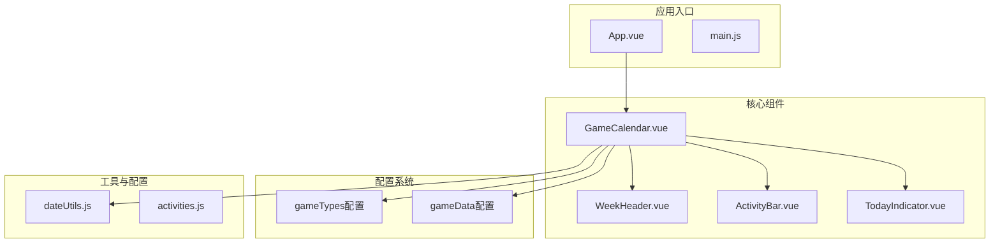
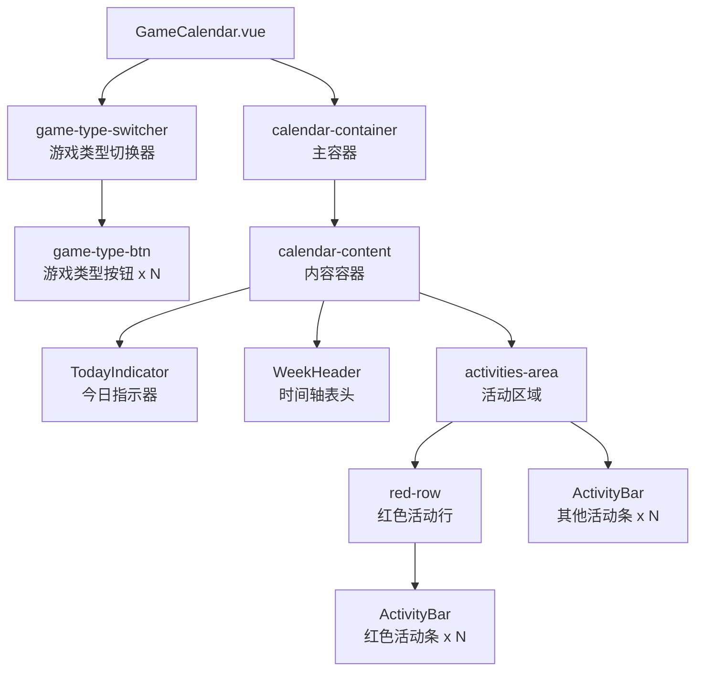
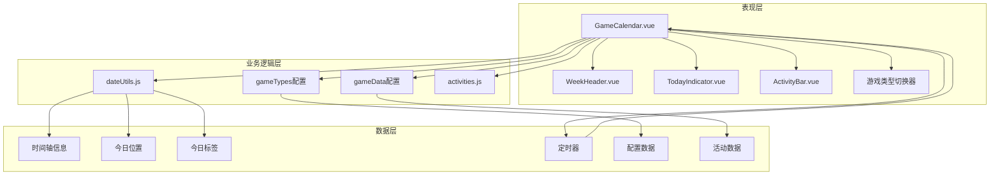
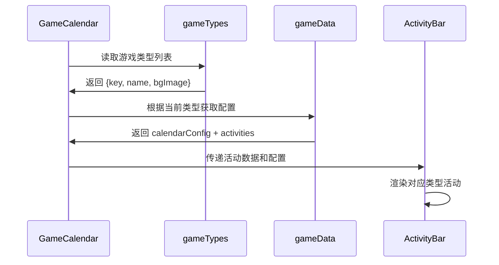
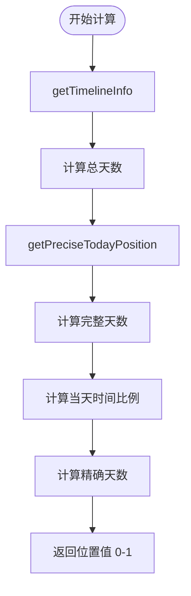
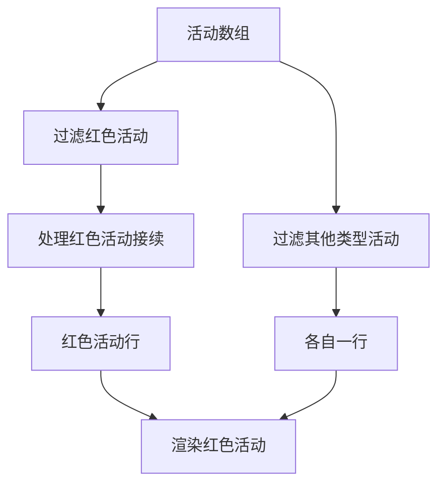
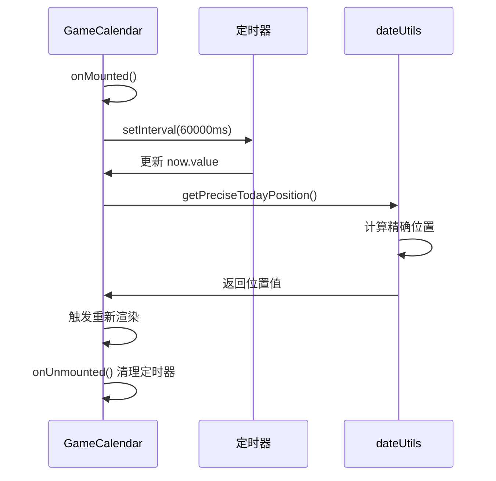
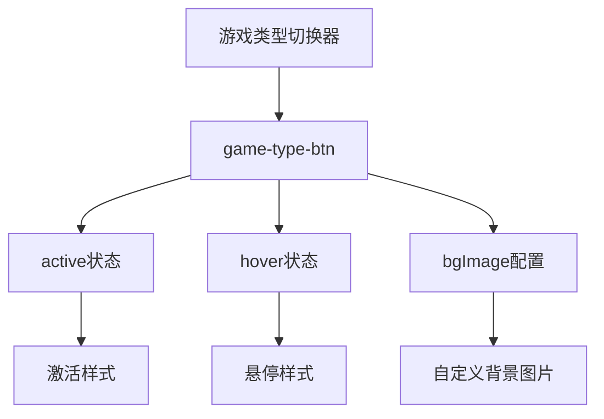
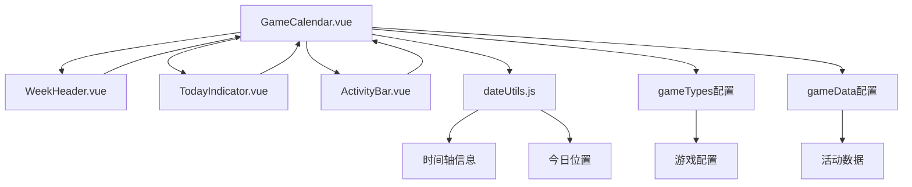
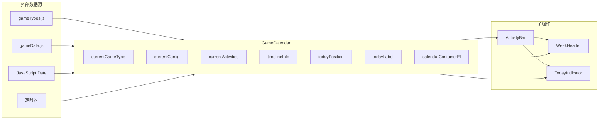

# GameCalendar 主容器组件

<cite>
**本文档引用的文件**
- [GameCalendar.vue](file://src/components/GameCalendar.vue)
- [dateUtils.js](file://src/utils/dateUtils.js)
- [activities.js](file://src/config/activities.js)
- [ActivityBar.vue](file://src/components/ActivityBar.vue)
- [WeekHeader.vue](file://src/components/WeekHeader.vue)
- [TodayIndicator.vue](file://src/components/TodayIndicator.vue)
- [App.vue](file://src/App.vue)
- [main.js](file://src/main.js)
</cite>

## 更新摘要
**变更内容**
- 完全重构的日历系统：从周系统迁移到精确的天系统
- 新增游戏类型切换机制：支持多游戏类型配置和动态切换
- 精确的时间轴计算：支持小时级精度的位置计算
- 改进的活动条样式：支持绝对定位和相对定位模式
- 动态配置系统：基于游戏类型的数据驱动架构

## 目录
1. [简介](#简介)
2. [项目结构](#项目结构)
3. [核心组件](#核心组件)
4. [架构概览](#架构概览)
5. [详细组件分析](#详细组件分析)
6. [依赖关系分析](#依赖关系分析)
7. [性能考虑](#性能考虑)
8. [故障排除指南](#故障排除指南)
9. [结论](#结论)

## 简介

GameCalendar 是一个专为游戏维护日历设计的 Vue 3 组件，采用 Composition API 和 `<script setup>` 语法。该组件作为整个日历应用的核心容器，负责协调其他子组件的布局和数据流，为用户提供直观的游戏维护时间线视图。

**重大更新**：系统已完全重构，从传统的周系统迁移到精确的天系统，支持小时级精度的时间计算。新增了游戏类型切换机制，允许用户在不同游戏之间切换，每个游戏都有独立的配置和活动数据。

该组件支持多游戏类型配置，包括绝区零和鸣潮等游戏，每个游戏都有独立的时间轴范围和活动配置。通过集成精确的日期计算工具和动态配置系统，用户可以清晰地看到各种限时活动的持续时间和状态。

## 项目结构

项目采用模块化架构，将功能按职责分离到不同的文件中：

**图表来源**
- [App.vue:1-29](file://src/App.vue#L1-L29)
- [GameCalendar.vue:1-279](file://src/components/GameCalendar.vue#L1-L279)

**章节来源**
- [App.vue:1-29](file://src/App.vue#L1-L29)
- [main.js:1-5](file://src/main.js#L1-L5)

## 核心组件

### GameCalendar 主容器组件

GameCalendar 作为核心容器组件，承担着以下关键职责：

- **多游戏类型管理**：支持绝区零和鸣潮等游戏类型的动态切换
- **精确时间轴计算**：基于天数的精确时间轴计算和位置更新
- **动态配置系统**：根据当前游戏类型动态加载相应的配置和活动数据
- **布局管理**：组织游戏类型切换器、周表头、今日指示器和活动条的排列
- **状态管理**：使用响应式引用管理当前游戏类型、时间轴信息和实时更新
- **组件通信**：通过 props 向子组件传递必要的数据和配置

#### 模板结构

组件采用完整的容器结构，包含游戏类型切换器和背景图片支持：

**图表来源**
- [GameCalendar.vue:1-64](file://src/components/GameCalendar.vue#L1-L64)

#### 脚本逻辑

组件使用 `<script setup>` 语法，实现了现代化的 Vue 3 开发模式：

- **导入声明**：统一导入所有依赖的子组件和工具函数
- **响应式数据**：使用 `ref` 和 `computed` 创建响应式状态
- **游戏类型管理**：通过 `currentGameType` 管理当前选中的游戏类型
- **动态配置**：使用 `computed` 属性动态计算当前配置和活动数据
- **实时更新**：每分钟自动更新今日位置，确保时间指示器准确
- **时间轴计算**：使用 `getTimelineInfo` 计算精确的时间轴信息

#### 样式设计

采用高级的视觉设计，包含游戏类型特定的背景图片和金属质感设计：

- **游戏类型背景**：每个游戏类型支持独立的背景图片配置
- **金属质感边框**：使用多层边框和阴影实现立体效果
- **渐变背景**：内部容器使用渐变背景增强视觉层次
- **响应式布局**：支持不同屏幕尺寸的适配
- **活动类型样式**：红色、橙色、灰色活动条的差异化视觉设计

**章节来源**
- [GameCalendar.vue:66-143](file://src/components/GameCalendar.vue#L66-L143)

## 架构概览

GameCalendar 采用了清晰的分层架构模式，包含多游戏类型支持和实时更新机制：

**图表来源**
- [GameCalendar.vue:66-143](file://src/components/GameCalendar.vue#L66-L143)
- [dateUtils.js:1-81](file://src/utils/dateUtils.js#L1-L81)
- [activities.js:1-110](file://src/config/activities.js#L1-L110)

## 详细组件分析

### 多游戏类型切换机制

#### 游戏类型配置系统

GameCalendar 新增了完整的多游戏类型支持系统：

**图表来源**
- [GameCalendar.vue:78-105](file://src/components/GameCalendar.vue#L78-L105)
- [activities.js:2-5](file://src/config/activities.js#L2-L5)
- [activities.js:8-109](file://src/config/activities.js#L8-L109)

##### 游戏类型定义

支持的游戏类型包括：
- **绝区零** (`zzz`)：具有完整的活动配置和背景图片
- **鸣潮** (`mc`)：当前为空配置，可扩展添加活动

##### 动态配置加载

- **配置选择**：根据 `currentGameType` 动态选择对应的配置
- **活动过滤**：将活动分为红色活动（同行）和其他类型（各自一行）
- **时间接续处理**：对红色活动进行时间连续性处理

**章节来源**
- [GameCalendar.vue:78-105](file://src/components/GameCalendar.vue#L78-L105)
- [activities.js:2-5](file://src/config/activities.js#L2-L5)
- [activities.js:8-109](file://src/config/activities.js#L8-L109)

### 精确的天系统

#### 时间轴计算系统

GameCalendar 从传统的周系统完全迁移到精确的天系统：

**图表来源**
- [dateUtils.js:11-54](file://src/utils/dateUtils.js#L11-L54)

##### 精确位置计算

新增的 `getPreciseTodayPosition` 函数提供小时级精度：

- **总毫秒计算**：计算起始日期到结束日期的总毫秒数
- **完整天数**：计算到当前日期的完整天数
- **时间比例**：计算当天已过时间占全天的比例
- **边界保护**：确保位置值在 0-1 范围内

##### 时间轴信息计算

`getTimelineInfo` 函数提供完整的时间轴信息：
- **总天数**：计算起始日期到结束日期的总天数（包含首尾两天）
- **日期范围**：返回原始的起始和结束日期字符串
- **精确计算**：使用 `setHours(0,0,0,0)` 确保日期计算的准确性

**章节来源**
- [dateUtils.js:11-54](file://src/utils/dateUtils.js#L11-L54)

### 改进的活动条系统

#### 活动类型分组机制

GameCalendar 实现了智能的活动类型分组系统：

**图表来源**
- [GameCalendar.vue:89-105](file://src/components/GameCalendar.vue#L89-L105)

##### 红色活动处理

红色活动具有特殊处理逻辑：
- **时间接续**：当相邻红色活动之间存在间隔时，自动调整起始时间
- **绝对定位**：使用绝对定位在同一行显示多个活动
- **样式统一**：共享相同的视觉样式和布局

##### 其他活动处理

其他类型的活动（橙色、灰色）：
- **独立行显示**：每个活动占据独立的一行
- **相对定位**：使用 `marginLeft` 进行定位
- **差异化样式**：根据类型应用不同的视觉样式

**章节来源**
- [GameCalendar.vue:89-105](file://src/components/GameCalendar.vue#L89-L105)

### 实时更新机制

#### 定时器管理系统

GameCalendar 保持了原有的实时更新机制，但进行了优化：

**图表来源**
- [GameCalendar.vue:129-142](file://src/components/GameCalendar.vue#L129-L142)
- [dateUtils.js:32-54](file://src/utils/dateUtils.js#L32-L54)

##### 精确位置计算优化

- **分钟级更新**：每分钟更新一次，确保时间指示器的准确性
- **响应式时间戳**：使用 `now` 响应式引用触发重新计算
- **内存安全**：在组件卸载时正确清理定时器

##### 生命周期管理

- **定时器创建**：在组件挂载时启动定时器
- **内存清理**：在组件卸载时清除定时器
- **防抖处理**：避免重复定时器创建

**章节来源**
- [GameCalendar.vue:129-142](file://src/components/GameCalendar.vue#L129-L142)
- [dateUtils.js:32-54](file://src/utils/dateUtils.js#L32-L54)

### 改进的样式系统

#### 游戏类型特定样式

新增了基于游戏类型的样式系统：

**图表来源**
- [GameCalendar.vue:241-278](file://src/components/GameCalendar.vue#L241-L278)

##### 游戏类型按钮样式

- **激活状态**：当前选中游戏类型显示红色边框和阴影
- **悬停效果**：鼠标悬停时按钮放大和颜色变化
- **背景图片**：支持每个游戏类型独立的背景图片配置
- **尺寸规格**：统一的160px×80px尺寸和圆角设计

##### 活动条样式系统

- **红色活动**：橙红色渐变，适合长时间连续活动
- **橙色活动**：明亮橙色渐变，适合重要活动
- **灰色活动**：中性灰色渐变，适合普通活动
- **装饰效果**：支持条纹纹理和阴影效果

**章节来源**
- [GameCalendar.vue:241-278](file://src/components/GameCalendar.vue#L241-L278)

## 依赖关系分析

### 组件依赖图

**图表来源**
- [GameCalendar.vue:66-76](file://src/components/GameCalendar.vue#L66-L76)

### 数据流向

**图表来源**
- [GameCalendar.vue:78-127](file://src/components/GameCalendar.vue#L78-L127)
- [activities.js:1-110](file://src/config/activities.js#L1-L110)

**章节来源**
- [GameCalendar.vue:66-127](file://src/components/GameCalendar.vue#L66-L127)

## 性能考虑

### 响应式数据优化

- **懒加载策略**：使用 `ref` 和 `computed` 创建响应式状态，避免不必要的重渲染
- **计算属性缓存**：利用 Vue 的计算属性缓存机制减少重复计算
- **事件处理优化**：避免在模板中直接调用复杂函数
- **定时器管理**：确保定时器正确清理，避免内存泄漏

### 渲染性能

- **虚拟滚动**：对于大量活动数据，可考虑实现虚拟滚动
- **组件拆分**：保持组件职责单一，便于单独优化
- **样式优化**：使用 CSS 变量和高效的选择器
- **背景图片优化**：使用固定定位减少重绘

### 内存管理

- **垃圾回收**：及时清理不再使用的引用
- **监听器管理**：在组件卸载时清理事件监听器
- **定时器清理**：确保定时器正确销毁

## 故障排除指南

### 常见问题及解决方案

#### 游戏类型切换问题

**问题描述**：游戏类型切换后配置不更新
**可能原因**：
- `currentGameType` 值未正确更新
- `computed` 属性未正确响应
- 配置数据结构不匹配

**解决方案**：
- 检查 `currentGameType` 的 `v-model` 绑定
- 验证 `computed` 属性的依赖关系
- 确保 `gameData` 结构与 `gameTypes` 匹配

#### 精确位置计算错误

**问题描述**：今日位置不更新或更新异常
**可能原因**：
- 定时器未正确创建
- 定时器被意外清理
- 位置计算函数错误

**解决方案**：
- 检查定时器创建和清理逻辑
- 验证 `getPreciseTodayPosition` 函数
- 确保组件生命周期钩子正确执行

#### 活动条位置计算错误

**问题描述**：活动条位置或宽度计算错误
**可能原因**：
- `totalDays` 参数不匹配
- `startTime` 或 `endTime` 格式不正确
- 浮点数精度问题

**解决方案**：
- 验证活动配置的日期格式
- 检查时间解析函数的实现
- 使用 `Math.round()` 处理浮点数

#### 背景图片问题

**问题描述**：游戏类型背景图片不显示
**可能原因**：
- 资源路径错误
- 图片格式不支持
- CSS 样式优先级问题

**解决方案**：
- 验证图片路径是否正确
- 检查图片格式和大小
- 确保 CSS 优先级正确

#### 组件通信问题

**问题描述**：子组件无法正确接收 props
**可能原因**：
- props 类型定义不匹配
- 数据传递时机问题
- 组件注册问题

**解决方案**：
- 检查 props 的类型和默认值
- 确保数据在组件创建前已准备就绪
- 验证组件导入和导出

**章节来源**
- [GameCalendar.vue:129-142](file://src/components/GameCalendar.vue#L129-L142)
- [dateUtils.js:32-54](file://src/utils/dateUtils.js#L32-L54)
- [ActivityBar.vue:68-102](file://src/components/ActivityBar.vue#L68-L102)

## 结论

GameCalendar 主容器组件展现了现代 Vue 3 应用的最佳实践，经过完全重构后具备了更强的功能性和用户体验：

### 设计优势

- **模块化架构**：清晰的组件分离和职责划分
- **响应式设计**：充分利用 Vue 3 的响应式系统
- **多游戏类型支持**：灵活的配置系统支持不同游戏类型
- **精确时间计算**：小时级精度的时间轴计算
- **实时更新**：每分钟自动更新确保时间准确性
- **丰富的视觉效果**：游戏类型特定的背景图片和样式
- **可扩展性**：良好的抽象层便于功能扩展
- **可维护性**：代码结构清晰，易于理解和修改

### 技术亮点

- **精确的天系统**：完全替代传统的周系统，提供更精确的时间计算
- **动态配置系统**：基于游戏类型的数据驱动架构
- **智能活动分组**：红色活动的时间接续处理和差异化显示
- **游戏类型切换**：用户友好的多游戏类型切换界面
- **高级视觉设计**：符合游戏应用的视觉规范
- **组件通信模式**：清晰的父子组件通信机制
- **内存安全**：完善的定时器管理和资源清理

### 扩展建议

1. **国际化支持**：添加多语言支持
2. **主题系统**：实现可配置的主题切换
3. **动画效果**：添加流畅的过渡动画
4. **无障碍访问**：提升用户体验和可访问性
5. **测试覆盖**：添加单元测试和集成测试
6. **性能监控**：添加性能指标监控
7. **错误处理**：增强错误处理和恢复机制
8. **移动端适配**：优化移动设备的显示效果

**更新**：经过完全重构的 GameCalendar 组件，从传统的周系统迁移到精确的天系统，新增了多游戏类型支持和智能的活动分组机制。新的架构不仅保持了原有的优秀特性，还显著提升了功能性和用户体验，是一个值得推荐的 Vue 3 组件实现。

该组件为游戏维护日历应用提供了坚实的基础，经过本次重构后，具备了现代化的架构设计、精确的时间计算能力和灵活的配置系统，能够轻松扩展和定制以满足不同的业务需求。