# GameCalendar 主容器组件

<cite>
**本文档引用的文件**
- [GameCalendar.vue](file://src/components/GameCalendar.vue)
- [dateUtils.js](file://src/utils/dateUtils.js)
- [activities.js](file://src/config/activities.js)
- [ActivityBar.vue](file://src/components/ActivityBar.vue)
- [WeekHeader.vue](file://src/components/WeekHeader.vue)
- [TodayIndicator.vue](file://src/components/TodayIndicator.vue)
- [App.vue](file://src/App.vue)
- [main.js](file://src/main.js)
</cite>

## 更新摘要
**变更内容**
- 新增实时更新机制（每分钟更新今日位置）
- 改进的样式系统（背景图片支持、金属质感边框）
- 更完整的组件集成结构
- 新增精确到分钟的位置计算功能

## 目录
1. [简介](#简介)
2. [项目结构](#项目结构)
3. [核心组件](#核心组件)
4. [架构概览](#架构概览)
5. [详细组件分析](#详细组件分析)
6. [依赖关系分析](#依赖关系分析)
7. [性能考虑](#性能考虑)
8. [故障排除指南](#故障排除指南)
9. [结论](#结论)

## 简介

GameCalendar 是一个专为游戏维护日历设计的 Vue 3 组件，采用 Composition API 和 `<script setup>` 语法。该组件作为整个日历应用的核心容器，负责协调其他子组件的布局和数据流，为用户提供直观的游戏维护时间线视图。

该组件以周四为一周的起始日（符合游戏维护日惯例），展示未来6周的时间轴，并突出显示当前维护周期。通过集成活动配置系统，用户可以清晰地看到各种限时活动的持续时间和状态。

**更新** 新增实时更新机制，每分钟自动更新今日位置，确保时间指示器的准确性。

## 项目结构

项目采用模块化架构，将功能按职责分离到不同的文件中：

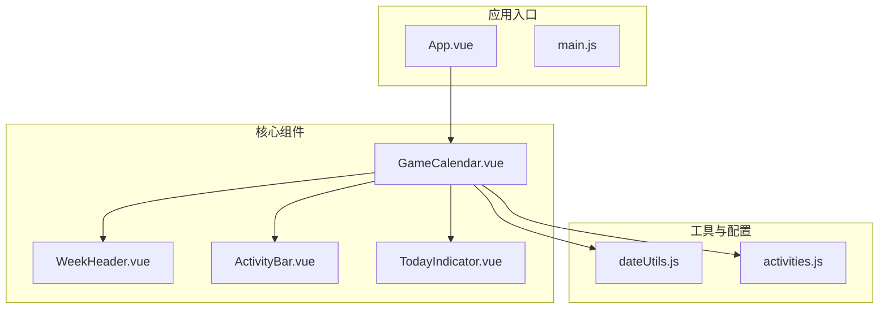

**图表来源**
- [App.vue:1-29](file://src/App.vue#L1-L29)
- [GameCalendar.vue:1-70](file://src/components/GameCalendar.vue#L1-L70)

**章节来源**
- [App.vue:1-29](file://src/App.vue#L1-L29)
- [main.js:1-5](file://src/main.js#L1-L5)

## 核心组件

### GameCalendar 主容器组件

GameCalendar 作为核心容器组件，承担着以下关键职责：

- **数据协调**：整合日期计算工具和活动配置数据
- **布局管理**：组织周表头、今日指示器和活动条的排列
- **状态管理**：使用响应式引用管理组件状态
- **组件通信**：通过 props 向子组件传递必要的数据
- **实时更新**：每分钟自动更新今日位置，确保时间指示器准确

#### 模板结构

组件采用完整的容器结构，包含背景图片支持和金属质感设计：

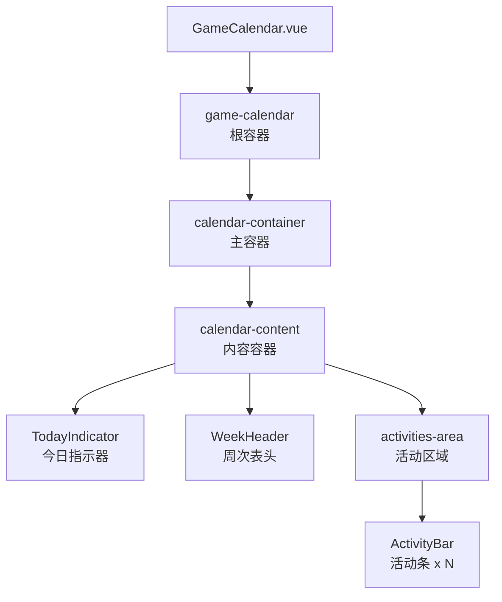

**图表来源**
- [GameCalendar.vue:1-27](file://src/components/GameCalendar.vue#L1-L27)

#### 脚本逻辑

组件使用 `<script setup>` 语法，实现了现代化的 Vue 3 开发模式：

- **导入声明**：统一导入所有依赖的子组件和工具函数
- **响应式数据**：使用 `ref` 创建响应式状态
- **计算属性**：通过 `computed` 处理派生状态
- **生命周期**：在组件挂载时初始化数据并设置定时器
- **实时更新**：每分钟自动更新今日位置

#### 样式设计

采用高级的视觉设计，包含背景图片和复杂的边框效果：

- **背景图片**：支持自定义背景图片，使用固定定位
- **金属质感边框**：使用多层边框和阴影实现立体效果
- **渐变背景**：内部容器使用渐变背景增强视觉层次
- **响应式布局**：支持不同屏幕尺寸的适配

**章节来源**
- [GameCalendar.vue:68-148](file://src/components/GameCalendar.vue#L68-L148)

## 架构概览

GameCalendar 采用了清晰的分层架构模式，包含实时更新机制：

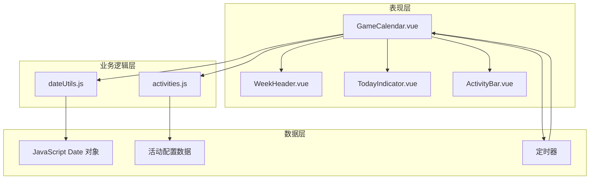

**图表来源**
- [GameCalendar.vue:29-66](file://src/components/GameCalendar.vue#L29-L66)
- [dateUtils.js:1-127](file://src/utils/dateUtils.js#L1-L127)
- [activities.js:1-57](file://src/config/activities.js#L1-L57)

## 详细组件分析

### 实时更新机制

#### 定时器管理

GameCalendar 新增了完整的实时更新机制：

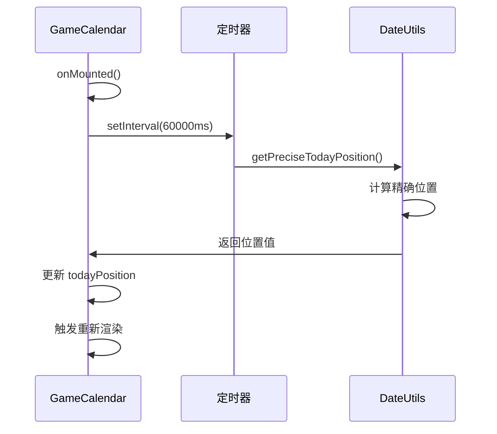

**图表来源**
- [GameCalendar.vue:52-65](file://src/components/GameCalendar.vue#L52-L65)
- [dateUtils.js:78-95](file://src/utils/dateUtils.js#L78-L95)

##### 精确位置计算

新增的 `getPreciseTodayPosition` 函数提供分钟级精度：

- **基础位置**：基于周起始日计算的天数比例
- **时间修正**：添加当天已过时间的比例修正
- **边界保护**：确保位置值在 0-1 范围内

##### 生命周期管理

- **定时器创建**：在组件挂载时启动定时器
- **内存清理**：在组件卸载时清除定时器
- **防抖处理**：避免重复定时器创建

**章节来源**
- [GameCalendar.vue:52-65](file://src/components/GameCalendar.vue#L52-L65)
- [dateUtils.js:78-95](file://src/utils/dateUtils.js#L78-L95)

### 改进的样式系统

#### 背景图片支持

新增了完整的背景图片支持系统：

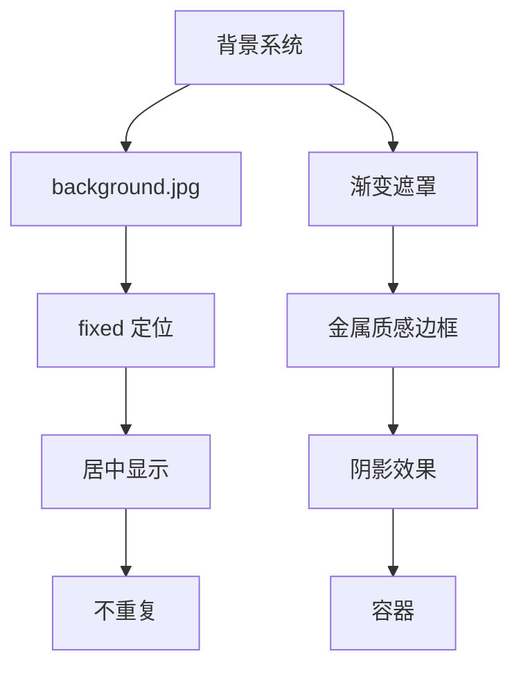

**图表来源**
- [GameCalendar.vue:69-100](file://src/components/GameCalendar.vue#L69-L100)

##### 金属质感边框

使用多层边框和阴影实现立体效果：

- **外层轮廓**：多层边框定义立体轮廓
- **内部高光**：顶部高光线增强立体感
- **内部阴影**：底部暗线提供深度感
- **渐变背景**：外层容器使用渐变背景

##### 渐变装饰元素

- **顶部装饰条**：使用线性渐变创建装饰条
- **容器背景**：内部容器使用深色背景
- **透明度控制**：通过透明度增强层次感

**章节来源**
- [GameCalendar.vue:69-148](file://src/components/GameCalendar.vue#L69-L148)

### 日期工具系统

#### dateUtils.js 核心功能

dateUtils.js 提供了完整的日期计算工具集，专门针对游戏维护日历场景优化：

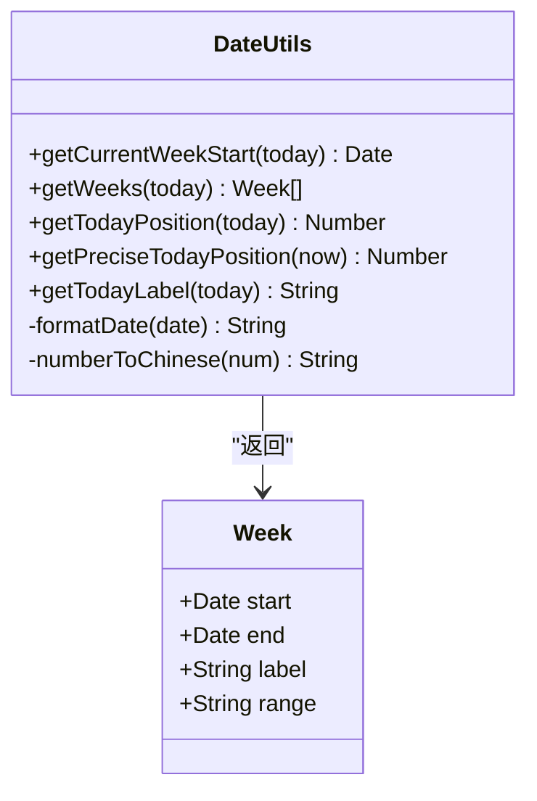

**图表来源**
- [dateUtils.js:12-127](file://src/utils/dateUtils.js#L12-L127)

##### 周起始日计算

组件采用独特的周四起始日规则：
- 如果今天是周四，则当前周从今天开始
- 否则找到最近的上一个周四
- 这种设计符合游戏维护日的惯例

##### 周次生成算法

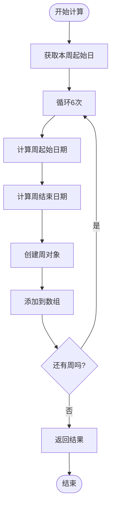

**图表来源**
- [dateUtils.js:35-55](file://src/utils/dateUtils.js#L35-L55)

**章节来源**
- [dateUtils.js:1-127](file://src/utils/dateUtils.js#L1-L127)

### 活动配置系统

#### activities.js 数据结构

活动配置采用标准化的数据格式，支持灵活的活动类型和显示选项：

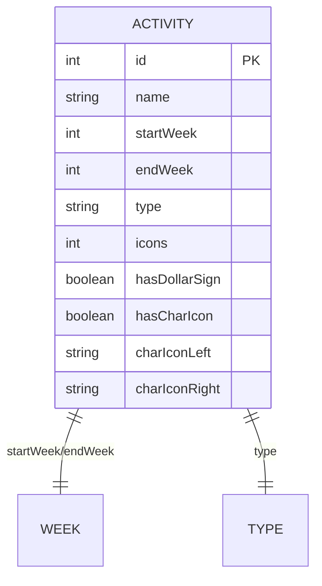

**图表来源**
- [activities.js:1-57](file://src/config/activities.js#L1-L57)

##### 活动类型系统

支持三种活动类型：
- **红色活动**：限时频段类活动
- **橙色活动**：重要活动
- **灰色活动**：普通活动

##### 显示选项控制

每个活动可以独立配置显示选项：
- `$` 符号标记
- 角色图标显示
- 图标数量配置
- 角色图片URL支持

**章节来源**
- [activities.js:1-57](file://src/config/activities.js#L1-L57)

### 子组件交互模式

#### 组件间通信机制

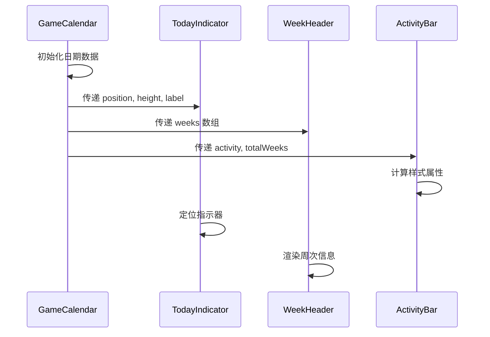

**图表来源**
- [GameCalendar.vue:6-23](file://src/components/GameCalendar.vue#L6-L23)
- [TodayIndicator.vue:9-22](file://src/components/TodayIndicator.vue#L9-L22)
- [WeekHeader.vue:19-24](file://src/components/WeekHeader.vue#L19-L24)
- [ActivityBar.vue:45-67](file://src/components/ActivityBar.vue#L45-L67)

#### ActivityBar 样式计算

ActivityBar 使用计算属性动态生成样式：

```mermaid
flowchart TD
Props[接收 props] --> CalcStart[计算起始百分比]
CalcStart --> CalcWidth[计算宽度百分比]
CalcWidth --> GenerateStyle[生成内联样式]
GenerateStyle --> Render[渲染组件]
CalcStart --> Formula1[(startWeek-1)/totalWeeks*100%]
CalcWidth --> Formula2[(endWeek-startWeek+1)/totalWeeks*100%]
```

**图表来源**
- [ActivityBar.vue:56-67](file://src/components/ActivityBar.vue#L56-L67)

**章节来源**
- [GameCalendar.vue:6-23](file://src/components/GameCalendar.vue#L6-L23)
- [ActivityBar.vue:45-67](file://src/components/ActivityBar.vue#L45-L67)

## 依赖关系分析

### 组件依赖图

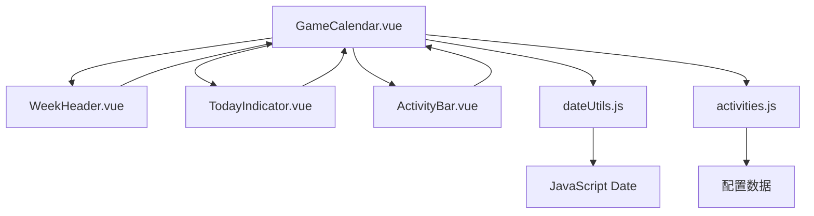

**图表来源**
- [GameCalendar.vue:31-39](file://src/components/GameCalendar.vue#L31-L39)

### 数据流向

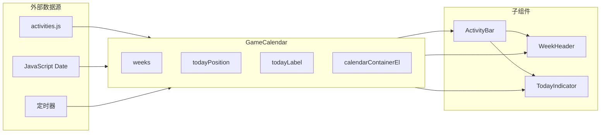

**图表来源**
- [GameCalendar.vue:41-50](file://src/components/GameCalendar.vue#L41-L50)
- [activities.js:1-57](file://src/config/activities.js#L1-L57)

**章节来源**
- [GameCalendar.vue:31-50](file://src/components/GameCalendar.vue#L31-L50)

## 性能考虑

### 响应式数据优化

- **懒加载策略**：使用 `ref` 创建响应式状态，避免不必要的重渲染
- **计算属性缓存**：利用 Vue 的计算属性缓存机制减少重复计算
- **事件处理优化**：避免在模板中直接调用复杂函数
- **定时器管理**：确保定时器正确清理，避免内存泄漏

### 渲染性能

- **虚拟滚动**：对于大量活动数据，可考虑实现虚拟滚动
- **组件拆分**：保持组件职责单一，便于单独优化
- **样式优化**：使用 CSS 变量和高效的选择器
- **背景图片优化**：使用固定定位减少重绘

### 内存管理

- **垃圾回收**：及时清理不再使用的引用
- **监听器管理**：在组件卸载时清理事件监听器
- **定时器清理**：确保定时器正确销毁

## 故障排除指南

### 常见问题及解决方案

#### 日期计算错误

**问题描述**：周起始日计算不正确
**可能原因**：
- 本地时区设置问题
- 夏令时影响
- 日期对象未正确初始化

**解决方案**：
- 确保使用 UTC 时间进行计算
- 验证日期对象的时区设置
- 添加边界条件检查

#### 实时更新问题

**问题描述**：今日位置不更新或更新异常
**可能原因**：
- 定时器未正确创建
- 定时器被意外清理
- 位置计算函数错误

**解决方案**：
- 检查定时器创建和清理逻辑
- 验证 `getPreciseTodayPosition` 函数
- 确保组件生命周期钩子正确执行

#### 样式显示异常

**问题描述**：活动条位置或宽度计算错误
**可能原因**：
- `totalWeeks` 参数不匹配
- `startWeek` 或 `endWeek` 超出范围
- 浮点数精度问题

**解决方案**：
- 验证活动配置的周数范围
- 添加数值验证和边界检查
- 使用 `Math.round()` 处理浮点数

#### 背景图片问题

**问题描述**：背景图片不显示或显示异常
**可能原因**：
- 资源路径错误
- 图片格式不支持
- 定位属性冲突

**解决方案**：
- 验证图片路径是否正确
- 检查图片格式和大小
- 确保定位属性正确设置

#### 组件通信问题

**问题描述**：子组件无法正确接收 props
**可能原因**：
- props 类型定义不匹配
- 数据传递时机问题
- 组件注册问题

**解决方案**：
- 检查 props 的类型和默认值
- 确保数据在组件创建前已准备就绪
- 验证组件导入和导出

**章节来源**
- [dateUtils.js:78-95](file://src/utils/dateUtils.js#L78-L95)
- [GameCalendar.vue:52-65](file://src/components/GameCalendar.vue#L52-L65)
- [ActivityBar.vue:56-67](file://src/components/ActivityBar.vue#L56-L67)

## 结论

GameCalendar 主容器组件展现了现代 Vue 3 应用的最佳实践，经过更新后具备了更强的功能性和用户体验：

### 设计优势

- **模块化架构**：清晰的组件分离和职责划分
- **响应式设计**：充分利用 Vue 3 的响应式系统
- **实时更新**：每分钟自动更新确保时间准确性
- **丰富的视觉效果**：背景图片和金属质感边框
- **可扩展性**：良好的抽象层便于功能扩展
- **可维护性**：代码结构清晰，易于理解和修改

### 技术亮点

- **日期计算工具**：专门针对游戏场景优化的日期处理
- **精确位置计算**：支持分钟级精度的时间指示
- **灵活的配置系统**：支持多种活动类型的配置
- **高级视觉设计**：符合游戏应用的视觉规范
- **组件通信模式**：清晰的父子组件通信机制
- **内存安全**：完善的定时器管理和资源清理

### 扩展建议

1. **国际化支持**：添加多语言支持
2. **主题系统**：实现可配置的主题切换
3. **动画效果**：添加流畅的过渡动画
4. **无障碍访问**：提升用户体验和可访问性
5. **测试覆盖**：添加单元测试和集成测试
6. **性能监控**：添加性能指标监控
7. **错误处理**：增强错误处理和恢复机制

**更新** 新增的实时更新机制和改进的样式系统显著提升了用户体验，使 GameCalendar 成为了一个功能完整、视觉出色的日历应用核心组件。通过合理的架构设计和工具函数支持，能够轻松扩展和定制以满足不同的业务需求。

该组件为游戏维护日历应用提供了坚实的基础，经过本次更新后，不仅保持了原有的优秀特性，还增加了实时性和视觉吸引力，是一个值得推荐的 Vue 3 组件实现。