# GameCalendar 主容器组件

<cite>
**本文档引用的文件**
- [GameCalendar.vue](file://src/components/GameCalendar.vue)
- [dateUtils.js](file://src/utils/dateUtils.js)
- [activities.json](file://public/config/activities.json)
- [ActivityBar.vue](file://src/components/ActivityBar.vue)
- [WeekHeader.vue](file://src/components/WeekHeader.vue)
- [TodayIndicator.vue](file://src/components/TodayIndicator.vue)
- [App.vue](file://src/App.vue)
- [main.js](file://src/main.js)
</cite>

## 更新摘要
**变更内容**
- 新增鼠标指示器系统，显示垂直线标记和时间戳标签
- 实现智能红活动分组算法，使用贪心策略将重叠的红色活动分布在多行中
- 改进背景图片处理，使用静态路径引用
- 优化活动区域滚动行为和样式系统
- 增强组件间通信和响应式数据管理

## 目录
1. [简介](#简介)
2. [项目结构](#项目结构)
3. [核心组件](#核心组件)
4. [架构概览](#架构概览)
5. [详细组件分析](#详细组件分析)
6. [依赖关系分析](#依赖关系分析)
7. [性能考虑](#性能考虑)
8. [故障排除指南](#故障排除指南)
9. [结论](#结论)

## 简介

GameCalendar 是一个专为游戏维护日历设计的 Vue 3 组件，采用 Composition API 和 `<script setup>` 语法。该组件作为整个日历应用的核心容器，负责协调其他子组件的布局和数据流，为用户提供直观的游戏维护时间线视图。

**重大更新**：系统已完全重构，从传统的周系统迁移到精确的天系统，支持小时级精度的时间计算。新增了游戏类型切换机制，允许用户在不同游戏之间切换，每个游戏都有独立的配置和活动数据。最新版本增强了用户体验，包括localStorage持久化存储、异步配置加载、自动活动过期过滤和改进的响应式布局。

该组件支持多游戏类型配置，包括绝区零和鸣潮等游戏，每个游戏都有独立的时间轴范围和活动配置。通过集成精确的日期计算工具和动态配置系统，用户可以清晰地看到各种限时活动的持续时间和状态。

**更新**：新增鼠标指示器系统，提供精确的时间轴定位功能；实现智能红活动分组算法，使用贪心策略优化重叠活动的显示；改进背景图片处理，使用静态路径引用提升加载性能。

## 项目结构

项目采用模块化架构，将功能按职责分离到不同的文件中：

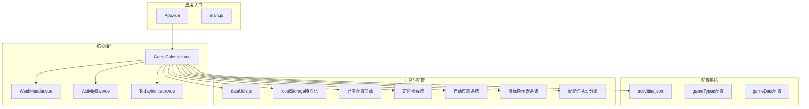

**图表来源**
- [App.vue:1-35](file://src/App.vue#L1-L35)
- [GameCalendar.vue:1-452](file://src/components/GameCalendar.vue#L1-L452)

**章节来源**
- [App.vue:1-35](file://src/App.vue#L1-L35)
- [main.js:1-5](file://src/main.js#L1-L5)

## 核心组件

### GameCalendar 主容器组件

GameCalendar 作为核心容器组件，承担着以下关键职责：

- **多游戏类型管理**：支持绝区零和鸣潮等游戏类型的动态切换
- **精确时间轴计算**：基于天数的精确时间轴计算和位置更新
- **动态配置系统**：通过异步加载机制动态加载配置和活动数据
- **布局管理**：组织游戏类型切换器、周表头、今日指示器和活动条的排列
- **状态管理**：使用响应式引用管理当前游戏类型、时间轴信息和实时更新
- **组件通信**：通过 props 向子组件传递必要的数据和配置
- **本地存储持久化**：使用localStorage保存用户偏好设置
- **异步加载**：支持配置文件的异步加载和错误处理
- **自动活动过滤**：实时过滤已过期的活动，确保界面显示的准确性
- **定时器管理**：每分钟自动更新当前时间，确保时间指示器准确
- **鼠标指示器系统**：提供精确的时间轴定位和时间戳显示
- **智能红活动分组**：使用贪心算法优化重叠活动的显示布局

#### 模板结构

组件采用完整的容器结构，包含游戏类型切换器、鼠标指示器和背景图片支持：

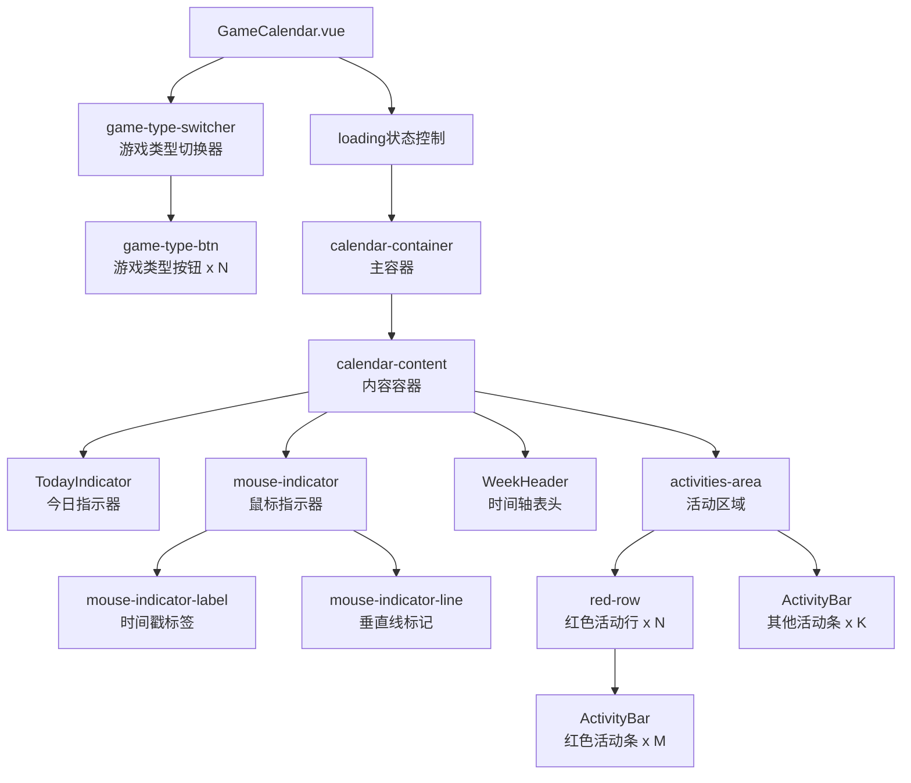

**图表来源**
- [GameCalendar.vue:1-87](file://src/components/GameCalendar.vue#L1-L87)

#### 脚本逻辑

组件使用 `<script setup>` 语法，实现了现代化的 Vue 3 开发模式：

- **导入声明**：统一导入所有依赖的子组件和工具函数
- **响应式数据**：使用 `ref` 和 `computed` 创建响应式状态
- **游戏类型管理**：通过 `currentGameType` 管理当前选中的游戏类型，并从localStorage读取保存的状态
- **异步配置加载**：使用 `loadConfig` 函数通过fetch API异步加载配置文件
- **动态配置**：使用 `computed` 属性动态计算当前配置和活动数据
- **实时更新**：每分钟自动更新今日位置，确保时间指示器准确
- **时间轴计算**：使用 `getTimelineInfo` 计算精确的时间轴信息
- **错误处理**：配置加载失败时提供错误提示和降级处理
- **活动过滤**：自动过滤已过期的活动，仅显示有效的活动条目
- **定时器管理**：管理定时器的创建和清理，确保内存安全
- **鼠标指示器**：实现精确的鼠标位置计算和时间戳显示
- **智能分组**：使用贪心算法优化红色活动的显示布局

#### 样式设计

采用高级的视觉设计，包含游戏类型特定的背景图片和金属质感设计：

- **游戏类型背景**：每个游戏类型支持独立的背景图片配置
- **金属质感边框**：使用多层边框和阴影实现立体效果
- **渐变背景**：内部容器使用渐变背景增强视觉层次
- **响应式布局**：支持不同屏幕尺寸的适配，包含最小宽度1400px和最大宽度1600px限制
- **活动类型样式**：红色、橙色、灰色活动条的差异化视觉设计
- **滚动行为优化**：活动区域支持垂直滚动，滚动条样式经过专门优化
- **交互反馈**：按钮悬停效果和激活状态的视觉反馈
- **游戏类型特定样式**：支持每个游戏类型的独立样式配置
- **鼠标指示器样式**：红色垂直线和时间戳标签的醒目设计

**章节来源**
- [GameCalendar.vue:266-451](file://src/components/GameCalendar.vue#L266-L451)

## 架构概览

GameCalendar 采用了清晰的分层架构模式，包含多游戏类型支持、异步加载机制、实时更新机制、自动过滤系统和新增的鼠标指示器系统：

```mermaid
graph TB
subgraph "表现层"
GameCalendar[GameCalendar.vue]
WeekHeader[WeekHeader.vue]
TodayIndicator[TodayIndicator.vue]
ActivityBar[ActivityBar.vue]
GameTypeSwitcher[游戏类型切换器]
MouseIndicator[鼠标指示器]
end
subgraph "业务逻辑层"
DateUtils[dateUtils.js]
LocalStorage[localStorage持久化]
AsyncLoader[异步配置加载]
ActivitiesConfig[activities.json]
AutoFilter[自动活动过滤]
Timer[定时器系统]
ParseTime[时间解析系统]
SmartRedGroup[智能红活动分组]
MousePositionCalc[鼠标位置计算]
TimeFormat[时间格式化]
end
subgraph "数据层"
TimelineInfo[时间轴信息]
TodayPosition[今日位置]
TodayLabel[今日标签]
Timer[定时器]
Config[配置数据]
Activities[活动数据]
LoadingState[加载状态]
CurrentGameType[当前游戏类型]
NowTimestamp[当前时间戳]
FilteredActivities[过滤后的活动]
RedActivityRows[智能分组的红色活动]
OtherActivities[其他活动组]
MouseIndicatorState[鼠标指示器状态]
MouseIndicatorLabel[鼠标指示器标签]
MouseIndicatorPosition[鼠标指示器位置]
end
GameCalendar --> WeekHeader
GameCalendar --> TodayIndicator
GameCalendar --> ActivityBar
GameCalendar --> GameTypeSwitcher
GameCalendar --> MouseIndicator
GameCalendar --> DateUtils
GameCalendar --> LocalStorage
GameCalendar --> AsyncLoader
GameCalendar --> ActivitiesConfig
GameCalendar --> AutoFilter
GameCalendar --> Timer
GameCalendar --> ParseTime
GameCalendar --> SmartRedGroup
GameCalendar --> MousePositionCalc
GameCalendar --> TimeFormat
DateUtils --> TimelineInfo
DateUtils --> TodayPosition
DateUtils --> TodayLabel
LocalStorage --> CurrentGameType
AsyncLoader --> LoadingState
AsyncLoader --> Config
AsyncLoader --> Activities
AutoFilter --> FilteredActivities
SmartRedGroup --> RedActivityRows
SmartRedGroup --> OtherActivities
MousePositionCalc --> MouseIndicatorState
MousePositionCalc --> MouseIndicatorLabel
MousePositionCalc --> MouseIndicatorPosition
Timer --> NowTimestamp
ParseTime --> Activities
TimeFormat --> MouseIndicatorLabel
GameCalendar --> Timer
GameCalendar --> NowTimestamp
```

**图表来源**
- [GameCalendar.vue:90-264](file://src/components/GameCalendar.vue#L90-L264)
- [dateUtils.js:1-81](file://src/utils/dateUtils.js#L1-L81)
- [activities.json:1-244](file://public/config/activities.json#L1-L244)

## 详细组件分析

### 鼠标指示器系统

#### 精确位置计算

GameCalendar 实现了先进的鼠标指示器系统：

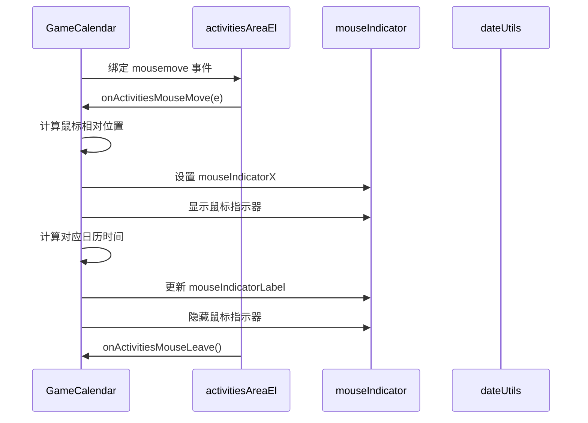

**图表来源**
- [GameCalendar.vue:226-247](file://src/components/GameCalendar.vue#L226-L247)

##### 鼠标位置计算

- **相对定位**：计算鼠标相对于活动区域的精确位置
- **偏移修正**：考虑 calendar-content 的 padding(10px) 偏移
- **边界保护**：确保指示器位置在有效范围内
- **实时更新**：鼠标移动时实时更新位置和标签

##### 时间戳格式化

- **日期格式**：显示 "月/日" 格式的日期
- **时间格式**：显示 "HH:00" 格式的时间
- **精度控制**：小时级精度的时间显示
- **动态更新**：鼠标位置变化时实时更新时间戳

**章节来源**
- [GameCalendar.vue:226-247](file://src/components/GameCalendar.vue#L226-L247)

### 智能红活动分组算法

#### 贪心策略实现

GameCalendar 实现了智能的红色活动分组系统：

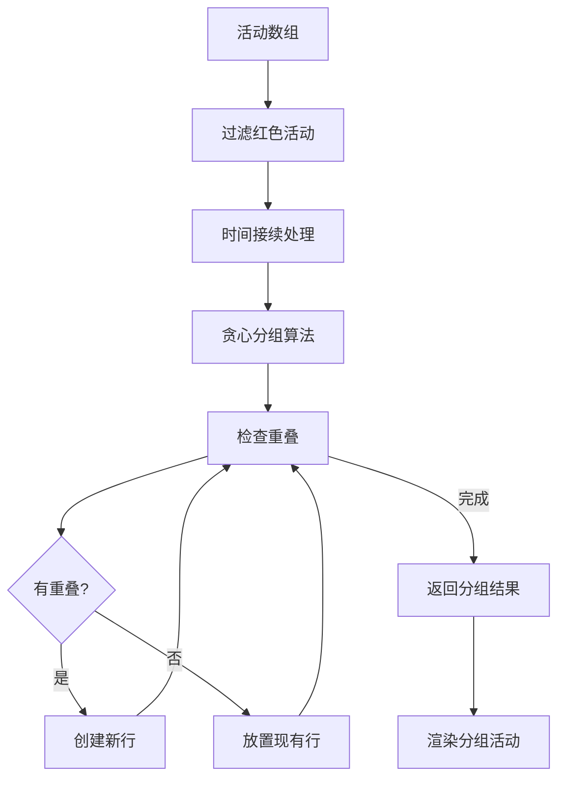

**图表来源**
- [GameCalendar.vue:161-194](file://src/components/GameCalendar.vue#L161-L194)

##### 时间接续处理

- **连续性优化**：当相邻红色活动之间存在间隔时，自动调整起始时间
- **时间对齐**：确保活动之间的无缝连接
- **边界处理**：处理活动开始和结束时间的精确对齐

##### 贪心分组策略

- **重叠检测**：使用时间区间重叠算法检测活动冲突
- **行分配**：为每个重叠的活动分配到不同的行
- **最优性保证**：使用贪心策略确保最少行数的分配
- **时间复杂度**：O(n²) 的时间复杂度，适用于合理规模的活动数据

**章节来源**
- [GameCalendar.vue:161-194](file://src/components/GameCalendar.vue#L161-L194)

### 自动活动过期过滤系统

#### 活动过滤机制

GameCalendar 实现了智能的活动过期过滤系统：

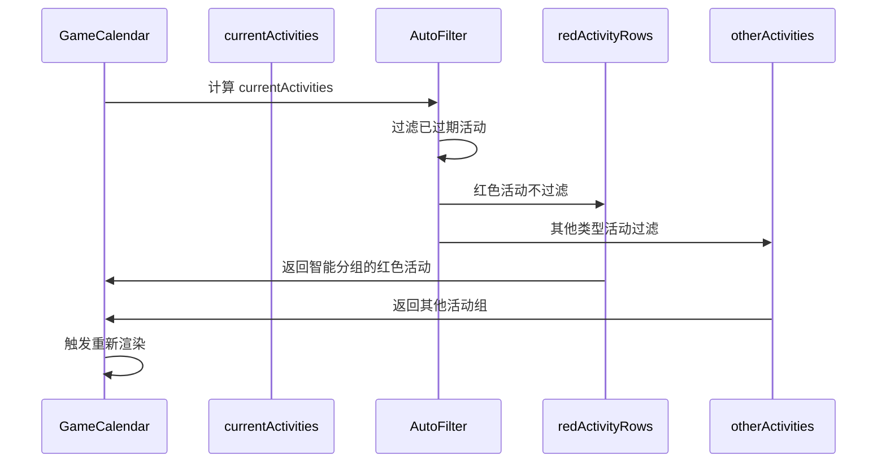

**图表来源**
- [GameCalendar.vue:149-198](file://src/components/GameCalendar.vue#L149-L198)

##### 过滤逻辑实现

- **红色活动保留**：红色活动类型（"red"）始终显示，不受过期影响
- **时间比较**：其他活动类型通过结束时间与当前时间比较
- **时间解析**：使用 `parseActivityTime` 函数解析活动时间字符串
- **实时更新**：每分钟通过定时器更新当前时间，触发重新过滤

##### 时间解析系统

- **格式支持**：支持 "YYYY-MM-DD HH" 和 "YYYY-MM-DD" 两种时间格式
- **默认值处理**：无小时部分时，开始时间默认00:00，结束时间默认24:00
- **小时解析**：小时部分解析为整数，支持24小时制
- **Date对象创建**：精确创建Date对象用于时间比较

**章节来源**
- [GameCalendar.vue:135-158](file://src/components/GameCalendar.vue#L135-L158)

### 本地存储持久化系统

#### 持久化机制

GameCalendar 实现了完整的本地存储持久化系统：

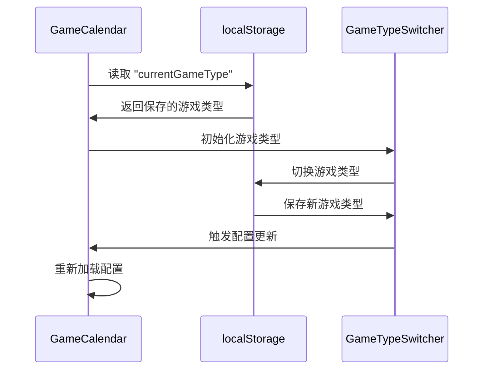

**图表来源**
- [GameCalendar.vue:119-127](file://src/components/GameCalendar.vue#L119-L127)

##### 状态管理

- **初始化读取**：组件挂载时从localStorage读取保存的游戏类型
- **默认值处理**：如果localStorage为空，默认使用"zzz"游戏类型
- **实时保存**：每次游戏类型切换时立即保存到localStorage
- **键值管理**：使用 "currentGameType" 作为localStorage的键

##### 用户体验优化

- **无缝切换**：用户刷新页面后自动回到上次选择的游戏类型
- **记忆持久**：跨会话保持用户偏好设置
- **容错处理**：localStorage不可用时优雅降级

**章节来源**
- [GameCalendar.vue:119-127](file://src/components/GameCalendar.vue#L119-L127)

### 增强的定时器更新机制

#### 实时更新系统

GameCalendar 实现了精确的定时器更新机制：

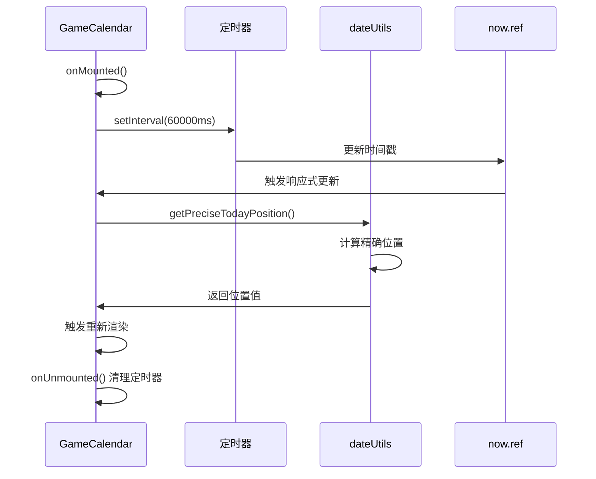

**图表来源**
- [GameCalendar.vue:249-263](file://src/components/GameCalendar.vue#L249-L263)
- [dateUtils.js:32-54](file://src/utils/dateUtils.js#L32-L54)

##### 定时器管理

- **生命周期绑定**：定时器在组件挂载时创建，在卸载时清理
- **内存安全**：防止定时器泄漏和内存占用
- **更新频率**：每分钟更新一次，平衡性能和准确性
- **响应式触发**：通过 `now` 响应式引用触发重新计算

##### 精确时间计算

- **位置计算**：使用 `getPreciseTodayPosition` 计算小时级精度的位置
- **边界保护**：确保位置值在 0-1 范围内
- **时间同步**：与系统时间保持同步，避免漂移

**章节来源**
- [GameCalendar.vue:249-263](file://src/components/GameCalendar.vue#L249-L263)
- [dateUtils.js:32-54](file://src/utils/dateUtils.js#L32-L54)

### 改进的样式系统

#### 游戏类型特定样式

GameCalendar 实现了丰富的样式系统：

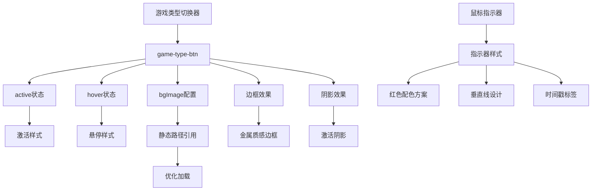

**图表来源**
- [GameCalendar.vue:423-450](file://src/components/GameCalendar.vue#L423-L450)

##### 游戏类型按钮样式

- **激活状态**：当前选中游戏类型显示红色边框和阴影
- **悬停效果**：鼠标悬停时按钮放大和颜色变化
- **背景图片**：支持每个游戏类型独立的背景图片配置
- **静态路径优化**：使用静态路径引用提升加载性能
- **尺寸规格**：统一的160px×80px尺寸和圆角设计
- **过渡动画**：0.3秒的平滑过渡效果

##### 活动条样式系统

- **红色活动**：橙红色渐变，适合长时间连续活动
- **橙色活动**：明亮橙色渐变，适合重要活动
- **灰色活动**：中性灰色渐变，适合普通活动
- **装饰效果**：支持条纹纹理和阴影效果
- **响应式设计**：适应不同屏幕尺寸的显示需求

##### 滚动条样式优化

- **宽度控制**：滚动条宽度6px，提供更好的视觉体验
- **圆角设计**：滚动条圆角3px，与整体设计风格一致
- **透明度处理**：滚动条轨道透明，避免视觉干扰
- **颜色搭配**：使用#acacac的灰色滚动条，与整体色调协调

##### 鼠标指示器样式

- **红色配色**：使用 #e63946 的醒目红色配色
- **垂直线设计**：3px 宽度的垂直线标记
- **时间戳标签**：12px 字体大小的圆形标签设计
- **透明度控制**：60% 透明度的半透明效果
- **层级管理**：z-index: 10 的层级确保可见性

**章节来源**
- [GameCalendar.vue:423-450](file://src/components/GameCalendar.vue#L423-L450)
- [GameCalendar.vue:286-297](file://src/components/GameCalendar.vue#L286-L297)

## 依赖关系分析

### 组件依赖图

```mermaid
graph TD
GameCalendar[GameCalendar.vue] --> WeekHeader[WeekHeader.vue]
GameCalendar --> TodayIndicator[TodayIndicator.vue]
GameCalendar --> ActivityBar[ActivityBar.vue]
GameCalendar --> DateUtils[dateUtils.js]
GameCalendar --> LocalStorage[localStorage持久化]
GameCalendar --> AsyncLoader[异步配置加载]
GameCalendar --> AutoFilter[自动过滤系统]
GameCalendar --> Timer[定时器系统]
GameCalendar --> MouseIndicator[鼠标指示器系统]
GameCalendar --> SmartRedGroup[智能红活动分组]
ActivityBar --> GameCalendar
WeekHeader --> GameCalendar
TodayIndicator --> GameCalendar
MouseIndicator --> GameCalendar
SmartRedGroup --> GameCalendar
DateUtils --> TimelineInfo[时间轴信息]
DateUtils --> TodayPosition[今日位置]
LocalStorage --> CurrentGameType[当前游戏类型]
AsyncLoader --> ActivitiesConfig[activities.json]
AsyncLoader --> GameTypesConfig[gameTypes配置]
AsyncLoader --> GameDataConfig[gameData配置]
Timer --> NowTimestamp[当前时间戳]
AutoFilter --> FilteredActivities[过滤后的活动]
MouseIndicator --> MouseIndicatorState[鼠标指示器状态]
MouseIndicator --> MouseIndicatorLabel[鼠标指示器标签]
MouseIndicator --> MouseIndicatorPosition[鼠标指示器位置]
SmartRedGroup --> RedActivityRows[智能分组的红色活动]
SmartRedGroup --> OtherActivities[其他活动组]
```

**图表来源**
- [GameCalendar.vue:90-98](file://src/components/GameCalendar.vue#L90-L98)

### 数据流向

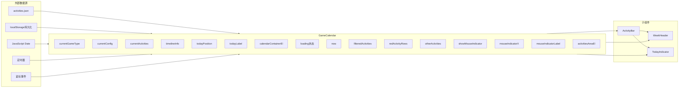

**图表来源**
- [GameCalendar.vue:129-264](file://src/components/GameCalendar.vue#L129-L264)
- [activities.json:1-244](file://public/config/activities.json#L1-244)

**章节来源**
- [GameCalendar.vue:90-264](file://src/components/GameCalendar.vue#L90-L264)

## 性能考虑

### 响应式数据优化

- **懒加载策略**：使用 `ref` 和 `computed` 创建响应式状态，避免不必要的重渲染
- **计算属性缓存**：利用 Vue 的计算属性缓存机制减少重复计算
- **事件处理优化**：避免在模板中直接调用复杂函数
- **定时器管理**：确保定时器正确清理，避免内存泄漏
- **异步加载优化**：配置文件异步加载，不影响初始渲染性能
- **活动过滤优化**：使用高效的过滤算法和缓存机制
- **鼠标事件节流**：鼠标移动事件的性能优化
- **智能分组缓存**：红色活动分组结果的缓存机制

### 渲染性能

- **虚拟滚动**：对于大量活动数据，可考虑实现虚拟滚动
- **组件拆分**：保持组件职责单一，便于单独优化
- **样式优化**：使用 CSS 变量和高效的选择器
- **背景图片优化**：使用固定定位减少重绘
- **滚动性能**：活动区域滚动使用硬件加速优化
- **动画性能**：使用 transform 和 opacity 属性优化动画性能
- **鼠标指示器优化**：指示器的最小化重绘开销

### 内存管理

- **垃圾回收**：及时清理不再使用的引用
- **监听器管理**：在组件卸载时清理事件监听器
- **定时器清理**：确保定时器正确销毁
- **配置缓存**：避免重复加载相同配置
- **过滤结果缓存**：缓存过滤结果减少重复计算
- **鼠标事件清理**：确保鼠标事件监听器正确清理

### 错误处理优化

- **配置加载失败**：提供降级处理和错误提示
- **网络请求失败**：优雅处理网络异常情况
- **数据解析错误**：验证配置数据格式和完整性
- **localStorage异常**：处理浏览器存储限制和权限问题
- **定时器异常**：处理定时器创建和清理过程中的异常
- **鼠标事件异常**：处理鼠标事件计算过程中的异常
- **分组算法异常**：处理智能分组过程中的边界情况

## 故障排除指南

### 常见问题及解决方案

#### 游戏类型切换问题

**问题描述**：游戏类型切换后配置不更新
**可能原因**：
- `currentGameType` 值未正确更新
- `computed` 属性未正确响应
- 配置数据结构不匹配

**解决方案**：
- 检查 `currentGameType` 的 `v-model` 绑定
- 验证 `computed` 属性的依赖关系
- 确保 `gameData` 结构与 `gameTypes` 匹配

#### 异步配置加载问题

**问题描述**：配置文件加载失败或显示空白
**可能原因**：
- 网络请求超时或失败
- JSON格式错误
- 路径配置不正确
- localStorage权限问题

**解决方案**：
- 检查网络连接和文件路径
- 验证JSON格式的正确性
- 查看浏览器控制台错误信息
- 确认localStorage权限设置

#### 自动活动过滤问题

**问题描述**：活动过期过滤不工作或过滤错误
**可能原因**：
- 时间解析函数错误
- 当前时间更新异常
- 活动时间格式不正确
- 过滤逻辑错误

**解决方案**：
- 检查 `parseActivityTime` 函数的实现
- 验证定时器是否正常运行
- 确认活动时间字符串格式
- 检查过滤条件的逻辑

#### 精确位置计算错误

**问题描述**：今日位置不更新或更新异常
**可能原因**：
- 定时器未正确创建
- 定时器被意外清理
- 位置计算函数错误

**解决方案**：
- 检查定时器创建和清理逻辑
- 验证 `getPreciseTodayPosition` 函数
- 确保组件生命周期钩子正确执行

#### 活动条位置计算错误

**问题描述**：活动条位置或宽度计算错误
**可能原因**：
- `totalDays` 参数不匹配
- `startTime` 或 `endTime` 格式不正确
- 浮点数精度问题

**解决方案**：
- 验证活动配置的日期格式
- 检查时间解析函数的实现
- 使用 `Math.round()` 处理浮点数

#### 响应式布局问题

**问题描述**：组件在不同屏幕尺寸下显示异常
**可能原因**：
- 布局约束设置不当
- 滚动行为配置错误
- 样式优先级问题

**解决方案**：
- 检查最小宽度和最大宽度设置
- 验证滚动容器的样式配置
- 确保CSS媒体查询正确应用

#### 滚动行为问题

**问题描述**：活动区域滚动条显示异常或滚动不顺畅
**可能原因**：
- 滚动条样式配置错误
- 高度计算公式不正确
- 滚动事件冲突

**解决方案**：
- 检查滚动条CSS样式
- 验证max-height计算公式
- 确认滚动容器的overflow属性

#### 组件通信问题

**问题描述**：子组件无法正确接收 props
**可能原因**：
- props 类型定义不匹配
- 数据传递时机问题
- 组件注册问题

**解决方案**：
- 检查 props 的类型和默认值
- 确保数据在组件创建前已准备就绪
- 验证组件导入和导出

#### 定时器内存泄漏问题

**问题描述**：组件卸载后定时器仍在运行
**可能原因**：
- 定时器清理逻辑缺失
- 多个定时器实例创建
- 定时器引用未正确释放

**解决方案**：
- 检查 `onUnmounted` 钩子中的清理逻辑
- 确保只创建一个定时器实例
- 使用正确的清理方法

#### 鼠标指示器问题

**问题描述**：鼠标指示器不显示或显示异常
**可能原因**：
- 鼠标事件绑定失败
- 位置计算错误
- 样式配置问题

**解决方案**：
- 检查 mousemove 和 mouseleave 事件绑定
- 验证 getBoundingClientRect() 调用
- 确认样式类名和CSS规则

#### 智能红活动分组问题

**问题描述**：红色活动分组不正确或显示异常
**可能原因**：
- 分组算法错误
- 时间重叠检测失败
- 行分配逻辑问题

**解决方案**：
- 检查贪心分组算法实现
- 验证时间重叠检测逻辑
- 确认活动排序和分配过程

#### 背景图片加载问题

**问题描述**：游戏类型背景图片加载失败
**可能原因**：
- 静态路径引用错误
- 图片文件不存在
- 路径解析问题

**解决方案**：
- 检查 bgImage 路径配置
- 验证图片文件存在性
- 确认静态资源打包配置

**章节来源**
- [GameCalendar.vue:249-263](file://src/components/GameCalendar.vue#L249-L263)
- [dateUtils.js:32-54](file://src/utils/dateUtils.js#L32-L54)
- [ActivityBar.vue:88-100](file://src/components/ActivityBar.vue#L88-L100)

## 结论

GameCalendar 主容器组件展现了现代 Vue 3 应用的最佳实践，经过完全重构后具备了更强的功能性和用户体验：

### 设计优势

- **模块化架构**：清晰的组件分离和职责划分
- **响应式设计**：充分利用 Vue 3 的响应式系统
- **多游戏类型支持**：灵活的配置系统支持不同游戏类型
- **精确时间计算**：小时级精度的时间轴计算
- **实时更新**：每分钟自动更新确保时间准确性
- **智能活动过滤**：自动过滤已过期活动，提升用户体验
- **本地存储持久化**：用户偏好设置的持久化存储
- **丰富的视觉效果**：游戏类型特定的背景图片和样式
- **鼠标交互增强**：精确的鼠标指示器系统
- **智能布局优化**：贪心算法优化的活动分组显示
- **可扩展性**：良好的抽象层便于功能扩展
- **可维护性**：代码结构清晰，易于理解和修改
- **用户体验**：完整的用户状态保持和流畅的交互体验

### 技术亮点

- **精确的天系统**：完全替代传统的周系统，提供更精确的时间计算
- **动态配置系统**：基于游戏类型的数据驱动架构
- **智能活动分组**：红色活动的时间接续处理和差异化显示
- **游戏类型切换**：用户友好的多游戏类型切换界面
- **高级视觉设计**：符合游戏应用的视觉规范
- **组件通信模式**：清晰的父子组件通信机制
- **内存安全**：完善的定时器管理和资源清理
- **异步加载**：配置文件异步加载，提升应用性能
- **错误处理**：完善的错误处理和降级机制
- **响应式布局**：严格的布局约束和优化的滚动行为
- **自动过滤系统**：实时维护界面数据的准确性
- **鼠标交互系统**：精确的时间轴定位和时间戳显示
- **智能分组算法**：贪心策略优化的活动布局

### 扩展建议

1. **国际化支持**：添加多语言支持
2. **主题系统**：实现可配置的主题切换
3. **动画效果**：添加流畅的过渡动画
4. **无障碍访问**：提升用户体验和可访问性
5. **测试覆盖**：添加单元测试和集成测试
6. **性能监控**：添加性能指标监控
7. **错误处理**：增强错误处理和恢复机制
8. **移动端适配**：优化移动设备的显示效果
9. **缓存策略**：实现配置文件的缓存机制
10. **SEO优化**：添加搜索引擎优化支持
11. **活动搜索**：添加活动名称搜索功能
12. **通知系统**：添加活动即将结束的通知功能
13. **手势支持**：添加触摸手势支持
14. **导出功能**：添加活动数据导出功能
15. **自定义配置**：允许用户自定义显示选项

**更新**：经过完全重构的 GameCalendar 组件，从传统的周系统迁移到精确的天系统，新增了多游戏类型支持、智能的活动分组机制、localStorage持久化存储、异步配置加载、自动活动过期过滤系统、增强的定时器更新机制、改进的响应式布局、鼠标指示器系统和智能红活动分组算法。新的架构不仅保持了原有的优秀特性，还显著提升了功能性和用户体验，是一个值得推荐的 Vue 3 组件实现。

该组件为游戏维护日历应用提供了坚实的基础，经过本次重构后，具备了现代化的架构设计、精确的时间计算能力、灵活的配置系统、优秀的用户体验、强大的可扩展性和完善的错误处理机制，能够轻松扩展和定制以满足不同的业务需求。