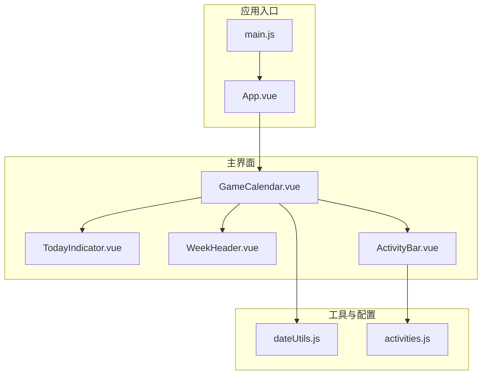
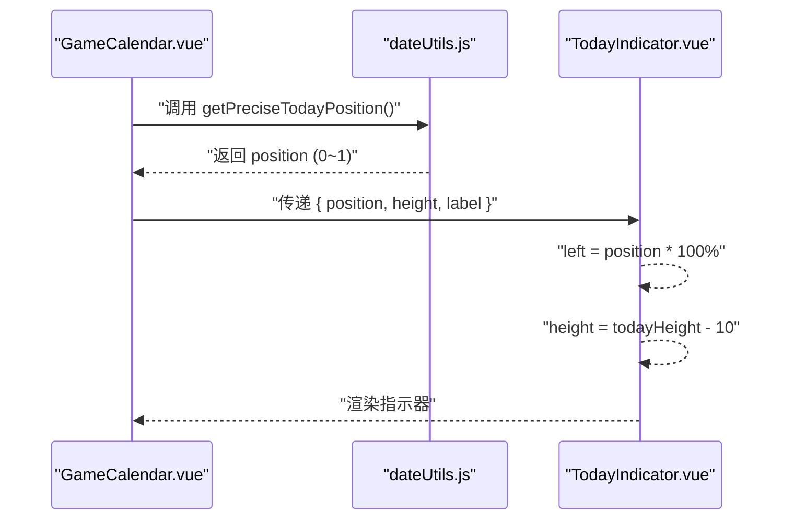
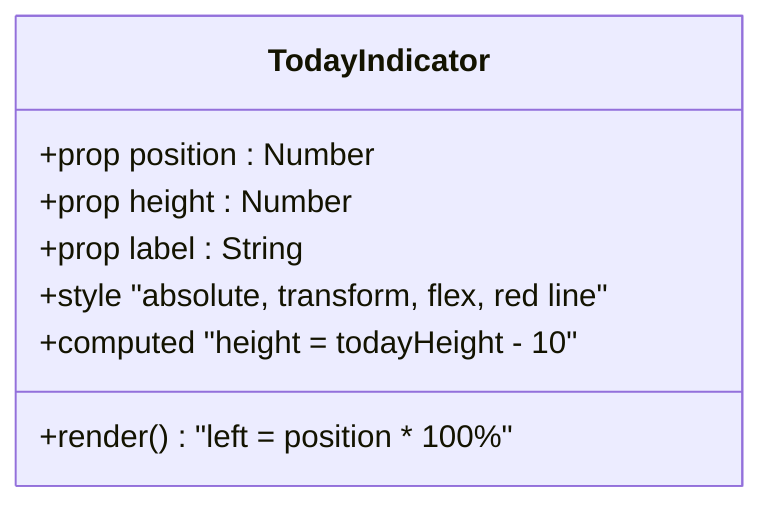
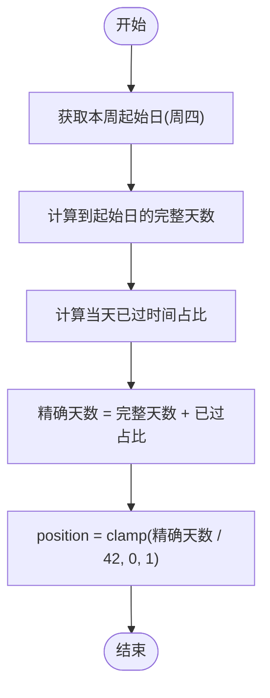
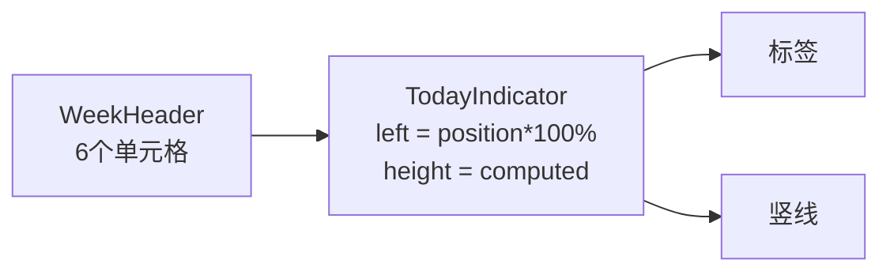
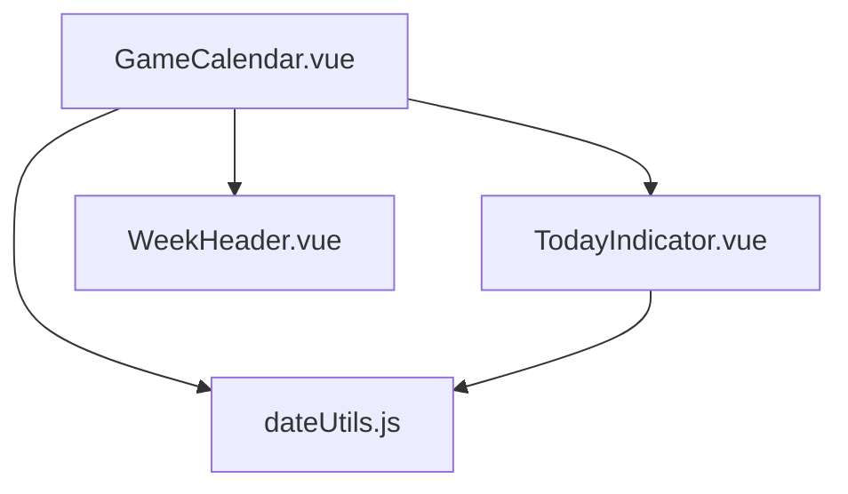

# TodayIndicator 今日指示器组件

<cite>
**本文引用的文件**
- [TodayIndicator.vue](file://src/components/TodayIndicator.vue)
- [GameCalendar.vue](file://src/components/GameCalendar.vue)
- [dateUtils.js](file://src/utils/dateUtils.js)
- [WeekHeader.vue](file://src/components/WeekHeader.vue)
- [ActivityBar.vue](file://src/components/ActivityBar.vue)
- [activities.js](file://src/config/activities.js)
- [App.vue](file://src/App.vue)
- [main.js](file://src/main.js)
</cite>

## 更新摘要
**变更内容**
- 新增 height 属性支持动态指示器高度计算
- 增强实时更新功能，支持每分钟精确更新今日位置
- 更新样式设计，增加更丰富的视觉效果
- 改进组件的响应式设计和用户体验

## 目录
1. [简介](#简介)
2. [项目结构](#项目结构)
3. [核心组件](#核心组件)
4. [架构总览](#架构总览)
5. [详细组件分析](#详细组件分析)
6. [依赖关系分析](#依赖关系分析)
7. [性能考量](#性能考量)
8. [故障排查指南](#故障排查指南)
9. [结论](#结论)
10. [附录：使用与集成指南](#附录使用与集成指南)

## 简介
TodayIndicator 是一个用于在6周时间轴上动态定位并标记"当前日期"的可视化组件。它通过接收三个关键属性：
- position：表示当前日期在6周时间轴上的相对位置（0~1之间的数值）
- height：表示指示器的动态高度，覆盖整个活动区域
- label：用于显示"今天"信息的文本标签

组件的核心职责是：
- 将 position 转换为可视化的绝对定位偏移量，使指示器在时间轴上准确对齐
- 根据容器高度动态计算指示器高度，确保覆盖整个活动区域
- 展示当前日期的友好标签文本
- 提供简洁、醒目且具有品牌特色的视觉提示，确保用户能快速识别当前日期所在位置

## 项目结构
该项目采用 Vue 3 单页应用结构，组件化组织清晰。TodayIndicator 作为子组件被 GameCalendar 使用，并通过 dateUtils 提供的工具函数计算 position 和 label。

**图表来源**
- [App.vue:1-29](file://src/App.vue#L1-L29)
- [main.js:1-5](file://src/main.js#L1-L5)
- [GameCalendar.vue:1-148](file://src/components/GameCalendar.vue#L1-L148)
- [TodayIndicator.vue:1-56](file://src/components/TodayIndicator.vue#L1-L56)
- [WeekHeader.vue:1-76](file://src/components/WeekHeader.vue#L1-L76)
- [ActivityBar.vue:1-255](file://src/components/ActivityBar.vue#L1-L255)
- [dateUtils.js:1-127](file://src/utils/dateUtils.js#L1-L127)
- [activities.js:1-57](file://src/config/activities.js#L1-L57)

**章节来源**
- [App.vue:1-29](file://src/App.vue#L1-L29)
- [main.js:1-5](file://src/main.js#L1-L5)
- [GameCalendar.vue:1-148](file://src/components/GameCalendar.vue#L1-L148)

## 核心组件
TodayIndicator 组件负责在时间轴上绘制"今日"指示器，包含以下关键点：
- 接收 position、height 和 label 三个必填属性
- 使用内联样式将 left 设置为 position × 100%，实现水平方向的百分比定位
- 通过 computed 属性动态计算指示器高度，覆盖整个活动区域
- 渲染一个带标签的垂直线，形成"竖线+标签"的视觉指示器

该组件的定位策略基于父容器的宽度，通过百分比 left 实现与时间轴刻度的同步对齐。

**章节来源**
- [TodayIndicator.vue:1-56](file://src/components/TodayIndicator.vue#L1-L56)

## 架构总览
TodayIndicator 的工作流由 GameCalendar 驱动，后者负责：
- 计算6周时间范围（以周四为一周起始）
- 计算当前时刻在6周时间轴上的精确位置（position）
- 生成"今天"标签文本（label）
- 每分钟刷新 position，保持指示器实时移动
- 动态计算指示器高度，覆盖整个活动区域

**图表来源**
- [GameCalendar.vue:54-65](file://src/components/GameCalendar.vue#L54-L65)
- [dateUtils.js:78-95](file://src/utils/dateUtils.js#L78-L95)
- [TodayIndicator.vue:2-5](file://src/components/TodayIndicator.vue#L2-L5)

**章节来源**
- [GameCalendar.vue:54-65](file://src/components/GameCalendar.vue#L54-L65)
- [dateUtils.js:78-95](file://src/utils/dateUtils.js#L78-L95)

## 详细组件分析

### TodayIndicator 组件
- 属性定义
  - position: Number，必填，表示当前日期在6周时间轴上的相对位置（0~1）
  - height: Number，必填，表示指示器的动态高度
  - label: String，必填，显示"今天"的友好文本
- 视觉设计
  - 容器采用绝对定位，顶部偏移至 -50px，z-index 10 保证层级高于内容
  - 使用 transform: translateX(-50%) 实现水平居中
  - 标签背景色为品牌红（#e63946），白色文字，圆角4px，字号13px，粗体
  - 垂直线宽3px，长度为 height - 10，颜色与标签一致，从顶部20px开始延伸到底部
  - 指示器采用 flex 布局，垂直居中对齐
- 动态定位
  - 通过内联样式 left: position * 100% 实现水平定位
  - position 为 0 表示时间轴最左侧，1 表示最右侧
  - height 通过 computed 属性动态计算，确保覆盖整个活动区域

**图表来源**
- [TodayIndicator.vue:1-56](file://src/components/TodayIndicator.vue#L1-L56)

**章节来源**
- [TodayIndicator.vue:1-56](file://src/components/TodayIndicator.vue#L1-L56)

### 位置计算算法（position）
position 的计算逻辑如下：
- 以"周四"为一周的起始日，确定当前维护周期的起始日
- 6周总时长为 6×7=42 天
- 对于"精确位置"，在"完整天数"基础上加上"当天已过时间占比"
  - 当天已过时间占比 = (小时×60 + 分钟) / (24×60)
- 最终 position = clamp(精确天数 / 42, 0, 1)

**图表来源**
- [dateUtils.js:78-95](file://src/utils/dateUtils.js#L78-L95)

**章节来源**
- [dateUtils.js:78-95](file://src/utils/dateUtils.js#L78-L95)

### 标签生成（label）
TodayIndicator 的 label 由外部传入，GameCalendar 通过工具函数生成"今天"友好文本，格式包含"今天 + 月份/日期 + 星期几"。该文本直接传递给 TodayIndicator，组件不做二次处理。

**章节来源**
- [GameCalendar.vue:43-44](file://src/components/GameCalendar.vue#L43-L44)
- [dateUtils.js:100-115](file://src/utils/dateUtils.js#L100-L115)

### 实时更新机制
组件支持每分钟精确更新今日位置，确保指示器的实时性：
- GameCalendar 使用 setInterval 每60000毫秒（1分钟）更新一次 position
- 通过 getPreciseTodayPosition(new Date()) 获取最新的精确位置
- 自动清理定时器，防止内存泄漏
- 支持组件卸载时的资源清理

**更新** 增强了实时更新功能，支持每分钟精确更新今日位置

**章节来源**
- [GameCalendar.vue:54-65](file://src/components/GameCalendar.vue#L54-L65)

### 动态高度计算
组件支持动态高度计算，确保指示器覆盖整个活动区域：
- 通过 computed 属性计算 todayHeight
- 使用 calendarContainerEl 的 offsetHeight 作为基础高度
- 减去10px的顶部偏移，确保视觉对齐
- 指示器高度为 computed(todayHeight - 10)

**更新** 新增 height 属性支持动态指示器高度计算

**章节来源**
- [GameCalendar.vue:47-50](file://src/components/GameCalendar.vue#L47-L50)
- [TodayIndicator.vue:14-17](file://src/components/TodayIndicator.vue#L14-L17)

### 与时间轴的对齐
- 时间轴由 WeekHeader 渲染，包含6个单元格，每个单元格代表一周
- TodayIndicator 的 left 为 position × 100%，与 WeekHeader 的单元格宽度成比例
- transform: translateX(-50%) 确保指示器中心与时间轴刻度对齐
- 指示器高度动态计算，覆盖整个活动区域

**图表来源**
- [WeekHeader.vue:1-76](file://src/components/WeekHeader.vue#L1-L76)
- [TodayIndicator.vue:2-5](file://src/components/TodayIndicator.vue#L2-L5)

**章节来源**
- [WeekHeader.vue:1-76](file://src/components/WeekHeader.vue#L1-L76)
- [TodayIndicator.vue:2-5](file://src/components/TodayIndicator.vue#L2-L5)

### 与活动条的协作
- ActivityBar 通过计算 startWeek 和 endWeek 在6周时间轴上绘制活动区间
- TodayIndicator 与 ActivityBar 共享同一时间轴基准（以"周四"为起点的6周）
- 二者通过相同的 week 计算逻辑保持视觉一致性
- TodayIndicator 的动态高度确保不会遮挡活动条的显示

**章节来源**
- [ActivityBar.vue:56-67](file://src/components/ActivityBar.vue#L56-L67)
- [dateUtils.js:35-55](file://src/utils/dateUtils.js#L35-L55)

## 依赖关系分析
TodayIndicator 的依赖链路清晰且低耦合：
- 直接依赖：GameCalendar（父组件）传递 position、height 和 label
- 间接依赖：dateUtils（提供 position 和 label 的计算逻辑）
- 视觉依赖：WeekHeader（提供时间轴布局参考）

**图表来源**
- [GameCalendar.vue:6-10](file://src/components/GameCalendar.vue#L6-L10)
- [TodayIndicator.vue:8-22](file://src/components/TodayIndicator.vue#L8-L22)
- [dateUtils.js:1-127](file://src/utils/dateUtils.js#L1-L127)
- [WeekHeader.vue:1-76](file://src/components/WeekHeader.vue#L1-L76)

**章节来源**
- [GameCalendar.vue:6-10](file://src/components/GameCalendar.vue#L6-L10)

## 性能考量
- 位置更新频率：GameCalendar 每分钟更新一次 position，避免高频重绘带来的性能开销
- 精确度平衡：使用"精确位置"算法兼顾了日级和小时级的精度需求
- 动态高度计算：通过 computed 属性缓存高度计算结果，减少不必要的重计算
- 视觉成本：指示器仅包含少量 DOM 节点，样式简单，渲染开销极低
- 响应式：position 为百分比，height 为动态计算，随容器尺寸自适应

**更新** 增强了性能优化，包括动态高度计算和定时器管理

## 故障排查指南
- 指示器不显示或位置异常
  - 检查父容器是否正确设置为相对定位（GameCalendar 的容器具备相对定位）
  - 确认 position 是否在 0~1 范围内（getPreciseTodayPosition 已做 clamp）
  - 验证 height 属性是否正确传递
- 标签不显示
  - 确认 label 属性已正确传入
  - 检查样式中是否有覆盖导致的隐藏
- 更新不生效
  - 确认 GameCalendar 的定时器是否正常运行（每分钟更新一次）
  - 检查组件生命周期钩子是否正确挂载和卸载
- 高度显示异常
  - 确认 calendarContainerEl 是否正确引用
  - 检查容器的 offsetHeight 是否正常获取

**更新** 新增了高度相关的故障排查指导

**章节来源**
- [GameCalendar.vue:54-65](file://src/components/GameCalendar.vue#L54-L65)
- [TodayIndicator.vue:8-22](file://src/components/TodayIndicator.vue#L8-L22)

## 结论
TodayIndicator 通过简洁的 API 设计和高效的计算逻辑，在6周时间轴上实现了高精度的"今日"定位。其视觉设计突出、易于理解，配合 GameCalendar 的定时更新机制和动态高度计算，确保用户始终能准确识别当前日期在时间轴中的相对位置。组件结构清晰、依赖明确，便于扩展与维护。

**更新** 增强了实时更新能力和动态高度计算，进一步提升了用户体验

## 附录：使用与集成指南

### 如何使用 TodayIndicator
- 在父组件中计算 position、height 和 label
  - 使用 getPreciseTodayPosition(now) 获取当前位置
  - 使用 getTodayLabel(today) 获取标签文本
  - 通过 computed 属性计算指示器高度
- 将结果作为 props 传递给 TodayIndicator
- 确保父容器具有相对定位，以便绝对定位的指示器能正确对齐

**更新** 新增了 height 属性的使用指导

**章节来源**
- [GameCalendar.vue:43-44](file://src/components/GameCalendar.vue#L43-L44)
- [GameCalendar.vue:47-50](file://src/components/GameCalendar.vue#L47-L50)
- [dateUtils.js:78-115](file://src/utils/dateUtils.js#L78-L115)

### 与时间轴的对齐建议
- 保持 WeekHeader 的单元格数量与 totalWeeks 一致（默认6周）
- 使用相同的"周四起始周"规则，确保与 ActivityBar 的区间计算一致
- 若需自定义时间范围，需同步调整 position 的分母（总天数）
- 确保父容器的高度正确计算，以便动态高度功能正常工作

**更新** 新增了动态高度对齐的建议

**章节来源**
- [WeekHeader.vue:1-76](file://src/components/WeekHeader.vue#L1-L76)
- [ActivityBar.vue:56-67](file://src/components/ActivityBar.vue#L56-L67)
- [dateUtils.js:35-55](file://src/utils/dateUtils.js#L35-L55)

### 视觉与交互优化
- 颜色与品牌一致：指示器的红色（#e63946）与主题色保持一致
- 文本可读性：标签使用对比度高的白色文字，避免遮挡活动条
- 动态高度：指示器高度自动适应容器尺寸，确保覆盖整个活动区域
- 实时更新：每分钟自动更新位置，保持指示器的实时性
- 响应式：position 为百分比，height 为动态计算，自动适配不同屏幕尺寸

**更新** 新增了动态高度和实时更新的视觉优化指导

**章节来源**
- [TodayIndicator.vue:26-54](file://src/components/TodayIndicator.vue#L26-L54)
- [GameCalendar.vue:54-65](file://src/components/GameCalendar.vue#L54-L65)