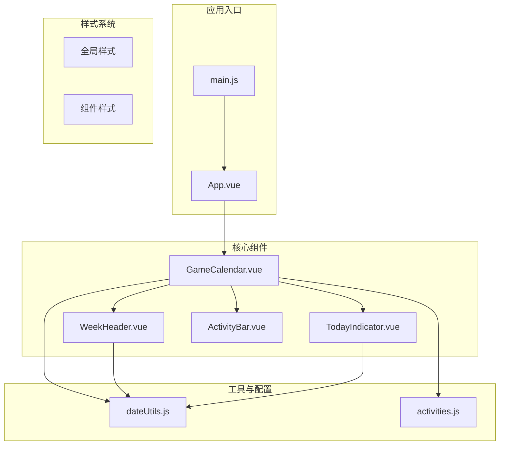
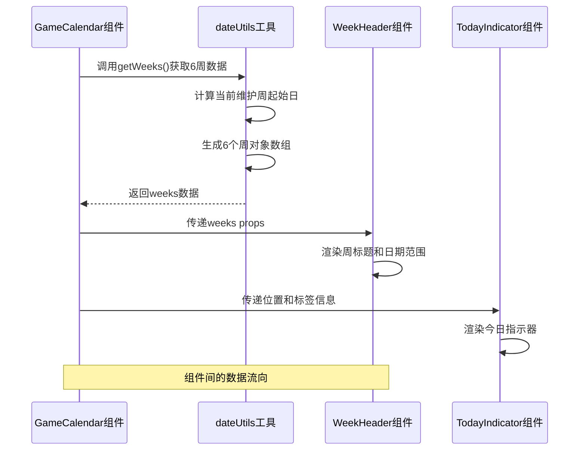
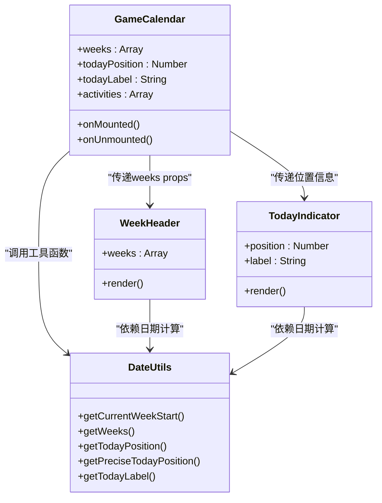
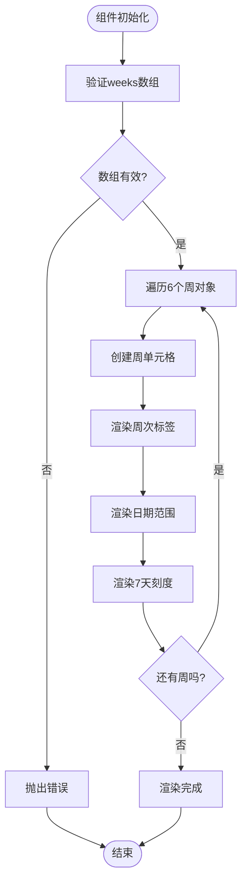
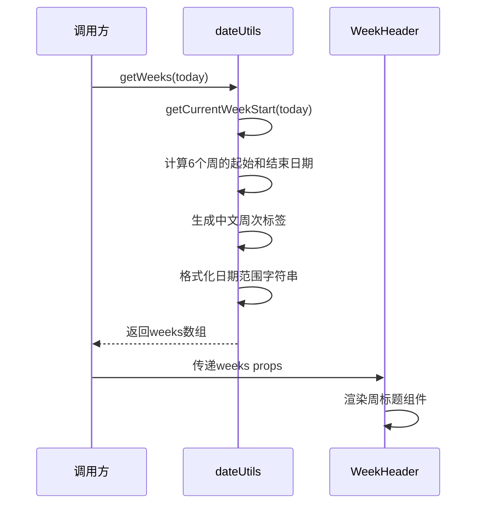
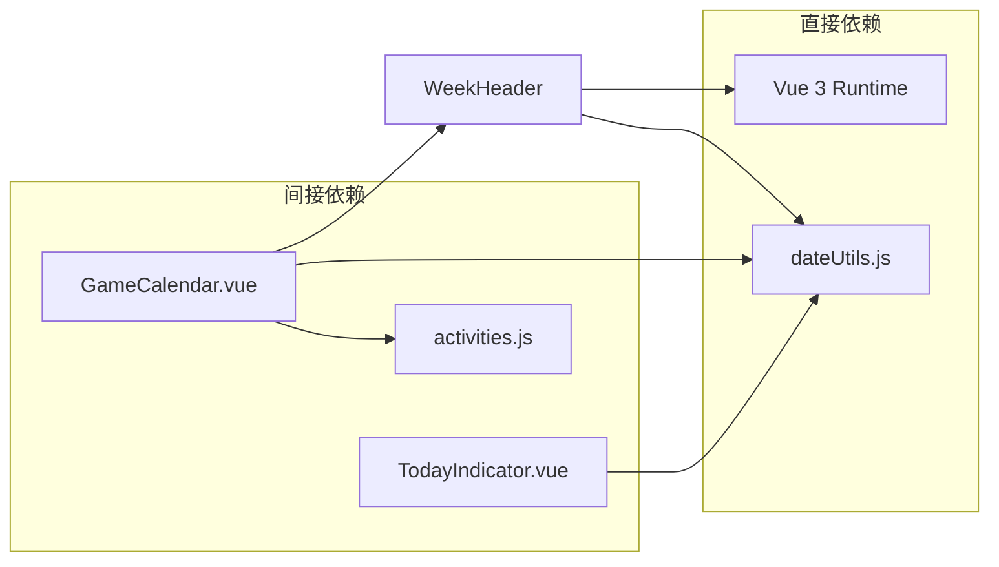

# WeekHeader 周标题组件

<cite>
**本文档引用的文件**
- [WeekHeader.vue](file://src/components/WeekHeader.vue)
- [dateUtils.js](file://src/utils/dateUtils.js)
- [GameCalendar.vue](file://src/components/GameCalendar.vue)
- [TodayIndicator.vue](file://src/components/TodayIndicator.vue)
- [activities.js](file://src/config/activities.js)
- [App.vue](file://src/App.vue)
- [main.js](file://src/main.js)
</cite>

## 更新摘要
**变更内容**
- 更新了样式系统分析，反映了WeekHeader.vue中增强的视觉表现和布局稳定性改进
- 新增了详细的样式设计原则和视觉层次分析
- 更新了组件间的样式协作关系说明
- 增强了响应式布局和布局稳定性的讨论

## 目录
1. [简介](#简介)
2. [项目结构](#项目结构)
3. [核心组件](#核心组件)
4. [架构概览](#架构概览)
5. [详细组件分析](#详细组件分析)
6. [依赖分析](#依赖分析)
7. [性能考虑](#性能考虑)
8. [故障排除指南](#故障排除指南)
9. [结论](#结论)
10. [附录](#附录)

## 简介

WeekHeader 是游戏日历系统中的关键组件，负责显示6周时间轴的周次标签和日期范围。该组件采用Vue 3 Composition API编写，通过props接收weeks参数，渲染每个周的起始日期、结束日期和显示标签。组件设计遵循游戏维护日（周四）为一周起始日的特殊规则，确保与游戏日程保持一致。

该组件不仅承担着视觉展示功能，还通过细小的刻度线为后续的时间轴交互提供基础支持。其简洁的设计风格与整体游戏日历的主题保持一致，采用深色背景和对比色文字，营造出专业的游戏界面氛围。

**更新** 组件的样式系统经过改进，增强了视觉表现力和布局稳定性，采用了更精细的样式控制和更好的响应式适配。

## 项目结构

游戏日历应用采用模块化的组件架构，WeekHeader作为独立的功能组件嵌入到GameCalendar主容器中。整个项目的文件组织清晰，按照功能域进行划分：



**图表来源**
- [main.js:1-5](file://src/main.js#L1-L5)
- [App.vue:1-29](file://src/App.vue#L1-L29)
- [GameCalendar.vue:1-85](file://src/components/GameCalendar.vue#L1-L85)

**章节来源**
- [main.js:1-5](file://src/main.js#L1-L5)
- [App.vue:1-29](file://src/App.vue#L1-L29)
- [GameCalendar.vue:1-85](file://src/components/GameCalendar.vue#L1-L85)

## 核心组件

WeekHeader组件的核心功能围绕以下三个关键方面展开：

### 数据结构设计
组件接收的weeks props参数是一个包含6个对象的数组，每个对象具有以下结构：
- `start`: Date类型，表示周的起始日期（周四）
- `end`: Date类型，表示周的结束日期（周三）
- `label`: string类型，中文周次标签（如"第1周"）
- `range`: string类型，日期范围显示格式（如"01/15-01/21"）

### 渲染机制
组件采用Vue模板语法，通过v-for指令遍历weeks数组，为每个周创建对应的DOM元素。每个周单元格包含三个主要部分：
1. **周次标签**：显示中文周次标识
2. **日期范围**：显示该周的起始和结束日期
3. **刻度线**：7个细小的垂直刻度，代表一周的7天

### 样式系统
**更新** 组件采用改进的scoped样式，确保样式隔离和可维护性，主要样式特性包括：

#### 布局稳定性增强
- **弹性布局**：display: flex确保6个单元格平均分配空间
- **圆角边框**：border-radius: 6px，营造柔和的视觉感受
- **溢出隐藏**：overflow: hidden，防止内容溢出影响布局
- **边框系统**：统一的1px solid #ccc边框，确保视觉一致性

#### 视觉层次优化
- **背景色**：#f0f0f0，提供温和的对比度，改善可读性
- **分割线**：每个单元格右侧1px分割线，突出边界但不过于突兀
- **最后子元素**：使用:last-child伪类移除最后一个单元格的分割线
- **定位系统**：week-ticks使用绝对定位，不影响文档流

#### 文本层级设计
- **周次标签**：13px字体，bold，#333颜色，强调重要信息
- **日期范围**：12px字体，#666颜色，2px顶部边距，创造视觉层次
- **字体选择**：系统默认字体族，确保跨平台兼容性

#### 刻度线系统
- **定位策略**：week-ticks使用absolute定位，left: 0，right: 0，bottom: 0
- **高度控制**：固定6px高度，提供足够的视觉反馈
- **刻度定位**：通过动态left样式计算，确保7个刻度均匀分布
- **刻度样式**：1px宽度，100%高度，#999灰色，提供微妙的视觉提示

**章节来源**
- [WeekHeader.vue:13-20](file://src/components/WeekHeader.vue#L13-L20)
- [WeekHeader.vue:22-66](file://src/components/WeekHeader.vue#L22-L66)

## 架构概览

WeekHeader组件在整个游戏日历系统中扮演着时间轴导航的关键角色。其工作流程涉及多个组件的协同：



**图表来源**
- [GameCalendar.vue:23-38](file://src/components/GameCalendar.vue#L23-L38)
- [dateUtils.js:35-55](file://src/utils/dateUtils.js#L35-L55)
- [WeekHeader.vue:1-11](file://src/components/WeekHeader.vue#L1-L11)

### 组件关系图



**图表来源**
- [GameCalendar.vue:23-38](file://src/components/GameCalendar.vue#L23-L38)
- [WeekHeader.vue:13-19](file://src/components/WeekHeader.vue#L13-L19)
- [TodayIndicator.vue:8-18](file://src/components/TodayIndicator.vue#L8-L18)
- [dateUtils.js:12-94](file://src/utils/dateUtils.js#L12-L94)

**章节来源**
- [GameCalendar.vue:1-85](file://src/components/GameCalendar.vue#L1-L85)
- [dateUtils.js:1-126](file://src/utils/dateUtils.js#L1-L126)

## 详细组件分析

### Props参数详解

WeekHeader组件的weeks属性是其核心输入参数，要求严格的数据结构：

#### 参数结构规范
- **类型**: Array
- **必需性**: true
- **元素类型**: Object
- **元素属性**:
  - `start`: Date实例，必须有效
  - `end`: Date实例，必须有效
  - `label`: string，中文周次标签
  - `range`: string，日期范围格式

#### 数据验证策略
组件通过Vue的类型检查确保传入数据的有效性。对于每个周对象，需要保证：
1. 日期对象的合法性
2. 起始日期早于或等于结束日期
3. 标签字符串的正确格式
4. 日期范围字符串的格式一致性

### 渲染逻辑分析

组件的渲染过程遵循以下步骤：



**图表来源**
- [WeekHeader.vue:3-9](file://src/components/WeekHeader.vue#L3-L9)

### 样式设计原则

**更新** WeekHeader组件的样式设计体现了现代UI设计的最佳实践，经过改进后具有更强的视觉表现力：

#### 布局稳定性设计
- **Flex布局系统**：使用display: flex确保6个单元格平均分配空间，即使在不同屏幕尺寸下也能保持稳定的布局
- **圆角边框系统**：统一的border-radius: 6px，营造柔和的视觉感受，同时避免尖锐边缘影响整体美感
- **溢出控制**：overflow: hidden确保内容不会溢出容器，保持布局的整洁性
- **边框一致性**：1px solid #ccc的边框系统，提供清晰的分隔但不过于突兀

#### 视觉层次结构
- **背景色系统**：#f0f0f0的背景色提供温和的对比度，改善文本可读性
- **边框系统**：统一的#ccc边框颜色，确保视觉一致性
- **分割线优化**：每个单元格右侧1px分割线，突出边界但避免过度分割
- **最后子元素处理**：使用:last-child伪类移除最后一个单元格的分割线，避免重复边框

#### 文本层级设计
- **周次标签**：13px字体，bold，#333颜色，强调重要信息，提供良好的视觉焦点
- **日期范围**：12px字体，#666颜色，2px顶部边距，创造清晰的视觉层次
- **字体选择**：系统默认字体族，确保跨平台兼容性和一致性

#### 响应式布局
**更新** 组件采用改进的flex布局，能够自适应容器宽度变化。每个周单元格使用flex: 1，确保6个单元格平均分布。刻度线系统通过动态left样式计算，确保7个刻度在不同屏幕尺寸下都能均匀分布。

#### 刻度线系统优化
- **定位策略**：week-ticks使用absolute定位，left: 0，right: 0，bottom: 0，不影响文档流
- **高度控制**：固定6px高度，提供足够的视觉反馈但不占用过多空间
- **刻度定位**：通过动态left样式计算，确保7个刻度均匀分布
- **刻度样式**：1px宽度，100%高度，#999灰色，提供微妙的视觉提示

**章节来源**
- [WeekHeader.vue:22-66](file://src/components/WeekHeader.vue#L22-L66)

### 与dateUtils的协作机制

WeekHeader组件与dateUtils工具函数建立了紧密的协作关系：

#### 周次计算流程


**图表来源**
- [dateUtils.js:35-55](file://src/utils/dateUtils.js#L35-L55)
- [GameCalendar.vue:35-38](file://src/components/GameCalendar.vue#L35-L38)

#### 周期计算算法
dateUtils模块实现了基于周四的游戏维护日制度：
1. **当前周确定**: 以包含今天的那一周为准
2. **起始日计算**: 找到最近的上一个周四
3. **连续周生成**: 基于起始日递增7天生成后续周
4. **标签本地化**: 使用中文数字转换周次编号

**章节来源**
- [dateUtils.js:12-29](file://src/utils/dateUtils.js#L12-L29)
- [dateUtils.js:35-55](file://src/utils/dateUtils.js#L35-L55)

### 使用示例与最佳实践

#### 基础使用模式
```javascript
// 在父组件中使用
const weeks = getWeeks(new Date());
<WeekHeader :weeks="weeks" />
```

#### 自定义选项
虽然WeekHeader目前不支持额外的props，但可以通过以下方式实现定制：
1. **样式覆盖**: 通过CSS变量或外部样式类
2. **数据预处理**: 在传递给组件之前修改weeks数组
3. **事件监听**: 通过父组件监听子组件的点击事件

#### 性能优化建议
1. **数据缓存**: 避免重复计算相同的weeks数组
2. **响应式更新**: 使用Vue的响应式系统优化更新频率
3. **懒加载**: 对于大量数据时考虑虚拟滚动

**章节来源**
- [GameCalendar.vue:35-38](file://src/components/GameCalendar.vue#L35-L38)
- [dateUtils.js:35-55](file://src/utils/dateUtils.js#L35-L55)

## 依赖分析

WeekHeader组件的依赖关系相对简单但功能明确：



**图表来源**
- [WeekHeader.vue:13-19](file://src/components/WeekHeader.vue#L13-L19)
- [GameCalendar.vue:25-33](file://src/components/GameCalendar.vue#L25-L33)

### 内部依赖关系

组件内部的依赖关系主要体现在数据流和渲染逻辑上：

1. **props依赖**: 完全依赖weeks数组的结构和内容
2. **工具函数依赖**: 依赖dateUtils提供的日期计算功能
3. **样式依赖**: 依赖Vue的scoped样式系统

### 外部依赖关系

- **Vue框架**: 依赖Vue 3的Composition API和模板系统
- **浏览器环境**: 依赖Date对象和DOM操作能力
- **CSS环境**: 依赖现代CSS特性和浏览器支持

**章节来源**
- [WeekHeader.vue:13-19](file://src/components/WeekHeader.vue#L13-L19)
- [GameCalendar.vue:25-33](file://src/components/GameCalendar.vue#L25-L33)

## 性能考虑

WeekHeader组件在设计时充分考虑了性能优化：

### 渲染性能
- **最小DOM操作**: 使用v-for渲染固定数量的元素
- **键值优化**: 使用索引作为key，避免复杂对象比较
- **样式复用**: 共享样式类，减少CSS解析开销
- **布局稳定性**: 使用flex布局减少重排计算

### 内存管理
- **无状态设计**: 组件本身不维护内部状态
- **props驱动**: 通过外部传入数据，便于垃圾回收
- **生命周期**: 无复杂的生命周期钩子调用

### 更新策略
- **单向数据流**: 依赖父组件传递的响应式数据
- **浅层比较**: 通过数组引用变化触发重新渲染
- **避免不必要的重绘**: 使用flex布局减少重排计算

## 故障排除指南

### 常见问题及解决方案

#### 问题1: weeks数组为空或未定义
**症状**: 组件不显示任何内容
**原因**: 未正确传递weeks props或数据计算失败
**解决方法**: 
1. 确保调用getWeeks()函数并正确传递结果
2. 检查传入的Date对象是否有效
3. 验证weeks数组长度是否为6

#### 问题2: 日期格式显示异常
**症状**: 日期范围显示不符合预期格式
**原因**: 日期对象格式化函数返回值异常
**解决方法**:
1. 检查Date对象的有效性
2. 验证formatDate函数的实现
3. 确认月份和日期的零填充逻辑

#### 问题3: 样式显示问题
**症状**: 组件样式错乱或布局异常
**原因**: CSS作用域冲突或样式优先级问题
**解决方法**:
1. 检查scoped样式的应用范围
2. 验证CSS选择器的优先级
3. 确认父组件样式的继承情况

#### 问题4: 刻度线定位不准确
**症状**: 7个刻度线没有均匀分布
**原因**: left样式计算错误或容器宽度计算问题
**解决方法**:
1. 检查v-for循环中的索引计算
2. 验证容器的宽度计算
3. 确认百分比计算的精度

### 调试技巧

#### 开发者工具使用
1. **Vue DevTools**: 检查props传递和组件状态
2. **网络面板**: 监控组件加载和资源请求
3. **性能面板**: 分析组件渲染性能

#### 日志调试
```javascript
// 在组件中添加调试输出
console.log('Weeks data:', this.weeks);
console.log('Week count:', this.weeks.length);
```

**章节来源**
- [WeekHeader.vue:13-19](file://src/components/WeekHeader.vue#L13-L19)
- [dateUtils.js:116-125](file://src/utils/dateUtils.js#L116-L125)

## 结论

WeekHeader组件作为游戏日历系统的核心导航组件，成功实现了以下目标：

### 设计成就
- **功能完整性**: 准确显示6周时间轴的周次标签和日期范围
- **用户体验**: 提供直观的时间导航和视觉反馈
- **技术实现**: 采用现代Vue 3技术栈，代码结构清晰
- **性能表现**: 优化的渲染策略和内存管理
- **视觉稳定性**: 改进的样式系统，增强了视觉表现和布局稳定性

### 技术亮点
- **领域特定设计**: 基于游戏维护日制度的周次计算
- **数据驱动渲染**: 通过props传递数据，实现高度可配置性
- **样式模块化**: 改进的scoped样式确保组件独立性和可维护性
- **工具函数分离**: 将日期计算逻辑封装在独立模块中
- **响应式布局**: 优化的flex布局系统，确保在不同设备上的稳定表现

### 改进建议
1. **国际化支持**: 添加多语言支持以适应不同地区用户
2. **主题系统**: 实现可配置的主题方案
3. **无障碍访问**: 增强屏幕阅读器支持
4. **动画效果**: 添加平滑的过渡动画提升用户体验
5. **样式系统**: 进一步优化样式系统，提高可定制性

该组件为整个游戏日历系统奠定了坚实的基础，其清晰的架构设计和良好的代码质量为后续功能扩展提供了良好的支撑。

## 附录

### API参考

#### Props接口
| 属性名 | 类型 | 必需 | 描述 |
|--------|------|------|------|
| weeks | Array | 是 | 包含6个周对象的数组 |

#### 周对象结构
| 属性名 | 类型 | 描述 |
|--------|------|------|
| start | Date | 周起始日期（周四） |
| end | Date | 周结束日期（周三） |
| label | string | 中文周次标签 |
| range | string | 日期范围字符串 |

### 使用示例

#### 基础用法
```vue
<template>
  <WeekHeader :weeks="weeks" />
</template>

<script setup>
import { ref } from 'vue'
import { getWeeks } from '../utils/dateUtils.js'

const weeks = ref(getWeeks(new Date()))
</script>
```

#### 高级用法
```vue
<template>
  <div class="calendar-wrapper">
    <WeekHeader 
      :weeks="processedWeeks" 
      @click="handleWeekClick"
    />
  </div>
</template>

<script setup>
import { computed } from 'vue'
import { getWeeks } from '../utils/dateUtils.js'

const originalWeeks = ref(getWeeks(new Date()))
const processedWeeks = computed(() => {
  return originalWeeks.value.map((week, index) => ({
    ...week,
    index: index,
    isActive: index === currentWeekIndex.value
  }))
})
</script>
```