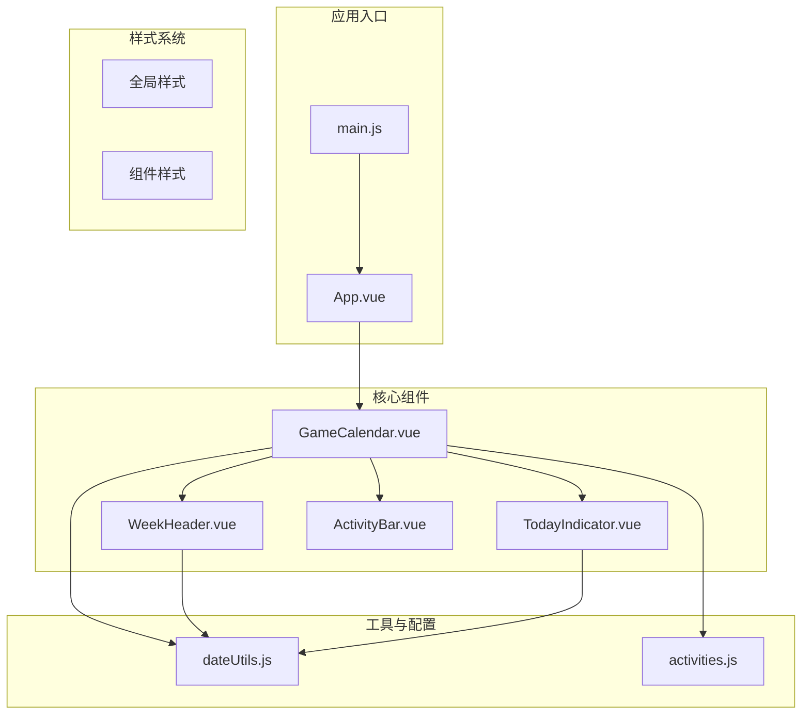
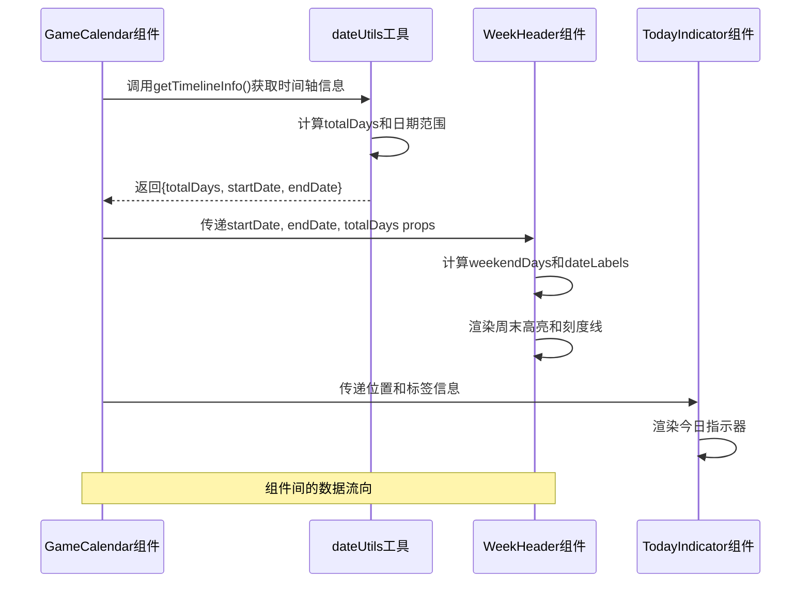
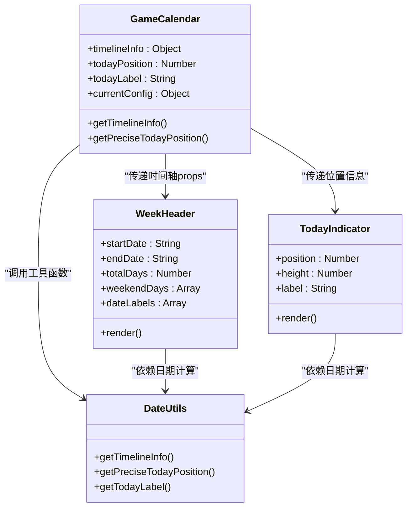
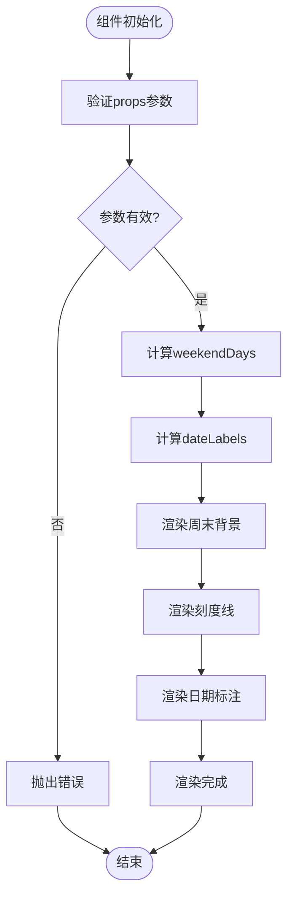
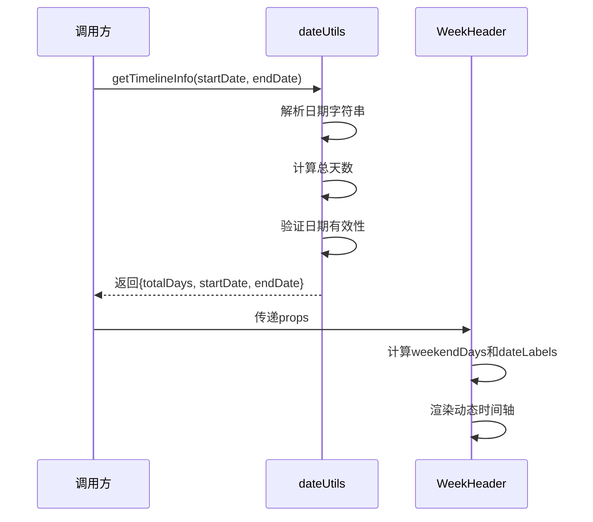
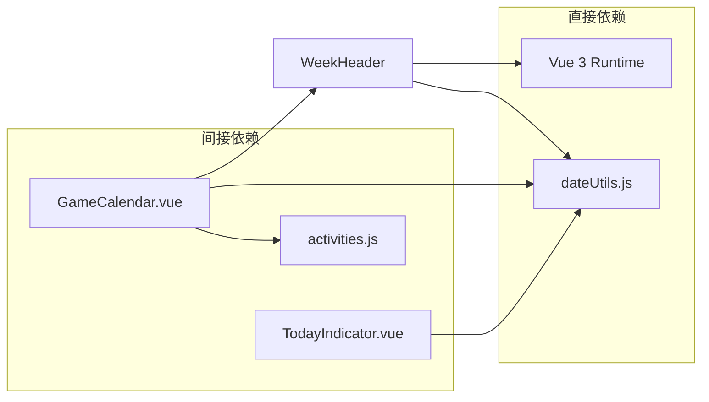

# WeekHeader 周标题组件

<cite>
**本文档引用的文件**
- [WeekHeader.vue](file://src/components/WeekHeader.vue)
- [dateUtils.js](file://src/utils/dateUtils.js)
- [GameCalendar.vue](file://src/components/GameCalendar.vue)
- [TodayIndicator.vue](file://src/components/TodayIndicator.vue)
- [activities.js](file://src/config/activities.js)
- [App.vue](file://src/App.vue)
- [main.js](file://src/main.js)
</cite>

## 更新摘要
**变更内容**
- WeekHeader组件完全重写，从固定周网格变为动态时间轴显示
- 新增周末高亮功能，通过红色背景标识周末
- 支持精确刻度线系统，每天空一个刻度
- 更新了props参数结构，从weeks数组改为startDate、endDate、totalDays
- 增强了响应式布局和动态定位系统
- 重新设计了样式系统，采用更现代化的视觉效果

## 目录
1. [简介](#简介)
2. [项目结构](#项目结构)
3. [核心组件](#核心组件)
4. [架构概览](#架构概览)
5. [详细组件分析](#详细组件分析)
6. [依赖分析](#依赖分析)
7. [性能考虑](#性能考虑)
8. [故障排除指南](#故障排除指南)
9. [结论](#结论)
10. [附录](#附录)

## 简介

WeekHeader 是游戏日历系统中的关键组件，负责显示动态时间轴的日期标签和刻度线。该组件采用Vue 3 Composition API编写，通过props接收startDate、endDate和totalDays参数，渲染整个时间轴的日期标注和刻度线系统。组件设计支持任意时间段的动态显示，不再局限于固定的6周网格，能够根据配置的起始和结束日期自动计算总天数。

该组件的核心创新在于周末高亮功能，通过红色背景标识周六和周日，为用户提供清晰的时间节律提示。同时，组件实现了精确的刻度线系统，每天空一个刻度线，配合日期标注形成完整的时间轴导航系统。

**更新** 组件经过完全重写，从固定周网格转变为动态时间轴显示，支持周末高亮和精确刻度线，显著提升了用户体验和视觉表现。

## 项目结构

游戏日历应用采用模块化的组件架构，WeekHeader作为独立的功能组件嵌入到GameCalendar主容器中。整个项目的文件组织清晰，按照功能域进行划分：



**图表来源**
- [main.js:1-5](file://src/main.js#L1-L5)
- [App.vue:1-29](file://src/App.vue#L1-L29)
- [GameCalendar.vue:1-279](file://src/components/GameCalendar.vue#L1-L279)

**章节来源**
- [main.js:1-5](file://src/main.js#L1-L5)
- [App.vue:1-29](file://src/App.vue#L1-L29)
- [GameCalendar.vue:1-279](file://src/components/GameCalendar.vue#L1-L279)

## 核心组件

WeekHeader组件的核心功能围绕以下三个关键方面展开：

### 数据结构设计
组件接收的props参数是一个包含3个必需参数的对象：
- `startDate`: string类型，ISO格式的起始日期字符串
- `endDate`: string类型，ISO格式的结束日期字符串  
- `totalDays`: number类型，总天数（由dateUtils计算得出）

### 渲染机制
组件采用Vue模板语法，通过computed属性计算两个关键数据集：
1. **周末高亮背景**：通过weekendDays计算数组，为每个周末天生成背景元素
2. **刻度线系统**：通过totalDays-1计算，每天空一个刻度线
3. **日期标注**：每隔7天生成一个日期标注，首尾也标注

### 样式系统
**更新** 组件采用全新的scoped样式，确保样式隔离和现代化视觉效果：

#### 动态布局系统
- **弹性容器**：.timeline-container使用相对定位，高度固定50px
- **绝对定位系统**：所有子元素使用绝对定位，通过left百分比精确控制位置
- **圆角边框**：border-radius: 6px，营造现代化视觉感受
- **边框系统**：1px solid #acacac的边框，提供清晰的容器边界

#### 视觉层次优化
- **背景色**：#acacac的灰色背景，提供中性色调的容器外观
- **周末高亮**：.weekend-bg使用#f11红色，醒目标识周末
- **刻度线系统**：.tick使用1px宽度，#999灰色，提供微妙的视觉提示
- **日期标注**：.date-label使用12px字体，#000黑色，加粗显示

#### 响应式设计
- **百分比定位**：所有元素通过left百分比定位，自适应容器宽度变化
- **动态计算**：通过(totalDays)计算每个元素的精确位置
- **灵活布局**：支持任意时间段的动态显示，无需固定网格

#### 动态定位系统
- **周末背景**：通过weekendDays计算，为每个周末天生成背景元素
- **刻度线定位**：通过(i / totalDays) * 100计算刻度线位置
- **日期标注**：通过(day / totalDays) * 100计算标注位置
- **首尾标注**：自动标注起始和结束日期，确保时间轴完整性

**章节来源**
- [WeekHeader.vue:36-49](file://src/components/WeekHeader.vue#L36-L49)
- [WeekHeader.vue:52-84](file://src/components/WeekHeader.vue#L52-L84)
- [WeekHeader.vue:86-100](file://src/components/WeekHeader.vue#L86-L100)

## 架构概览

WeekHeader组件在整个游戏日历系统中扮演着动态时间轴导航的关键角色。其工作流程涉及多个组件的协同：



**图表来源**
- [GameCalendar.vue:108-110](file://src/components/GameCalendar.vue#L108-L110)
- [dateUtils.js:11-25](file://src/utils/dateUtils.js#L11-L25)
- [WeekHeader.vue:1-31](file://src/components/WeekHeader.vue#L1-L31)

### 组件关系图



**图表来源**
- [GameCalendar.vue:108-121](file://src/components/GameCalendar.vue#L108-L121)
- [WeekHeader.vue:36-49](file://src/components/WeekHeader.vue#L36-L49)
- [TodayIndicator.vue:12-25](file://src/components/TodayIndicator.vue#L12-L25)
- [dateUtils.js:11-74](file://src/utils/dateUtils.js#L11-L74)

**章节来源**
- [GameCalendar.vue:1-279](file://src/components/GameCalendar.vue#L1-L279)
- [dateUtils.js:1-81](file://src/utils/dateUtils.js#L1-L81)

## 详细组件分析

### Props参数详解

WeekHeader组件的props参数是其核心输入参数，要求严格的数据结构：

#### 参数结构规范
- **类型**: Object
- **必需性**: true
- **参数属性**:
  - `startDate`: string，ISO格式日期字符串（如"2026/05/07"）
  - `endDate`: string，ISO格式日期字符串（如"2026/06/17"）
  - `totalDays`: number，总天数（由dateUtils.getTimelineInfo计算）

#### 数据验证策略
组件通过Vue的类型检查确保传入数据的有效性。对于每个参数，需要保证：
1. 日期字符串格式正确且可解析
2. startDate早于或等于endDate
3. totalDays为正整数
4. 日期范围计算逻辑正确

### 渲染逻辑分析

组件的渲染过程遵循以下步骤：



**图表来源**
- [WeekHeader.vue:86-100](file://src/components/WeekHeader.vue#L86-L100)
- [WeekHeader.vue:52-84](file://src/components/WeekHeader.vue#L52-L84)

### 样式设计原则

**更新** WeekHeader组件的样式设计体现了现代UI设计的最佳实践，经过全新设计后具有更强的视觉表现力：

#### 动态布局设计
- **相对定位容器**：.timeline-container使用position: relative，高度固定50px
- **绝对定位系统**：所有子元素使用position: absolute，通过left百分比精确定位
- **圆角边框系统**：统一的border-radius: 6px，营造现代化视觉感受
- **边框一致性**：1px solid #acacac的边框系统，提供清晰的容器边界

#### 视觉层次结构
- **背景色系统**：#acacac的灰色背景，提供中性色调的容器外观
- **周末高亮系统**：.weekend-bg使用#f11红色，醒目标识周末天
- **刻度线系统**：.tick使用1px宽度，#999灰色，提供微妙的视觉提示
- **日期标注系统**：.date-label使用12px字体，#000黑色，加粗显示

#### 响应式布局
**更新** 组件采用全新的百分比定位系统，能够自适应容器宽度变化。所有元素通过left百分比计算，确保在不同屏幕尺寸下都能保持精确的位置关系。

#### 动态定位系统优化
- **百分比计算**：通过(i / totalDays) * 100计算刻度线位置
- **动态宽度**：周末背景通过width百分比计算，自适应时间轴长度
- **精确标注**：日期标注通过(day / totalDays) * 100计算位置
- **首尾标注**：自动处理起始和结束日期的标注逻辑

**章节来源**
- [WeekHeader.vue:103-141](file://src/components/WeekHeader.vue#L103-L141)

### 与dateUtils的协作机制

WeekHeader组件与dateUtils工具函数建立了紧密的协作关系：

#### 时间轴计算流程


**图表来源**
- [dateUtils.js:11-25](file://src/utils/dateUtils.js#L11-L25)
- [GameCalendar.vue:108-110](file://src/components/GameCalendar.vue#L108-L110)

#### 时间轴计算算法
dateUtils模块实现了基于日期范围的动态时间轴计算：
1. **日期解析**：解析ISO格式的startDate和endDate字符串
2. **时间计算**：计算两个日期之间的毫秒差，转换为天数
3. **总天数确定**：加1得到包含起始和结束日期的总天数
4. **精确位置计算**：支持当前时刻在时间轴上的精确比例位置

**章节来源**
- [dateUtils.js:11-25](file://src/utils/dateUtils.js#L11-L25)
- [dateUtils.js:32-54](file://src/utils/dateUtils.js#L32-L54)

### 使用示例与最佳实践

#### 基础使用模式
```javascript
// 在父组件中使用
const timelineInfo = getTimelineInfo("2026/05/07", "2026/06/17");
<WeekHeader 
  :startDate="timelineInfo.startDate"
  :endDate="timelineInfo.endDate" 
  :totalDays="timelineInfo.totalDays"
/>
```

#### 自定义选项
虽然WeekHeader目前不支持额外的props，但可以通过以下方式实现定制：
1. **样式覆盖**：通过CSS变量或外部样式类
2. **数据预处理**：在传递给组件之前修改props对象
3. **事件监听**：通过父组件监听子组件的点击事件

#### 性能优化建议
1. **数据缓存**：避免重复计算相同的时间轴信息
2. **响应式更新**：使用Vue的响应式系统优化更新频率
3. **懒加载**：对于大量数据时考虑虚拟滚动

**章节来源**
- [GameCalendar.vue:108-110](file://src/components/GameCalendar.vue#L108-L110)
- [dateUtils.js:11-25](file://src/utils/dateUtils.js#L11-L25)

## 依赖分析

WeekHeader组件的依赖关系相对简单但功能明确：



**图表来源**
- [WeekHeader.vue:34](file://src/components/WeekHeader.vue#L34)
- [GameCalendar.vue:75](file://src/components/GameCalendar.vue#L75)

### 内部依赖关系

组件内部的依赖关系主要体现在数据流和渲染逻辑上：

1. **props依赖**：完全依赖startDate、endDate、totalDays的结构和内容
2. **工具函数依赖**：依赖dateUtils提供的日期计算功能
3. **样式依赖**：依赖Vue的scoped样式系统

### 外部依赖关系

- **Vue框架**：依赖Vue 3的Composition API和模板系统
- **浏览器环境**：依赖Date对象和DOM操作能力
- **CSS环境**：依赖现代CSS特性和浏览器支持

**章节来源**
- [WeekHeader.vue:34](file://src/components/WeekHeader.vue#L34)
- [GameCalendar.vue:75](file://src/components/GameCalendar.vue#L75)

## 性能考虑

WeekHeader组件在设计时充分考虑了性能优化：

### 渲染性能
- **最小DOM操作**：使用v-for渲染动态数量的元素
- **键值优化**：使用唯一key，避免复杂对象比较
- **样式复用**：共享样式类，减少CSS解析开销
- **定位优化**：使用绝对定位减少布局重排

### 内存管理
- **无状态设计**：组件本身不维护内部状态
- **props驱动**：通过外部传入数据，便于垃圾回收
- **生命周期**：无复杂的生命周期钩子调用

### 更新策略
- **单向数据流**：依赖父组件传递的响应式数据
- **计算属性优化**：使用computed属性缓存计算结果
- **避免不必要的重绘**：通过百分比定位减少重排计算

## 故障排除指南

### 常见问题及解决方案

#### 问题1: props参数为空或未定义
**症状**: 组件不显示任何内容
**原因**: 未正确传递startDate、endDate或totalDays
**解决方法**: 
1. 确保调用getTimelineInfo()函数并正确传递结果
2. 检查传入的日期字符串格式是否正确
3. 验证totalDays是否为正整数

#### 问题2: 日期格式显示异常
**症状**: 日期标注显示不符合预期格式
**原因**: 日期对象格式化函数返回值异常
**解决方法**:
1. 检查Date对象的有效性
2. 验证日期字符串的ISO格式
3. 确认月份和日期的零填充逻辑

#### 问题3: 样式显示问题
**症状**: 组件样式错乱或布局异常
**原因**: CSS作用域冲突或样式优先级问题
**解决方法**:
1. 检查scoped样式的应用范围
2. 验证CSS选择器的优先级
3. 确认父组件样式的继承情况

#### 问题4: 刻度线定位不准确
**症状**: 刻度线和日期标注没有正确对齐
**原因**: 百分比计算错误或容器宽度计算问题
**解决方法**:
1. 检查v-for循环中的索引计算
2. 验证totalDays的计算结果
3. 确认百分比计算的精度

### 调试技巧

#### 开发者工具使用
1. **Vue DevTools**: 检查props传递和组件状态
2. **网络面板**: 监控组件加载和资源请求
3. **性能面板**: 分析组件渲染性能

#### 日志调试
```javascript
// 在组件中添加调试输出
console.log('Props:', this.props);
console.log('Total days:', this.totalDays);
console.log('Weekend days:', this.weekendDays);
```

**章节来源**
- [WeekHeader.vue:36-49](file://src/components/WeekHeader.vue#L36-L49)
- [dateUtils.js:32-54](file://src/utils/dateUtils.js#L32-L54)

## 结论

WeekHeader组件作为游戏日历系统的核心导航组件，成功实现了以下目标：

### 设计成就
- **功能完整性**: 准确显示动态时间轴的日期标注和刻度线
- **用户体验**: 提供直观的时间导航和周末高亮视觉反馈
- **技术实现**: 采用现代Vue 3技术栈，代码结构清晰
- **性能表现**: 优化的渲染策略和内存管理
- **视觉稳定性**: 全新的样式系统，增强了视觉表现和响应式适配

### 技术亮点
- **动态时间轴**: 基于任意日期范围的动态时间轴计算
- **周末高亮系统**: 红色背景醒目标识周末天
- **精确刻度线**: 每天空一个刻度线，提供精确的时间定位
- **百分比定位**: 通过left百分比实现自适应布局
- **工具函数分离**: 将日期计算逻辑封装在独立模块中

### 改进建议
1. **国际化支持**: 添加多语言支持以适应不同地区用户
2. **主题系统**: 实现可配置的主题方案
3. **无障碍访问**: 增强屏幕阅读器支持
4. **动画效果**: 添加平滑的过渡动画提升用户体验
5. **样式系统**: 进一步优化样式系统，提高可定制性

该组件为整个游戏日历系统奠定了坚实的基础，其清晰的架构设计和良好的代码质量为后续功能扩展提供了良好的支撑。

## 附录

### API参考

#### Props接口
| 属性名 | 类型 | 必需 | 描述 |
|--------|------|------|------|
| startDate | string | 是 | ISO格式起始日期字符串 |
| endDate | string | 是 | ISO格式结束日期字符串 |
| totalDays | number | 是 | 总天数（包含起始和结束日期） |

#### 计算属性
| 属性名 | 类型 | 描述 |
|--------|------|------|
| weekendDays | Array | 周末天索引数组 |
| dateLabels | Array | 日期标注数组 |

### 使用示例

#### 基础用法
```vue
<template>
  <WeekHeader 
    :startDate="currentConfig.startDate"
    :endDate="currentConfig.endDate"
    :totalDays="timelineInfo.totalDays"
  />
</template>

<script setup>
import { computed } from 'vue'
import { getTimelineInfo } from '../utils/dateUtils.js'

const timelineInfo = computed(() =>
  getTimelineInfo(currentConfig.value.startDate, currentConfig.value.endDate)
)
</script>
```

#### 高级用法
```vue
<template>
  <div class="calendar-wrapper">
    <WeekHeader 
      :startDate="processedTimeline.startDate" 
      :endDate="processedTimeline.endDate"
      :totalDays="processedTimeline.totalDays"
      @click="handleTimelineClick"
    />
  </div>
</template>

<script setup>
import { computed } from 'vue'
import { getTimelineInfo } from '../utils/dateUtils.js'

const originalTimeline = computed(() =>
  getTimelineInfo(startDate, endDate)
)
const processedTimeline = computed(() => {
  return {
    ...originalTimeline.value,
    startDate: adjustStartDate(originalTimeline.value.startDate),
    endDate: adjustEndDate(originalTimeline.value.endDate)
  }
})
</script>
```