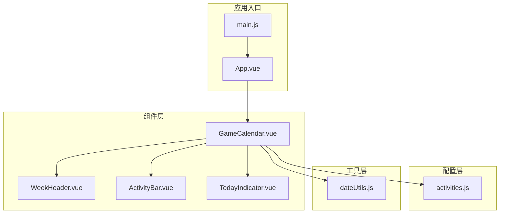
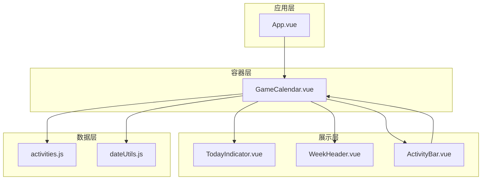
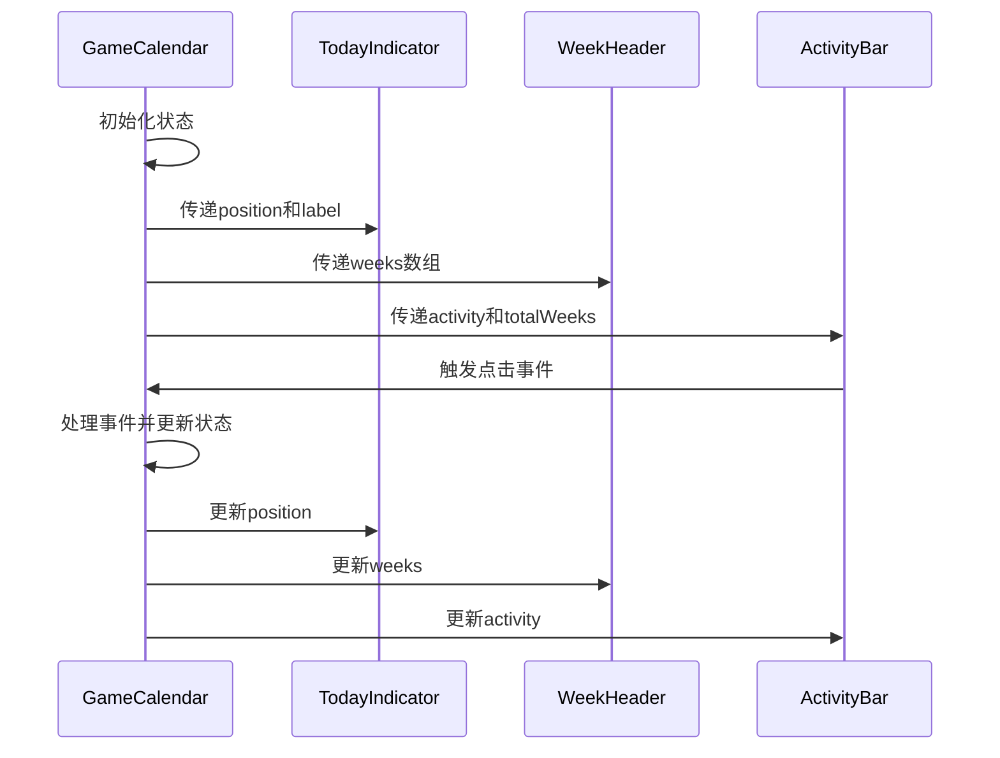
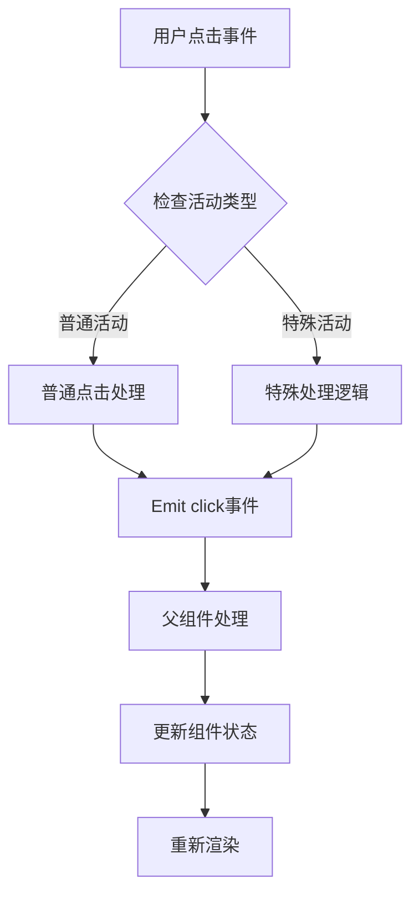
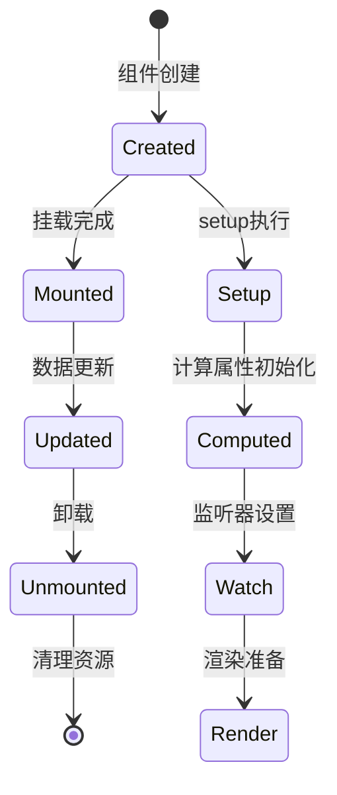
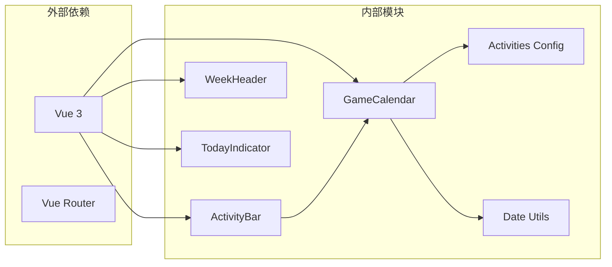
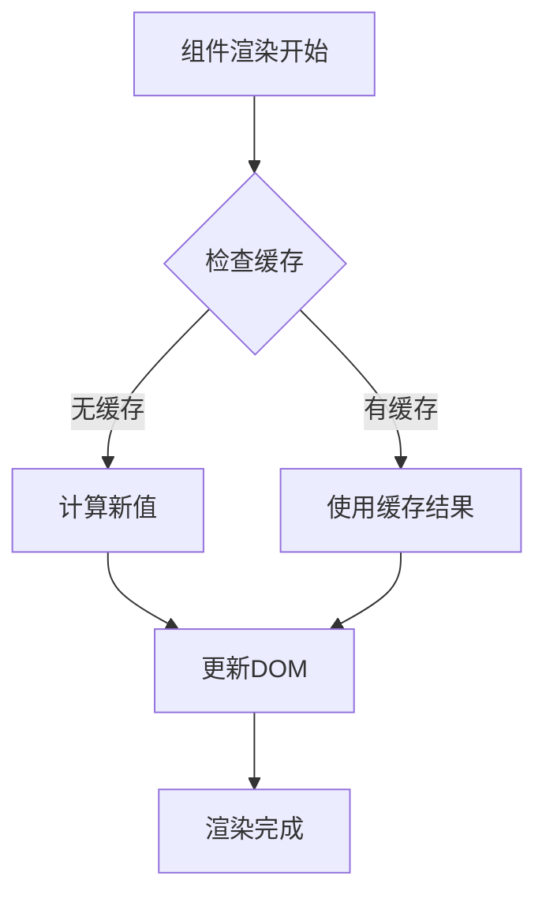

# 核心组件

<cite>
**本文档引用的文件**
- [GameCalendar.vue](file://src/components/GameCalendar.vue)
- [ActivityBar.vue](file://src/components/ActivityBar.vue)
- [WeekHeader.vue](file://src/components/WeekHeader.vue)
- [TodayIndicator.vue](file://src/components/TodayIndicator.vue)
- [activities.js](file://src/config/activities.js)
- [dateUtils.js](file://src/utils/dateUtils.js)
- [App.vue](file://src/App.vue)
- [main.js](file://src/main.js)
</cite>

## 目录
1. [简介](#简介)
2. [项目结构](#项目结构)
3. [核心组件](#核心组件)
4. [架构概览](#架构概览)
5. [详细组件分析](#详细组件分析)
6. [依赖关系分析](#依赖关系分析)
7. [性能考虑](#性能考虑)
8. [故障排除指南](#故障排除指南)
9. [结论](#结论)

## 简介

游戏日历是一个基于Vue 3的响应式日历组件系统，专门用于展示游戏维护周期和活动安排。该系统采用组件化架构设计，通过四个核心组件协同工作：GameCalendar主容器、ActivityBar活动条目、WeekHeader周标题和TodayIndicator今日指示器。系统以游戏维护日（周四）为一周的起始，展示未来6周的时间轴布局，支持多种类型的活动显示和交互功能。

## 项目结构

项目采用模块化的文件组织结构，按照功能域进行分离：

**图表来源**
- [main.js:1-5](file://src/main.js#L1-L5)
- [App.vue:1-29](file://src/App.vue#L1-L29)
- [GameCalendar.vue:1-70](file://src/components/GameCalendar.vue#L1-L70)

**章节来源**
- [main.js:1-5](file://src/main.js#L1-L5)
- [App.vue:1-29](file://src/App.vue#L1-L29)
- [GameCalendar.vue:1-70](file://src/components/GameCalendar.vue#L1-L70)

## 核心组件

### GameCalendar主容器组件

GameCalendar是整个日历系统的核心容器组件，负责协调其他子组件的工作。它承担以下主要职责：

- **状态管理**：维护当前日期、周数列表、今日位置和标签等状态
- **数据协调**：从配置文件和工具函数中获取活动数据和日期计算结果
- **组件编排**：控制TodayIndicator、WeekHeader和ActivityBar的渲染顺序和参数传递
- **样式管理**：提供整体的视觉样式和布局控制

组件采用组合式API（Composition API）模式，使用ref和computed进行响应式状态管理。通过导入的工具函数实现日期计算逻辑，确保界面与数据的一致性。

**章节来源**
- [GameCalendar.vue:23-39](file://src/components/GameCalendar.vue#L23-L39)
- [GameCalendar.vue:10-18](file://src/components/GameCalendar.vue#L10-L18)

### ActivityBar活动条目组件

ActivityBar负责渲染单个活动条目，具有以下特性：

- **动态定位**：根据活动的起始和结束周数计算在时间轴上的位置
- **类型化样式**：支持红色、橙色、灰色三种类型，每种类型有不同的视觉表现
- **图标系统**：可选的美元符号、角色图标和右侧操作按钮
- **响应式布局**：使用Flexbox实现自适应的内部布局

组件通过计算属性barStyle动态生成CSS样式，确保活动条目能够准确反映其在6周时间轴中的位置和宽度。

**章节来源**
- [ActivityBar.vue:24-49](file://src/components/ActivityBar.vue#L24-L49)
- [ActivityBar.vue:118-127](file://src/components/ActivityBar.vue#L118-L127)

### WeekHeader周标题组件

WeekHeader组件负责显示顶部的周标题栏，提供清晰的时间参考：

- **等宽布局**：每个周单元格占据相等的空间
- **双行信息**：显示周次标签和具体日期范围
- **简洁设计**：采用浅色背景和边框分隔线

组件通过v-for指令动态渲染6个周单元格，每个单元格包含周标签和日期范围信息。

**章节来源**
- [WeekHeader.vue:1-17](file://src/components/WeekHeader.vue#L1-L17)
- [WeekHeader.vue:28-37](file://src/components/WeekHeader.vue#L28-L37)

### TodayIndicator今日指示器组件

TodayIndicator组件是系统的核心交互元素，负责突出显示当前日期：

- **绝对定位**：使用position: absolute实现精确的位置控制
- **动态位置**：根据getTodayPosition计算的结果调整left偏移
- **视觉强调**：红色标签和垂直指示线形成醒目的视觉效果
- **文本格式化**：显示完整的日期和星期信息

组件采用transform: translateX(-50%)实现水平居中对齐，确保指示器准确指向当前日期。

**章节来源**
- [TodayIndicator.vue:1-19](file://src/components/TodayIndicator.vue#L1-L19)
- [TodayIndicator.vue:22-31](file://src/components/TodayIndicator.vue#L22-L31)

## 架构概览

系统采用自上而下的组件层次结构，通过props向下传递数据，通过事件向上通信：

**图表来源**
- [App.vue:1-7](file://src/App.vue#L1-L7)
- [GameCalendar.vue:25-33](file://src/components/GameCalendar.vue#L25-L33)
- [ActivityBar.vue:24-36](file://src/components/ActivityBar.vue#L24-L36)

## 详细组件分析

### 组件间通信机制

系统采用单向数据流的组件通信模式：

1. **父传子通信**：GameCalendar通过props向子组件传递必要的数据
2. **子传父通信**：ActivityBar组件通过事件向父组件传递用户交互信息
3. **配置共享**：活动配置通过独立的配置文件提供给GameCalendar

**图表来源**
- [GameCalendar.vue:5-18](file://src/components/GameCalendar.vue#L5-L18)
- [ActivityBar.vue:24-36](file://src/components/ActivityBar.vue#L24-L36)

### Props接口定义

#### GameCalendar组件Props
- `weeks`: Array - 周数信息数组，包含起始日期、结束日期、标签和范围
- `todayPosition`: Number - 今日在时间轴上的相对位置（0-1）
- `todayLabel`: String - 今日的显示文本

#### ActivityBar组件Props
- `activity`: Object - 活动配置对象，包含id、name、startWeek、endWeek、type等属性
- `totalWeeks`: Number - 总周数，默认值为6

#### WeekHeader组件Props
- `weeks`: Array - 周数信息数组

#### TodayIndicator组件Props
- `position`: Number - 指示器的相对位置（0-1）
- `label`: String - 显示文本

**章节来源**
- [GameCalendar.vue:35-38](file://src/components/GameCalendar.vue#L35-L38)
- [ActivityBar.vue:27-36](file://src/components/ActivityBar.vue#L27-L36)
- [WeekHeader.vue:11-16](file://src/components/WeekHeader.vue#L11-L16)
- [TodayIndicator.vue:9-18](file://src/components/TodayIndicator.vue#L9-L18)

### 事件处理机制

ActivityBar组件实现了基础的事件处理功能：

**图表来源**
- [ActivityBar.vue:24-36](file://src/components/ActivityBar.vue#L24-L36)

### 生命周期管理

组件采用Vue 3的组合式API生命周期：

**图表来源**
- [GameCalendar.vue:23-39](file://src/components/GameCalendar.vue#L23-L39)
- [ActivityBar.vue:24-49](file://src/components/ActivityBar.vue#L24-L49)

### 状态管理策略

系统采用集中式状态管理模式：

1. **局部状态**：GameCalendar维护当前日期、周数和今日信息
2. **计算属性**：ActivityBar使用computed属性优化渲染性能
3. **响应式更新**：通过Vue的响应式系统自动触发UI更新

**章节来源**
- [GameCalendar.vue:35-38](file://src/components/GameCalendar.vue#L35-L38)
- [ActivityBar.vue:38-49](file://src/components/ActivityBar.vue#L38-L49)

## 依赖关系分析

系统依赖关系呈现清晰的层次结构：

**图表来源**
- [GameCalendar.vue:25-33](file://src/components/GameCalendar.vue#L25-L33)
- [ActivityBar.vue:24-26](file://src/components/ActivityBar.vue#L24-L26)

**章节来源**
- [GameCalendar.vue:25-33](file://src/components/GameCalendar.vue#L25-L33)
- [ActivityBar.vue:24-26](file://src/components/ActivityBar.vue#L24-L26)

## 性能考虑

### 渲染优化策略

1. **计算属性缓存**：ActivityBar使用computed属性缓存barStyle计算结果
2. **条件渲染**：使用v-if控制可选元素的渲染，减少DOM节点数量
3. **样式复用**：通过类名切换实现样式变化，避免频繁的内联样式计算

### 内存管理

1. **组件卸载**：确保组件在不需要时正确卸载，释放内存资源
2. **事件清理**：及时移除事件监听器，防止内存泄漏
3. **定时器管理**：如果添加定时器功能，需要在组件卸载时清除

### 渲染性能优化

**图表来源**
- [ActivityBar.vue:38-49](file://src/components/ActivityBar.vue#L38-L49)

## 故障排除指南

### 常见问题及解决方案

1. **日期计算错误**
   - 检查getCurrentWeekStart函数的日期计算逻辑
   - 验证getTodayPosition的边界条件处理

2. **组件渲染异常**
   - 确认props的数据类型和必需字段
   - 检查v-for的key值唯一性

3. **样式显示问题**
   - 验证CSS变量和类名的正确性
   - 检查scoped样式的作用域

**章节来源**
- [dateUtils.js:12-29](file://src/utils/dateUtils.js#L12-L29)
- [dateUtils.js:60-71](file://src/utils/dateUtils.js#L60-L71)

### 调试技巧

1. **使用Vue DevTools**：监控组件状态和props变化
2. **添加console.log**：在关键函数中输出调试信息
3. **单元测试**：为关键函数编写测试用例

## 结论

游戏日历的核心组件系统展现了良好的模块化设计和组件化架构。通过明确的职责分工、清晰的组件通信机制和合理的性能优化策略，系统实现了功能完整且易于维护的日历展示功能。

主要优势包括：
- **模块化设计**：每个组件职责单一，便于维护和测试
- **响应式架构**：充分利用Vue 3的响应式系统
- **性能优化**：通过计算属性和条件渲染提升渲染效率
- **扩展性强**：清晰的接口设计便于功能扩展

建议的改进方向：
- 添加更多的用户交互功能
- 实现更丰富的动画效果
- 增强移动端适配能力
- 完善错误处理和边界情况