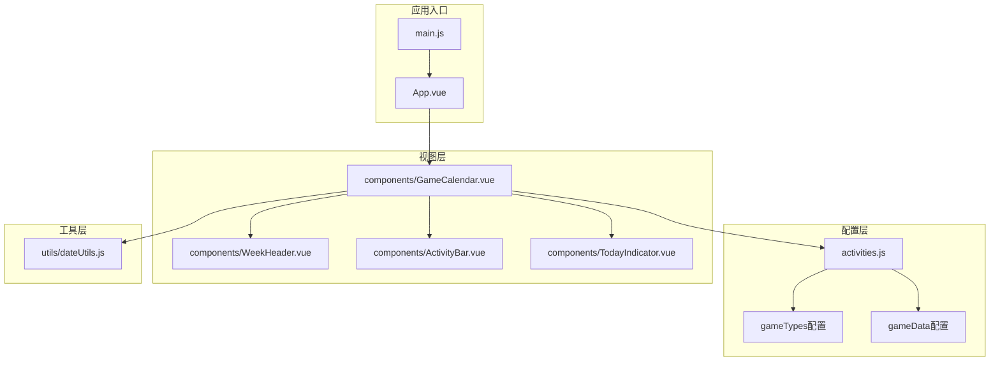
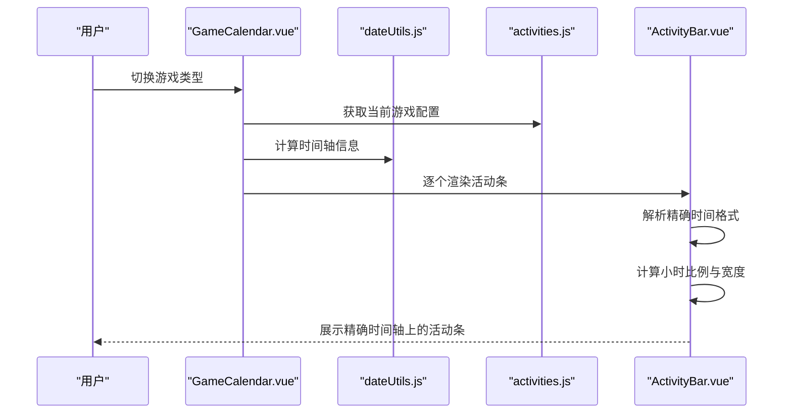
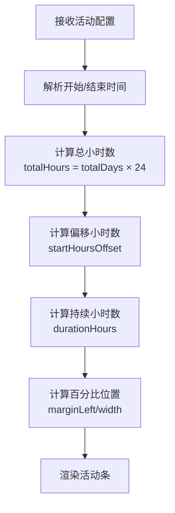
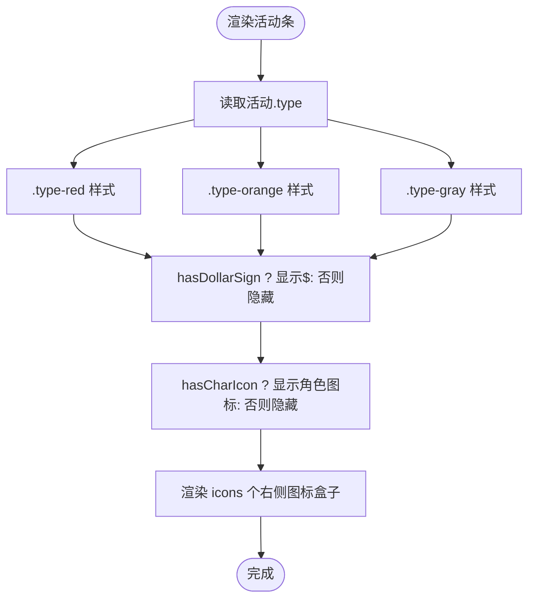
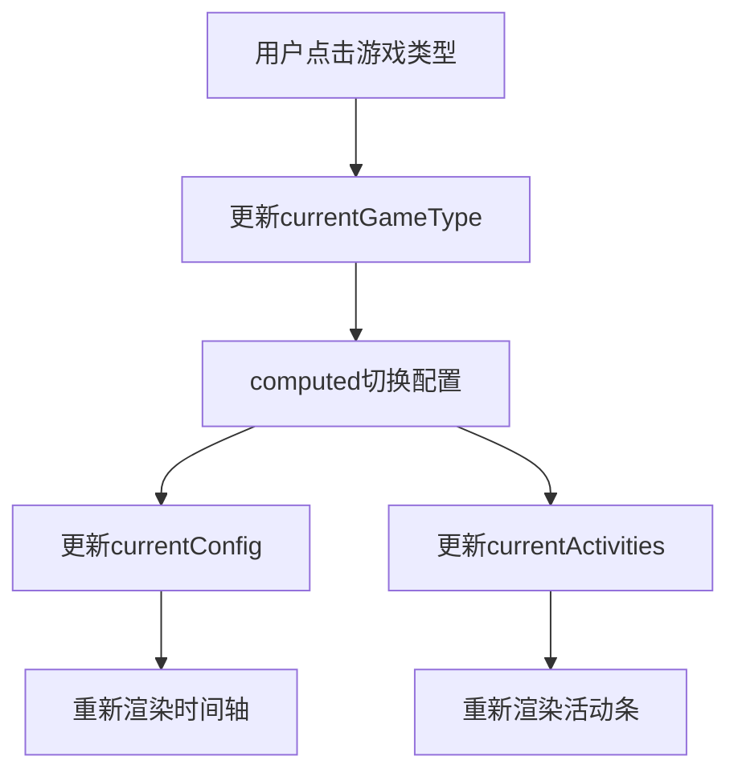
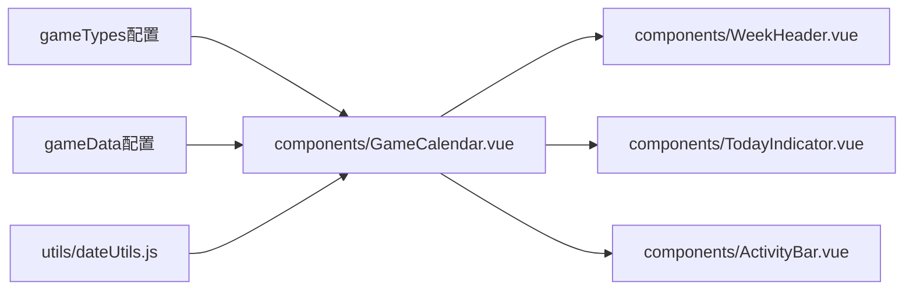

# 配置系统

<cite>
**本文引用的文件**
- [activities.js](file://src/config/activities.js)
- [GameCalendar.vue](file://src/components/GameCalendar.vue)
- [ActivityBar.vue](file://src/components/ActivityBar.vue)
- [dateUtils.js](file://src/utils/dateUtils.js)
- [WeekHeader.vue](file://src/components/WeekHeader.vue)
- [TodayIndicator.vue](file://src/components/TodayIndicator.vue)
- [App.vue](file://src/App.vue)
- [main.js](file://src/main.js)
- [vite.config.js](file://vite.config.js)
</cite>

## 更新摘要
**变更内容**
- activities.js重构：从周系统改为精确的开始/结束时间格式，支持多游戏类型配置结构
- 新增多游戏类型支持：gameTypes和gameData配置结构
- 时间精度提升：从周精度改为小时精度的时间计算
- 配置验证规则更新：支持更严格的时间格式验证

## 目录
1. [简介](#简介)
2. [项目结构](#项目结构)
3. [核心组件](#核心组件)
4. [架构总览](#架构总览)
5. [详细组件分析](#详细组件分析)
6. [依赖分析](#依赖分析)
7. [性能考虑](#性能考虑)
8. [故障排查指南](#故障排查指南)
9. [结论](#结论)
10. [附录](#附录)

## 简介
本文件面向"活动配置系统"，聚焦于重构后的activities.js配置文件结构与数据模型。系统现已从传统的周系统升级为精确的开始/结束时间格式，支持多游戏类型配置结构，能够灵活管理不同游戏的活动日历。活动对象的关键字段包括name、startTime、endTime、type等，支持角色图标URL配置和多种视觉装饰选项。

**更新** 本版本反映了activities.js的重大重构，从周系统改为精确时间格式，支持多游戏类型配置，提升了配置的精确性和灵活性。

## 项目结构
该工程采用 Vue 3 单页应用结构，围绕"多游戏类型配置驱动"的方式组织代码：配置集中在src/config下，视图组件位于src/components，通用工具位于src/utils。入口文件负责挂载根组件，构建工具使用Vite。

**图表来源**
- [main.js:1-5](file://src/main.js#L1-L5)
- [App.vue:1-29](file://src/App.vue#L1-L29)
- [GameCalendar.vue:1-279](file://src/components/GameCalendar.vue#L1-L279)
- [WeekHeader.vue:1-142](file://src/components/WeekHeader.vue#L1-L142)
- [ActivityBar.vue:1-288](file://src/components/ActivityBar.vue#L1-L288)
- [TodayIndicator.vue:1-59](file://src/components/TodayIndicator.vue#L1-L59)
- [dateUtils.js:1-81](file://src/utils/dateUtils.js#L1-L81)
- [activities.js:1-110](file://src/config/activities.js#L1-L110)

**章节来源**
- [main.js:1-5](file://src/main.js#L1-L5)
- [App.vue:1-29](file://src/App.vue#L1-L29)
- [GameCalendar.vue:1-279](file://src/components/GameCalendar.vue#L1-L279)
- [vite.config.js:1-8](file://vite.config.js#L1-L8)

## 核心组件
- 配置文件activities.js：重构为多游戏类型配置结构，包含gameTypes游戏类型列表和gameData各游戏类型的活动配置，支持精确的开始/结束时间格式。
- 视图组件：
  - GameCalendar.vue：支持游戏类型切换，聚合周表头、今日指示器与活动条，负责装配配置与日期工具。
  - ActivityBar.vue：渲染单个活动条，依据活动类型应用样式，依据精确时间计算宽度与偏移。
  - WeekHeader.vue：渲染日期轴与周末背景，支持多游戏类型的时间轴显示。
  - TodayIndicator.vue：根据精确位置参数绘制今日指示线与标签。
- 工具模块dateUtils.js：提供时间轴信息计算、精确今日位置计算、日期标签生成等能力。

**章节来源**
- [activities.js:1-110](file://src/config/activities.js#L1-L110)
- [GameCalendar.vue:1-279](file://src/components/GameCalendar.vue#L1-L279)
- [ActivityBar.vue:1-288](file://src/components/ActivityBar.vue#L1-L288)
- [WeekHeader.vue:1-142](file://src/components/WeekHeader.vue#L1-L142)
- [TodayIndicator.vue:1-59](file://src/components/TodayIndicator.vue#L1-L59)
- [dateUtils.js:1-81](file://src/utils/dateUtils.js#L1-L81)

## 架构总览
活动配置系统遵循"多游戏类型配置驱动 + 组件渲染"的分层架构：
- 配置层：activities.js定义游戏类型和各游戏的活动配置，作为唯一事实来源。
- 渲染层：GameCalendar.vue聚合视图，WeekHeader.vue与TodayIndicator.vue提供时间上下文；ActivityBar.vue将活动配置映射为可视元素。
- 工具层：dateUtils.js提供精确的日期与时间轴计算，确保UI与游戏维护周期对齐。

**图表来源**
- [GameCalendar.vue:76-87](file://src/components/GameCalendar.vue#L76-L87)
- [dateUtils.js:11-54](file://src/utils/dateUtils.js#L11-L54)
- [activities.js:1-110](file://src/config/activities.js#L1-L110)
- [ActivityBar.vue:68-102](file://src/components/ActivityBar.vue#L68-L102)

## 详细组件分析

### 多游戏类型配置结构与数据模型
重构后的配置系统采用多游戏类型结构：

**游戏类型配置（gameTypes）**
- key：游戏标识符（如"zzz"、"mc"）
- name：游戏名称（如"绝区零"、"鸣潮"）
- bgImage：游戏背景图片URL

**游戏数据配置（gameData）**
- calendarConfig：游戏日历配置
  - startDate：日历开始日期（格式："YYYY/MM/DD"）
  - endDate：日历结束日期（格式："YYYY/MM/DD"）
- activities：活动数组，每个活动包含：
  - name：活动名称
  - startTime：活动开始时间（格式："YYYY-MM-DD HH"）
  - endTime：活动结束时间（格式："YYYY-MM-DD HH"）
  - type：活动类型（red/orange/gray）
  - icons：右侧图标数量
  - hasDollarSign：是否显示美元符号标记
  - hasCharIcon：是否显示角色图标
  - charIconLeft：左侧角色图片URL
  - charIconRight：右侧角色图片URL

**章节来源**
- [activities.js:1-110](file://src/config/activities.js#L1-L110)

### 精确时间格式与布局计算
- 时间格式规范：
  - startDate/endDate：YYYY/MM/DD格式
  - startTime/endTime：YYYY-MM-DD HH格式（24小时制）
  - 示例：startTime: "2026-05-07 10" 表示2026年5月7日上午10点
- 布局计算精度：
  - totalHours = totalDays × 24
  - startHoursOffset = (活动开始时间 - 日历开始时间) / (1000×60×60)
  - durationHours = (活动结束时间 - 活动开始时间) / (1000×60×60)
  - marginLeft = (startHoursOffset / totalHours) × 100%
  - width = (durationHours / totalHours) × 100%
- 时间轴计算：
  - getTimelineInfo：计算总天数和日期范围
  - getPreciseTodayPosition：计算精确的今日位置比例（含小时精度）

**图表来源**
- [ActivityBar.vue:68-102](file://src/components/ActivityBar.vue#L68-L102)
- [dateUtils.js:11-54](file://src/utils/dateUtils.js#L11-L54)

**章节来源**
- [ActivityBar.vue:1-288](file://src/components/ActivityBar.vue#L1-L288)
- [dateUtils.js:1-81](file://src/utils/dateUtils.js#L1-L81)

### 活动类型分类与颜色编码规则
- 类型与样式映射：
  - type="red" → 应用 .type-red 样式（渐变橙红色背景与阴影）
  - type="orange" → 应用 .type-orange 样式（浅橙色背景）
  - type="gray" → 应用 .type-gray 样式（灰白渐变背景与阴影）
- 文字可读性：所有类型均使用深色文字，确保在各种背景下的可读性
- 图标与装饰：
  - hasDollarSign=true 时显示美元符号标记
  - hasCharIcon=true 时显示角色图标容器
  - icons 决定右侧图标盒子数量
  - 支持自定义角色图片渲染

**图表来源**
- [ActivityBar.vue:118-132](file://src/components/ActivityBar.vue#L118-L132)
- [ActivityBar.vue:4-27](file://src/components/ActivityBar.vue#L4-L27)

**章节来源**
- [ActivityBar.vue:1-288](file://src/components/ActivityBar.vue#L1-L288)

### 游戏类型切换与多配置管理
- 游戏类型切换：
  - GameCalendar.vue提供游戏类型切换按钮
  - currentGameType响应式状态管理当前选中游戏
  - currentConfig和currentActivities自动切换到对应游戏配置
- 配置隔离：
  - 每个游戏类型拥有独立的日历配置和活动列表
  - 支持不同游戏的活动时间完全独立
- 红色活动特殊处理：
  - red类型活动在同一行显示，支持时间接续处理
  - 自动修复相邻red活动的时间重叠问题

**图表来源**
- [GameCalendar.vue:4-18](file://src/components/GameCalendar.vue#L4-L18)
- [GameCalendar.vue:78-105](file://src/components/GameCalendar.vue#L78-L105)

**章节来源**
- [GameCalendar.vue:1-279](file://src/components/GameCalendar.vue#L1-L279)

### 新增活动类型与扩展配置选项指南
- 新增游戏类型步骤
  1) 在gameTypes中添加新的游戏类型对象，设置key、name、bgImage
  2) 在gameData中为新游戏类型添加calendarConfig和activities配置
  3) 确保活动时间格式符合"YYYY-MM-DD HH"规范
  4) 如需调整样式，可在ActivityBar.vue中添加对应类型样式
- 扩展配置选项建议
  - 可引入更多布尔开关（如hasBadge、hasTimer）以支持徽章或倒计时提示
  - 可增加枚举字段（如difficulty）以支持难度分级与差异化样式
  - 可引入外部资源字段（如iconUrl）以支持动态图标加载
  - 支持自定义角色图片URL配置
- 注意事项
  - 新增游戏类型必须在gameTypes中注册，否则无法切换
  - 新增类型必须与样式类名保持一致，避免样式缺失
  - 新增字段需同步更新渲染逻辑与默认值处理
  - 时间格式必须严格遵循YYYY-MM-DD HH规范

**章节来源**
- [activities.js:1-110](file://src/config/activities.js#L1-L110)
- [GameCalendar.vue:76-87](file://src/components/GameCalendar.vue#L76-L87)

### 修改活动配置与业务逻辑调整
- 修改活动时间范围：调整startTime与endTime，即可改变活动条在精确时间轴上的位置与长度
- 修改活动外观：通过type切换颜色主题，或通过hasDollarSign/hasCharIcon控制装饰元素
- 动态控制显示：通过icons数量控制右侧图标的密度
- 自定义角色图标：通过charIconLeft和charIconRight设置角色图片URL
- 游戏类型切换：通过游戏类型按钮在不同游戏的活动日历间切换
- 业务逻辑灵活性：通过仅修改配置文件即可快速调整活动展示策略，无需改动组件代码

**章节来源**
- [activities.js:1-110](file://src/config/activities.js#L1-L110)
- [GameCalendar.vue:1-279](file://src/components/GameCalendar.vue#L1-L279)

### 配置验证规则与错误处理机制
- 验证规则（基于重构后的实现）
  - 时间格式：startTime和endTime必须符合"YYYY-MM-DD HH"格式
  - 日期范围：startDate必须早于endDate，且在合理范围内
  - 类型验证：type必须为已知类型字符串（red/orange/gray）
  - 图片URL：charIconLeft和charIconRight必须为有效的图片URL
  - 游戏类型：必须在gameTypes中注册，且在gameData中有对应配置
- 错误处理建议
  - 运行期：若时间格式不正确，parseTime函数会返回Invalid Date，应在组件中进行验证
  - 渲染期：若时间计算出现NaN，应在barStyle计算属性中进行边界检查
  - 图片加载：自定义角色图片URL无效时，组件会回退到默认样式
  - 游戏类型：未注册的游戏类型会导致currentConfig为undefined，应在组件中进行保护
  - 构建期：可通过ESLint规则在提交前校验配置格式与字段完整性

**章节来源**
- [ActivityBar.vue:68-102](file://src/components/ActivityBar.vue#L68-L102)
- [activities.js:1-110](file://src/config/activities.js#L1-L110)

## 依赖分析
- 模块依赖
  - GameCalendar.vue依赖activities.js（导入gameTypes和gameData）、dateUtils.js（计算时间轴信息）
  - ActivityBar.vue依赖活动对象的字段进行渲染与样式绑定
  - WeekHeader.vue依赖日期范围数据进行时间轴显示
  - TodayIndicator.vue依赖精确位置比例进行定位
- 外部依赖
  - Vue 3与Vite构建工具链，通过vite.config.js配置插件

**图表来源**
- [GameCalendar.vue:76-87](file://src/components/GameCalendar.vue#L76-L87)
- [dateUtils.js:11-54](file://src/utils/dateUtils.js#L11-L54)
- [activities.js:1-110](file://src/config/activities.js#L1-L110)

**章节来源**
- [GameCalendar.vue:1-279](file://src/components/GameCalendar.vue#L1-L279)
- [vite.config.js:1-8](file://vite.config.js#L1-L8)

## 性能考虑
- 渲染优化
  - 使用v-for渲染活动条时，确保每个活动对象具有稳定id，减少重排成本
  - 将布局计算逻辑置于计算属性中，避免重复计算
  - 红色活动在同一行显示，减少DOM节点数量
- 时间计算优化
  - 使用精确的小时级计算，避免周精度带来的舍入误差
  - 缓存时间轴信息，避免重复计算
- 样式与资源
  - 类型样式采用CSS渐变，注意在低端设备上的渲染开销
  - 图标为纯CSS实现，性能开销较低；如引入外部图片，需考虑缓存与懒加载
  - 游戏背景图片采用CSS背景，支持浏览器缓存
- 数据规模
  - 多游戏类型配置支持按需加载，减少不必要的数据传输
  - 活动数量增长时，建议按类型分组渲染，提高渲染效率

## 故障排查指南
- 症状：活动条位置异常或溢出
  - 排查：确认startTime和endTime格式是否正确，检查时间计算逻辑
  - 参考：parseTime函数和barStyle计算属性
- 症状：游戏类型切换无效
  - 排查：确认gameTypes中是否存在对应key，检查currentGameType状态更新
  - 参考：游戏类型切换按钮和computed配置
- 症状：文字颜色不可读
  - 排查：检查type是否为有效类型，所有类型均使用深色文字
- 症状：美元符号或角色图标未显示
  - 排查：确认hasDollarSign/hasCharIcon是否为true；检查对应DOM是否被条件渲染
- 症状：今日指示线位置不正确
  - 排查：确认getPreciseTodayPosition返回值在0~1之间，检查时间轴计算
- 症状：自定义角色图片不显示
  - 排查：确认图片URL有效且可访问，检查网络连接和跨域设置
  - 排查：确认图片格式受支持，检查图片尺寸和大小限制

**章节来源**
- [ActivityBar.vue:68-102](file://src/components/ActivityBar.vue#L68-L102)
- [GameCalendar.vue:76-105](file://src/components/GameCalendar.vue#L76-L105)
- [dateUtils.js:32-54](file://src/utils/dateUtils.js#L32-L54)

## 结论
通过将活动配置重构为多游戏类型结构并采用精确的时间格式，系统实现了更高精度和更强灵活性的活动管理能力。开发者可以为不同游戏维护独立的日历和活动配置，支持精确到小时的时间控制。这种设计使得配置系统更加贴近实际业务需求，同时保持了良好的可维护性和扩展性。建议在团队内建立配置校验与变更流程，确保配置质量和一致性。

## 附录
- 快速操作清单
  - 新增游戏类型：在gameTypes中添加对象，在gameData中添加对应配置
  - 新增活动：在对应游戏的activities数组中添加活动对象
  - 修改活动：调整startTime/endTime/type/icons/hasDollarSign/hasCharIcon
  - 自定义角色图标：设置charIconLeft和charIconRight字段为有效图片URL
  - 扩展配置：增加布尔开关或枚举字段，同步更新渲染与样式
- 参考路径
  - 多游戏配置：[activities.js:1-110](file://src/config/activities.js#L1-L110)
  - 活动条渲染：[ActivityBar.vue:1-288](file://src/components/ActivityBar.vue#L1-L288)
  - 时间轴计算：[dateUtils.js:11-54](file://src/utils/dateUtils.js#L11-L54)
  - 游戏类型切换：[GameCalendar.vue:4-18](file://src/components/GameCalendar.vue#L4-L18)