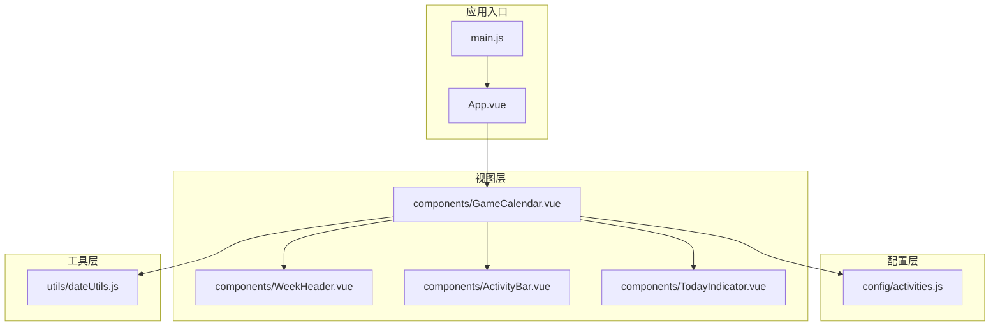
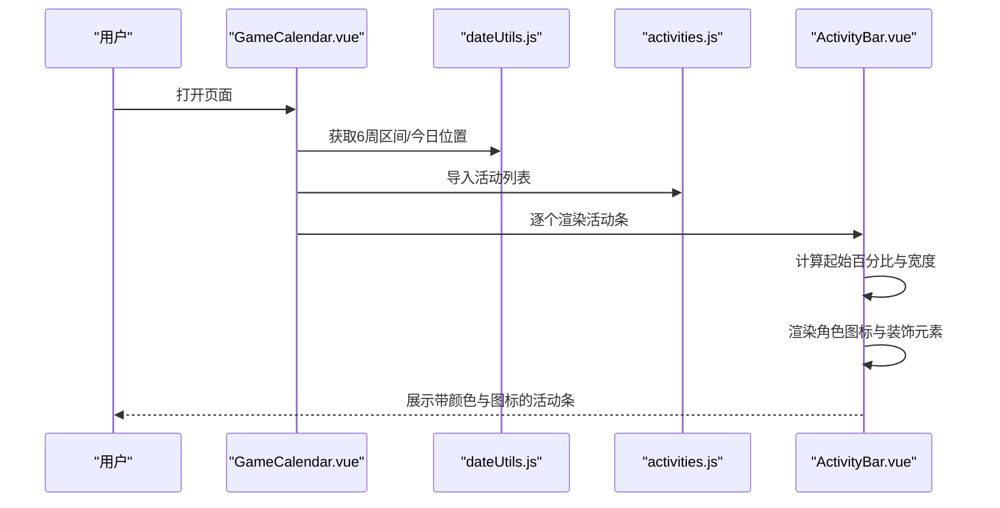
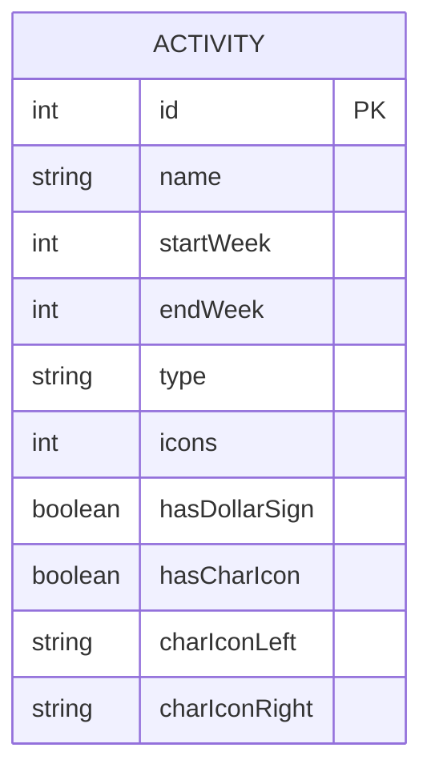
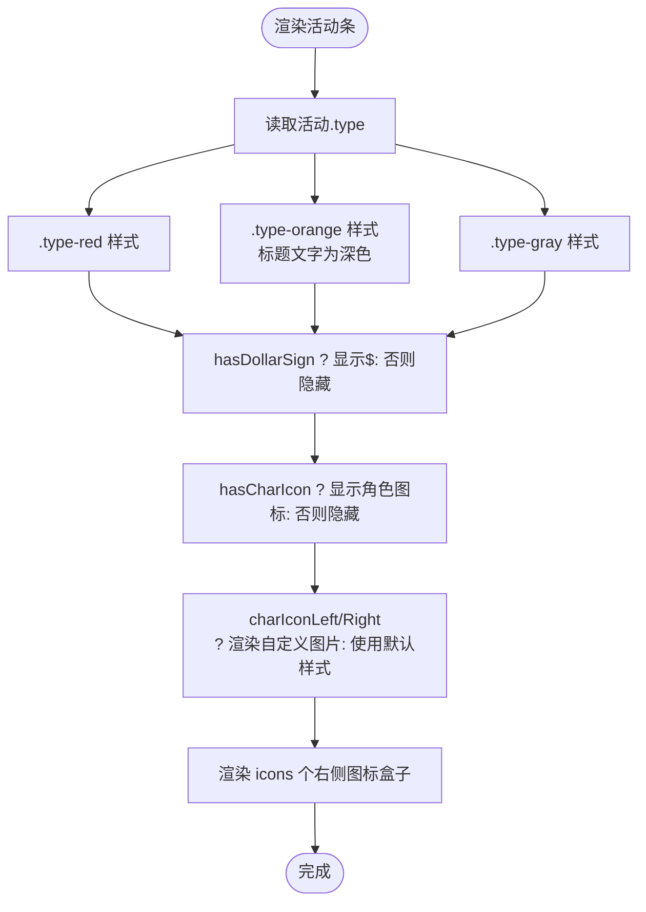
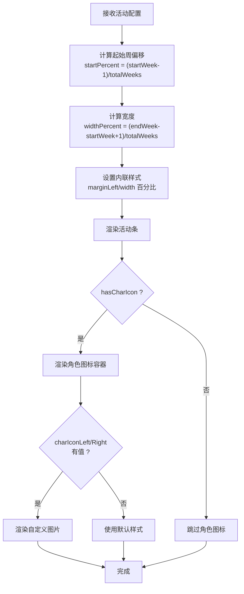
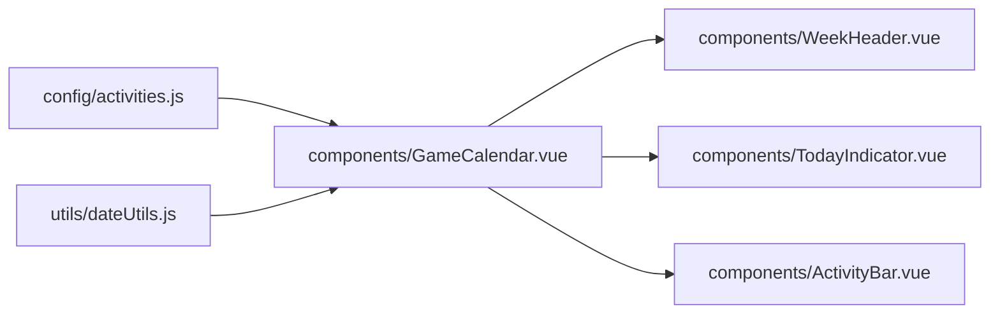

# 配置系统

<cite>
**本文引用的文件**
- [activities.js](file://src/config/activities.js)
- [GameCalendar.vue](file://src/components/GameCalendar.vue)
- [ActivityBar.vue](file://src/components/ActivityBar.vue)
- [dateUtils.js](file://src/utils/dateUtils.js)
- [WeekHeader.vue](file://src/components/WeekHeader.vue)
- [TodayIndicator.vue](file://src/components/TodayIndicator.vue)
- [App.vue](file://src/App.vue)
- [main.js](file://src/main.js)
- [vite.config.js](file://vite.config.js)
</cite>

## 更新摘要
**变更内容**
- 更新了活动配置数据模型，新增了角色图标URL字段（charIconLeft、charIconRight）
- 扩展了活动配置的视觉属性支持
- 增强了配置文件的完整性和功能性描述
- 更新了活动条渲染组件以支持新的图标配置

## 目录
1. [简介](#简介)
2. [项目结构](#项目结构)
3. [核心组件](#核心组件)
4. [架构总览](#架构总览)
5. [详细组件分析](#详细组件分析)
6. [依赖分析](#依赖分析)
7. [性能考虑](#性能考虑)
8. [故障排查指南](#故障排查指南)
9. [结论](#结论)
10. [附录](#附录)

## 简介
本文件面向"活动配置系统"，聚焦于配置文件 activities.js 的结构与数据模型，解释活动对象的关键字段（如 id、name、startWeek、endWeek、type 等），并基于现有实现梳理活动类型的分类体系与颜色编码规则。同时提供新增活动类型、修改活动配置与扩展配置选项的操作指南，并总结配置验证与错误处理的实践建议，帮助通过配置文件灵活调整业务逻辑。

**更新** 本版本反映了activities.js中新增的角色图标URL配置字段，增强了活动配置的视觉表现能力。

## 项目结构
该工程采用 Vue 3 单页应用结构，围绕"配置驱动"的方式组织代码：配置集中在 src/config 下，视图组件位于 src/components，通用工具位于 src/utils。入口文件负责挂载根组件，构建工具使用 Vite。

**图表来源**
- [main.js:1-5](file://src/main.js#L1-L5)
- [App.vue:1-29](file://src/App.vue#L1-L29)
- [GameCalendar.vue:1-148](file://src/components/GameCalendar.vue#L1-L148)
- [WeekHeader.vue:1-76](file://src/components/WeekHeader.vue#L1-L76)
- [ActivityBar.vue:1-255](file://src/components/ActivityBar.vue#L1-L255)
- [TodayIndicator.vue:1-56](file://src/components/TodayIndicator.vue#L1-L56)
- [dateUtils.js:1-127](file://src/utils/dateUtils.js#L1-L127)
- [activities.js:1-57](file://src/config/activities.js#L1-L57)

**章节来源**
- [main.js:1-5](file://src/main.js#L1-L5)
- [App.vue:1-29](file://src/App.vue#L1-L29)
- [GameCalendar.vue:1-148](file://src/components/GameCalendar.vue#L1-L148)
- [vite.config.js:1-8](file://vite.config.js#L1-L8)

## 核心组件
- 配置文件 activities.js：集中管理所有活动条目的配置，包含活动 ID、名称、起止周、类型、图标数量以及是否显示美元符号与角色图标等布尔开关，**新增** 支持角色图标URL配置。
- 视图组件：
  - GameCalendar.vue：聚合周表头、今日指示器与活动条，负责装配配置与日期工具。
  - ActivityBar.vue：渲染单个活动条，依据活动类型应用样式，依据 startWeek/endWeek 计算宽度与偏移，**新增** 支持角色图标渲染。
  - WeekHeader.vue：渲染 6 周的周标签与日期范围。
  - TodayIndicator.vue：根据位置参数绘制今日指示线与标签。
- 工具模块 dateUtils.js：提供当前维护周期起始日、6 周区间计算、今日位置比例与标签生成等能力。

**章节来源**
- [activities.js:1-57](file://src/config/activities.js#L1-L57)
- [GameCalendar.vue:1-148](file://src/components/GameCalendar.vue#L1-L148)
- [ActivityBar.vue:1-255](file://src/components/ActivityBar.vue#L1-L255)
- [WeekHeader.vue:1-76](file://src/components/WeekHeader.vue#L1-L76)
- [TodayIndicator.vue:1-56](file://src/components/TodayIndicator.vue#L1-L56)
- [dateUtils.js:1-127](file://src/utils/dateUtils.js#L1-L127)

## 架构总览
活动配置系统遵循"配置驱动 + 组件渲染"的分层架构：
- 配置层：activities.js 定义活动集合，作为唯一事实来源，**包含完整的活动配置数据结构**。
- 渲染层：GameCalendar.vue 聚合视图，WeekHeader.vue 与 TodayIndicator.vue 提供时间上下文；ActivityBar.vue 将活动配置映射为可视元素。
- 工具层：dateUtils.js 提供日期与周区间计算，确保 UI 与游戏维护周期对齐。

**图表来源**
- [GameCalendar.vue:34-39](file://src/components/GameCalendar.vue#L34-L39)
- [dateUtils.js:35-95](file://src/utils/dateUtils.js#L35-L95)
- [activities.js:1-57](file://src/config/activities.js#L1-L57)
- [ActivityBar.vue:56-67](file://src/components/ActivityBar.vue#L56-L67)

## 详细组件分析

### 活动配置数据模型与字段定义
活动对象由以下字段构成：
- id：活动唯一标识，用于列表渲染的 key 与内部识别。
- name：活动名称，用于展示。
- startWeek：活动开始周（从 1 开始计）。
- endWeek：活动结束周（包含该周）。
- type：活动类型，决定样式类别（如 red、orange、gray）。
- icons：右侧图标数量，用于渲染若干个等宽矩形图标。
- hasDollarSign：是否显示美元符号标记。
- hasCharIcon：是否显示左侧角色图标。
- **新增** charIconLeft：左侧角色图片URL，支持自定义角色图标。
- **新增** charIconRight：右侧角色图片URL，支持自定义角色图标。

字段约束与关系：
- startWeek 与 endWeek 必须满足 1 ≤ startWeek ≤ endWeek ≤ 总周数（当前固定为 6）。
- type 必须与组件样式类名一致（如 type="red" 对应 .type-red）。
- hasDollarSign 与 hasCharIcon 控制 UI 元素的显隐。
- **新增** charIconLeft 和 charIconRight 为空字符串时使用默认样式，非空时渲染自定义图片。

**图表来源**
- [activities.js:2-56](file://src/config/activities.js#L2-L56)

**章节来源**
- [activities.js:1-57](file://src/config/activities.js#L1-L57)

### 活动类型分类与颜色编码规则
- 类型与样式映射：
  - type="red" → 应用 .type-red 样式（渐变橙红色背景与阴影）。
  - type="orange" → 应用 .type-orange 样式（浅橙色背景，标题文字为深色以保证可读性）。
  - type="gray" → 应用 .type-gray 样式（灰白渐变背景与阴影）。
- 文字可读性：当 type 为 orange 时，标题文字颜色调整为深色并去除阴影，确保对比度。
- 图标与装饰：
  - hasDollarSign=true 时显示美元符号标记。
  - hasCharIcon=true 时显示左侧角色图标容器。
  - icons 决定右侧图标盒子数量。
  - **新增** charIconLeft 和 charIconRight 支持自定义角色图片渲染。

**图表来源**
- [ActivityBar.vue:2-39](file://src/components/ActivityBar.vue#L2-L39)
- [ActivityBar.vue:10-27](file://src/components/ActivityBar.vue#L10-L27)
- [ActivityBar.vue:173-195](file://src/components/ActivityBar.vue#L173-L195)
- [ActivityBar.vue:214-229](file://src/components/ActivityBar.vue#L214-L229)

**章节来源**
- [ActivityBar.vue:1-255](file://src/components/ActivityBar.vue#L1-L255)

### 活动条渲染与布局计算
- 布局计算：
  - marginLeft = ((startWeek - 1)/totalWeeks) × 100%
  - width = (((endWeek - startWeek + 1)/totalWeeks) × 100%
  - totalWeeks 默认为 6，可通过属性传入。
- 周区间与今日指示：
  - GameCalendar.vue 通过 dateUtils.js 计算 6 周区间与今日位置，传递给子组件。
  - TodayIndicator.vue 根据 position 百分比定位指示线。
- **新增** 角色图标渲染：
  - 当 hasCharIcon 为 true 时，渲染左右两侧的角色图标容器。
  - charIconLeft 和 charIconRight 支持自定义图片URL，为空时使用默认样式。

**图表来源**
- [ActivityBar.vue:56-67](file://src/components/ActivityBar.vue#L56-L67)
- [GameCalendar.vue:42-44](file://src/components/GameCalendar.vue#L42-L44)
- [dateUtils.js:35-95](file://src/utils/dateUtils.js#L35-L95)

**章节来源**
- [ActivityBar.vue:1-255](file://src/components/ActivityBar.vue#L1-L255)
- [GameCalendar.vue:1-148](file://src/components/GameCalendar.vue#L1-L148)
- [dateUtils.js:1-127](file://src/utils/dateUtils.js#L1-L127)

### 新增活动类型与扩展配置选项指南
- 新增活动类型步骤
  1) 在 activities.js 中添加新的活动对象，设置 id、name、startWeek、endWeek、type、icons、hasDollarSign、hasCharIcon。
  2) 在 ActivityBar.vue 的样式中为新类型补充对应的类选择器与颜色值，确保视觉一致性。
  3) 如需调整布局或交互，可在组件中增加条件渲染或样式变量。
- 扩展配置选项建议
  - 可引入更多布尔开关（如 hasBadge、hasTimer）以支持徽章或倒计时提示。
  - 可增加枚举字段（如 difficulty）以支持难度分级与差异化样式。
  - 可引入外部资源字段（如 iconUrl）以支持动态图标加载。
  - **新增** 可使用 charIconLeft 和 charIconRight 字段支持自定义角色图片。
- 注意事项
  - 新增类型必须与样式类名保持一致，避免样式缺失导致不可读。
  - 新增字段需同步更新渲染逻辑与默认值处理，防止空值影响布局。
  - **新增** 自定义图片URL需要有效的网络路径或本地资源路径。

**章节来源**
- [activities.js:1-57](file://src/config/activities.js#L1-L57)
- [ActivityBar.vue:10-27](file://src/components/ActivityBar.vue#L10-L27)

### 修改活动配置与业务逻辑调整
- 修改活动时间范围：调整 startWeek 与 endWeek，即可改变活动条在时间轴上的位置与长度。
- 修改活动外观：通过 type 切换颜色主题，或通过 hasDollarSign/hasCharIcon 控制装饰元素。
- 动态控制显示：通过 icons 数量控制右侧图标的密度，便于区分不同活动强度或重要程度。
- **新增** 自定义角色图标：通过 charIconLeft 和 charIconRight 设置角色图片URL，实现个性化的视觉效果。
- 业务逻辑灵活性：通过仅修改配置文件即可快速调整活动展示策略，无需改动组件代码，降低耦合并提升迭代效率。

**章节来源**
- [activities.js:1-57](file://src/config/activities.js#L1-L57)
- [ActivityBar.vue:1-255](file://src/components/ActivityBar.vue#L1-L255)

### 配置验证规则与错误处理机制
- 验证规则（基于现有实现的约束）
  - startWeek 与 endWeek：必须为整数且满足 1 ≤ startWeek ≤ endWeek ≤ 6。
  - type：必须为已知类型字符串（red/orange/gray），否则样式类不匹配。
  - icons：建议为非负整数，超出合理范围可能影响布局美观。
  - hasDollarSign/hasCharIcon：布尔值，控制元素显隐。
  - **新增** charIconLeft/charIconRight：字符串类型，为空时使用默认样式，非空时需要有效的图片URL。
- 错误处理建议
  - 运行期：若 type 未匹配任何样式类，可能导致文字不可读或背景异常，应在样式层统一兜底。
  - 渲染期：若 startWeek 或 endWeek 越界，可能导致宽度或偏移异常，应在导入后进行边界校验与告警。
  - **新增** 图片加载：自定义角色图片URL无效时，组件会回退到默认样式，确保界面稳定性。
  - 构建期：可通过 ESLint/自定义脚本在提交前校验配置格式与字段完整性。
  - 用户反馈：对于越界或非法配置，可在开发环境抛出警告，在生产环境降级为默认值并记录日志。

**章节来源**
- [ActivityBar.vue:10-27](file://src/components/ActivityBar.vue#L10-L27)
- [ActivityBar.vue:56-67](file://src/components/ActivityBar.vue#L56-L67)
- [activities.js:1-57](file://src/config/activities.js#L1-L57)

## 依赖分析
- 模块依赖
  - GameCalendar.vue 依赖 activities.js（导入活动列表）、dateUtils.js（计算周区间与今日位置）。
  - ActivityBar.vue 依赖活动对象的字段进行渲染与样式绑定，**新增** 支持角色图标渲染。
  - WeekHeader.vue 依赖周区间数据进行周标签与日期范围展示。
  - TodayIndicator.vue 依赖今日位置比例进行定位。
- 外部依赖
  - Vue 3 与 Vite 构建工具链，通过 vite.config.js 配置插件。

**图表来源**
- [GameCalendar.vue:34-39](file://src/components/GameCalendar.vue#L34-L39)
- [dateUtils.js:35-95](file://src/utils/dateUtils.js#L35-L95)
- [activities.js:1-57](file://src/config/activities.js#L1-L57)

**章节来源**
- [GameCalendar.vue:1-148](file://src/components/GameCalendar.vue#L1-L148)
- [vite.config.js:1-8](file://vite.config.js#L1-L8)

## 性能考虑
- 渲染优化
  - 使用 v-for 渲染活动条时，确保每个活动对象具有稳定 id，减少重排成本。
  - 将布局计算逻辑置于计算属性中，避免重复计算。
  - **新增** 角色图片采用懒加载策略，只有在需要时才渲染自定义图片。
- 样式与资源
  - 类型样式采用 CSS 渐变与阴影，注意在低端设备上的渲染开销。
  - 图标为纯 CSS 实现，性能开销较低；如引入外部图片，需考虑缓存与懒加载。
  - **新增** 自定义角色图片需要合理的缓存策略，避免频繁请求。
- 数据规模
  - 当活动数量增长时，建议按周或类型分组渲染，或启用虚拟滚动（如后续需要）。
  - **新增** 大量自定义图片时，建议使用CDN加速和图片压缩。

## 故障排查指南
- 症状：活动条位置异常或溢出
  - 排查：确认 startWeek 与 endWeek 是否越界（1~6），以及 totalWeeks 参数是否正确传入。
  - 参考：布局计算逻辑与周区间生成。
- 症状：文字颜色不可读
  - 排查：检查 type 是否为 orange，此时标题文字应为深色；若使用了未知类型，需补充对应样式。
- 症状：美元符号或角色图标未显示
  - 排查：确认 hasDollarSign/hasCharIcon 是否为 true；检查对应 DOM 是否被条件渲染。
  - **新增** 角色图标问题：检查 charIconLeft 和 charIconRight 是否为有效URL，确认图片资源可访问。
- 症状：今日指示线位置不正确
  - 排查：确认 getTodayPosition 返回值在 0~1 之间，且 TodayIndicator.vue 的 left 样式为百分比。
- **新增** 症状：自定义角色图片不显示
  - 排查：确认图片URL有效且可访问，检查网络连接和跨域设置。
  - 排查：确认图片格式受支持（PNG、JPG、WebP等），检查图片尺寸和大小限制。

**章节来源**
- [ActivityBar.vue:56-67](file://src/components/ActivityBar.vue#L56-L67)
- [ActivityBar.vue:173-195](file://src/components/ActivityBar.vue#L173-L195)
- [dateUtils.js:61-95](file://src/utils/dateUtils.js#L61-L95)
- [GameCalendar.vue:42-44](file://src/components/GameCalendar.vue#L42-L44)

## 结论
通过将活动配置集中于 activities.js 并以组件渲染为核心，系统实现了"配置即逻辑"的灵活架构。开发者仅需维护配置文件即可完成活动展示策略的调整，配合明确的颜色与布局规则，能够快速响应业务变化。**新增的角色图标URL支持进一步增强了配置系统的表达能力，使得活动展示更加个性化和丰富。** 建议在团队内建立配置校验与变更流程，确保配置质量与一致性。

## 附录
- 快速操作清单
  - 新增活动：在 activities.js 添加对象，补充对应样式类，必要时扩展渲染逻辑。
  - 修改活动：调整 startWeek/endWeek/type/icons/hasDollarSign/hasCharIcon。
  - **新增** 自定义角色图标：设置 charIconLeft 和 charIconRight 字段为有效图片URL。
  - 扩展配置：增加布尔开关或枚举字段，同步更新渲染与样式。
- 参考路径
  - 活动配置：[activities.js:1-57](file://src/config/activities.js#L1-L57)
  - 活动条渲染：[ActivityBar.vue:1-255](file://src/components/ActivityBar.vue#L1-L255)
  - 周区间与今日位置：[dateUtils.js:35-95](file://src/utils/dateUtils.js#L35-L95)
  - 页面装配：[GameCalendar.vue:34-39](file://src/components/GameCalendar.vue#L34-L39)