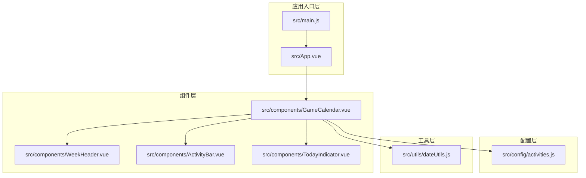
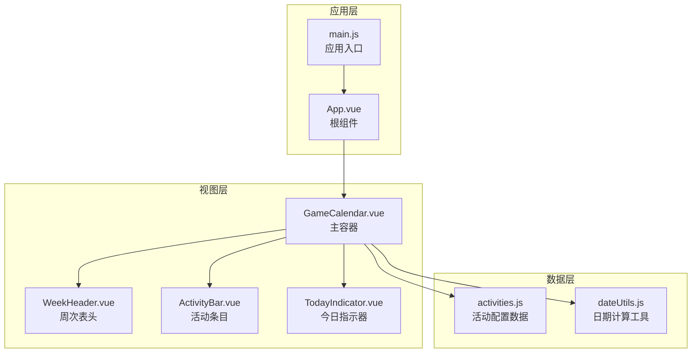
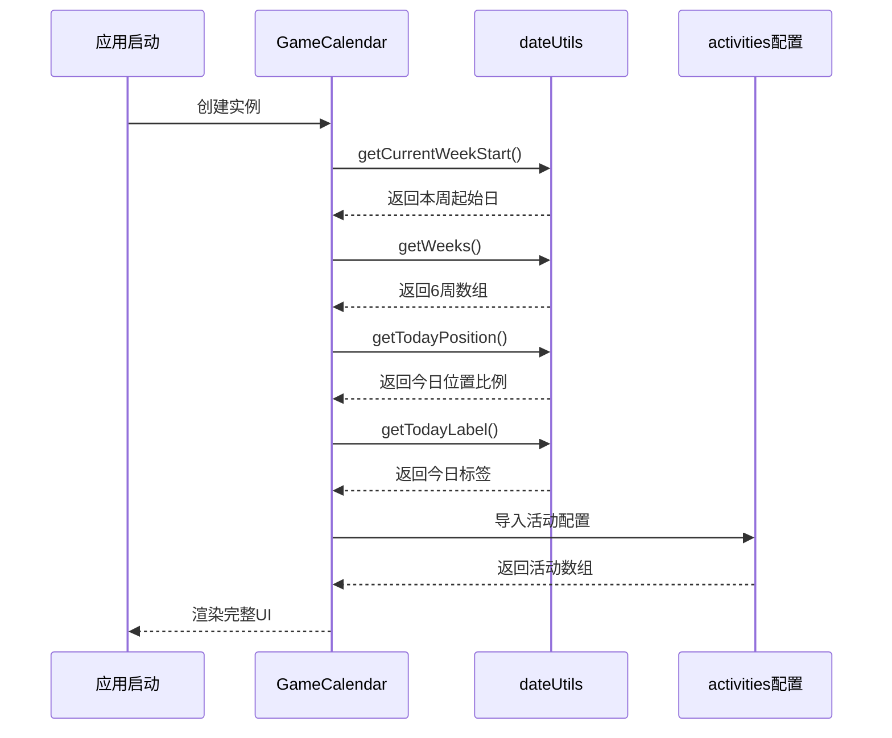
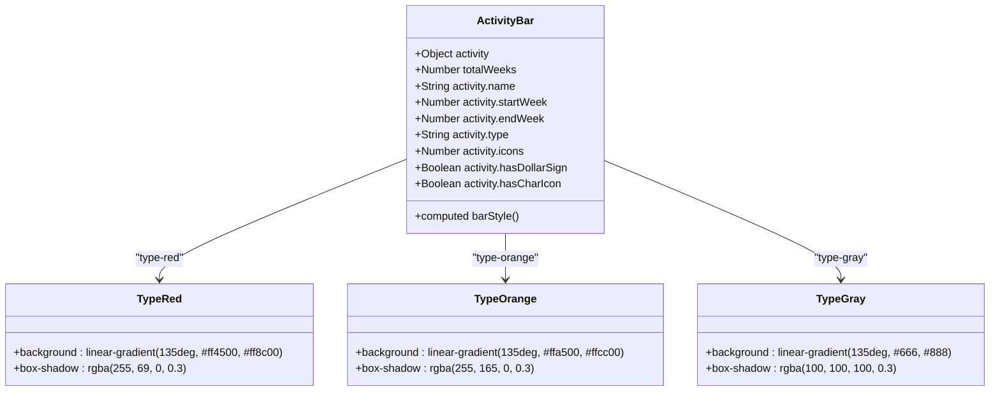
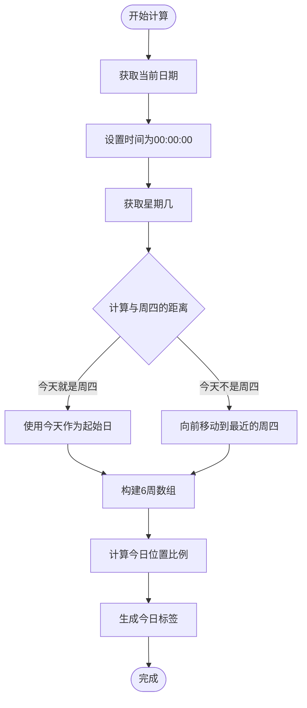

# 项目概述

<cite>
**本文档引用的文件**
- [package.json](file://package.json)
- [vite.config.js](file://vite.config.js)
- [README.md](file://README.md)
- [src/main.js](file://src/main.js)
- [src/App.vue](file://src/App.vue)
- [src/components/GameCalendar.vue](file://src/components/GameCalendar.vue)
- [src/components/ActivityBar.vue](file://src/components/ActivityBar.vue)
- [src/components/WeekHeader.vue](file://src/components/WeekHeader.vue)
- [src/components/TodayIndicator.vue](file://src/components/TodayIndicator.vue)
- [src/config/activities.js](file://src/config/activities.js)
- [src/utils/dateUtils.js](file://src/utils/dateUtils.js)
</cite>

## 目录
1. [简介](#简介)
2. [项目结构](#项目结构)
3. [核心组件](#核心组件)
4. [架构总览](#架构总览)
5. [详细组件分析](#详细组件分析)
6. [依赖关系分析](#依赖关系分析)
7. [性能考虑](#性能考虑)
8. [故障排除指南](#故障排除指南)
9. [结论](#结论)
10. [附录](#附录)

## 简介
本项目是一个基于 Vue 3 + Vite 的游戏活动日历应用，用于可视化展示游戏内6周时间轴内的各类活动。项目采用组件化架构，通过清晰的组件职责划分和数据流设计，实现了以下核心功能：
- 6周时间轴展示：以游戏维护日（周四）为周期起点，展示未来6周的活动分布
- 活动类型区分：通过不同颜色和视觉样式区分活动类型（红色、橙色、灰色）
- 今日定位：动态标识当前日期在时间轴上的位置，并显示今日标签
- 响应式布局：适配不同屏幕尺寸，提供良好的用户体验

项目使用现代前端技术栈，结合 Vue 3 的 Composition API 和单文件组件（SFC）模式，提供了简洁高效的开发体验。

## 项目结构
项目采用典型的 Vue 3 单页应用结构，主要分为以下几个层次：



**图表来源**
- [src/main.js:1-5](file://src/main.js#L1-L5)
- [src/App.vue:1-29](file://src/App.vue#L1-L29)
- [src/components/GameCalendar.vue:1-70](file://src/components/GameCalendar.vue#L1-L70)

**章节来源**
- [src/main.js:1-5](file://src/main.js#L1-L5)
- [src/App.vue:1-29](file://src/App.vue#L1-L29)

## 核心组件
项目的核心由五个主要组件构成，每个组件都有明确的职责分工：

### 应用根组件
App.vue 作为应用的根组件，负责全局样式设置和根组件渲染。它简单地渲染 GameCalendar 组件，确保整个应用的统一外观和基础样式。

### 游戏日历主组件
GameCalendar.vue 是整个应用的核心容器组件，承担以下职责：
- 管理6周时间轴的数据状态
- 计算今日在时间轴上的位置
- 渲染活动条目列表
- 集成所有子组件

### 周次表头组件
WeekHeader.vue 负责显示6周的时间轴头部信息，包括每周的中文标签和日期范围，为用户提供清晰的时间参考。

### 活动条组件
ActivityBar.vue 展示单个活动的详细信息，包括：
- 活动名称和类型标识
- 角色图标和美元符号标记
- 动态宽度计算，反映活动持续时间
- 不同类型的视觉样式

### 今日指示器组件
TodayIndicator.vue 实时显示当前日期的位置标识，通过绝对定位和动态left值精确标出今日所在位置。

**章节来源**
- [src/components/GameCalendar.vue:1-70](file://src/components/GameCalendar.vue#L1-L70)
- [src/components/WeekHeader.vue:1-51](file://src/components/WeekHeader.vue#L1-L51)
- [src/components/ActivityBar.vue:1-164](file://src/components/ActivityBar.vue#L1-L164)
- [src/components/TodayIndicator.vue:1-53](file://src/components/TodayIndicator.vue#L1-L53)

## 架构总览
项目采用自上而下的组件化架构，数据流向清晰明确：



**图表来源**
- [src/components/GameCalendar.vue:23-39](file://src/components/GameCalendar.vue#L23-L39)
- [src/config/activities.js:1-53](file://src/config/activities.js#L1-L53)
- [src/utils/dateUtils.js:1-103](file://src/utils/dateUtils.js#L1-L103)

架构特点：
- **单向数据流**：数据从配置文件和工具函数流向组件，组件只负责渲染和少量交互
- **组件解耦**：各组件职责单一，通过 props 和事件进行通信
- **可扩展性**：新增活动类型或功能只需修改对应组件，不影响整体架构

## 详细组件分析

### GameCalendar 主组件分析
GameCalendar.vue 作为核心容器，实现了复杂的时间轴逻辑：



**图表来源**
- [src/components/GameCalendar.vue:35-39](file://src/components/GameCalendar.vue#L35-L39)
- [src/utils/dateUtils.js:12-91](file://src/utils/dateUtils.js#L12-L91)
- [src/config/activities.js:1-53](file://src/config/activities.js#L1-L53)

**章节来源**
- [src/components/GameCalendar.vue:1-70](file://src/components/GameCalendar.vue#L1-L70)

### 活动类型与视觉设计
项目通过三种活动类型实现差异化视觉呈现：



**图表来源**
- [src/components/ActivityBar.vue:27-49](file://src/components/ActivityBar.vue#L27-L49)
- [src/components/ActivityBar.vue:65-78](file://src/components/ActivityBar.vue#L65-L78)

视觉设计要点：
- **渐变背景**：每种类型使用独特的渐变色彩方案
- **圆角矩形**：54px高度的圆角设计，营造柔和的视觉效果
- **图标系统**：支持美元符号、角色图标和装饰图标
- **响应式布局**：flex布局确保内容在不同屏幕尺寸下正确排列

**章节来源**
- [src/components/ActivityBar.vue:1-164](file://src/components/ActivityBar.vue#L1-L164)

### 日期计算与时间轴逻辑
项目实现了精确的日期计算算法，确保与游戏维护周期保持一致：



**图表来源**
- [src/utils/dateUtils.js:12-91](file://src/utils/dateUtils.js#L12-L91)

关键算法特性：
- **维护日基准**：以游戏维护日（周四）为周期起点
- **精确计算**：使用毫秒级时间差计算准确的天数差异
- **边界处理**：确保位置比例在0-1范围内
- **本地化支持**：中文星期显示和日期格式化

**章节来源**
- [src/utils/dateUtils.js:1-103](file://src/utils/dateUtils.js#L1-L103)

## 依赖关系分析
项目的技术栈选择体现了现代化前端开发的最佳实践：

```mermaid
graph LR
subgraph "运行时依赖"
A[vue@^3.5.34<br/>核心框架]
end
subgraph "开发依赖"
B[@vitejs/plugin-vue@^6.0.6<br/>Vite Vue插件]
C[vite@^8.0.12<br/>构建工具]
end
subgraph "项目配置"
D[package.json<br/>依赖管理]
E[vite.config.js<br/>构建配置]
end
D --> A
D --> B
D --> C
E --> B
A --> F[运行时应用]
B --> G[Vite构建流程]
C --> G
```

**图表来源**
- [package.json:1-18](file://package.json#L1-L18)
- [vite.config.js:1-7](file://vite.config.js#L1-L7)

依赖关系特点：
- **轻量级核心**：仅依赖 Vue 3 作为运行时框架
- **现代化构建**：使用 Vite 提供快速开发体验
- **TypeScript友好**：Vue 3 支持原生 TypeScript
- **生态兼容**：与 Vue 生态系统完全兼容

**章节来源**
- [package.json:1-18](file://package.json#L1-L18)
- [vite.config.js:1-7](file://vite.config.js#L1-L7)

## 性能考虑
项目在设计时充分考虑了性能优化：

### 渲染性能
- **虚拟DOM优化**：Vue 3 的响应式系统提供高效的更新机制
- **组件懒加载**：大型组件可以按需加载
- **CSS作用域**：scoped CSS 避免样式冲突，减少重绘

### 内存管理
- **响应式数据**：使用 ref 和 computed 管理状态变化
- **生命周期优化**：合理使用 onMounted、onUnmounted 等生命周期钩子
- **事件监听**：避免内存泄漏的事件绑定管理

### 加载性能
- **Tree Shaking**：Vite 构建支持模块级别的代码分割
- **资源压缩**：生产环境自动压缩 JavaScript 和 CSS
- **缓存策略**：浏览器缓存静态资源

## 故障排除指南
常见问题及解决方案：

### 环境配置问题
**问题**：Node.js 版本不兼容
**解决方案**：检查 package-lock.json 中的引擎版本要求，确保 Node.js 版本满足最低要求

**问题**：Vue 插件安装失败
**解决方案**：清理 npm 缓存，重新安装依赖；检查网络连接和代理设置

### 运行时错误
**问题**：组件渲染异常
**解决方案**：检查 props 类型定义，确保传入正确的数据结构

**问题**：样式显示异常
**解决方案**：确认 scoped 样式的作用域，检查 CSS 变量和媒体查询

### 开发工具问题
**问题**：热重载失效
**解决方案**：重启 Vite 开发服务器，检查端口占用情况

**问题**：TypeScript 类型错误
**解决方案**：检查 tsconfig.json 配置，确保类型定义完整

**章节来源**
- [package.json:1-18](file://package.json#L1-L18)

## 结论
游戏活动日历项目展现了现代前端开发的优秀实践。通过合理的架构设计、清晰的组件职责划分和精确的日期计算逻辑，项目成功实现了游戏活动可视化的核心需求。

技术选型方面，Vue 3 + Vite 的组合提供了出色的开发体验和运行性能。组件化架构确保了代码的可维护性和可扩展性，而精心设计的视觉系统则提升了用户体验。

项目为初学者提供了友好的学习曲线，通过简单的组件结构和清晰的数据流，帮助理解现代前端开发的基本概念。同时，对于有经验的开发者，项目也提供了足够的技术深度和扩展空间。

## 附录

### 快速开始指南
1. **环境要求**
   - Node.js 20.19.0 或更高版本
   - npm 10.0.0 或更高版本

2. **安装步骤**
   ```bash
   # 克隆项目
   git clone <repository-url>
   
   # 安装依赖
   npm install
   
   # 启动开发服务器
   npm run dev
   ```

3. **构建应用**
   ```bash
   # 生产环境构建
   npm run build
   
   # 预览构建结果
   npm run preview
   ```

4. **基本使用**
   - 访问 http://localhost:5173 查看应用
   - 修改 src/config/activities.js 添加新的活动
   - 自定义样式通过组件的 scoped CSS 进行调整

### 技术栈说明
- **Vue 3**: 最新版本的响应式前端框架
- **Vite**: 现代化的构建工具和开发服务器
- **Composition API**: Vue 3 的现代化组件开发模式
- **单文件组件**: 将模板、脚本和样式整合在一个文件中

### 扩展建议
- 添加活动详情弹窗功能
- 实现活动搜索和过滤功能
- 支持多语言本地化
- 添加离线缓存机制
- 集成移动端触摸手势支持